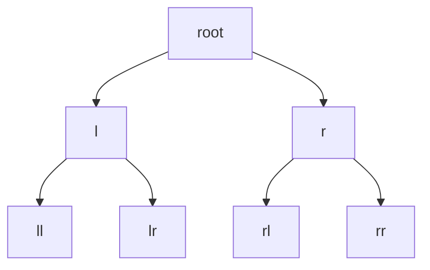
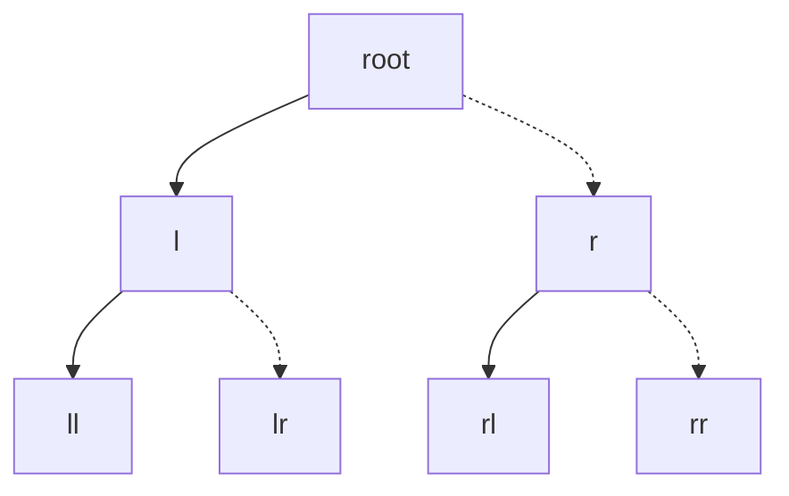
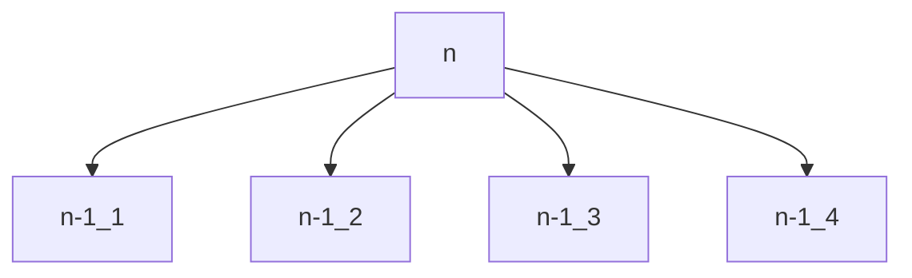

# 算法作业1

* 王华强
* 2016K8009929035

***

## Problem 1

#### 算法描述

对于两个数据库的剩余有效部分(在算法的第一轮是两个数据库全体), 每次分别查询其中点. 两个数据库的中点进行比较, 无妨设数据库A的中点为ma, B的中点为mb, 且$ma<mb$, 则下一轮迭代的有效部分为数据库A中点ma右侧的数据和数据库B中点mb左侧的数据. 这里的"左侧"和"右侧"是否包含分点本身取决于数据库两端剩余数据的数量(见伪码). 如此反复迭代, 每次迭代中记录已判定的比中点大的数据的个数. 已判定的比中点大的数据的个数=n时可以停止迭代, 依照当前的数据库有效部分边界找出中点.

```c
database A;
database B;
//int elem_number=n;
int elem_right_cnt=n;
int a_start, a_end, b_start, b_end;//数据库AB有效部分界(包含边界)
int ma, mb;

while((a_start!=a_end)&&(b_start!=b_end))
{
    int query_position_a=(a_start+a_end)/2;
    int query_position_b=(b_start+b_end)/2;
    int ma=query(A,query_position_a);
    int mb=query(B,query_position_b);
    if(ma<mb){
        a_start=query_position_a;
        b_end=query_position_b;
        elem_right_cnt-=b_end-query_position_b;
    }else{
        b_start=query_position_b;
        a_end=query_position_a;
        elem_right_cnt-=a_end-query_position_a;
    }
}

int result;
if(elem_right_cnt==n)
{
    return (ma<mb)a_start:b_start;
}else{//elem_right_cnt==n-1
    return (ma>mb)a_start:b_start;
}
;
```

#### 子问题化简图


#### 正确性证明

考察两个数据库中数据的特征, 由于其是按照顺序排列的, 所以每次查找找出两个中点之后, 就将数据划分成了4个部分. 为了叙述方便, 我们设中点分别为ma,mb, 数据集分别为A, B, 被中点分成的四个部分分别记成Al, Ag, Bl, Bg:

```mermaid
graph LR;
subgraph A;
Al--<-->ma
ma--<-->Ag
end
subgraph B;
Bl--<-->mb
mb--<-->Bg
end
ma--<-->mb
```

在第一次迭代中, Bg中的数据大于等于总数据的一半, Al中的数据小于等于总数据的一半, 因此不可能是中点. 余下迭代同理. 每次排除$\frac{1}{2}$的不正确结果, 最后留下的就是中点.

#### 复杂度分析

按照上面的证明, 将所有数据(2n)按每次1/2的速度减少到1对应`O(log(n))`的复杂度.

***

## Problem 2

#### 算法描述

从根节点开始查找. 对于每个节点, 先求得其左右两棵子树中的最长距离, 以及左右两颗子树的深度(左子树不存在记为0, 只有一个节点记为1, 以此类推). 这个节点对应子树中最大距离=max((左子树深度+右子树深度),左子树最长距离, 右子树最长距离), 同时生成该节点对应子树的深度.

最后求得的根节点下的两点最大距离即为所求.

```c
//node 为节点
func find_max_diatance(node node_now)
{
    int max_distance, left_height, right_height;
    int left_distance, right_distance;
    left_distance, left_height=find_max_diatance(node->left_subnode);
    right_distance, right_height=find_max_diatance(node->right_subnode);
    height=max(left_height, right_height)+1;
    max_distance=max(left_distance, right_distance,left_height+right_height);
    return max_distance, height;
}
int result, placeholder;
result, placeholder = find_max_diatance(root);
return result;
```

#### 子问题化简图


......

root级--T(n)
l级--T(n/2)(约)
ll级--T(n/4)(约)

#### 正确性证明

因为是二叉树, 所以无论是哪条最长路径, 只要不为0必然经过某个子树的根节点, 由此可以进行判断: 如果某条最长路径经过某个子树的根节点, 其必然占据这个子树左右子树中的最大深度路线. 否则的话, 就可以选取左右子树的最大深度分支, 分支端点的两点的距离大于"最长路径".

这样, 某个子树下的最长路径有两种情况: 要么经过根节点并占有左右两侧的最深路径, 要么不经过经过其子树的根节点. 因此算法正确.

#### 复杂度分析

对于每个节点, 执行算法中所述的操作需要常数时间. 图中共计n个节点, 所以复杂度为`O(n)`.

***
## Problem 3

#### 算法描述

从根节点开始搜索. 对于每个当前目标节点, 首先检查它的值(如果之前没有检查过的话), 之后检查其左节点的值. 如果左节点的值小于它的值, 则当前目标节点切换到左节点. 否则, 检查右节点. 若右节点的值小于他的值, 则当前目标切换到右节点. 反之, 当前节点是局部最小点, 算法终止.

对于叶子节点的情况: 如果一个左叶子节点小于当前目标节点, 则这个左叶子节点为局部最小点. 反之检查右叶子节点. 如果右叶子节点小于当前目标节点, 则这个右叶子节点为局部最小点. 否则, 当前目标节点为局部最小点.

```c
func find_local_min(node)
{
    //处理近叶子节点
    if(node.nearleaf())
    {
        if(node.value()>node->left_subnode.value())
        {
            return node->left_subnode;
        }
        if(node.value()>node->right_subnode.value())
        {
            return node->right_subnode;
        }
        return node;//当前目标节点是局部最小值点    
    }
    //处理一般节点
    if(node.value()>node->left_subnode.value())
    {
        return find_local_min(left_subnode);
    }
    if(node.value()>node->right_subnode.value())
    {
        return find_local_min(right_subnode);
    }
    return node;//当前目标节点是局部最小值点
}
```

#### 子问题化简图


......

虚线代表可能会存在的路线.

#### 正确性证明

首先: "当前目标节点"一定小于等于其父节点的值. 因为"当前目标节点"切换的条件是"下一级的节点的值小于(上一级的)当前节点".

接下来分两种情况讨论: 当前目标节点是"叶子节点"还是"非叶子节点".

若一个节点不是叶子节点, 则其是局部最小值的条件是: 其小于周边的三个顶点. 若一个节点是叶子节点, 则只要它小于其父节点, 它就是局部最小点.

上述的算法保证了在由上至下的搜索中一定会找出一个满足上述条件的点.

综上正确性得证.


#### 复杂度分析

在完全二叉树的每一级, 算法至多读取两个节点的值. 有n个元素的完全二叉树的高度`O(log(n))`, 因此算法读取的节点个数至多在`O(log(n))`量级.

***
## Problem 4

No idea......

```
2019.6.19 补充:

对于最基本的情况(1x1), 唯一的一个点就是局部最小点.

对于更复杂的情况, 将网格分拆成4个子网格, 分别求其局部最小点.

如局部最小点不在边界上, 直接取这一点, 算法结束.

若所有局部最小点都在边界上, 依次对其进行判断, 需要常数时间.

总的复杂度为:

T(n)=4T(1/4)+Const

因此需要的探测次数为: O(n)
```

***
## Problem 5

I'm too lazy......

```
2019.6.19 补充:

同理, 进行归并排序. 在排序的过程中完成计数.

```

***
## Problem 6

#### 算法描述

将一个(n)规模的问题拆分成4个规模为(n-1)的小问题. 每个小问题是将n*n的方格填成只有一个空格的形状, 之后将四个子问题如下组合:

空格在右下角|空格在左下角
-|-
空格在右上角|空格在右下角

之后在中间可以用一个块填充.

子问题同理可得.

对于n=1的情况(2*2), 显然直接放置一个块即可.

```c
func place_block(int n)
{
    if(n==1)
    {
        直接放置一个块.
        return 放置结果;
    }
    以图形中点将方格划分出四个区域;
    左上角=place_block(n/2);
    旋转左上角使得空格在右下角;
    左下角=place_block(n/2);
    旋转右上角使得空格在左下角;
    左上角=place_block(n/2);
    旋转左下角使得空格在右上角;
    右下角=place_block(n/2);
    旋转右下角使得空格在右下角;
    填充中间的空格;
    返回当前的填充结果;
}

place_block(n);
```

#### 子问题化简图


......

#### 正确性证明

由数学归纳法显然成立.

#### 复杂度分析

由`T(n)=4T(n-1)+const`, T(1)=1, 推知

$$T(n)=O(2^{2n})$$

***