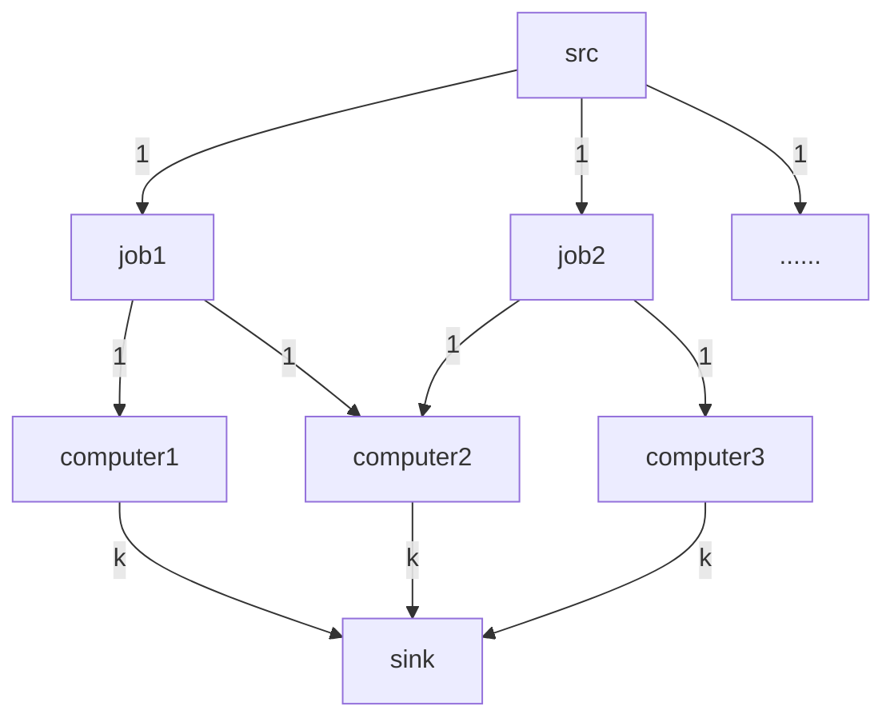
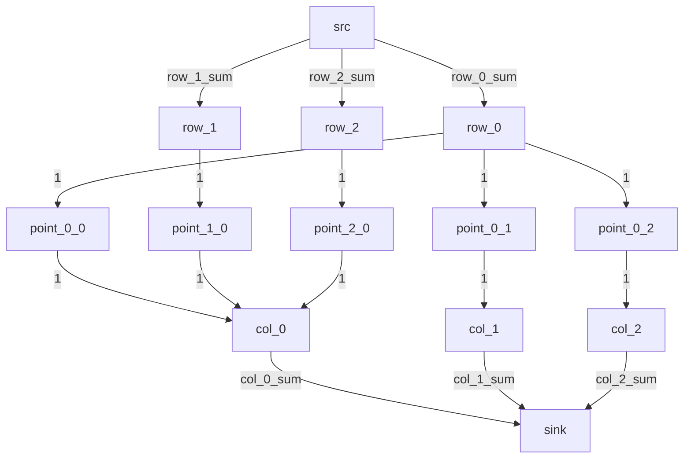
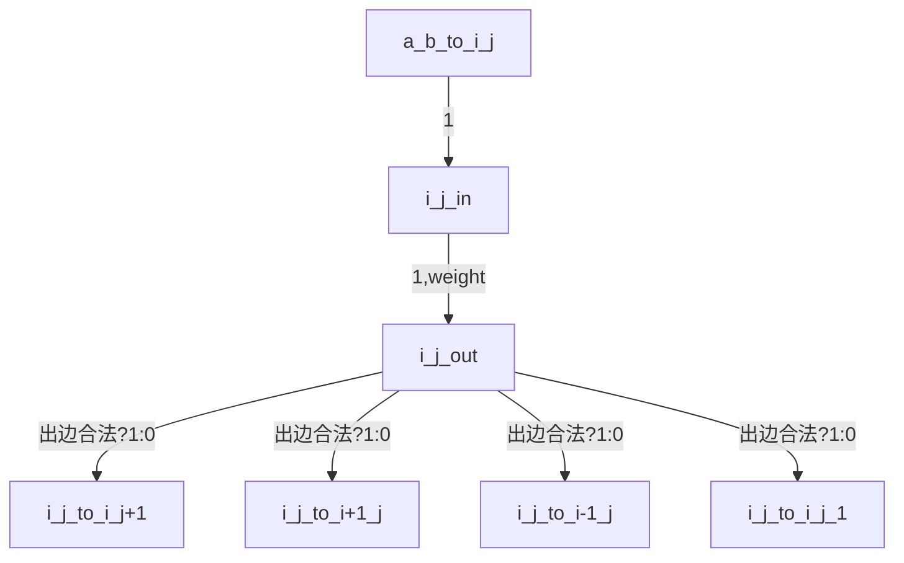
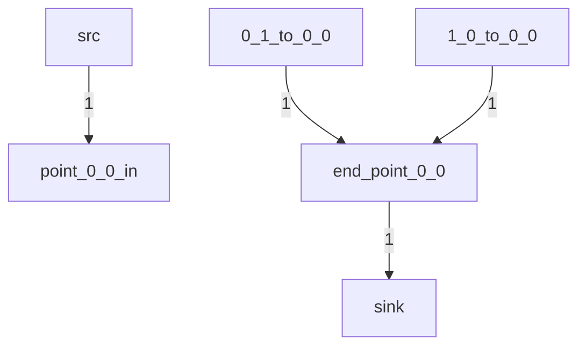
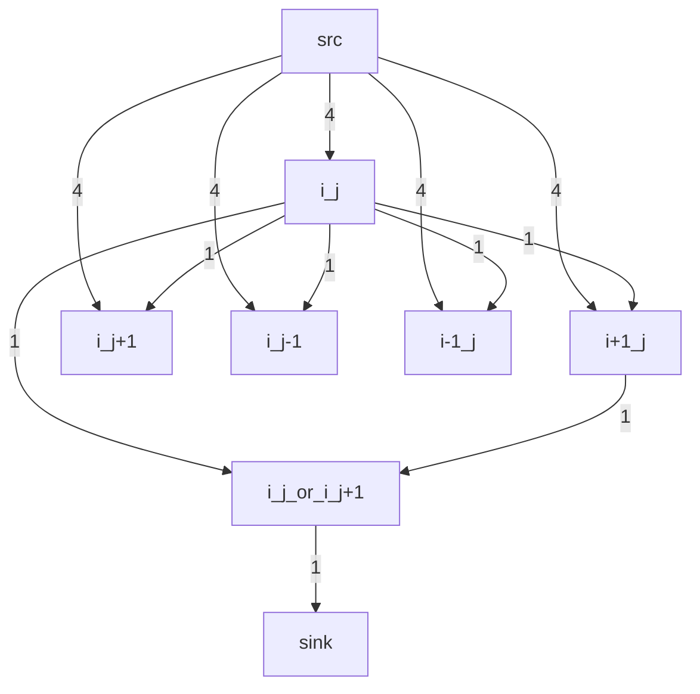
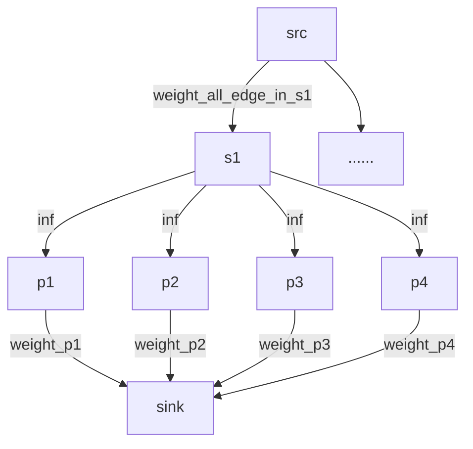

算法作业5
==================

* 王华强
* 2016K8009929035

***
<!-- • Describe the basic idea of your algorithm in natural language
AND pseudo-code;
• Prove the correctness of your algorithm.
• Analyse the complexity of your algorithm. -->

# 0. 算法定义

## 0.1. Dinic

```c
int Dinic(int src, int sink)
{
    ......
    return 最大流;
}
```

复杂度`O(mn^2)`, m为边数, n为顶点数.

<!-- ## SPFA -->

## 0.2. Weighted_Netflow

这里给出一种可行的算法.

```c
Weighted_Netflow(int src, int sink)
{
    int flow=0;

    while(1)
    {
        求最短路径(残量网络, "weight");
        if(求最短路径找出解)
        {
            处理这条最短路径, 计算其瓶颈并修改残量网络, 修改flow.
        }
        else
        {
            break;
        }
    }

    计算weight和.
    return weight和, flow;
}
```


---

# 1. Load balance

## 1.1. Algorithm

网络流图解如下:



伪代码描述如下:
```c
int lower_bound=0;
int upper_bound=job总数;

int build_graph(int k)
{
    for all j in jobs
    {
        addedge(src,j,1);
        addedge(j,j.computer1,1);
        addedge(j,j.computer2,1);
    }
    for all c in computers
    {
        addedge(c,sink,k);
    }
}

int reset_graph();
int Dinic(point src, point sink);

//使用二分搜索
int algorithm1_main()
{
    while(upper_bound!=lower_bound)
    {
        reset_graph();
        int mid;
        bulid_graph(mid=(upper_bound+lower_bound)/2);
        if(Dinic(src, sink)!=job总数)
        {
            //failed
            lower_bound=mid+1;
        }
        else
        {
            upper_bound=mid;
        }
    }
    return upper_bound;
}
```

自然语言描述如下:

> 使用二分搜索来检查出正确的值. 二分上下界从(0,#jobs)开始, 每次按照上面的图示构造网络流图, 之后检查这个网络流的最大流量(代表在这个条件下可以执行的最大任务量)是否等于#jobs. 如果等于, 说明当前的二分取值下这样的分配可行. 二分法结束时, 会给出单机可行最大负载的最小值.


## 1.2. Correctness Proof

网络流的正确性显然. 每个任务只能分配一台计算机上, 因此用入边1加以限制. 每个任务可能被分配给两台计算机中的一台, 因此有两个出边. 每台计算机的最大负载量用计算机节点的出边最大流量k来限制. 网络流图的最大流反映的是在当前k下可以执行的最大任务数. 在最大流=任务数的情况下, 说明当前k>=最大负载的最小值. 因此, 此后用二分搜索就可以找到这个最小的k.

## 1.3. Complexity

$$O(mn^2log(\#jobs))$$
$$=O(log(\#jobs)*(\#jobs + \#comp)^2(3(\#jobs) + \#comp))$$

即Dinic的复杂度$\times$二分的复杂度.

---


# 2. Matrix

## 2.1. Algorithm

建立网络流图如下:



伪代码如下:
```c

// build_graph
{
    for all p in points
    {
        addedge(p.x, p, 1);
        addedge(p, p.y, 1);
    }
    for all c in cols
    {
        addedge(c,sink,c.sum);
    }
    for all r in rows
    {
        addedge(src,r,r.sum);
    }
}

if(Dinic(point src, point sink)!=sum(所有列的sum))
{
    failed();//不存在这样的矩阵
}

return 从src到矩阵中各个位置所对应的点的流量.
//(流量0代表矩阵上此位置为0, 1代表1).
```

自然语言描述如下:

> 如上所示建图, 之后使用Dinic算法求最大流. 如果最大流的流量不等于所有列的和的和, 说明输入数据所对应的矩阵并不存在. 否则矩阵存在, 且矩阵各个位置上的值就等于矩阵各个位置对应的点的流量.

## 2.2. Correctness Proof

如果按照上图求出的最大流流量等于所有列的和的和, 则按照这个网络流图的定义, 对应的矩阵各行各列的和满足要求. 否则, 这样的矩阵不存在.

## 2.3. Complexity

设矩阵的长宽分别为a, b.

$$O(mn^2)=O(2a^3b^3+a^3b^2+a^2b^3)$$

## 2.4. 补充

如果要输出全部满足要求的矩阵, 对生成的图进行有向图判环, 之后依照环来进行矩阵的调整即可.

---
# 3. Problem Reduction

## 3.1. Algorithm

建立网络流图如下:

对于矩阵中的每一个位置:



没有标出weight的位置weight为0.

包含src和sink在内的特殊点:


伪代码如下:
```c


// build_graph
{
    for all p in points
    {
        addedge(p.x, p, 1);
        addedge(p, p.y, 1);
    }
    for all c in cols
    {
        addedge(c,sink,c.sum);
    }
    for all r in rows
    {
        addedge(src,r,r.sum);
    }
}

if(Dinic(point src, point sink)!=sum(所有列的sum))
{
    failed();//不存在这样的矩阵
}

return 从src到矩阵中各个位置所对应的点的流量.
//(流量0代表矩阵上此位置为0, 1代表1).

```

自然语言描述如下:

> 按照上面的思路建立网络流图, 之后用最小费用最大流算法求解即可.

## 3.2. Correctness Proof

由于利用了point_in-->point_out这个结构, 可以确保每个点都只被经过了一次. 最小化权重和的最大流算法的每一步确保了这一步的结果是当前流量下的最优解.

<!-- (可以反证, 如果最小化权重和的最大流算法的某一步输出的不是当前流量下的最优解, 则在当前流量和残量网络下必然能找出一条路径, 在不改变流量和的情况下) -->

## 3.3. Complexity

$$O(m^2n)$$

```
2019.6.20 勘误

由于在每一点只能在向右向下和向左向上两种选择中二选一, 一次这个问题有很好的对称性, 原问题转化为从原点出发两条不相交的路线到达汇点. 问题因此得以简化. 算法略.
```

---
# 4. Network Cost (思路)

## 4.1. Algorithm

对最短路径最大流算法稍加改动. 使用"判断最大流后检测负环(负weight环)的算法". 这样在每次判断之后检测负环, 根据负环调整流量即可.

```
2019.6.20 勘误

由于cost依赖于当前流量的平方, 传统的余量网络不能够满足要求.

不使用"求最大流后找负环"的最小费用最大流算法, 而是采用"贪心的选取weight最小的flow"的方式, 用FF算法求解即可.
```

---

# 5. Choose Numbers (思路)

???

一个错误的结果:

图中省略了一些边.



满足要求的判断条件是最大流=相邻点的对数

一个想法: 引入新的改进方式?

---

# 6. Maximum Weight Subgraph (思路)

ref: https://www.cnblogs.com/TreeDream/p/5942354.html



完整思路参见资威的作业, (他之前写了个慢的一匹的被我忽悠改了).

不过即便如此效率也不是特别高....

```
2019.6.20 补充

这道题解法的思路来自于加权网络流中的负权处理思路. 参见 Project Selection 问题.

这种网络流的特点是: 原图中只有正权-->正权/0/负权, 0-->负权的边.
```

---

Copyright (C) 2019 Wang Huaqiang