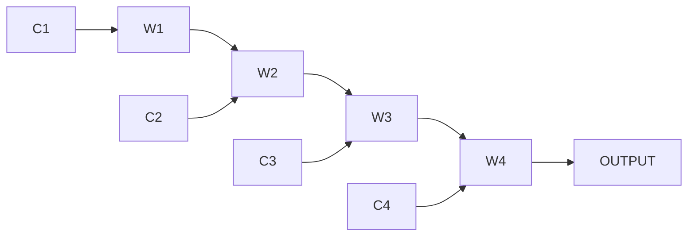

人工智能期末大作业实现
=====================

王华强

2016K8009929035

---

<!-- TOC -->

- [1. 说明](#1-说明)
- [2. 问题分析](#2-问题分析)
- [3. 网络构造: many-to-one ATVP RNN](#3-网络构造-many-to-one-atvp-rnn)
- [4. 进一步迭代](#4-进一步迭代)
    - [4.1. 网络复杂化](#41-网络复杂化)
    - [4.2. 修改为LSTM网络](#42-修改为lstm网络)
    - [4.3. 对整个句子进行操作](#43-对整个句子进行操作)
    - [4.4. 总结: 计划测试的各种网络实现方式](#44-总结-计划测试的各种网络实现方式)
- [5. RNN学习手记](#5-rnn学习手记)
- [6. 网络顶层代码](#6-网络顶层代码)
- [7. 测试结果](#7-测试结果)
- [8. Reference](#8-reference)

<!-- /TOC -->

# 1. 说明

在这里, 我们在同组的规则操作的基础上, 试图通过Pytorch来构造RNN解决三元组对应问题.

# 2. 问题分析

我们选择使用LSTM来构造神经网络模型.

对于某种三元组, 给定特殊的输入(0,1)代表这个数据是否在被选取的范围中.

之后对整个句子搭建LSTM网络.

特殊地, 引入关键字机制, 来处理关键的标点符号以及特殊动词等等.

关键字机制来源于我们的规则实现.

词语有以下的几个类型:

1. A
1. T
1. V
1. PUNCT,
1. PUNCT...
1. KEYWORD

<!-- 除此之外的重要属性有:

1. word mapping value -->

受到规则测试结果的启发. A-T-V三元组在A-T-V序列中的位置会很大程度上影响结果.

简单的想法1: 构造简单的网络, 判断在某种三元组中的匹配情况. (缺点, 怎么写呢...)

问题转化成: 给定ATVP串, 判断所有合法的匹配的得分.?

问题的关键: 输入规模未知?

解决办法: 训练多个网络?

ref: http://karpathy.github.io/2015/05/21/rnn-effectiveness/

> Notice that in every case are no pre-specified constraints on the lengths sequences because the recurrent transformation (green) is fixed and can be applied as many times as we like.

因此只需要训练一个RNN网络.

采用`many-to-one`的模式.

# 3. 网络构造: many-to-one ATVP RNN

首先构造比较简单的RNN网络, 在RNN网络构造正确之后转化为LSTM网络.

采用两种PUNCT: 

* P 对应"," 表示从句结束 
* E 对应中文顿号, 代表并列结构

网络结构说明:

缩写|全称|说明|示例
-|-|-|-
C|choose|输入一个长度为6的向量: [是否选择,词语类型...]|[1,0,0,1,0,0],[0,1,0,0,0,0]
W||中间节点|
OUTPUT|output|输出节点, 返回是或不是的布尔值, 在实际网络中放宽为[0,1]之间的概率值|0.68(1)

> encode each word into a vector using 1-of-k encoding 

注: 为了对应不同的激活函数可能需要映射. 目前看来tanh对应的[-1,1]值域比较符合要求.

损失函数使用测试时的损失函数(面向测试编程)

直接暴力遍历所有可能的三元组, 这样每个句子对应 `#A*#V*#T` 个输入

问题: LSTM和RNN的隐藏层维度如何确定?

# 4. 进一步迭代

## 4.1. 网络复杂化

Going deep: stacking 每个节点对应多层? 使用循环网络?

Getting fancy: Long Short-Term Memory (LSTM) network

## 4.2. 修改为LSTM网络

实现细节:

> A more technical explanation is that we use the standard Softmax classifier (also commonly referred to as the cross-entropy loss) on every output vector simultaneously. The RNN is trained with mini-batch Stochastic Gradient Descent and I like to use RMSProp or Adam (per-parameter adaptive learning rate methods) to stablilize the updates.

根据上文中的结果, 在首次网络构建时采用以下操作:

* 采用 Softmax classifier
* 采用 mini-batch Stochastic Gradient Descent
* 采用 RMSProp (未研究)

## 4.3. 对整个句子进行操作

需要对各种关键词进行 word mapping, 这部分可能需要较多的人工干预.

## 4.4. 总结: 计划测试的各种网络实现方式

网络类型|计算节点|隐变量维度|是否处理整句|是否处理关键词|分类器|梯度下降算法
-|-|-|-|-|-|-
基本RNN|tanh(Wi*I+Wh*H)|?|否|否|Softmax|SGD/mini-batch SGD
基本LSTM|Torch.nn.Module.lstm|?|否|否|Softmax|SGD/mini-batch SGD
整句LSTM|Torch.nn.Module.lstm|?|是|否|Softmax|SGD/mini-batch SGD
整句+关键词LSTM|Torch.nn.Module.lstm|?|是|是|Softmax|SGD/mini-batch SGD

# 5. RNN学习手记

RNNs combine the input vector with their state vector with a fixed (but learned) function to produce a new state vector.

In fact, it is known that RNNs are Turing-Complete in the sense that they can to simulate arbitrary programs (with proper weights). But similar to universal approximation theorems for neural nets you shouldn’t read too much into this. In fact, forget I said anything.

If training vanilla neural nets is optimization over functions, training recurrent nets is optimization over programs.

The takeaway is that even if your data is not in form of sequences, you can still formulate and train powerful models that learn to process it sequentially. You’re learning stateful programs that process your fixed-sized data.

使用[-1,1]来对应激活函数 np.tanh()? [0,1]对应Relu? 写两个版本测试一下.

# Reference

语法:

https://www.pytorchtutorial.com/pytorch-sequence-model-and-lstm-networks/

LSTM:

http://colah.github.io/posts/2015-08-Understanding-LSTMs/

LSTM with TF:

https://towardsdatascience.com/lstm-by-example-using-tensorflow-feb0c1968537

手工实现LSTM:

https://www.jianshu.com/p/b6130685d855

保存与恢复结果:

https://www.pytorchtutorial.com/pytorch-note5-save-and-restore-models/

~~Why not just use Keras......~~

---

Wang Huaiqang (c) 2019