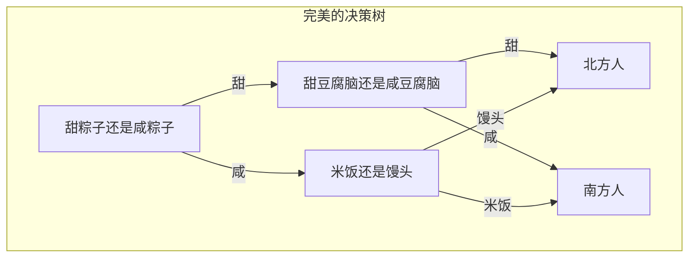

# 人工智能基础作业 9.10

* 王华强
* 2016K8009929035

***

## 证明: 条件信息熵信息增益>=0

<!-- 琴生不等式 -->

Sol:

From:

$$Gain(X,Y)=H(Y)-H(Y|X)$$
$$H(Y)=-\sum_{j}^{}P(I_j)log(P(I_j))$$
$$H(Y|X)=\sum_{i}H(Y|x_i)P(x_i)$$

We gain:

$$Gain(X,Y)=H(Y)-H(Y|X)$$
$$=-\sum_{j}^{}P(I_j)log(P(I_j))-\sum_{i}H(Y|x_i)P(x_i)$$
$$=-\sum_{j}^{}P(I_j)log(P(I_j))+\sum_{i}(\sum_{j}^{}P(I_j|x_i)log(P(I_j|x_i))))P(x_i)$$
$$=-\sum_{j}^{}log(P(I_j))\sum_{i}P(I_j|x_i)P(x_i)+\sum_{i}P(x_i)\sum_{j}^{}P(I_j|x_i)log(P(I_j|x_i))$$
$$=\sum_{i,j}P(I_j|x_i)P(x_i)log(\frac{P(I_j|x_i)}{P(I_j)})$$
$$=\sum_{i,j}P(I_jx_i)log(\frac{P(I_jx_i)}{P(I_j)P(x_i)})$$
$$=\sum_{i,j}P(I_jx_i)-log(\frac{P(I_j)P(x_i)}{P(I_jx_i)})$$
<!-- $$=\sum_{i,j}(P(I_jx_i)logP(I_jx_i)-P(I_jx_i)log(P(I_j)P(x_i)))$$ -->

`-log` is a convex function, then we can use Jensen unequation.

From Jensen unequation:

$$\sum_{i,j}P(I_jx_i)-log(\frac{P(I_j)P(x_i)}{P(I_jx_i)})$$
$$>=\sum_{i,j}-log(P(I_jx_i)\frac{P(I_j)P(x_i)}{P(I_jx_i)})$$
$$=\sum_{i,j}-log(P(I_j)P(x_i))$$
$$=-log(1)=0$$

Therefore:

$$Gain(X,Y)=H(Y)-H(Y|X)>=0$$

Also, we may import KL divergence, and prove that KL divergence is non-negative;

ref: https://blog.csdn.net/MathThinker/article/details/48375523

## 构造训练数据, 使得使用Greedy算法计算出的决策树不是最优的决策树

<!-- 决策树, 样本数量越小越好 -->

数据构造:

粽子|豆腐脑|主食|地区
-|-|-|-
甜|咸|米饭|南
甜|甜|米饭|南
甜|甜|米饭|北
咸|咸|馒头|北

构造理念:

数据必须有无法区分项, 否则在所有数据都能用不同属性区分开的情况下, 必定能生成熵为0的决策树;

在这种情况下, 使用贪心算法完全没有问题;

因此必须构造干扰项:

使用第一层+第二层可以取得更低的信息熵(较好分类)
贪心算法使用第一层获取局部较大信息熵, 但是无法较好分类
