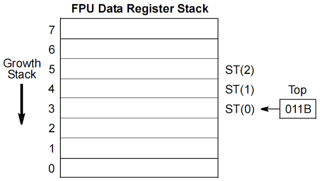
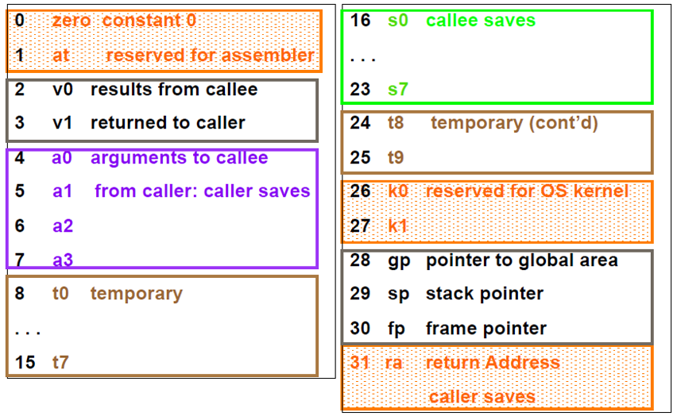

# 汇编语言笔记

zeweiwang@outlook.com


***

# 1. 引言

## Example: 汇编程序示例

```attasm
#hello.S
.section .data
	output:	.ascii  "Hello World\n“
.section .text
.globl _start
_start:
/* output  like printf */
	movl	$4, %eax
	movl	$1, %ebx
	movl	$output, %ecx
	movl	$12, %edx
	int	$0x80
/* exit */
	movl	$1, %eax
	movl	$0, %ebx
	int	$0x80
```

## 注释

1. “#”开头的一行
2. “/*”和 “*/”包围的一段内容

注意: “;”不是注释标志

## 节

以字符“.”开头的符号名称

    .section
    .data

节-针对未链接的单个文件

    .section

常见的节

    .text  -- 代码
    .data  -- 数据
    .bss  -- 未初始化数据

## 数据定义

1. 数据定义在数据区，即节 .data
2. 数据定义需要指定数据类型和值
   “.ascii” 定义ASCII字符串类型
   “Hello world\n”是字符串的值
3. 数据定义通常需要一个符号名作为标号以方便引用
    output
即为一个标号

## 符号 (symbol) 
* 由字母 (大小写) 、数字和’_.$’组成
* 以字母或’._’开头
* 作为标号 (label) 时后面紧跟’:’
* 符号区分大小写

    output :	.ascii	“Hello World\n”
* 定义了一个字符串”Hello World\n”
* 定义了一个标号 output，与该字符串的地址关联
* 该字符串可通过标号output进行访问  

## 程序入口地址

Ld默认的入口地址: _start
     _start必须是第一条指令的标号
2. Ld -e entry可改变入口地址
3. 入口地址必须定义为全局符号
    .globl 或者 .global 定义全局符号
    .globl _start

## 指令格式
 (以mov指令为例) 

指令后缀表示数据类型
* ’l’: 表示32位数据
* ’w’: 表示16位数据
* ‘b’: 表示8位数据

说明: 
    mov指令涉及不同数据类型，需要后缀区分
    int指令没有不同数据类型

数据类型
    .byte, .word, .int, .long, .quad, .octa
    .ascii, .asciz


立即数操作数

   ‘$number’: 表示立即数number
    ‘$symbol’: 表示标号地址

寄存器

    寄存器名加前缀%

源操作数与目标操作数

    左边是源操作数
    最右边是目的操作数

## int 0x80 (Linux32系统调用) 

> 系统调用即调用操作系统提供的功能，需要在核心态运行
> 中断引发特权态改变，从用户态进入核心态
> Linux约定0x80 (128) 号软中断为系统调用
> Linux系统调用的寄存器约定
> EAX: 系统调用号，4号是写文件，1号是程序退出
> EBX、ECX、EDX、…: 传递参数

4号调用: 写文件

    EBX: 文件描述符，1表示终端
    ECX: 输出缓冲区 (Buffer) 的地址
    EDX: 输出的字节数

1号调用: 程序退出

    EBX: 返回值

> 64bit下系统中断定义发生变化

## 汇编程序的基本形式

```x86asm
.section .data
    <initialized data>
.section .bss
    <uninitialized data>
.section .text
.globl _start
_start:
    <instruction code>
```

注意: .text、.data、.bss等基本节的名字用小写, 其他的汇编指导大小写混合不影响


## Intel语法

指令不需要后缀，汇编器根据使用的寄存器和数据类型来区别

立即数不加$

内存操作数需要显示的类型操作

    byte ptr,  word ptr,  dword ptr

标号地址需要使用offset操作

    offset output

目的寄存器在最左边

1. .intel_syntax表示采用Intel语法
2. noprefix表示寄存器名前不加%
3. offset label: 引用标号地址
4. 目的寄存器在最左边
5. 立即数不加$

```x86asm
#hello.S
        .intel_syntax noprefix
```

## 汇编、链接、执行
$ as -o hello.o hello.S
$ ld -o hello hello.o

```shell
# $vi asm_sh
as -o $1.o $1.S
ld -o $1 $1.o
# $chmod +x asm_sh
# $./asm_sh hello
# $./hello
# Hello World
# $
```

```shell
echo as -o $1.o $1.S
as -o $1.o $1.S
echo ld -o $1 $1.o
ld -o $1 $1.o
echo running $1
./$1
```

## objdump

    $objdump <options> <file> 

options:

```
   -x       Display the contents of all headers, 显示所有文件头
   -d      Display assembler contents of executable sections, 反汇编代码
   -s      Display the full contents of all sections requested, 显示所有内容
   -D       反汇编所有内容
```

    File off //文件偏移      
    Algn     //对齐

symbol table 格式:

value flag_bits section alignment name

其中对于flag_bits: l: local, d: debug, g: global

## GDB

* Break
* Run
* Continue 
* Info //info registers 
* Nexti
* Stepi
* Display /c //在每个断点显示表达式的值
* print /c  
* X //地址
* Disassemble
* quit

```
info registers 
```

## 汇编Debug信息的程序

```sh
as --gstabs -o hello.o hello.S
ld -o hello hello.o
```

## 汇编32bit的程序

```sh
as --32 --gstabs -o hello.o hello.S
ld -m elf_i386 -o hello hello.o
```

```sh
echo as --32 --gstabs -o $1.o $1.S
as --32 --gstabs -o $1.o $1.S
echo ld -m elf_i386 -o $1 $1.o
ld -m elf_i386 -o $1 $1.o
echo running $1
./$1
```


## HW1

输出字符串, 32位版本

```x86asm
#ucas.S
    .intel_syntax noprefix
.section .data
    output: .ascii "University of CAS\n"
.section .bss
.section .text
.globl _start

_start:fi
/*
4号调用: 写文件

    EBX: 文件描述符，1表示终端
    ECX: 输出缓冲区 (Buffer) 的地址
    EDX: 输出的字节数

1号调用: 程序退出

    EBX: 返回值
*/
    mov eax, 4
    mov ebx, 1
    mov ecx, offset output
    mov edx, 18
    int 0x80

    mov eax, 1
    mov ebx, 0
    int 0x80

```

64位版本

```x86asm
#ucas.S
    .intel_syntax noprefix
.section .data
    output: .ascii "University of CAS\n"
.section .bss
.section .text
.globl _start

_start:
/*
    64位系统
    1号调用: 写文件

    RDI: 文件描述符，1表示终端
    RSI: 输出缓冲区 (Buffer) 的地址
    EDX: 输出的字节数

    60号调用: 程序退出

    RDI: 返回值

    系统中断使用 syscall 语句
*/
    mov rax, 1
    mov rdi, 1
    mov rsi, offset output
    mov edx, 18
    syscall

    mov rax, 60
    mov rdi, 0
    syscall

```

***

# 2. 基本指令

## MOV指令

### Intel Syntax

指令格式: 

    MOV  destination, source    

语义: destination = source
适用范围: 寄存器之间, 内存<->寄存器, ie:内存只出现一次

### AT&T Syntax

指令格式: 

    MOVx  source, destination   

其中，x  = b, w, l，用于指定内存操作数的大小
## 内存操作数指令示例 (AT&T) 
```x86asm
movb   var, %al				disp
movw  (%ebx), ax			base
movl  $4, 4(%ebx)			base+disp
movl  (%ebx, %esi),%eax		base+index
movl  4(%ebx, %esi),%eax		base+index+disp
movl  %eax, (%ebx, %esi, 2) 	base+index*scale
movl  4(%ebx, %esi, 2), %eax	base+index*scale+disp
movl  4(,%esi,2), %eax		index*scale+disp
```

```x86asm
disp(基地址,index,scale)
```
## XCHG指令

Intel syntax

指令格式: 

    XCHG  destination, source

语义: destination与source交换, i.e. 源操作数与目的操作数交换数据

适用范围: 寄存器之间, 内存<->寄存器, 内存只出现一次

## MOVZX和MOVSX指令

Intel syntax

指令格式: 

    MOVZ  destination, source

语义: 移动的同时扩展数据宽度. MOVZX描述用0来进行扩展, MOVS使用符号位来进行扩展

适用范围: 寄存器之间, 内存<->寄存器: ie:目的操作数必须是寄存器.

## MOVZX/MOVSX指令示例 (AT&T) 

```x86asm
movzbw		bytevar, %ax
movsbw		bytevar+4, %cx
movzwl		%cx, %ebx
movswl		wordvar+2, %edx
movzbl		bytevar+2, %esi
movsbl		%al, %edi
```

## 二进制算术指令

INC, DEC, ADD, SUB, NEG

算术指令在CPU内部计算时不区分有符号数和无符号数, 都按照无符号数计算, 根据指令和计算结果设置相应的标志位，供程序使用

注: 可以使用8位的立即数, 会自动扩展为对应的宽度

### EFLAGS的状态标志位

* CF - Carry
* 无符号数运算溢出 (最高位发生进位或借位) 
* OF - Overflow
* 有符号数运算溢出 (正+正=负, 负+负=正, 正-负=负, 负-正=正) 
* SF - Sign
* 结果为负数
* ZF - Zero
* 结果为0
* AF - Auxiliary Carry
* Bit 3 到 Bit 4的进位
* PF - Parity
* 奇偶标志，最低字节”1”的个数为偶数

## INC, DEC

INC: 加1

指令格式: 

    INC destination

语义: destination <- destination + 1

CF标志位不变，其他标志位根据计算结果改变

DEC: 减1

指令格式: 
    
    DEC destination

语义: destination <- destination – 1

CF标志位不变，其他标志位根据计算结果改变

**目的操作数可以是寄存器/内存单元**

## ATT语法宽度的自动识别

如果操作数大小可以通过寄存器区分，则指令后缀可省略，汇编器自动识别

如: 

```x86asm
inc	%al		等价于	incb	%al
dec	%ax		等价于	decw	%ax
inc	%ecx		等价于	incl	%ecx
decb	bytevar
incw	(%ebx, %esi, 2)
decl	4(%eax)
```

## ADD, SUB

ADD: 加

指令格式: 

    ADD destination, source

语义: destination = destination + source

根据计算结果改变标志位CF、OF、SF、ZF、AF、PF

SUB: 减

指令格式: 
    
    SUB destination, source

语义: destination = destination – source

根据计算结果改变标志位CF、OF、SF、ZF、AF、PF

remark: 

* 源与目的操作数大小一致，即都是8位、16位或32位
* 内存操作数最多只有一个
* 立即数只能作为源操作数

## NEG

NEG: 求相反数 (补码) 

指令格式: 

    NEG destination

语义: destination = 0 - destination

标志位: 如果destination =0，CF=0，否则CF=1, 其他标志位根据结果设置

**目的操作数必须是寄存器或内存单元**
## LOOP

LOOP: 循环 (Loop with ECX counter)

指令格式: 

    LOOP  destination

语义: counter = counter - 1, 如果 counter ≠ 0，跳转到标号destination处 (循环入口) 执行，否则

结束LOOP指令，执行LOOP之后第一条指令

16位地址counter是CX寄存器

```x86asm
  mov 	$10, %ecx
  mov 	$0, %al
  mov 	$bytevar, %ebx
l1:
  movb 	%al, (%ebx)
  inc  	%ebx
  inc  	%al
  loop 	l1
```
## C语言对应的汇编

使用

    gcc -S xxxx.c
    gcc -S -masm=intel xxxx.c

来生成汇编代码.

## HW2

```x86asm
#hw2.S
.section .data
stringvar:
  .ascii	"0123456789abcdef"
  /*要输出1032547698badcfe,相邻字符两两交换*/
.section .text
.globl _start
_start:

#main
    movl    $8, %ecx
    movl    $0, %ebx
    movl    $stringvar, %edx
loopmark:
    xchgb   (%edx,%ebx,2), %al
    xchgb   1(%edx,%ebx,2), %al
    xchgb   (%edx,%ebx,2), %al
    incl    %ebx
    loop    loopmark

#	movl	$4, %eax
#	movl	$1, %ebx
#	movl	$stringvar, %ecx
#	movl	$16, %edx
#	int	$0x80
#	movl	$1, %eax
#	movl	$0, %ebx
#	int	$0x80

#output
    mov $1, %rax
    mov $1, %rdi
    mov $stringvar, %rsi
    mov $16, %edx
    syscall

#exit
    mov $60, %rax
    mov $0, %rdi
    syscall

```

***

# 3. 条件处理与跳转

## 条件处理指令

## AND/OR/XOR运算指令

AND: 按位与

指令格式: 

    AND dest, src

语义: dest = dest & src 

OR: 按位或

    OR dest, src

dest = dest | src

XOR: 按位异或

    XOR dest, src

dest = dest ^ src

AND/OR/XOR对标志位的影响: OF=CF=0，SF、ZF、PF根据结果设置，AF未定义

dest可取:寄存器, 内存单元. src可取:立即数, 内存单元, 寄存器

## NOT指令

NOT: 按位非 destination

指令格式: 

    NOT dest

语义: dest = ~dest

**不影响标志位,可以在逻辑运算后,TEST之后,条件转移之前使用**

**dest可取:寄存器, 内存单元**

## TEST指令

TEST: 逻辑比较

指令格式: 

    TEST src1, src2

语义: temp <- src1 & src2

CF=OF=0, SF, ZF, PF根据结果设置，AF未定义

TEST指令用于为条件转移指令设置标志位

**TEST判空: `TEST %al, %al`**

**TEST用来测试一个位: `TEST %al 100b`+`jnz xxx`(若%al第三位非0则跳转)**

**内存单元在前src1, 立即数在后src2, 寄存器位置可任取**

## CMP指令

CMP: 比较两个操作数

指令格式: 

    CMP src1, src2

语义: temp <- src1 - SignExtend(src2)

如SUB指令一样设置标志位CF, OF, SF, ZF, AF, PF，但不产生计算结果

**立即数在后, 内存单元出现一次**

CMP指令用于为条件转移指令设置标志位

## Jcc指令

Jcc: 根据条件码转移

指令格式: 

    Jcc dest

语义: 若条件码满足，则转移到目的标号dest的地址，若条件码不满足，则执行Jcc之后的第一条指令

(cc: condition code)

```
指令助记符
条件码
描述

Unsigned compari-son
JA/JNBE
CF=0 & ZF=0
Jump if above/not below or equal
JAE/JNB
CF=0
Jump if above or equal/not below
JB/JNAE
CF=1
Jump if below/not above or equal
JBE/JNA
CF=1 | ZF=1
Jump if below or equal/not above

Signed compari-son
JG/JNLE
ZF=0 & SF=OF
Jump if greater/not less or equal
JGE/JNL
SF=OF
Jump if greater or equal/not less 
JL/JNGE
SF≠OF
Jump if less/not greater or equal
JLE/JNG
ZF=1 | SF≠OF
Jump if less or equal/not greater
JC
CF=1
Jump if carry
JNC
CF=0
Jump if not carry
JE/JZ
ZF=1
Jump if equal / zero
JNE/JNZ
ZF=0
Jump if not equal / not zero
JO
OF=1
Jump if overflow
JNO
OF=0
Jump if not overflow
JS
SF=1
Jump if sign
JNS
SF=0
Jump if not sign
JP/JPE
PF=1
Jump if parity / parityeven
JNP/JPO
PF=0
Jump if not parity / parity odd
JCXZ
CX = 0
Jump if CX = 0
JECXZ
ECX = 0
Jump if ECX =0

```

## 数字标号 (AT&T) 

对于局部标号N，如果N是一个正整数，则标号N可以在同一段代码中多次出现

* Nb: 紧邻的后一个标号N，’b’表示backward
* Nf:  紧邻的前一个标号N，’f’表示forward

## JMP: 无条件转移指令

JMP: 无条件转移

指令格式: 

    JMP dest

语义: 跳转到dest所指的目的地址

可以使用:
* 相对地址跳转
* 绝对地址间接(段内)跳转; 可以根据内存单元值间接跳转, `jmp *(%eax)`
* 远跳转(LJMP) `jmp *(%eax)`, `jmp $seg, $offset`

## if语句

```x86asm
CMP A,B;
jcc else;

...(if)
jmp end;

else:
...(else)

end:
...(end)
```
## switch语句

短switch:
```x86asm
movl	8(%ebp), %eax
	cmpl	$1, %eax
	je	.L3
	cmpl	$2, %eax
	je	.L4
	testl	%eax, %eax
	jne	.L8

```

长switch(跳转表):
```x86asm
        cmpl    $4, 8(%ebp)
        ja      .L2
        movl    8(%ebp), %eax
        sall    $2, %eax
        addl    $.L4, %eax
        movl    (%eax), %eax
        jmp     *%eax
        .section        .rodata
        .align 4
        .align 4
.L4:
        .long   .L3
        .long   .L5
        .long   .L6
        .long   .L7
        .long   .L8

        .L3:
        .L5:
        ......
        .L2:(default)
        .L9:(end switch)
```

## for语句
```x86asm
	jmp	.L2

# loop body
.L3:
	movl	-8(%ebp), %eax
	addl	%eax, -4(%ebp)
	addl	$1, -8(%ebp)

# check loop condition
.L2:
	movl	-8(%ebp), %eax
	cmpl	8(%ebp), %eax
	jl	.L3

#end loop
	movl	-4(%ebp), %eax
	leave
	ret
```

GCC将循环先转成GOTO的形式;
## while语句

类似 for
## dowhile语句

类似for

## CMOVcc指令: 条件传输指令(Jcc+MOV)

CMOVcc: 根据条件码进行数据传输

指令格式: 

    CMOVcc dest, src

语义: 若条件码满足，则dest = src

CMOVcc指令用于消除赋值类的条件分支, 相当于 Jcc+MOVE指令的组合, 从P6架构的处理器开始引入

目的操作数只能是寄存器.

condition code 同Jcc指令
## HW3

```x64asm
.section .data
iostring:
  .asciz "ab1g2hA0H56po9wK78nB"
.section .text
.globl _start

#补充完整下面的程序，将iostring中的小写字母转换为大写字母，然后输出转换后的iostring
_start:
  
#start
    mov $iostring,%eax
    #mov $iostring,%ebx
    mov $0,%edx #length

#while
WHILE:
    inc %edx
    movb (%eax),%bl
    testb %bl,%bl
    je END

    #_if
    #_ifcondition
        cmpb $'a',(%eax)
        jb ELSE
        cmpb $'z',(%eax)
        ja ELSE

    #meet_IF_condition:
        subb $32, (%eax)

    ELSE:
        #do nothing

    #end_if
    inc %eax
    jmp WHILE

END:
#endwhile

#output
    mov $1, %rax
    mov $1, %rdi
    mov $iostring, %rsi
    #mov $16, %edx
    syscall

#exit
    mov $60, %rax
    mov $0, %rdi
    syscall

#output
	#movl	$4, %eax
	#movl	$1, %ebx
	#movl	$iostring, %ecx
    #movl	$16, %edx
    

	#int	$0x80
#exit
	#movl	$1, %eax
	#movl	$0, %ebx
	#int	$0x80

```

***

# 4. 栈与过程调用

## STACK-栈

STACK:

* 传递函数的参数(寄存器放不下的参数)、返回值等
* 存放函数的局部变量、返回地址等
* 保存寄存器的旧值以备将来恢复使用


X86-Linux-32的程序栈:

* **自顶向下生长的栈**
* **自高地址向低地址生长**
* 栈底地址为0xbffffxxx
* **栈顶指针是esp寄存器**
* 栈单元大小是32位

注:

* **栈顶指针esp**
* **栈底指针ebp**(当前栈帧基址)

分配给一个过程使用的栈空间称为栈帧(stack frame)

* 包括过程的局部变量
* 子过程的形参地址单元
* 调用子过程的返回地址
* 临时保存的寄存器

当前栈帧的基址(底部)保存上一个栈帧的基址.

Remark: 栈帧的分配是按照以下方式进行的, 以长为16的栈帧为例:

```x86asm
push %ebp
mov %esp,%ebp
sub $16,%esp

# do Sth

leave (%rsp=%rbp; %rbp=pop())
ret
```

?????

分配为:

地址|对应的寄存器|对应的功能
-|-|-
88|%ebp+8|之前栈帧中被push的部分, 作为传入的参数
84|%ebp+4|函数调用时被push的%ebp的值
84-81|%ebp-->84:(%esp+16)-(%esp+13)|当前栈帧的基址, 可以用来保存局部变量
80-77|(%esp+12)-(%esp+9)|局部变量
76-73|(%esp+8)-(%esp+5)|局部变量
72-69|(%esp+4)-(%esp+1)|局部变量
68|%esp所指向的位置|(push的下一个写入位置)将来写入子程序调用所需的参数

## 过程调用指令

* CALL
* RET
* PUSH
* POP
* LEAVE

## CALL

CALL: 过程调用

指令格式: 

    CALL dest

语义: 将下一条指令的地址压入栈，跳转到dest所指示的目标地址执行

等价于:

    push(eip)；eip = eip+dest (相对地址调用) 
    push(eip)；eip = dest (绝对地址调用) 

注意:

    CALL *%eax
    JMP *%eax
## RET

RET: 从过程返回

指令格式: 

    RET(只返回)
    RET src(返回加退栈:单位为字节,可用于返回时清除形参占据的栈空间)

语义: 从栈中弹出返回地址，即eip <- pop()；如果有立即数操作数src，则再退栈src字节，即esp = esp + src；跳到返回地址执行。

## PUSH

PUSH: 压栈

指令格式: 

    PUSH src

语义: 栈指针下移一个单元，将操作数src的内容压入该栈单元中

对象: 立即数, 寄存器, 内存单元数据, 段寄存器内容

**补充: 注意在64位下push,pop操作限制于64位, ex: push %rsi**
## POP

POP: 退栈

指令格式: 

    POP dest

语义: 将栈顶单元的内容传输到dest所在单元，栈指针上移一个单元

对象: 寄存器, 内存单元数据, 段寄存器内容(除cs)

注意: POP指令不能操作cs段寄存器

## LEAVE

LEAVE: 释放当前栈帧

指令格式: 

    LEAVE

语义: 把ebp寄存器的值传输给esp，然后从栈顶单元恢复ebp寄存器的值。即esp = ebp； ebp = pop()

X86-Linux环境中GCC只使用LEAVE指令，不使用配套的ENTER指令.

## RET 与 LEAVE

LEAVE离开并释放当前栈帧, RET离开当前语句调用, 返回之前应执行的语句继续执行

## 带参数的函数调用

例子:

```x86asm
_start:
        #写入参数
        push    $12
        push    $output
        call    print_s
/* exit */
        movl    $1, %eax
        movl    $0, %ebx
        int     $0x80
print_s:
        movl    $4,%eax
        movl    $1,%ebx
        #注意参数顺序
        movl    4(%esp),%ecx #$output
        movl    8(%esp),%edx #$12
        int     $0x80
        ret     $8 #(完成参数退栈)

```

## 函数类型说明

```x86asm
.type print_s, @function
print_s:
        movl    $4, %eax
        movl    $1, %ebx
        movl    $output, %ecx
        movl    $12, %edx
        int     $0x80
        ret
```

## 程序调用时的栈底

%esp-->0x00000001 标记了程序调用时的参数数量, 没有参数则为1, 即自身路径及名称

## C语言的程序调用

.CFI编译指导:(call frame information)

栈桢的主体部分是局部变量和子过程形参所占据的单元空间，以16字节为单位分配

使用

    andl    $-16, %esp
    subl    $32, %esp

分配栈帧.

栈桢不是都需分配:

叶子函数就可以不分配

    gcc -O2 -S call.c

* 栈桢的主体是局部变量和形参
* **栈桢以16字节为单位分配**
* **以容纳所有局部变量和形参数量最多的子函数的形参为限**
* **局部分配在栈桢底部，形参分配在栈桢的顶部**

## ABI

* Application binary interface
* 应用程序二进制接口
* 在不同情况编成二进制代码后互相调用的接口约定，与硬件平台和操作系统相关
* 主要约定寄存器的使用方式，保存和恢复的义务，参数与返回值的传递方式，栈帧的格式和维护义务

### X86-Linux-32 abi

参数与返回值约定:
* 参数通过栈传递
* 参数的传递顺序是从右向左
* 参数由调用者维护，属于调用者栈帧
* 返回值存放在的eax寄存器
* 返回地址存放调用者的栈桢顶部

寄存器使用约定
* eax保存返回值
* 调用者保存eax、edx、ecx寄存器
* 被调用者自由使用
* 被调用者保存ebx、esi、edi寄存器
* 调用者自由使用
* ebp和esp是栈桢指针和栈顶指针

栈桢的约定:

栈桢的布局
1. ebp旧值寄存器
1. 其他要保存的寄存器、局部变量
1. 形参
1. 返回地址

栈帧主体部分以16字节为单位分配

栈单元大小是32位

"被调用者保存, 调用者自由使用"表示: 调用之后不改变这些寄存器的值.

### X86-Linux-64 abi

参数与返回值约定
* 前6个参数通过寄存器传递(rdi, rsi, rdx, rcx ,r8, r9)
* 第7个参数起通过栈传递，传递顺序是从右向左
* 参数由调用者维护，属于调用者栈帧
* 返回值存放在的rax寄存器
* 返回地址存放调用者的栈桢顶部

寄存器使用约定
* rax保存返回值
* 被调用者保存rbp, rbx, r12~r15寄存器
* 调用者自由使用
* 调用者保存其他寄存器
* 被调用者自由使用
* rsp是栈顶指针，rbp是栈桢指针

栈桢结构
* 栈帧主体部分16 (32，64) 字节对齐
* 栈单元大小是64位
* Red zone区域可以用于临时数据

## *(转化为地址)

*代表转化为地址, 在使用jmp, jcc, call指令时使用:

    jmp *%eax

而不能使用

    jmp (%eax)
<!-- 被调用者保存, 调用者自由使用: 调用之后不改变这些寄存器的值. -->

## registers


## HW4

```x86asm
.section .data
array:
  .int 6, -5, 3, 1, -8, 7, 0, 2, 4, 9
string:
  .ascii "012345678901234567890123456789"
mbreakpoint:
  .ascii "breakpoint\n"  
format: 
   .asciz "%d\n" 
.section .text
.globl _start

#进行插入排序
_start:
    mov $array,%rax
    mov $40,%rbx
    call sort
    call ints_to_string    
    call return

    mov %rax,%r9
    add %rbx,%r9

    mov %rax,%rcx
    add $4,%rcx #    int i;
    #for(i = 1; i<n; i++)
    for_sort:
    cmp %rcx,%r9
    je end
    
    movl (%ecx),%edx #tmp = a[i];
    movl %ecx,%esi
    sub $4,%esi #j = i - 1;

    #while loop_ints_to_string
    loop_while:
        cmp %eax,%esi
        jb end_while
        cmp %edx,(%esi)
        jng end_while

        #temp reg %edi

        movl (%esi),%edi
        movl %edi,4(%esi)

        sub $4,%esi
        call debug
        jmp loop_while
    end_while:
    call breakpoint
    add $4,%esi    #a[j+1]=tmp;
    mov %edx,(%esi)

    #for loop    
    add $4,%rcx
    jmp for_sort

    end:

    ret


ints_to_string:
    #%eax,%ebx,%ecx,%edx is used.
    mov $10,%rsi
    mov $array,%eax
    mov $string,%ecx
    mov $0,%edx

    loop_ints_to_string:
    cmp $0,%rsi
    je end_ints_to_string

    call int_to_string
    add $4,%eax
    dec %rsi

    jmp loop_ints_to_string

    end_ints_to_string:
    call add_endl
    call printints
    
    ret


return:
    mov $60, %rax
    mov $0, %rdi
    syscall

breakpoint:
    push %rax
    push %rdi
    push %rsi
    push %rdx
    push %rcx
    push %rbx
    push %r8
    push %r9

    mov $1, %rax
    mov $1, %rdi
    mov $mbreakpoint, %rsi
    mov $11, %edx
    syscall

    pop %r9
    pop %r8
    pop %rbx
    pop %rcx
    pop %rdx
    pop %rsi
    pop %rdi
    pop %rax
    
    ret

printints:
# 参数: 将长度传入%edx中
    push %rax
    push %rdi
    push %rsi
    push %rdx
    push %rcx
    push %rbx

    mov $1, %rax
    mov $1, %rdi
    mov $string, %rsi
    #mov $11, %edx
    syscall

    pop %rbx
    pop %rcx
    pop %rdx
    pop %rsi
    pop %rdi
    pop %rax
    
    ret

int_to_string:
# 使用寄存器%edx来累计字符串长度
# 当前int地址用%eax传入
# 待转化的数放入%ebx
# 目的字符串放入%ecx

    movl (%eax),%ebx
    cmpl $0,%ebx
    jnl not_negative
    
    movb $'-',(%ecx)
    inc %ecx
    inc %edx
    mov %rbx,%rdi
    mov $0,%rbx
    sub %rdi,%rbx #取反, 变成正数

    not_negative:

    addl $48,%ebx
    movb %bl,(%ecx)
    inc %ecx
    inc %edx

    #add space
    movb $' ',(%ecx)
    inc %ecx
    inc %edx

    ret

add_endl:
# 使用寄存器%edx来累计字符串长度
# 目的字符串放入%ecx

    movb $'\n',(%ecx)
    inc %ecx
    inc %edx

    ret

debug:
    push %rax
    push %rdi
    push %rsi
    push %rdx
    push %rcx
    push %rbx
    push %r8
    push %r9

    call ints_to_string

    pop %r9
    pop %r8
    pop %rbx
    pop %rcx
    pop %rdx
    pop %rsi
    pop %rdi
    pop %rax
    
    ret


#output
	#movl	$4, %eax
	#movl	$1, %ebx
	#movl	$iostring, %ecx
    #movl	$16, %edx
    

	#int	$0x80
#exit
	#movl	$1, %eax
	#movl	$0, %ebx
	#int	$0x80

```

***

# 5. 移位,乘除,位操作与调试

## 移位指令

* SHL: 逻辑左移
* SHR: 逻辑右移
* SAL: 算术左移
* SAR: 算术右移
* SHLD: 双精度左移(intel?)
* SHRD: 双精度右移(intel?)

## SHL/SAL: 逻辑左移/算术左移

指令格式 (Intel)  : 

    SHL dest, count 
    
    SAL dest, count

count 可取 0-31 imm8, 或者使用寄存器的值, dest可以是寄存器或内存单元

语义: 将dest操作数向左移动count位，CF位保存最后移出的一位，右侧低位补count个0

标志位影响

* 当count = 0时，所有标志位不受影响
* 当count > 0时，CF位等于最后移出的一位，SF、ZF、PF根据移位结果设置，AF未定义
* 当count = 1时，如果移位前dest的最高2位相同，OF = 0，否则OF = 1；当count > 1时，OF未定义

*注意:使用寄存器作为移位位数时必须(只能)使用%cl*

## SHR: 逻辑右移

指令格式 (Intel)  : 

    SHR dest, count 

count 可取 0-31 imm8, 或者使用寄存器的值, dest可以是寄存器或内存单元

语义: 将dest操作数向右移动count位，CF位保存最后移出的一位，左侧高位补count个0

标志位影响
* 当count = 0时，所有标志位不受影响
* 当count > 0时，CF位等于最后移出的一位，SF、ZF、PF根据移位结果设置，AF未定义
* 当count = 1时，OF = 移位前dest的最高位；当count > 1时，OF未定义

*注意:使用寄存器作为移位位数时必须(只能)使用%cl*

## SAR: 算术右移

指令格式 (Intel)  : 

    SAR dest, count 


语义: 将dest操作数向右移动count位，CF位保存最后移出的一位，左侧高位补count个原符号位

标志位影响
* 当count = 0时，所有标志位不受影响
* 当count > 0时，CF位等于最后移出的一位，SF、ZF、PF根据移位结果设置，AF未定义
* 当count = 1时，OF = 0；当count > 1时，OF未定义

*注意:使用寄存器作为移位位数时必须(只能)使用%cl*

## SHLD: 双精度左移(编译器可能不能实现)
指令格式 (Intel)  : 

    SHLD dest, src, count

语义: 将dest操作数向左移动count位，CF位保存最后移出的一位，右侧低位补充来自src的count个高位

注意: imm8或者cl寄存器的内容只使用低5位，即移位的位数是0~31, src操作数只能是寄存器


标志位影响
* 当count = 0时，所有标志位不受影响
* 当count > 0时，CF位等于最后移出的一位，SF、ZF、PF根据移位结果设置，AF未定义
* 当count = 1时，如果移位前后dest的符号位发生变化，OF = 1，否则OF = 0；当count > 1时，OF未定义

## SHRD: 双精度右移(编译器可能不能实现)

指令格式 (Intel)  : 

    SHRD dest, src, count

语义: 将dest操作数向右移动count位，CF位保存最后移出的一位，左侧高位补充来自src的count个低位

注意: imm8或者cl寄存器的内容只使用低5位，即移位的位数是0~31, src操作数只能是寄存器

标志位影响
* 当count = 0时，所有标志位不受影响
* 当count > 0时，CF位等于最后移出的一位，SF、ZF、PF根据移位结果设置，AF未定义
* 当count = 1时，如果移位前后dest符号位发生变化，OF = 1，否则OF = 0；当count > 1时，OF未定义

## SHLD/SHRD的AT&T指令格式

    shldx	count, src, dest
    
    shrdx	count, src, dest

指令后缀x可要可不要, 因为src是寄存器，可确定指令的操作数大小

## 乘除指令

* MUL
* DIV
* IMUL
* IDIV
* CBW/CWDE
* CWD/CDQ

## MUL: 无符号数乘法

指令格式 (Intel)  : 

    MUL src

语义: **src与隐含操作数累加器 (AL/AX/EAX) 相乘，结果存放在 (AX/DX:AX/EDX:EAX) ，其中高位部分存放在AH/DX/EDX**

注意: 这里的高位结果可能在**DX, EDX**, src来自内存, 寄存器

标志位

* 如果高位部分为0，CF=OF=0，否则，CF=OF=1
* SF、ZF、PF、AF未定义

## DIV: 无符号数除法

指令格式 (Intel)  : 

    DIV src

语义: 隐含dest (AX/DX:AX/EDX:EAX) 除以src，结果存放在dest ( AH:AL/DX:AX/EDX:EAX ) ，其中**商放在低位寄存器，余数放在高位寄存器**

注意: 8位除法被除数是16位，16位除法被除数是32位，32位除法被除数是64位, 当不能整除时，商的截取趋向0


除法错例外 (#DE) 

除数为0或者商的大小超过低位寄存器的大小

标志位

CF、OF、SF、ZF、PF、AF未定义

## IMUL: 有符号数乘法

指令格式 (Intel) 

    imul src
    imul dest, src
    imul dest, src1, src2

语义:
* 单操作数:  src(r/m)与隐含操作数累加器 (AL/AX/EAX) 相乘，结果存放在 (AX/DX:AX/EDX:EAX) ，其中高位部分存放在AH/DX/EDX
* 双操作数: src(r/m)与dest相乘，结果**截断后存放dest**
* 三操作数: src1(r/m)与src2(imm)相乘，结果**截断后存放dest**

注意: dest操作数是寄存器


标志位:
* SF=MSB (dest) (有时为未定义)
* ZF、PF、AF未定义
* 对于单操作数，如果高位寄存器的内容不是低位寄存器结果的符号扩展，则CF = OF =1， 否则CF = OF = 0；
* 对于双操作数/三操作数，如果中间计算结果不是dest存放结果的符号扩展，则CF = OF =1，否则CF = OF = 0

## IDIV: 有符号数除法

指令格式 (Intel) : 

    IDIV src

语义: 隐含dest (AX/DX:AX/EDX:EAX) 除以src，结果存放在dest ( AH:AL/DX:AX/EDX:EAX ) ，其中商放在低位寄存器，余数放在高位寄存器

注意: 
* 8位除法被除数是16位，16位除法被除数是32位，32位除法被除数是64位
* 当不能整除时，商的截取趋向0
* 如-5 ÷3，商=-1， 余数=-2

除法错例外 (#DE) 

* 除数为0或者商的大小超过低位寄存器可表示的有符号数的大小

标志位

* CF、OF、SF、ZF、PF、AF未定义

## CBW：字节扩展为字 (change byte to word)

指令格式(Intel)：

    CBW

语义：将隐含源操作数**AL**的字节数据符号扩展为隐含目的操作数**AX**的字数据

AX<- signed-extend(AL)

指令格式(AT&T)：CBTW

as汇编器也能正确识别CBW

## CWDE：字扩展为双字 (change word to long)

指令格式（Intel）：

    CWDE

语义：将隐含源操作数AX的字数据符号扩展为隐含目的操作数**EAX**的双字数据(仅仅扩宽)

EAX<- signed-extend(AX)

指令格式(AT&T)：CWTL

as汇编器也能正确识别CWDE

## CWD：字扩展为双字

指令格式（Intel）：

    CWD

语义：将隐含源操作数AX的字数据符号扩展为隐含目的操作数**DX：AX**的双字数据(除法可用)

DX：AX<- signed-extend(AX)

指令格式（AT&T）：CWTD

as汇编器也能正确识别CWD

## 杂项指令

## LEA：装载有效地址

指令格式（Intel） ：

    LEA dest(r16/r32),src(m)

语义：dest <- effective address(src)，src是内存操作数，dest是寄存器操作数. (装载内存操作数的有效地址)

注意:
* 若lea r16,m中m的有效地址是32位，则截取低16位；
* 若lea r32,m中m的有效地址是16位，则高16位0扩展


LEA指令常被用作计算指令

ex:

```x86asm
lea    0x20(%ebx),%eax
lea    0x4(%edx,%esi,2),%cx
```


## NOP：空操作指令

指令格式：

    NOP / NOP src(占位用)

语义：空操作，主要用于占据指令流的位置。无操作数的NOP是单字节指令，带src操作数的NOP指令用于产生多字节指令(仅仅占位没有实际意义)


注意:
* 采用复杂寻址方式的内存操作数，可形成9字节的NOP指令
* 1字节前缀66H，2字节指令码，1字节ModR/m，1字节SIB，4字节displacement

```x86asm
nop
nopl   0x4(%ebx)
nopw 0x12345678(%edx,%esi,2) 
nopw(2byte) (4bytemax)(1byte,1byte,1byte) 
```

## 字节指令

## SETcc：根据条件码设置字节操作数

指令格式（Intel） ：

    SETcc dest(r/m8)

    SET(condition code) dest

语义：若条件码满足，则dest = 1，否则dest = 0

`SETcc`指令用于消除逻辑赋值类的条件分支, 相当于`Jcc+MOV`指令的组合, MOV赋值的结果是0/1

注意：

* SETcc是字节操作指令，**操作数是8位**

## 汇编的gdb调试相关

ref: https://blog.csdn.net/hejinjing_tom_com/article/details/26704487

执行: 单指令。

```
ni
si
```

用 

    p $eax
    p $edi 
    
等可以查看寄存器.

在gdb中 敲入help layout 

(gdb) help layout
Change the layout of windows.
Usage: layout prev | next | <layout_name> 
Layout names are:
   src   : Displays source and command windows.
   asm   : Displays disassembly and command windows.
   split : Displays source, disassembly and command windows.
   regs  : Displays register window. If existing layout
           is source/command or assembly/command, the 
           register window is displayed. If the
           source/assembly/command (split) is displayed, 
           the register window is displayed with 
           the window that has current logical focus.

然后你可以用layout 去调试,很方便, 例如 layout asm.

建议使用`layout asm`+`layout regs`

```x86asm
#编写一个符合x86-linux-32 ABI的子过程
#输入参数： 32位有符号整数
#返回值：无
#功能：将输入的32位有符号整数以16进制字符串形式在终端输出，输出格式为：
#[-]0xhhhhhhhh
#其中，hhhhhhhh是16进制的绝对值，并消除前导0
#如，
#输入：0x0812abcd， 输出：0x812abcd
#输入：0x80001234， 输出：-0x7fffedcc

### X86-Linux-32 abi

#参数与返回值约定:
#* 参数通过栈传递
#* 参数的传递顺序是从右向左
#* 参数由调用者维护，属于调用者栈帧
#* 返回值存放在的eax寄存器
#* 返回地址存放调用者的栈桢顶部
#
#寄存器使用约定
#* eax保存返回值
#* 调用者保存eax、edx、ecx寄存器
#* 被调用者自由使用
#* 被调用者保存ebx、esi、edi寄存器
#* 调用者自由使用
#* ebp和esp是栈桢指针和栈顶指针
#
#栈桢的约定:
#
#栈桢的布局
#1. ebp旧值寄存器
#1. 其他要保存的寄存器、局部变量
#1. 形参
#1. 返回地址
#
#栈帧主体部分以16字节为单位分配
#
#栈单元大小是32位
#
#"被调用者保存, 调用者自由使用"表示: 调用之后不改变这些寄存器的值.

#hw5.S

.section .data

    var: .int 0x80001234
    var1: .int 0x00abcde1
    var2: .int 0xffffffff
    var3: .int 0xfffffffe
    var4: .int 0xffffffff
    outputbuff: .ascii "000000000000012345678901234567890"
    mbreakpoint: .ascii "breakpoint\n"

.section .text
.globl _start

_start:

    pushl $outputbuff
    pushl $var
    
    call printhex
    mov $outputbuff,%ecx
    #mov $10,%edx
    call printf
    #call printbuff
    mov   $1, %eax
    mov   $0, %ebx
    int   $0x80


.type printf, @function
printf:
    push %ebp
    push %esi
    push %edi
    movl $4, %eax
    movl $1, %ebx
    #movl	$outputbuff, %ecx
    #movl	$16, %edx
    int	$0x80
    pop %edi
    pop %esi
    pop %ebp
    ret

.type printhex, @function
printhex:
#参数: push(缓冲区地址)
#参数: push(原数组地址)

#4(%ebp):原地址
#8(%esp):缓冲区地址

#%eax:元数据复制,除法用
#%ebx:当前写入地址计数
#%ecx:循环计数器
#%edx:商
#%esi:缓冲区起始地址
#%edi:临时变量

    push %ebp
    mov %esp,%ebp
    sub $16,%esp
    push %ebx

    mov 12(%ebp),%esi
    mov 8(%ebp),%edi
    mov (%edi),%eax

    movb $'0',1(%esi)
    movb $'x',2(%esi)
    
    #mov $0,%ebx
    cmpl $0,%eax
    jng negative
    
    positive:
        movb $'+',(%esi)
        jmp endif
    negative:
        movb $'-',(%esi)
        movl $0,%ebx
        subl %eax,%ebx
        movl %ebx,%eax
	jmp endif

    endif:
        mov $0,%ecx
        mov %eax,%edi
        
	

    loop1:

        cmp $9,%cl
        je endloop1

	movb %al,%bl
        andb $15,%bl

        inc %cl #ch:counter
        shrl $4,%eax
        test %bl,%bl
        jz loop1
        
        mov %cl,%ch #ch:last counter have non 0 byte
        jmp loop1
        
    endloop1:

        mov %ch,%cl
        mov $0,%ch
        mov %edi,%eax #recover %eax
        movb $0,3(%esi,%ecx) # write'\0'
        mov %ecx,%edx

    loop2:

    if1:
	mov $15,%ebx
	andb %al,%bl
	shrl $4,%eax
        cmpb $10,%bl
        jnb alpha

        number:
        addb $48,%bl
        jmp endif1

        alpha:
        addb $55,%bl

        endif1:

        movb %bl,2(%esi,%ecx)
        #call printbuff
        loop loop2

    addl $4,%edx
    pop %ebx
    leave
    ret

breakpoint:

    push %eax
    push %ebx
    push %ecx
    push %edx
    push %esi
    push %edi
	
    movl $4, %eax
    movl $1, %ebx
    movl $mbreakpoint, %ecx
    movl $12, %edx
    int	$0x80
	
    pop %edi
    pop %esi
    pop %edx
    pop %ecx
    pop %ebx
    pop %eax
    
    ret

printbuff:

    push %eax
    push %ebx
    push %ecx
    push %edx
    push %esi
    push %edi
	
    movl $4, %eax
    movl $1, %ebx
    movl $outputbuff, %ecx
    movl $12, %edx
    int	$0x80
	
    pop %edi
    pop %esi
    pop %edx
    pop %ecx
    pop %ebx
    pop %eax
    
    ret

```

***

# 6. 浮点指令

## 浮点数据寄存器



说明：
1. TOP是栈顶指针，栈顶位置是变化的，初始位置是0
1. 寄存器的寻址是相对栈顶位置，如ST(0), ST(1), ST(2)……
1. 寄存器栈是环形回绕的

补充: 在嵌入式汇编中:

1. f：浮点寄存器
1. t：栈顶寄存器st(0)
1. u: st(1)寄存器

## 浮点寄存器的栈性质

浮点寄存器的分配使用循环栈, 原理见上图.

在嵌入式汇编中注意出入栈的次数, 在嵌入式汇编结束输出结果时隐含一次退栈.

## X87浮点指令

X87浮点指令助记符

* 指令助记符以字母F开头
* 指令助记符的第二个字母指明内存操作数类型
* B = bcd(binary coded decimal)
* I = integer
* no letter: floating point

如

* FBLD	load binary coded decimal
* FISTP	store integer and pop stack
* FMUL	multiply floating-point operands

X87浮点指令操作数

* 操作数个数：0, 1, 2
* 没有立即数操作数
* 没有通用寄存器操作数 (EAX, EBX, ...)
* 2个操作数时至少1个操作数为浮点寄存器

## 浮点数的定义

```x86asm
.section	.data
	floatvar:	.float 1
	doublevar: .double 1
	tfloatvar: .tfloat	1
```

## FLD：Load floating point value

指令格式（Intel）： 

    FLD	src(m32fp/m64fp/m80fp/st(i))

st(i)代表浮点寄存器

语义：将src单元的值压入浮点寄存器栈，并在入栈前转换为扩展双精度浮点值

注意:压栈时栈顶指针减一，即TOP = TOP - 1

## FST/FSTP：store floating point value

指令格式（Intel）:

    FST	dest(m32fp/m64fp/m80fp/st(i))
    FSTP dest(m32fp/m64fp/m80fp/st(i))

语义:

* FST：将浮点栈顶寄存器ST(0)的值存入dest，并转换为dest指定的格式
* FSTP：执行FST操作，Pop Stack

注意:只有fstp指令可以在内存单元存入80位扩展双精度浮点值

## FLDconst: Load Constant指令

FLD1/FLDL2T/FLDL2E/FLDPI/FLDLG2/FLDLN2/FLDZ
Load:  +1.0, log210, log2e, π, log102, loge2, +0.0

无操作数, 将特定常数压入浮点寄存器栈

## FXCH：交换浮点寄存器的内容(与st(0)交换)
指令格式（Intel）:

    FXCH ST(i)
    FXCH

语义：

* FXCH ST(i)：交换ST(0)和ST(i)的内容
* FXCH	：交换ST(0)和ST(1)的内容

## FADD：浮点加
指令格式（Intel）：

    FADD src
    FADD dest, src

语义：
* dest = dest + src
* FADD src指令隐含的dest是浮点栈顶寄存器ST(0)

注意:
* 浮点运算指令的内存操作数没有扩展双精度浮点类型
* FPU的内部格式都是扩展双精度浮点


## FADDP：浮点加并退栈
指令格式（Intel）： 

    FADDP
    FADDP ST(i), ST(0)

语义：
* FADDP	：ST(1) = ST(1) + ST(0)，Pop stack
* FADDP ST(i), ST(0)： ST(i) = ST(i) + ST(0)，Pop Stack


## FSUB/FSUBP: 浮点减指令
指令格式：与FADD/FADDP类似

语义：
* dest = dest – src
* FSUBP Pop Stack

## FSUBR/FSUBRP: Reverse Subtract(Intel语法限定)

指令格式：与FSUB/FSUBP类似

语义：

    dest = src – dest，**即被减数是src**

* FSUBRP Pop Stack
* Reverse的目的是减少一条数据传输指令

AT&T指令助记符不同:

只要出现ST(0)作为减数, 就使用r

ST(0)为减数表示Reverse减法，如ST(i) – ST(0)

```x86asm
.section .data
   	fvar1: .float 1
   	dvar2: .double  1
.section .text
	…
	fsubrs  fvar1		#ST(0) = fvar1 – ST(0)
  	fsubrl  dvar2		#ST(0) = dvar2 – ST(0)
 	fsubr %st(1), %st	#ST(0) = ST(1) – ST(0)
  	fsubr %st, %st(1)	#ST(1) = ST(1) – ST(0)
	…
  	fsubs  fvar1		#ST(0) = ST(0) – fvar1
  	fsubl  dvar2		#ST(0) = ST(0) – dvar2
  	fsub  %st(1), %st	#ST(0) = ST(0) – ST(1)
	fsub  %st, %st(1)	#ST(1) = ST(0) – ST(1)
```

## FMUL/FMULP: 浮点乘

指令格式：与FADD/FADDP相似

语义：
* dest = dest * src
* FMULP Pop Stack

## FDIV/FDIVP: 浮点除

指令格式：与FSUB/FSUBP相似

语义：
* dest = dest / src
* FDIVP Pop Stack

## FDIVR/FDIVRP: Reverse Divide

指令格式：与FSUBR/FSUBRP相似

语义： 
* dest = src / dest
* FDIVRP Pop Stack

## FCH：改变st(0)符号

指令格式：
    FCH

语义：ST(0) = - ST(0)

## FCOMI/FCOMIP/FUCOMI/FUCOMIP

浮点比较并设置EFLAGS标志

指令格式（Intel）：

    FCOMI	ST, ST(i)
    FCOMIP	ST, ST(i)
    FUCOMI	ST, ST(i)
    FUCOMIP	ST, ST(i)

语义：	
* 比较ST(0)和ST(i)，根据比较结果设置ZF、PF和CF，OF = AF = SF =0
* 比较有4种结果：大于，小于，等于，及Unordered
* FCOMIP/FUCOMIP比较后退栈

X87 FPU没有浮点转移指令，因此浮点Condition Code需要转存到通用寄存器进行比较后转移，或者转存到EFLAGS寄存器后再执行转移

## FCMOVcc

FCMOVcc cc-list:

* Below
* Equal
* Not
* Unordered

## 浮点相关的ABI

* 参数通过栈传递
* 返回值ST(0),(ST(1))
* 寄存器无需保存:本身就是栈的形式

浮点运算子程序:

pop操作至少比load操作数少1;

## SSE2标量浮点指令(x64对应)

SSE2标量浮点指令

数据传输指令

    MOVSS、MOVSD

运算指令

    ADDSS、SUBSS、MULSS、DIVSS、SQRTSS、MINSS、MAXSS
    ADDSD、SUBSD、MULSD、DIVSD、SQRTSD、MINSD、MAXSD

比较指令

    COMSS、COMISS、UCOMISS

转换指令

    CVTSS2SD、CVTSD2SS
    CVTSD2SI、CVTSI2SD、CVTTSD2SI
    CVTSS2SI、CVTSI2SS、CVTTSS2SI

## MOVSD：Move Scalar Double-Precision Floating-Point Value
指令格式（Intel）

    MOVSD xmm1, xmm2/m64
    MOVSD xmm2/m64, xmm1

语义

Move scalar double-precision floating-point value between xmm2/m64 and xmm1 register.

## MULSD：Multiply Scalar Double-Precision Floating-Point Values

指令格式（Intel）

    MULSD xmm1, xmm2/m64

语义

Multiply the low double-precision floating-point value in xmm2/m64 by low double-precision floating-point value in xmm1

## UCOMISD：Unordered Compare Scalar Double-Precision Floating-Point Values and Set EFLAGS

指令格式（Intel）:

    UCOMISD xmm1, xmm2/m64

语义:

an unordered compare of the double-precision floating-point values in the low quadwords of xmm1 and xmm2/m64, and sets the ZF, PF, and CF flags

## CVTSS2SD：Convert Scalar Single-Precision FP Value to Scalar Double-Precision FP Value

指令格式（Intel）:

    CVTSS2SD xmm1, xmm2/m64

语义

Converts a single-precision floating-point value in the xmm2/m64 to a double-precision floating-point value in xmm1

## gcc调用浮点指令

```shell
gcc -S -mfpmath=sse -msse -O2 fsub.c
#Or
gcc -S -march=pentium4 -mfpmath=sse -O2 fsub.c
```

## 在汇编中调用printf

***

# 7. 汇编语言的数据表示

## 基本数据类型

整数

    b, l ,w ,q
    char, short, int, long int

浮点

    s, l ,t
    float, double, long double

## 数组

利用index进行索引.

## 结构

利用偏移量确定地址.

## 联合

略.

## 内存分布

内存地址对齐.(便于使用各种半字/Byte操作汇编指令, 避免在内存中取到两页中的跨页数据)

在C语言中, 结构体对齐有以下要求:

* 原则1、数据成员对齐规则：结构（struct或联合union）的数据成员，第一个数据成员放在offset为0的地方. 每个数据成员(包括子结构)存储的起始位置要从该成员大小的整数倍开始.
* 原则2、结构体作为成员：如果一个结构里有某些结构体成员，则结构体成员要从其内部最大元素大小的整数倍地址开始存储。（struct a里存有struct b，b里有char，int，double等元素，那b应该从8的整数倍开始存储。）
* 原则3、收尾工作：结构体的总大小，也就是sizeof的结果，必须是其内部最大成员的整数倍，不足的要补齐。

***

# 8. 嵌入式汇编

## 产生汇编的手段

* 直接编写汇编程序.s
* 采用gcc -S -O n .c产生.s文件，人工优化.s中相关的代码
* 采用嵌入式汇编（Inline Assembly），在.c文件中嵌入程序员编写的汇编代码，由C编译器生成.s文件

## 基本型嵌入式汇编

```c
asm [ volatile ] ( Assembler Instructions )
__asm__ [ volatile ] ( Assembler Instructions )
//Keyword asm 是 GNU的扩展
//若编译时使用‘-ansi’ 和各种 ‘-std’ 选项时，则采用keyword  __asm__

```

asm

* Keyword，表明括号中的Assembler Instructions 将逐字拷贝到生成的汇编程序中，C编译器不做语法处理

volatile

* Qualifiers，表示Assembler Instructions不可被C编译器优化删除，基本型都是默认volatile

Assembler Instructions

* Parameters，以*字符串*的形式表示的汇编指令，多条指令之间通过换行符隔开

例如:

```c
  asm("movl $1,%eax\n\tmovl $0, %ebx\n\tint $0x80");
  //换行符隔离不同指令，否则汇编器不能识别
  	asm( "movl $1,%eax\n\t"
         "movl $0, %ebx\n\t"
         "int $0x80");

```

## 基本形嵌入式汇编访问全局变量

* 基本型不能访问局部变量
* 汇编程序中局部变量是栈单元，没有全局标号
* 但是可以直接用标号访问全局变量

```c
int a = 10;
int b = 20;
int result;

int main(void)
{
   asm( "mov a, %eax\n\t"
        "mov b, %ebx\n\t"
        "add %ebx, %eax\n\t"
        "mov %eax, result");
}
```

## .comm汇编指导

```x86asm
.comm symbol , length, alignment
```
定义未初始化的变量，位于.bss段，不占用可执行文件空间.

主要用于为没有初始化值的全局变量分配空间.

* symbol：变量名
* length：变量大小（字节为单位）
* alignment：变量对齐位置（字节为单位）
    
    .comm   result,4,4
    #未初始化变量result，大小4字节，地址4字节对齐

## 使用汇编定义独立函数

```c
void print_str(char *s, int len);

asm("print_str:\n\t"
    "push %ebx\n\t"
    "mov $4, %eax\n\t"
    "mov $1, %ebx\n\t"
    "mov 8(%esp), %ecx\n\t"
    "mov 12(%esp), %edx\n\t"
    "int $0x80\n\t"
    "pop %ebx\n\t"
    "ret");

int main(void)
{
   print_str("hello world\n", 12);
   return 0;
}
```

基本型嵌入式汇编的说明:

* 只能访问全局变量，不能访问局部变量
* 直接使用寄存器，存在寄存器冲突的隐患，代码安全性不高
* 除了独立函数外，很少使用基本型

## 扩展型嵌入式汇编

* 嵌入式汇编的*主流形式*
* 代码高效，短小，安全
* 但只能在*C函数中使用*，*不能作为独立函数*
* *可以访问局部变量*
* 扩展型嵌入式汇编可看做是*根据输入变量值产生输出变量值的一组汇编指令*
* 只能用在C函数中，可访问局部变量
为重复使用，通常以Inline函数或者宏(macro)的方式定义


```c

asm [volatile] ( Assembler Template
: Output Operands
[ : Input Operands
[ : Clobbers ] ])

__asm__ [volatile] ( Assembler Template
: Output Operands
[ : Input Operands
[ : Clobbers ] ])

```

    asm

Keyword

    volatile

C编译器不能对其优化删除

    Assembler Template

字符串形式的汇编指令模板，模板中的记号代表输入、输出参数，编译时替换

    Output Operands

以逗号分隔的C变量，这些C变量被指令模板的指令修改, Output Operands可以为空

    Input Operands

以逗号分隔的C变量，这些C变量被指令模板的指令读取, Input Operands可以为空, Input & output operands不超过30个

    Clobbers 

以逗号分隔的寄存器或其他值，它们被指令模板的指令修改，但不在Output Operands的列表中, Clobbers可以为空.


### 模板中的操作数引用

* 按下面输出输入操作数格式命名为`%0`, `%1`,`%2`...
* 直接使用寄存器`%%eax`
* 使用符号名引用`%[data2]`

### 输出操作数格式
```x86asm
    [ [asmSymbolicName] ] constraint (cvariablename)
```
    asmSymbolicName

操作数的符号名（可选），可在汇编模板中用于引用对应的操作数，引用格式为%[asmSymbolicName]，有效范围是汇编模板

    Constraint

 字符常数，如“r”, “m”, “=r”等，指定操作数存放位置的限制，即存放寄存器或者存放内存单元

    cvariablename

保存输出结果的C变量名，括号不能省略

### 常用限定符Constraints

Constraint|Description
-|-
r|A register operand
m|A memory operand
i|An immediate integer operand
g|A register、memory or immediate integer operand
---|下面是x86相关的常用限定符Constraints
a|eax
b|ebx
c|ecx
d|edx
s|esi
D|edi
A|eax and edx

### 限定符的修饰符

Modifier|Description
-|-
=|操作数被修改（输出）
+|操作数既读又写（输出输入）
&|操作数可能一开始就被修改，不要分配与输入操作数相同的单元

&的详细说明:

在输入被使用之前, 在汇编指令中修改了输入寄存器的值(因为输入输出可能公用寄存器,在对输出寄存器进行操作时很可能出现这样的结果)

尽量使用&来确保安全性

### X86相关的操作数修饰符(使用在汇编模板中)

* 用于字节、字、双字寄存器的分配
* 假设：第一个输出操作数x(引用记号 %0) 对应的限定符是 “=a”(x)

Operand Modifier|usage|effect
-|-|-
b|%b0|%al
h|%h0|%ah
w|%w0|%ax
k|%k0|%eax

```c 
    asm("shld   %b2, %1, %0"
        :"=r"(result)
        :"r"(b), "c"(c), "0"(a));
```

### 输入操作数 Input Operands

    [ [asmSymbolicName] ] constraint (cexpression)

* 与Output operands相似
其中
* Constraint没有“=”，“+”，“&”修饰符，Constraint可以是数字（操作数位置），表示与对应位置的output operand存放在相同的存储单元
* Cexpression可以是表达式
* 输入操作数的内容在嵌入式汇编代码开始执行前传输到对应的存放单元，此过程由C编译器处理

### 直接使用寄存器

* 寄存器名前要使用“%%”
* 用限定符直接指定

```c
   asm ("imull  %%edx, %%ecx\n\t"
        "movl   %%ecx, %%eax"
        : "=a" (result)
        : "d" (data1),"c"(data2));
```

### i限定符

```c 
   asm ("imull  %3, %%edx, %%ecx\n\t"
        "movl   %%ecx, %%eax"
        : "=a" (result)
        : "d" (data1),"c"(data2),"i"(8)
```
“i”表示立即数操作数

### 0数字限定符(使用相同的寄存器)

```c 
   asm ("imull  %1, %0"
        : "=r" (data2)
        : "r" (data1),"0"(data2));

//第二个输入操作数data2与第一个输出操作数data2使用同一个寄存器

//下一个操作数正常编号, 应为%3
```

### 符号名引用
```c
int product(int data1, int data2)
{
   asm ("imull  %[data1], %[data2]"
        :[data2] "+r" (data2)
        :[data1] "r" (data1));
   return data2;
}
```
符号名只在嵌入式汇编中使用，因此可以与C变量同名

### clobbers

* Output operands之外修改的寄存器等
* C编译器在分配寄存器时不要使用Clobbers列表的寄存器
* 直接使用寄存器名: 如"eax"

```c
   asm ("imull  %3, %1, %%edx\n\t"
        "imull  %%edx,%0"
        : "=r" (data2)
        : "r" (data1),"0"(data2),"i"(8)
        : "edx");
```

## 浮点操作数的嵌入式汇编

Assembler Template
* 汇编指令对寄存器栈的push/pop操作必须一致

Constraints
* f：浮点寄存器
* t：栈顶寄存器st(0)
* u: st(1)寄存器
* 输出变量只能用t,u限定符

Clobbers
* 告诉C编译器汇编指令存在隐含的退栈操作，避免重复退栈，确保栈恢复到原状

```c
float fsum(float data1, float data2)
{
   asm ("fadds  %1, %0"
        :"=t" (data2)
        :"u" (data1),"0"(data2));
   return data2;
}
```

*在嵌入式汇编中注意出入栈的次数, 在嵌入式汇编结束输出结果时隐含一次退栈.*

## 嵌入式汇编SSE标量浮点指令

可以直接使用SSE寄存器.

## 嵌入式汇编实例

```c 
#define __wsum  unsigned int
#define __be32  unsigned int
/*
 *      Fold a partial checksum
 */
inline __wsum csum_tcpudp_nofold(__be32 saddr, __be32 daddr,
                                        unsigned short len,
                                        unsigned short proto,
                                        __wsum sum)
{
        asm("addl %1, %[sum]        ;\n"
            "adcl %2, %[sum]        ;\n"
            "adcl %3, %[sum]        ;\n"
            "adcl $0, %[sum]        ;\n"
            :[sum] "=r" (sum)
            : "g" (daddr), "g"(saddr),
              "g" ((len + proto) << 8), “[sum]" (sum));
        return sum;
}
```

## ADC：带进位的加

指令格式：

    ADC dest, src

语义：

    dest = dest + src + CF

根据计算结果改变标志位CF、OF、SF、ZF、AF、PF

正常情况下C编译器不会使用

## SBB：带借位的减

指令格式：

    SBB dest, src

语义：

    dest = dest – （src + CF）

根据计算结果改变标志位CF、OF、SF、ZF、AF、PF

正常情况下C编译器不会使用

## 位指令

    BT 			Bit test
    BTC 		Bit test and complement 
    BTS 		Bit test and set
    BTR 		Bit test and reset
    BSF 		Bit scan forward
    BSR 		Bit scan reverse

## BT：Bit test

指令格式
    
    BT  bitbase, bitoffset

语义

    CF = bit（bitbase，bitoffset）
    (carryout flag)

```x86asm
    bt  %edx, 4(%esp)
    setc %al
```

## BTC：Bit test and complement(补)

指令格式

    BTC  bitbase, bitoffset

语义

    CF = bit(bitbase，bitoffset)
    bit(bitbase，bitoffset) = NOT bit(bitbase，bitoffset)

## BTS：Bit test and set

指令格式
    
    BTS  bitbase, bitoffset

语义

    CF = bit(bitbase，bitoffset)
    bit(bitbase，bitoffset)= 1

## BTR：Bit test and reset

指令格式

    BTR  bitbase, bitoffset

语义

    CF = bit(bitbase，bitoffset)
    bit(bitbase，bitoffset)= 0

## BSF：Bit scan forward

指令格式

    BSF  dest, src

语义

* src是bit string
* 如果src = 0，则ZF = 1, dest未定义；
* 否则，ZF=0， 从src的最低位开始搜索，找到第一个1，将该位的index存放在dest中；
Index从src的第0位（最低位）开始计算

## BSR：Bit scan reverse

指令格式

    BSR  dest, src

语义

* src是bit string
* 如果src = 0，则ZF = 1, dest未定义；
* 否则，ZF=0， 从src的最高位开始搜索，找到第一个1，将该位的index存放在dest中；
Index从src的第0位（最低位）开始计算

## HW6

```c
//用扩展型嵌入式汇编完成下列程序：
// unsigned int shld5(unsigned int a, unsigned int b)
// {
    // unsigned int result;
    // result = (a << 5) |( b>>(32-5)); //此语句用嵌入式汇编编写
    // return result；
// }


unsigned int shld5(unsigned int a, unsigned int b)
{
    unsigned int result;
    //result = (a << 5) |( b>>(32-5)); //此语句用嵌入式汇编编写
    // asm("mov $1000,%0"
    //     : "=r"(result));

    __asm__(
        "shll $5,%1;\n\t"
        "movb $(32-5),%%cl;\n\t"
        "shrl %%cl,%2;\n\t"
        "orl %2,%1;"
        : [result] "=r"(result)
        : "0"(a), "g"(b)
        : "cl");

        //or

    // __asm__(
    //     "orl %2,%0;"
    //     : [result] "=r"(result)
    //     : "0"(a<<5), "g"(b>>(32-5)));
    return result;
}

int main()
{
    shld5(10086, 2333);
}

```

# 9. 代码优化

***

# 10. ELF, 链接和库

.使用`readelf -h`来取得elf头相关信息.

使用`readelf -S`来读取section table.

使用`readelf -s`来读取symbol table.

使用`hexdump -C`来读取二进制内容.

使用`objdump -s`来取得.data.

使用`objdump -d`来取得.text.

使用`objdump -h`来取得.bss.

`objdump`的功能很丰富, 可以查看目标对象的各种信息.

使用`nm`可以看出示所有可以被外部引用或者引用外部的函数和变量. 其中T表示text；D和d表示data；b表示bss，C表示Common，U表示Undef.

`nm`列出符号清单

`ar`库文件操作

`ps`查看当前进程快照.

`pmap <PID>`查看进程空间.

`ar -rs libmy.a output_str.o my_exit.o`创建静态库.

创建动态链接库:

`gcc -shared -o libvector.so addvec.c multvec.c`

`ld -o libmy.so -shared output_str.o my_exit.o`

`ld -o main -dynamic-linker /lib/ld-linux.so.2   main.o  ./libmy.so`

编译runtime动态链接库

`gcc -rdynamic -o dl_main dl_main.c -ldl`   

## 附:top, free(查看cpu状态和内存状态)

***

# 11. MIPS汇编

参见MIPS汇编指令手册.

在计算机组成原理实验的基础上加以补充.

## LL与SC

用于成对的原子操作. 用这两条指令来硬件实现锁的机制. 

```
MIPS32 (MIPS II)
Format: SC rt, offset(base) 
Purpose:
To store a word to memory to complete an atomic read-modify-write
Description: if atomic_update then memory[base+offset] <- rt, rt <- 1 else rt <- 0
```

## 定点乘法与除法

乘法和除法指令产生乘数两倍长精度的结果，将结果放置在特殊寄存器HI和LO中。

乘法将高位放置在HI，低位放置在LO，除法将商放置在LO，余数放置在HI中。

## 条件转移指令

```
movn rd, rs, rt   : if(rt != 0) then rd <- rs
movz
......
```

条件转移指令可以把某些简单的分支指令转换为非分支指令，减少了由于分支指令导致的开销

## 预取指令 - Prefetch

两类预取指令，一种是寄存器加偏移量寻址`PREF`，一种是寄存器加寄存器寻址`PREFX`。

预取指令试图把将来很可能要用到的数据预取到cache中的某一级中。

## 协处理器

### 协处理器0 - CP0

> MIPS处理器的系统控制通过CP0来实现，称为系统控制协处理器

> CP0提供处理器控制、内存管理 (MMU和TLB等) 和例外处理功能 

> CP0指令通常是特权态指令，和处理器的实现相关，在处理器手册中进行描述

### 浮点协处理器 - CP1

存在浮点控制和状态寄存器- FCSR.

> Coprocessor control register 31 Is the FCSR.
> 1. 设置缺省的舍入模式.
> 1. 选择性的开启浮点例外条件的陷阱(trap)
> 1. 控制一些非规格化数处理选项.
> 1. 报告最近执行的指令所引发的IEEE例外，以及累积的IEEE例外.
> 1. 条件比较指令执行所设置的条件码结果

## 浮点指令

### LOAD, STORE, MOVE

MOVE:在浮点control, float general reg, cpu general reg之间传输.

### 浮点算术指令 XXX.fmt

### 浮点格式转换指令 CVT.X.fmt

浮点转定点/单双精度浮点转换.

## MIPS通用寄存器分配



## MIPS ABI 32

## MIPS ABI 64