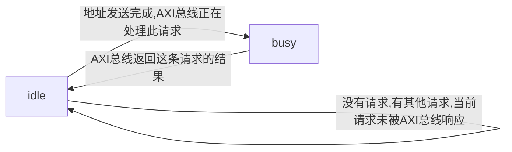
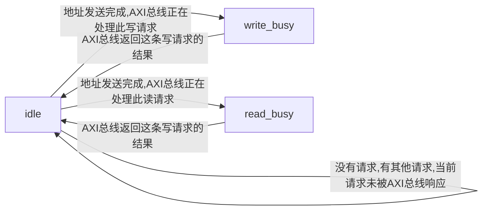
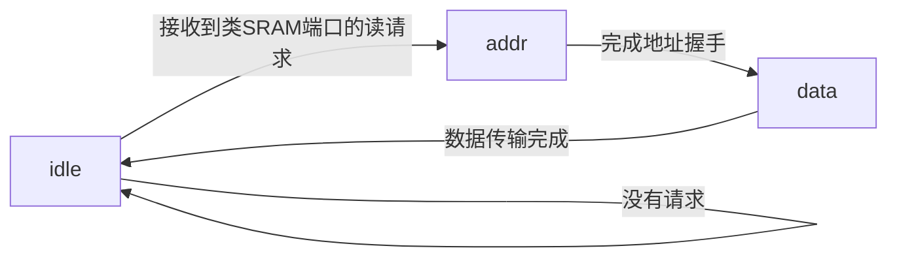

Sram-like to Axi Bridge
====================

Copyright (C) 2018 Wang Huaqiang 

email : wanghuaqiang16@mails.ucas.ac.cn

***

<!-- TOC -->

- [1. 模块综述](#1-模块综述)
- [2. 实现说明](#2-实现说明)
- [3. 实现细节](#3-实现细节)
    - [3.1. 类SRAM端口的INST端控制](#31-类sram端口的inst端控制)
    - [3.2. 类SRAM端口的DATA端控制](#32-类sram端口的data端控制)
    - [3.3. AXI总线的READ端控制](#33-axi总线的read端控制)
    - [3.4. AXI总线的WRITE端控制](#34-axi总线的write端控制)
    - [3.5. 仲裁逻辑](#35-仲裁逻辑)
        - [3.5.1. 仲裁逻辑的组成](#351-仲裁逻辑的组成)
        - [3.5.2. 仲裁依据](#352-仲裁依据)
- [4. BUG分析](#4-bug分析)
- [5. 实验日程](#5-实验日程)
- [6. 补充](#6-补充)
    - [6.1. 进一步开发计划](#61-进一步开发计划)
    - [6.2. 支持高效读取的桥的设计思路](#62-支持高效读取的桥的设计思路)

<!-- /TOC -->

***

# 1. 模块综述

`cpu_axi_interface`模块是一个实现保守的, 不支持多条读指令同时在AXI总线上执行的类sram-axi总线转接桥.

# 2. 实现说明

在总线实验第一阶段中, 实现了基本的转接桥设计. 为了确保在第一阶段中的设计正确, 在本次实验中采取了最为保守的设计. 对于数据写操作, 只要数据写操作到达即可执行. 对于两种数据读操作, 每次AXI总线只执行其中的一种, 并且在一条读操作完成之前不进行其他的操作.

同样, 对于类sram接口数据端的读与写操作, 在本设计中严格按顺序执行, 在一条指令完成操作之前不会进行下一个读写操作.

# 3. 实现细节

在转接桥的内部实现了四个状态机, 当然, 状态机的控制高度耦合. 其中四个状态机分别对应:

* 类SRAM端口的INST端控制
* 类SRAM端口的DATA端控制
* AXI总线的READ端控制
* AXI总线的WRITE端控制

各个状态机采用标准的三段式状态机写法.

状态机的状态转移图如下:

## 3.1. 类SRAM端口的INST端控制


## 3.2. 类SRAM端口的DATA端控制


## 3.3. AXI总线的READ端控制

下图中addr对应地址握手状态, data对应数据握手状态.



READ端的数据来源由仲裁逻辑决定.

## 3.4. AXI总线的WRITE端控制

下图中addr对应地址握手状态, data对应数据握手状态, bend对应传输结束处理bxx信号状态.


## 3.5. 仲裁逻辑

仲裁逻辑负责处理多个数据事务同时请求读端口的情况.

在本设计中, 因为DATA端口的数据处理严格有序, 所以不涉及处理读写相关的情况.

### 3.5.1. 仲裁逻辑的组成

仲裁逻辑主要依赖于`current_affair`寄存器. 其维护了当前AXI总线读端口上正在执行的传输的信息. 关键控制代码如下:

```v
reg [1:0]current_affair;

`define affair_none 2'b00
`define affair_inst 2'b01
`define affair_data 2'b10

//judge
always@(posedge clk)begin
    if(!resetn)begin
        current_affair<=2'b0;
    end
    else
    begin
    if(current_affair==`affair_none)
    begin
        current_affair<=
        (data_req&(!data_wr))?
            `affair_data:
            (inst_req)?
                `affair_inst:
                `affair_none;
    end else begin
        current_affair<=rvalid?`affair_none:current_affair;
        //在完成一次读传输之后清除仲裁寄存器中保存的值
    end
    end
end
```

之后, 各状态机就可以根据自身状态和 current_affair 的值来给出控制信号.

### 3.5.2. 仲裁依据

由于CPU实现中, 如果指令读优先于数据读的话, 可能因为数据读等待而引起流水线阻塞. 此时先完成指令的取址是没有必要的. 因此选择将数据读的优先级提高, 在数据读和指令读同时发生时, 先完成数据读处理.

<!-- 附注: 在CPU实现中, 写数据指令和读数据指令都在访存(MEM)级向内存端口发出信息. -->

# 4. BUG分析

简单的语法错误, 连线错误略去不谈(从写完大概花了30分钟就在tb上跑对了).

在上板过程中暂时没有测试到使桥失效的种子. 

# 5. 实验日程

* 2018.12.2 下午 总线相关知识学习.
* 2018.12.3 15:20-17:00 框架设计.状态机设计,初步代码编写.
* 2018.12.3 19:00-23:00 完成代码编写,仿真及测试,完成说明文件编写.

# 6. 补充

(因为暂时没什么BUG好写的就多写点补充吧)

## 6.1. 进一步开发计划

如果在CPU上这个桥工作正常的话(不太可能): 考虑修改桥的设计, 使之支持同时处理两条读指令, 这样应该可以大幅提高CPU的访存速度.

否则的话: 依照CPU的设计修改桥或者CPU.

## 6.2. 支持高效读取的桥的设计思路

如果要支持同时处理两条读指令的话, 控制AXI总线的状态机需要进行比较大幅度的修改. 

引入新结构 data_history 寄存器来保证读写操作的顺序正确. 在一个新的数据内存读写操作到达时, 将其信息加入历史寄存器. 因为数据内存读写相关只发生在两条指令之间, 因此历史寄存器只需要设置至多两项. 
<!-- 
```v
`define hst_none 2'b00;
`define hst_read 2'b01;
`define hst_write 2'b10;
reg [1:0]data_history[2];//init to 0
reg hist_point;//init to 0
always@(posedge clk)begin
    case({data_req,data_wr})
    2'b10://read
    begin
        if(data_history[hist_point]==hst_none)
    end
    2'b11://write
    begin

    end
    default://no transfer
    begin

    end

    endcase
end
``` -->

首先是要根据返回的结果的id来确定结果的类型, 并将结果返回回对应的sram端口. 比如说一条取址读的结果和访存读的结果需要借此来进行区分. 同时状态机的"结束传输"逻辑也要进行变动. 再其次, 对于连续的读写和写读同一个地址的指令, 应该在第一条传输操作完成之前禁止第二条传输操作的执行.

我们来分析这样的操作对于CPU实际效率的影响. 支持两个读操作并行执行可以提高"取址和读内存"同时发生时的执行效率. 在实际情况中, 这样的事件是很常见的, 因此有很大的意义.

但是对于连续的读写同一个内存地址的操作, 在之前的CPU实现中, 写数据指令和读数据指令都在访存(MEM)级向内存端口发出信息. 因此支持这种操作只对于"阻塞在第四级等待返回的读内存指令和阻塞在第三级等待返回的写内存指令"有效. 相比之前的改动来说对于性能的影响并不会特别大, 反而可能会引起很多较难调试的BUG;

之后的实验中将尽可能先满足"两个读操作并行", 数据读写同时进入AXI总线的设计优先级不高.
