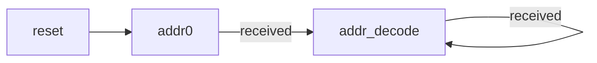
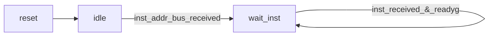
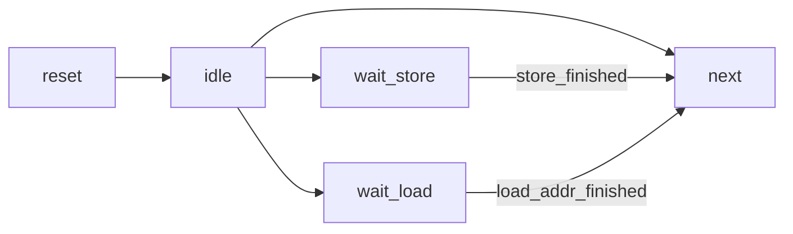

# 总线调整说明

## CPUsram_inst接口

### 取指令(地址)状态机

* reset: 无请求发出
* addr0: 0xbfc00000
* addr_decode: addr_decode

### 取指令(数据)状态机

decode_readygo 逻辑: IF_valid&ID_valid 

## CPUsram_data接口

### EXsram状态机

-->next: cango

cango条件:

1. idle状态(没有存取指令)
1. wait_store--store_finished(store完成)
1. wait_load--load_addr_finished

其他影响: divider在mem级写回数据, 似乎没有很大的影响(TODO)

## MEMsram状态机

cango=load?load_data_finished:1;

## 其他注意事项

### 复位期间不要对外发起总线请求

利用reset状态解决.

### 取指发出的请求并不一定会被立刻响应，取指请求响应后下一拍不一定会返回指令

### 请求一旦置起后，如果没有响应，则不能更换请求。这个要求导致，一个取指请求置起后，如果此时发生例外清空流水线从例外入口处取指，需要仔细控制好总线接口上的请求

此时延迟槽中的指令需要等待其读取完成, 但是是无效指令.

PS: 补充逻辑: if(!valid)setas(0);

可能发生的情况有: 

1. 在此(例外被处理)时刻, 延迟槽指令刚好进入. 解决办法是: valid直接置0, 延迟槽指令写0即可.
1. 在此(例外被处理)时刻, 延迟槽正在等待指令进入. 解决办法是:进入"等待并抛弃"状态

## sram-like-AXI-bridge改进: 

同时取值和取指令: 支持两个ID不同的读操作. 

data端口支持连续的两个操作.

## 问题: 流水线控制逻辑行为分析

## AXI读、写通道分离，导致可能出现一种情冴：当存在地址相关的总线读写序列是，在Master端写地址和写数据请求先亍读请求交互完毕，但是在Slave端读请求先于写地址和写数据请求到达，从而导致读返回的数据并丌是写入的新值，出错

解法1: 在CPU内部设置判断逻辑, 为此需要改写EX状态机.
解法2: 在总线桥上设置仲裁逻辑.
解法3: 在总线桥上设置data通路同时只处理一个请求(lab5-1, 基本版本实现).

## 同一个请求源分配相同ID来约束数据返回的顺序

