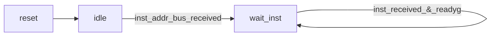
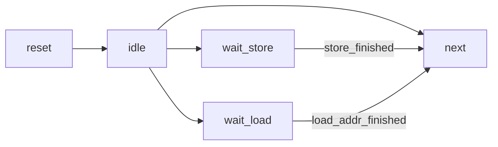
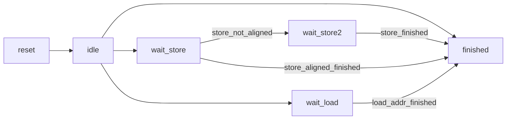
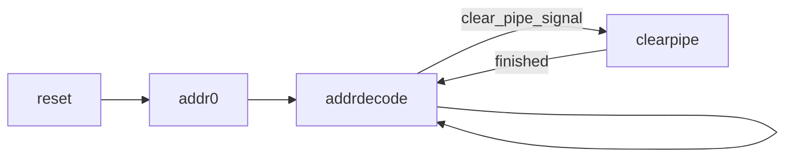
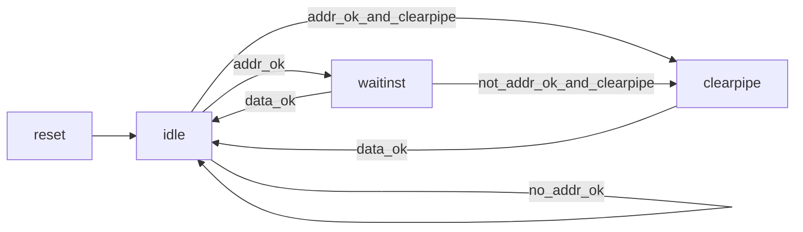
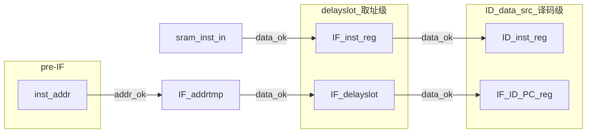

计算机体系结构实验报告

LAB5: CPU总线支持
========================

* 王华强
* 2016K8009929035

---

# 1. 目录

<!-- TOC -->

- [1. 目录](#1-目录)
- [2. 实验任务](#2-实验任务)
- [3. 实现综述](#3-实现综述)
- [4. 总线调整初步设计](#4-总线调整初步设计)
    - [4.1. CPUsram_inst接口](#41-cpusram_inst接口)
        - [4.1.1. 取指令(地址)状态机](#411-取指令地址状态机)
        - [4.1.2. 取指令(数据)状态机](#412-取指令数据状态机)
    - [4.2. CPUsram_data接口](#42-cpusram_data接口)
        - [4.2.1. EXsram状态机](#421-exsram状态机)
        - [4.2.2. MEMsram状态机](#422-memsram状态机)
    - [4.3. 其他注意事项](#43-其他注意事项)
        - [4.3.1. EXsram状态机改](#431-exsram状态机改)
    - [4.4. 顶层模块修改](#44-顶层模块修改)
    - [4.5. BUGS](#45-bugs)
- [5. 设计修正(实际设计)](#5-设计修正实际设计)
    - [5.1. sram-AXI-bridge](#51-sram-axi-bridge)
    - [5.2. EX-sram 和 MEM-sram 控制逻辑](#52-ex-sram-和-mem-sram-控制逻辑)
    - [5.3. pre-IF-sram 控制逻辑](#53-pre-if-sram-控制逻辑)
    - [5.4. IF-sram 控制逻辑](#54-if-sram-控制逻辑)
    - [5.5. IF部分流水线逻辑重构](#55-if部分流水线逻辑重构)
- [6. 实验日程](#6-实验日程)
- [7. 其他错误记录](#7-其他错误记录)
    - [7.1. 保留指令例外与取指地址错同时触发](#71-保留指令例外与取指地址错同时触发)
    - [7.2. Set Compare to 0](#72-set-compare-to-0)
    - [7.3. 流水线设计问题](#73-流水线设计问题)
    - [7.4. SW指令过早流出EX级](#74-sw指令过早流出ex级)
    - [7.5. Bridge 存在问题导致读取操作过慢](#75-bridge-存在问题导致读取操作过慢)
- [8. 通过时间](#8-通过时间)
    - [8.1. 初版(总线桥存在BUG)](#81-初版总线桥存在bug)
    - [8.2. lab5-3passed(总线桥BUG修复)](#82-lab5-3passed总线桥bug修复)
- [9. 下一步设计计划](#9-下一步设计计划)

<!-- /TOC -->

***

# 2. 实验任务

* 调整CPU流水逻辑, 完成无延迟情况下的CPU-AXI总线支持.
* 至少完成上板情况下无延迟的测试

# 3. 实现综述

本周利用 axi-sram-bridge , 完成了CPU-AXI总线的对接工作, **并且在使用随机种子的情况下测试通过**.

# 4. 总线调整初步设计

这里描述实验过程中对于控制逻辑的初步设计. 在实验过程中控制逻辑的设计经过了较大的变动, 因此这里只给出初版逻辑设计作为参考, 不再做详细的解释.

## 4.1. CPUsram_inst接口

### 4.1.1. 取指令(地址)状态机


* reset: 无请求发出
* addr0: 0xbfc00000
* addr_decode: addr_decode

### 4.1.2. 取指令(数据)状态机



decode_readygo 生成逻辑: IF_valid&ID_valid 


## 4.2. CPUsram_data接口

### 4.2.1. EXsram状态机



-->next: cango

cango条件:

1. idle状态(没有存取指令)
1. wait_store--store_finished(store完成)
1. wait_load--load_addr_finished

其他影响: divider在mem级写回数据, 似乎没有很大的影响(TODO)

### 4.2.2. MEMsram状态机


cango=load?load_data_finished:1;

## 4.3. 其他注意事项


> 复位期间不要对外发起总线请求

利用reset状态解决.

> 取指发出的请求并不一定会被立刻响应，取指请求响应后下一拍不一定会返回指令

> 请求一旦置起后，如果没有响应，则不能更换请求。这个要求导致，一个取指请求置起后，如果此时发生例外清空流水线从例外入口处取指，需要仔细控制好总线接口上的请求

此时延迟槽中的指令需要等待其读取完成, 但是是无效指令.

PS: 补充逻辑: if(!valid)setas(0);

可能发生的情况有: 

1. 在此(例外被处理)时刻, 延迟槽指令刚好进入. 解决办法是: valid直接置0, 延迟槽指令写0即可.
1. 在此(例外被处理)时刻, 延迟槽正在等待指令进入. 解决办法是:进入"等待并抛弃"状态

> sram-like-AXI-bridge改进(todo) 

同时取值和取指令: 支持两个ID不同的读操作. 

data端口支持连续的两个操作.

> 问题: 流水线控制逻辑行为分析(todo)

> AXI读、写通道分离，导致可能出现一种情冴：当存在地址相关的总线读写序列是，在Master端写地址和写数据请求先亍读请求交互完毕，但是在Slave端读请求先于写地址和写数据请求到达，从而导致读返回的数据并丌是写入的新值，出错

* 解法1: 在CPU内部设置判断逻辑, 为此需要改写EX状态机.
* 解法2: 在总线桥上设置仲裁逻辑.
* 解法3: 在总线桥上设置data通路同时只处理一个请求(lab5-1, 基本版本实现).

> 同一个请求源分配相同ID来约束数据返回的顺序


> 非对齐访存指令的处理

需要将三位读写转化成一次一位读写, 一次两位读写.

```v
wire[3:0] strb_swl=
    {4{ea==2'b00}}&4'b0001|
    {4{ea==2'b01}}&4'b0011|
    {4{ea==2'b10}}&4'b0111|
    {4{ea==2'b11}}&4'b1111;
wire[3:0] strb_swr=
    {4{ea==2'b00}}&4'b1111|
    {4{ea==2'b01}}&4'b1110|
    {4{ea==2'b10}}&4'b1100|
    {4{ea==2'b11}}&4'b1000;
```

涉及的问题在EX级处理, EX级的状态机需要引入额外的状态来处理三位非对齐访存指令.

### 4.3.1. EXsram状态机改

另外发现, 在EX级要考虑到MEM级读取操作未完成, 以及DIV操作未完成被阻塞的情况.



这里的finished是一个特殊的状态, 用来处理后面的流水级被阻塞时的情况. 只有在后面的流水级allowin的情况下, 这一状态才能够跳转到idle状态.

-->next: cango

cango条件:

1. idle状态(没有存取指令)
1. wait_store--store_finished(store完成)且store_aligned
1. wait_store2--store_finished
1. wait_load--load_addr_finished

其他影响: divider在mem级写回数据, 似乎没有很大的影响(TODO)

## 4.4. 顶层模块修改

直接连接新的CPU与bridge即可.

## 4.5. BUGS

B系列指令没有考虑到延迟槽, 由此导致了大量的跳转异常, 为此重写了取指部分的流水线.

B_delay: 这个信号在一开始被用于描述"延迟槽等待"操作, 即: 跳转指令正在被译码, 但是延迟槽指令还没有成功建立数据握手的情况. 原本的设计是在出现这个问题时使用状态机来控制取指部分进行特殊处理, 后来发现写起来困难很大, 不方便调试, 而且设计复杂很不优雅. 最终选择放弃此信号, 通过重写取指部分的流水线, 保证ID级, 延迟槽中同时有有效指令来解决此问题.

吐槽: 对于各种跳转指令来说, 延迟槽的引入对于设计造成了相当大的不便.

***

# 5. 设计修正(实际设计)

实际实现与初步设计有着较大的差距. 下面描述本实验中的最终设计.


<!-- 首先从最简单的数据访存部分开始考虑. -->


## 5.1. sram-AXI-bridge

若按照实验讲义要求上的使用sram-like-AXI-bridge来进行输入输出控制, 则在遇到非对齐访存指令时可能出现无法在一次传输中完成的情况. 举例来说, 对于strb为`0111`的数据写操作, 使用sram-like接口的话就需要进行长度为1和长度为2的两次传输, 由此导致状态机设置非常复杂.

本实验中使用sram-AXI-bridge. 由于AXI总线支持wstrb接口, 使得CPU写内存的状态机设计可以极大简化. 在这样的前提下, 状态机只需要处理"MEM级访存未完成的情况下不能重复发出访存指令"这一点即可.

而由于桥模块`cpu_axi_sram_interface`的设计仅仅支持同时进行一条指令的读或写操作, 因此实际上"MEM级访存未完成的情况下不能重复发出访存指令"也不会有影响.

## 5.2. EX-sram 和 MEM-sram 控制逻辑

<!-- 依照上文所描述, 在这个阶段不需要使用状态机就可以完成控制. 因此, 这里使用纯组合逻辑来实现这两个阶段的控制. -->

由于SXX系列指令需要在先addr_ok, 再data_ok之后才能流出EX流水级, 因此 EX-sram 部分使用状态机来加以控制.

EX部分控制的关键在于"指令可以流出EX级"的条件控制. 在非访存指令, LX指令addr_ok, SX指令data_ok以后, 指令才可以流出EX级. 同时由于MEM级可能产生阻塞, EX级必须设置等待状态, 在不向总线发出请求的状态下等待MEM级完成操作.

这里使用纯组合逻辑来实现这MEM-SRAM阶段的控制.

在这个过程中, 难免会出现阻塞等等情况, 这时使用流水线中的readygo逻辑来进行控制.

## 5.3. pre-IF-sram 控制逻辑

相比之下, pre-IF-sram 和 IF-sram 控制逻辑必须要交由状态机实现, 因为清空流水线等等操作要用到状态机当前的状态.

新的状态机设计图如下所示:



其中:

* reset 初始化状态, 不输出有效值
* addr0 CPU起始地址: 给出bfc00000
* addrdecode 传给 INST RAM 的地址由ID级的跳转逻辑给出
* clearpipe 清空流水线通路, 传给 INST RAM 的地址由MEM级的异常处理逻辑给出

## 5.4. IF-sram 控制逻辑

IF-sram状态机用来获取返回的指令, 状态机设计图如下所示:



其中:

* reset 初始化状态, 不输出有效值
* idle 当前没有等待接收的指令
* waitinst 正在等待指令传入
* clearpipe 清空流水线的过程中存在未传输完成的指令

clearpipe状态的存在保证了在清空流水线的过程中不会出现"已发出取指但是没有接收到指令就直接清空流水线"的情况.

## 5.5. IF部分流水线逻辑重构

IF部分流水线逻辑重构的目的是为了实现支持总线延迟的分支延迟槽. 核心逻辑在于, 取指成功后指令进入分支延迟槽, 直到下一条指令取指成功时, 才将分支延迟槽中的指令写入ID。

指令流时空关系图如下：



其中:

* IF_addrtmp 是取指地址发出之后暂存地址(PC)所用的寄存器
* IF_inst_reg 是延迟槽指令寄存器
* ID_inst_reg 是ID级译码所用的指令寄存器
* IF_delayslot 是延迟槽PC寄存器
* IF_ID_PC_reg 是译码级所用的PC寄存器


核心代码段如下:

```verilog
//d flipflop of IF_delayslot (now IF_addrtmp)
reg [31:0]IF_addrtmp;
always@(posedge clk)begin
    if(!resetn)begin
        IF_addrtmp<=32'hbfc00000;
    end
    // else 
    // if(clear_pipeline)begin
    //     IF_delayslot<=32'b0;
    // end
    else begin
        // IF_delayslot<=((IF_ID_allowout|clear_pipeline)?
        //     (inst_addr_ok?inst_addr:IF_delayslot):
        //     IF_delayslot);
        IF_addrtmp<=inst_addr_ok?inst_addr:IF_addrtmp;
    end
end

//d flipflop of IF_inst
//IF data flow
always@(posedge clk)begin
    if(!resetn)begin
        IF_ID_valid<=1'b0;
        IF_ID_PC_reg<=32'b0;
        IF_inst_reg<=32'b0;
        IF_delayslot<=32'hbfc00000;
    end
    else begin
        IF_ID_valid<=
        (clear_pipeline?1'b0:
        (IF_ID_allowin?IF_ID_valid_in:IF_ID_valid));
    end

    if(clear_pipeline)begin
        // IF_ID_valid<=1'b0;
        IF_ID_PC_reg<=32'b0;
        IF_inst_reg<=32'b0;
        ID_inst_reg<=32'b0;
        IF_delayslot<=32'b0;
    end else
    if(IF_ID_valid_in&&IF_ID_allowin)begin
        IF_ID_PC_reg<=IF_delayslot;
        IF_inst_reg<=inst_sram_rdata;
        ID_inst_reg<=IF_inst_reg;
        IF_delayslot<=IF_addrtmp;
    end
end

```

# 6. 实验日程

* 2018.12.8 19:00-次日4:00 初版控制逻辑编写
* 2018.12.9 13:00-22:00 修改控制逻辑和流水线到新的版本, 处理完异常处理之外的所有问题, 实验日志编写
* 2018.12.10 2:15 Lab5-3 passed.
* 2018.12.10 整理实验报告

# 7. 其他错误记录

## 7.1. 保留指令例外与取指地址错同时触发

如题, 出现原因是引入总线之后在地址错误时会发出错误的总线请求, 取得错误的指令. 解决办法是在ID级的例外信号生成逻辑上加上判断, 在地址错例外发生时屏蔽保留指令例外.

## 7.2. Set Compare to 0 

实验手册上没有描述遇到这种情况应当如何处理. 似乎是"在setcompare的同时将TI置0"优先. 因此禁止CPU在`Compare==0`的情况下发出时钟中断.

## 7.3. 流水线设计问题

一开始的流水线设计与最终的正确流水有较大差距, 详见上文流水线设计改动部分.

## 7.4. SW指令过早流出EX级

(1. 造成流水线问题 2. SW指令没有得到data_ok就流出了)

出现问题的原因是, 忘记控制SW指令, 使之在EX级停留到data_ok再流出, 这个问题在之前的测试中因为总线性能太低(见下文)没有被发现.

因此EX级仍然要设立状态机, 或者采用类状态机的控制逻辑. 在此实现中, EX级的控制逻辑引入了一个状态寄存器, 用于在SX指令的执行过程中控制指令何时可以流出.

## 7.5. Bridge 存在问题导致读取操作过慢

问题体现在上板测试过程中, 部分随机种子在0x50测试点失败. 0x50测试点对应时钟中断测试. 出现问题的位置用伪代码可以如下表示:

```
设置compare;
执行一段指令;
在一条跳转指令处等待时钟中断触发; 
(时钟中断处理)
```

在模拟中, 时钟中断在跳转指令之前就被触发, 说明指令执行效率太低, 不能达到测试的要求.

检查波形发现速度过慢的原因是bridge状态机存在问题.

错误的代码片段如下:
```verilog
//in axi_sram_ifc.v
    `sram_inst_idle: 
    begin
        sram_inst_state_next=axi_judge_inst?`sram_inst_busy:`sram_inst_idle;
    end
    `sram_inst_busy: 
    begin
    //ERROR
    //原来的错误代码如下:
        //sram_inst_state_next=axi_judge_inst?`sram_inst_busy:`sram_inst_idle;
        //应该是复制粘贴的过程中忘记改了
    //正确代码
        sram_inst_state_next=axi_data_received?`sram_inst_idle:`sram_inst_busy;
    end
```

按照原有的写法, 在每次数据传输之后多进行了一次无谓的数据传输, 在这次数据传输之后桥模块的sram端口才能够进行有效的输入输出. 因此每次访存操作要多花了一倍的时间.

~~写成这样之前居然还能过而且无延迟测试还能过我也是很佩服我自己的啊.~~

# 8. 通过时间

## 8.1. 初版(总线桥存在BUG)

```
        [16842000 ns] Test is running, debug_wb_pc = 0x00000000
        [16852000 ns] Test is running, debug_wb_pc = 0x00000000
        [16862000 ns] Test is running, debug_wb_pc = 0x00000000
        [16872000 ns] Test is running, debug_wb_pc = 0x00000000
        [16882000 ns] Test is running, debug_wb_pc = 0x00000000
----[16882445 ns] Number 8'd94 Functional Test Point PASS!!!
==============================================================
Test end!
----PASS!!!
$finish called at time : 16886285 ns : File "C:/Users/autum/Desktop/ucas_CDE/mycpu_axi_verify/testbench/mycpu_tb.v" Line 267
run: Time (s): cpu = 00:10:04 ; elapsed = 00:09:26 . Memory (MB): peak = 1685.793 ; gain = 48.570
```

## 8.2. lab5-3passed(总线桥BUG修复)

```
        [8642000 ns] Test is running, debug_wb_pc = 0x00000000
        [8652000 ns] Test is running, debug_wb_pc = 0x00000000
----[8655195 ns] Number 8'd94 Functional Test Point PASS!!!
==============================================================
Test end!
----PASS!!!
$finish called at time : 8657185 ns : File "C:/Users/autum/Desktop/ucas_CDE/mycpu_axi_verify/testbench/mycpu_tb.v" Line 267
run: Time (s): cpu = 00:07:53 ; elapsed = 00:07:10 . Memory (MB): peak = 918.367 ; gain = 28.758
```

# 9. 下一步设计计划

* 完善EX级状态机, 当前状态机在连续指令的情况下会有问题. (尽管在当前的总线下不会出现连续指令)
* 更新总线桥, 支持"两个读操作并行", 以及"连续的两个读指令"来提高性能.

---

Copyright (C) 2018 Wang Huaqiang 