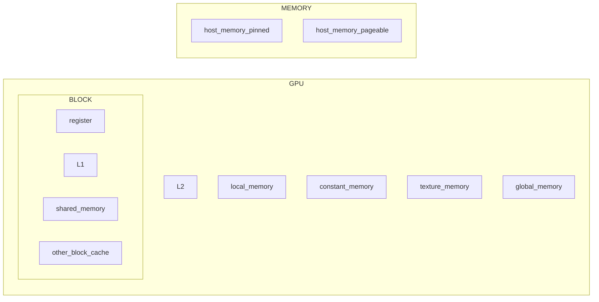

#### 计算机体系结构

作业十
============

* 王华强
* 2016K8009929035

***

## 1. 

在阻塞方式中, 数据只有从本地送出之后才可以执行后学的预计. 而对于非阻塞方式来说, 其无需等待数据传回就可以继续执行后面的指令. 在本题中, 使用的四个函数均为标准同行模式, 这意味着MPI会根据当前的通信情况来选取其他的模式.


## 2. 

<!-- > 规约是一类并行算法, 对传入的N个数据，使用一个二元的符合结合律的操作符⊕，生成1个结果。这类操作包括取最小、取最大、求和、平方和、逻辑与/或、向量点积。规约也是其他高级算法中重要的基础算法。 -->

ref: http://www.cnblogs.com/5long/p/algorithms-on-cuda-reduction.html

ref: https://blog.csdn.net/susan_wang1/article/details/50033823

规约操作被用来描述一系列并行算法. 一般而言, 这些算法将多个传入的数据使用一个相同的满足结合律的二元运算符进行计算生成一个结果.

并行描述|实现方式
-|-
MPI|全局规约函数`MPI_Reduce()`
OPENMP|使用数据域属性子句:reduction(规约)来规约列表中出现的变量

## 3. 

ref: http://blog.jobbole.com/101977/

`Barrier`是一种同步机制. 简单地说, 它可以保证多个进程/线程在全都到达某个位置时才继续向下(并行)执行. "其可以用于在无锁的情况下保护并行算法的正确性".

并行描述|实现方式
-|-
MPI|栅障函数`MPI_Barrier()`
OPENMP|使用编译指导语句`#pragma omp barrier newline`

## 4.

不正确, 会引起死锁.

我们先分析`MPI_Bcast()`函数. 在进程0中使用这个函数的作用是发送全局广播, 在进程1中使用这个函数的目的是接收全局广播. 在这两个进程中, 两组消息传递的顺序不同, 因此会引发死锁(进程1永远在`MPI_Recv()`处等待).

## 5.

```c
#include<stdio.h>
#include<omp.h>
#define n 111
#define m 222
#define p 333

#define rep0(a,b,c) for(int a=b; a<(c); a++)

int A[m][p];
int B[p][n];
int C[m][n];

int main()
{
    rep0(a,0,m)
        rep0(b,0,p)
            A[a][b]=1;
    rep0(a,0,p)
        rep0(b,0,n)
            B[a][b]=1;
    
    int a, b, c;

#pragma omp parallel for shared(A,B) private(a,b,c)
    for(a=0;a<m;a++)
        for(b=0;b<n;b++)
        {
            C[a][b]=0;
            for(c=0;c<p;c++)
            {
                C[a][b]+=A[m][p]*B[p][n];
            }
        }

    return 0;
}

```

## 6.


```c
#include<stdio.h>
#include"mpi.html"
#define n 111
#define m 222
#define p 333

int main(int argc, char** argv)
{
    int *A, *B, *C;
    int a,b,c,;
    int ID, nprocs, line;
    MPI_Status status;

    MPI_Init(&argc, &argv);
    MPI_Comm_rank(MPI_COMM_WORLD, &ID);
    MPI_Comm_size(MPI_COMM_WORLD, &nprocs);

    A=(int *)malloc(sizeof(int)*n*m);
    B=(int *)malloc(sizeof(int)*p*m);
    C=(int *)malloc(sizeof(int)*n*p);
    line=n/nprocs;

    if(ID==0)
    {
        for(int a=0;a<n;a++)
            for(int b=0;b<mb++)
                A[a*m+b]=1;//input();
        for(int a=0;a<m;a++)
            for(int b=0;b<p;b++)
                B[a*p+b]=1;//input();
        for(int a=0;a<n;a++)
            for(int b=0;b<p;b++)
                C[a*p+b]=0;//input();
        for(int i=1;i<nprocs;i++)
        {
            MPI_Send(B,m*p,MPI_INT,i,0,MPI_COMM_WORLD);
            MPI_Send(A+(i-1)*line*m,m*line,MPI_INT,i,1,MPI_COMM_WORLD);
        }
        for(int i=1;i<nprocs;i++)
        {
            MPI_Recv(C+(i-1)*line*p,line*p,MPI_INT,i,2,MPI_COMM_WORLD,&status);
        }
        for(int i=(nprocs-1)*line;i<n;i++)
        {
            for(int j=0;j<p;j++)
            {
                C[i*p+j]=0;
                for(int k=0;k<m;k++)
                {
                    C[i*p+j]+=A[i*m+k]*B[k*p+j];
                }
            }
        }
        //Finished
    }
    else
    {
        MPI_Recv(B,m*p,MPI_INT,0,0,MPI_COMM_WORLD,&status);
        MPI_Recv(A+(ID-1)*line*m,line*m,MPI_INT,0,1,MPI_COMM_WORLD,&status);
        for(int i=(ID-1)*line;i<line*ID;i++)
        {
            for(int j=0;j<p;j++)
            {
                C[i*p+j]=0;
                for(int k=0;k<m;k++)
                {
                    C[i*p+j]+=A[i*m+k]+B[k*p+k];
                }
            }
        }
        MPI_Send(C+(nprocs-1)*line*n,line*n,MPI_INT,0,2,MPI_COMM_WORLD);
    }
    MPI_Finalize();
    return 0;

}

```

区别如下: 

OPENMP提供了更高层次的近似, 使得调用者可以不必关心底层的实现, 而只需要提供可以正常串行化的代码, 起余优化和并行设计交由编译器实现. 在编译器不支持 OPENMP 宏的情况下, 程序会被作为正常的串行程序执行.

相比之下, MPI需要编程者手动设计并行程序工作分配的细节. 这样虽然提高了编程复杂度, 但是允许编程者对程序进行更为精细的控制, 适用于需要特殊控制的并行程序.

## 7.

此答案基于 NVIDIA GPU 的通用存储架构. 参考了CUDA手册中的内容.

ref: https://blog.csdn.net/lavorange/article/details/20465869

用示意图描述如下:



层级名|描述
-|-
register|GPU上寄存器,对每个线程独立
local_memory|板载显存,对每个线程独立
shared_memory|板载显存,可以被同一Block中的所有进程访问
constant_memory|显存上缓存加速的只读存储
texture_memory|纹理存储器(啥玩意啊咋回事啊)
global_memory|显存,CPU,GPU均可访问
host_memory_pageable|物理内存(可重新分页)
host_memory_pinned|物理内存(虚拟页pin住)
L1|L1 cache
L2|L2 cache

总体来说, GPU为并行操作进行了特殊的设计. 对于一定范围内的并行处理单元提供了专用的存储. 在更高的层次上又提供了多个单元共用的存储及缓存. 同时, 根据不同的需要, 在相同的层级上, NIVDIA的GPU也将显存划分成了不同的用途. 整体架构层级大致为 小范围专用存储->Block内共享存储->GPU内共享存储->内存


---

Copyright (C) 2018 Wang Huaqiang 