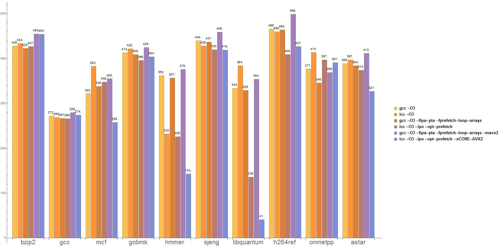

#### 计算机体系结构

作业十二
============

* 王华强
* 2016K8009929035

***

## 1.

测试整数性能的程序如下:

```c++
// Copyright (C) 2019 Wang Huaqiang

#include <bits/stdc++.h>

using namespace std;
#define TIMES 1000000
#define ASM_STEP 8

int main()
{
    int a[10000];
    int t=0;
    clock_t start, end;
    start=clock();
    while(t++<TIMES)
    {
        for(int i=0;i<10000;i+=2)
        {
            a[i+1]+=a[i];
        } 
    }
    end=clock();
    cout<<"start:"<<start<<" end:"<<end<<" CLOCKS_PER_SEC:"<<CLOCKS_PER_SEC<<endl;
    cout<<"ips:"<<(double)((double)ASM_STEP*(double)TIMES*5000)/((double)(end-start)/(double)CLOCKS_PER_SEC)<<endl;
    return 0;
}
```

测试浮点性能的程序, 除了上面的程序之外, 还需要:

```c++
// Copyright (C) 2019 Wang Huaqiang

#include <bits/stdc++.h>

using namespace std;
#define TIMES 1000000
#define ASM_STEP 13

int main()
{
    double a[10000];
    int t=0;
    clock_t start, end;
    start=clock();
    while(t++<TIMES)
    {
        for(int i=0;i<10000;i+=2)
        {
            a[i+1]+=a[i];
        } 
    }
    end=clock();
    cout<<"start:"<<start<<" end:"<<end<<" CLOCKS_PER_SEC:"<<CLOCKS_PER_SEC<<endl;
    cout<<"ips:"<<(double)((double)ASM_STEP*(double)TIMES*5000)/((double)(end-start)/(double)CLOCKS_PER_SEC)<<endl;
    return 0;
}
```

编译及运行指令如下:

```sh
g++ -S mips.cc
g++ -S mflops.cc
g++ mips.cc -o mips.exe
g++ mflops.cc -o mflops.exe
./mips
./mflops
```

在编译的过程中编译出了汇编指令文件, 程序中循环体指令数(ASM_STEP)的计算需要通过汇编文件中循环内汇编指令的个数求得.

运行结果如下:

```
PS F:\workpath\Notes\OperationSystem\lab\share\vmshare\1> cd "f:\workpath\Notes\OperationSystem\lab\share\vmshare\1\" ; if ($?) { g++ -std=c++11 mips.cc -o mips -lpthread } ; if ($?) { .\mips }

start:0 end:16591 CLOCKS_PER_SEC:1000
ips:2.41095e+009

PS F:\workpath\Notes\OperationSystem\lab\share\vmshare\1> g++ -S .\mflops.ccPS F:\workpath\Notes\OperationSystem\lab\share\vmshare\1> cd "f:\workpath\Notes\OperationSystem\lab\share\vmshare\1\" ; if ($?) { g++ -std=c++11 mflops.cc -o mflops -lpthread } ; if ($?) { .\mflops }

start:0 end:41399 CLOCKS_PER_SEC:1000
ips:1.57009e+009
```

注意: flops的值需要使用`mips.cc`与`flops.cc`的结果进行换算之后求得. 原因是浮点指令在`flops.cc`的循环主体中占$\frac{4}{13}$.

---

## 2.

分别使用以下指令编译运行. (除了处理器的频率, 处理器的频率控制通过设置BIOS实现(但是笔记本实现不了, 这部分只能依赖其他人的兼容台式机了)).

```bat
REM Run in windows 10 env

gcc stream.c -o stream 
.\stream
gcc -O -fopenmp stream.c -o stream
.\stream

gcc stream_float.c -o stream_float 
.\stream_float
gcc stream_float.c -O -fopenmp -o stream_float 
.\stream_float
```

测试结果如下:


## 直接运行测试程序

### 单核直接运行测试程序

```
PS F:\workpath\Notes\OperationSystem\lab\share\vmshare\4> cd "f:\workpath\Notes\OperationSystem\lab\share\vmshare\2\" ; if ($?) { gcc stream.c -o stream } ; if ($?) { .\stream }
-------------------------------------------------------------
STREAM version $Revision: 5.10 $
-------------------------------------------------------------
This system uses 8 bytes per array element.
-------------------------------------------------------------
Array size = 10000000 (elements), Offset = 0 (elements)
Memory per array = 76.3 MiB (= 0.1 GiB).
Total memory required = 228.9 MiB (= 0.2 GiB).
Each kernel will be executed 10 times.
 The *best* time for each kernel (excluding the first iteration)
 will be used to compute the reported bandwidth.
-------------------------------------------------------------
Your clock granularity/precision appears to be 944 microseconds.
Each test below will take on the order of 27298 microseconds.
   (= 28 clock ticks)
Increase the size of the arrays if this shows that
you are not getting at least 20 clock ticks per test.
-------------------------------------------------------------
WARNING -- The above is only a rough guideline.
For best results, please be sure you know the
precision of your system timer.
-------------------------------------------------------------
Function    Best Rate MB/s  Avg time     Min time     Max time
Copy:            6305.2     0.026458     0.025376     0.027350
Scale:           7126.3     0.024073     0.022452     0.029311
Add:             9469.7     0.026355     0.025344     0.027328
Triad:           8773.5     0.028630     0.027355     0.030226
-------------------------------------------------------------
Solution Validates: avg error less than 1.000000e-013 on all three arrays
-------------------------------------------------------------
PS F:\workpath\Notes\OperationSystem\lab\share\vmshare\2>
```

### 多核运行测试程序

```
PS F:\workpath\Notes\OperationSystem\lab\share\vmshare\2> gcc -O -fopenmp stream.c -o stream
PS F:\workpath\Notes\OperationSystem\lab\share\vmshare\2> .\stream
-------------------------------------------------------------
STREAM version $Revision: 5.10 $
-------------------------------------------------------------
This system uses 8 bytes per array element.
-------------------------------------------------------------
Array size = 10000000 (elements), Offset = 0 (elements)
Memory per array = 76.3 MiB (= 0.1 GiB).
Total memory required = 228.9 MiB (= 0.2 GiB).
Each kernel will be executed 10 times.
 The *best* time for each kernel (excluding the first iteration)
 will be used to compute the reported bandwidth.
-------------------------------------------------------------
Number of Threads requested = 8
Number of Threads counted = 8
-------------------------------------------------------------
Your clock granularity/precision appears to be 945 microseconds.
Each test below will take on the order of 7807 microseconds.
   (= 8 clock ticks)
Increase the size of the arrays if this shows that
you are not getting at least 20 clock ticks per test.
-------------------------------------------------------------
WARNING -- The above is only a rough guideline.
For best results, please be sure you know the
precision of your system timer.
-------------------------------------------------------------
Function    Best Rate MB/s  Avg time     Min time     Max time
Copy:           18223.3     0.009655     0.008780     0.010734
Scale:          18221.4     0.009757     0.008781     0.012687
Add:            20495.5     0.012687     0.011710     0.014641
Triad:          20493.6     0.012905     0.011711     0.013667
-------------------------------------------------------------
Solution Validates: avg error less than 1.000000e-013 on all three arrays
-------------------------------------------------------------
PS F:\workpath\Notes\OperationSystem\lab\share\vmshare\2>
```

## 使用单精度带宽

### 单核单精度带宽

```
PS F:\workpath\Notes\OperationSystem\lab\share\vmshare\2> cd "f:\workpath\Notes\OperationSystem\lab\share\vmshare\2\" ; if ($?) { gcc stream_float.c -o stream_float } ; if ($?) { .\stream_float }
-------------------------------------------------------------
STREAM version $Revision: 5.10 $
-------------------------------------------------------------
This system uses 4 bytes per array element.
-------------------------------------------------------------
Array size = 10000000 (elements), Offset = 0 (elements)
Memory per array = 38.1 MiB (= 0.0 GiB).
Total memory required = 114.4 MiB (= 0.1 GiB).
Each kernel will be executed 10 times.
 The *best* time for each kernel (excluding the first iteration)
 will be used to compute the reported bandwidth.
-------------------------------------------------------------
Your clock granularity/precision appears to be 948 microseconds.
Each test below will take on the order of 27300 microseconds.
   (= 28 clock ticks)
Increase the size of the arrays if this shows that
you are not getting at least 20 clock ticks per test.
-------------------------------------------------------------
WARNING -- The above is only a rough guideline.
For best results, please be sure you know the
precision of your system timer.
-------------------------------------------------------------
Function    Best Rate MB/s  Avg time     Min time     Max time
Copy:            3278.9     0.026242     0.024398     0.034141
Scale:           3726.0     0.022668     0.021471     0.023454
Add:             4917.8     0.026347     0.024401     0.027333
Triad:           4553.9     0.028416     0.026351     0.031252
-------------------------------------------------------------
Solution Validates: avg error less than 1.000000e-006 on all three arrays
-------------------------------------------------------------
PS F:\workpath\Notes\OperationSystem\lab\share\vmshare\2>
```

### 多核单精度带宽

```
PS F:\workpath\Notes\OperationSystem\lab\share\vmshare\2> cd "f:\workpath\Notes\OperationSystem\lab\share\vmshare\2\" ; if ($?) { gcc stream_float.c -O -fopenmp -o stream_float } ; if ($?) { .\stream_float }
-------------------------------------------------------------
STREAM version $Revision: 5.10 $
-------------------------------------------------------------
This system uses 4 bytes per array element.
-------------------------------------------------------------
Array size = 10000000 (elements), Offset = 0 (elements)
Memory per array = 38.1 MiB (= 0.0 GiB).
Total memory required = 114.4 MiB (= 0.1 GiB).
Each kernel will be executed 10 times.
 The *best* time for each kernel (excluding the first iteration)
 will be used to compute the reported bandwidth.
-------------------------------------------------------------
Number of Threads requested = 8
Number of Threads counted = 8
-------------------------------------------------------------
Your clock granularity/precision appears to be 941 microseconds.
Each test below will take on the order of 3923 microseconds.
   (= 4 clock ticks)
Increase the size of the arrays if this shows that
you are not getting at least 20 clock ticks per test.
-------------------------------------------------------------
WARNING -- The above is only a rough guideline.
For best results, please be sure you know the
precision of your system timer.
-------------------------------------------------------------
Function    Best Rate MB/s  Avg time     Min time     Max time
Copy:           20497.5     0.004667     0.003903     0.004920
Scale:          20481.6     0.004985     0.003906     0.005857
Add:            20498.6     0.006184     0.005854     0.006833
Triad:          20499.1     0.006398     0.005854     0.006848
-------------------------------------------------------------
Solution Validates: avg error less than 1.000000e-006 on all three arrays
-------------------------------------------------------------
PS F:\workpath\Notes\OperationSystem\lab\share\vmshare\2>
```

## 总结

* 处理器的频率对于内存的带宽没有太大影响. 
* 在相同的条件下, 使用双精度带宽可以增大内存带宽.

---

## 3.

<!-- 它对处理器微结构的压力应该在于并行性能力方面。可以查到数据于下： [图片]其中数据代表运行的时间，可以看到icc -O3 -ipo -opt -prefetch编译出来的结果是最快的，原因应该是它充分利用了向量指令，提高了处理器的并行性。 -->



icc比gcc有很大优势. 猜测icc使用了向量指令优化来提高并行性能.

猜测微结构压力在于并行操作性能.

补充:

根据http://llvm.org/devmtg/2015-10/slides/Gerolf-PerformanceImprovementsAndHeadroom.pdf, llvm对于libquantum也进行了优化. 推测icc可能也采用了类似的策略.

这些策略包括:

* Array of Structs (AoS) to Structs of Array (SoA)
* Interprocedural Loop Fusion
......


---

## 4. 

程序设计见: https://github.com/AugustusWillisWang/Notes/tree/master/ComputerArchitecture/evaluate

TODO: perf无法正常运行

---

## 5. 

TODO

---

## 6.

LMbench3使用前的特殊处理: 删除原有压缩包中的配置文件.

结果如下:

```

```
---

## 7.

TODO

---

## 8. 

ref: https://www.eembc.org/products/#het

我们以EEMBC中"EEMBC's original benchmarks focused on single core 8- and 16-bit embedded processors"的部分(EEMBC中针对嵌入式设备的部分)为例, 来分析这个问题.

通常来说, 面向桌面的基准测试程序会执行一些科学计算操作, 常用算法和常用程序的性能测试. 测试程序需要长时间的占用CPU. 测试程序对于CPU的**性能**(主频, IPC)有着很高的要求. 其目的是测试桌面处理器的极限性能.

而对于嵌入式测试程序来说, 其需要更多的考虑到嵌入式设备实际使用时的场景, 关注**功耗**与性能等等指标. 测试程序不一定是对于CPU的计算性能有着很高的要求, 而是会模拟嵌入式实际使用时"不时被唤醒", "连接传感器"等等的情况. 举例来说:

* ULPMark 测试"不时被唤醒"场景下的功耗
* IoTMark 测试使用蓝牙和传感器时CPU的表现
* SecureMark 测试TLS握手时的功耗

---

## 9.

ref: https://blog.csdn.net/chichi123137/article/details/80145914?tdsourcetag=s_pctim_aiomsg

编号|说明
-|-
0x00|软件自增。寄存器随着向软件自增寄存器写入增加而增加
0x03|导致数据或cache重填的数据读写操作。包括因读或写操作导致的数据cache的申请操作
0x04|在数据或cache上导致cache访问的读写操作。
0x05|在TLB上导致TLB充填的数据读写操作
0x0E|程序返回
0x10|分支预测失败
0x16|l2数据cache访问
0x17|l2数据cache重填
0x18|l2数据cache写回
0x19|总线访问
0x86|中断异常

---

## 10.

-|模拟建模|性能测量
-|-|-
可以取得的调试信息|比较充足|只能通过预留的硬件接口获得
灵活性|比较充足, 可以随时修改并重新测试|很低
成本|比较低, 不需要实际生产硬件|比较高

速度上: 根据不同的模拟建模方法和硬件设计, 可能更快也可能更慢.

<!-- 10.模拟建模的方法相比性能测试的方法对配置修改的灵活性较高，成本较低。 -->

## 11.

ref: http://cseweb.ucsd.edu/~calder/simpoint/simpoint_overview.htm

SimPoint的核心思想被称为 `Offline phase analysis`.

传统的cycle-level模拟器需要模拟大量的细节, 但这会占用许多的时间.

SimPoint在每个相位选取一个代表点(代表点来自于聚簇的中心), 只在代表点处执行详细的程序分析/模拟. 之后通过聚簇的大小来衡量这一部分的性能表现. 本质上就如同它的名字所暗示的一样, 可以理解成是通过点采样来在不大幅提高错误率的情况下进行加速.

<!-- SimPoint calculates phases for a program/input pair, and then chooses a single representative from each phase and estimates the remaining intervals’ behaviors by performing a detailed program analysis or simulation only on that chosen representative. We choose this representative for each phase (which is a cluster of intervals) by finding the interval closest to the cluster’s center (centroid). This selected interval for a phase is called a simulation point for that phase. We then perform detailed simulation at the simulation points and weigh the performance by the size (number of intervals) in its cluster. -->

<!-- To gain this understanding, architects typically employ detailed cycle-level simulators. Unfortunately, this level of detail comes at the cost of simulation speed,   -->


<!-- 11.SimPoint在进行采样时首先找到程序执行的相位，然后对能够代表每个相位的部分进行采样和模拟仿真，这种方法之所以能够减少模拟时间，是因为这种采样方法能够截取程序中能够代表整个程序的一小部分进行模拟，而这大大减少了需要模拟的指令数。 -->

## 12. 

尽量减小模拟器和真实系统的区别.

<!-- 模拟器和真实的机器校准可以进行微结构级的模拟，模拟器在时钟周期级别上记录每条动态指令的运行结果、每一级流水线触发器的状态、内部各种队列的状态以及体系结构寄存器的状态、内存和Cache行为、分支预测器的状态，真实的机器可以根据这些指标进行校准。 -->

TODO

## 13.

执行命令:

```
runspec -c x86_64.O3.cfg -i ref -n 1 -r -u 4 all -I -D
```

结果如下:

TODO
---

Copyright (C) 2018 Wang Huaqiang 