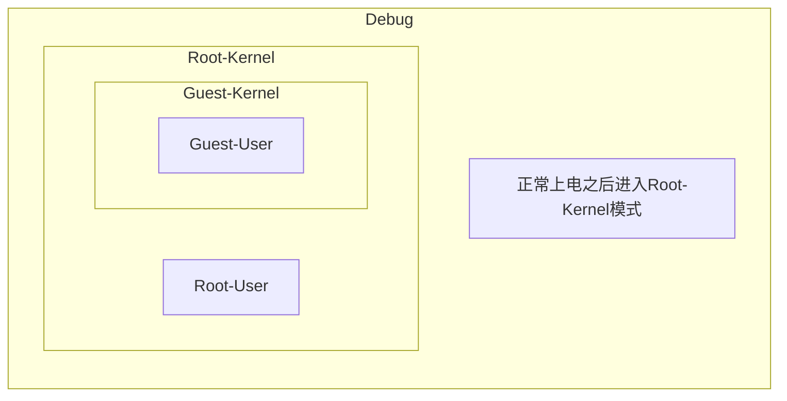
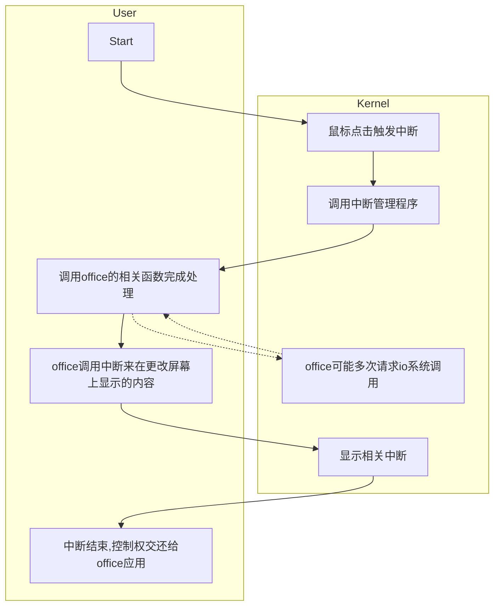

# 计算机体系结构

## 作业二

* 王华强
* 2016K8009929035

***

## 1. 列出一种指令系统的运行级别之间的关系

以MIPS指令系统为例:

上电后进入Root-Kernel模式, Root-Kernel包含完整的系统权限;

在这一模式之下的是Root-Uesr模式和Guest-Kernel模式, Guest-Kernel模式下还包含Guest-User模式. 每种模式只能控制自身的所属资源. (当然可以控制其下的子模式的资源.)

画图如下:



## 2. 用C描述段页式存储的地址转化过程

```c
//解析虚拟地址
#define SEG_MASK 11100000 //对应段号在虚拟地址中位置的掩码
#define SEG_OFFSET 11 //对应段号在虚拟地址中位置的偏移量
#define VPAGE_MASK ...
#define VPAGE_OFFSET ...
#define INPAGE_MASK ...
#define INPAGE_OFFSET ...

uint32_t virtual_address;
uint32_t seg_number=(virtual_address&SEG_MASK)>>SEG_OFFSET;
uint32_t vpage_number=(virtual_address&VPAGE_MASK)>>VPAGE_OFFSET;
uint32_t inpage_offset=(virtual_address&INPAGE_MASK)>>INPAGE_OFFSET;

//产生页表入口
#define PAGE_BASE_MASK
uint32_t* pagetable=segtable[seg_number]&PAGE_BASE_MASK;

//查找物理页号
#define PHYSIC_PAGE_MASK
uint32_t physic_page=pagetable[vpage_number];

//产生真实地址
uint32_t physic_addr=physic_page<<offset_physic_page+inpage_offset;
```

> PS: 这段用verilog描述要省事多了....

## 3. 描述PC上PPT翻页过程中用户态和核心态的转换

使用流程图来描述:



## 4. 按要求完成问题

```
A=B+C
B=A+C
C=B+A
```

以下所有问题的回答都基于未优化的程序片段.

类似寄存器-寄存器型指令可以利用寄存器堆进行优化来减少访存次数. 但是题目中没有明确指出是否要写出最优化的指令序列.

#### (1)写出在堆栈型, 累加器型, 寄存器存储器型, 寄存器寄存器型下的指令序列

```
#堆栈型
push B
push C
add
pop A

push C
push A
add
pop B

push B
push A
add 
pop C
```

```
#累加器型
load B
add C
store A

load A
add C
store B

load B
add A
store C
```

```
#寄存器-存储器型
load R1,B
add R1,C
store A,R1

load R1,A
add R1,C
store B,R1

load R1,B
add R1,A
store C,R1
```

```
#寄存器-寄存器型
load R1,B
load R2,C
add R3,R1,R2
store R3,A

load R1,A
load R2,C
add R3,R1,R2
store R3,B

load R1,B
load R2,A
add R3,R1,R2
store R3,C
```
#### (2)假设四种指令都属于CISC型, 指令码宽度, 寄存器操作数宽度, 内存地址操作数宽度, 数据宽度分别为x, y, z, w位, 求指令的总位数以及所有内存访问的总位数.
指令类型|指令总位数|总内存访问
-|-|-
堆栈型|4(4x+3z)|4(3w)
累加器型|4(3x+3y)|4(3w)
寄存器存储器型|4(3x+3y+3z)|4(3w)
寄存器寄存器型|4(4x+6y+3z)|4(3w)

#### (3)讨论在64位时代上述指令系统的优劣

从目前情况下来看, 在64位时代使用比较广泛的可能是寄存器, 寄存器型. 原因是寄存器-寄存器型指令格式比较整齐, 更加符合CISC的思想, 便于处理器进行优化来提高处理器性能. 同时, 寄存器-寄存器型指令便于控制当代处理器中的大量寄存器. 除此之外, 寄存器-寄存器型指令通过在寄存器中完成大量的操作来避免访存, 从而减轻"存储墙"效应的影响.

如果允许汇编优化, 则上述指令中寄存器-寄存器型指令的访存次数可以大幅减小.

## 5. 写出0xDEADBEEF在大小尾端下内存中的排列

地址|0|1|2|3
-|-|-|-|-
大尾端|DE|AD|BE|EF
小尾端|EF|BE|AD|DE

## 6. 编写C程序给出不同数据类型占用的字节数

```c
#include <stdio.h>
#define showsz(t) printf("Size of type "#t" : %d\n",sizeof(t))
int main{
    showsz(int);
    showsz(short);
    showsz(char);
    showsz(float);
    showsz(double);
    showsz(int*);
    showsz(long);
    showsz(long long);
}
```

```
//结果
Size of type int : 4
Size of type short : 2
Size of type char : 1
Size of type float : 4
Size of type double : 8
Size of type int* : 4
Size of type long : 4
Size of type long long : 8
```

## 7. 根据MIPS指令集编码格式计算条件转移指令和直接转移指令的跳转范围

条件转移指令可用的offset有16位. MIPS架构中指令地址是4byte对齐的. 指令跳转时对offset进行符号扩展. 因此实际跳转范围是-(2^15)到(2^15-1)条指令(共计2^16), 即-(2^17)byte到(2^17-1)byte.

直接转移指令的offset有26位, 为PC高4位与offset与00直接拼接而得. 因此跳转范围为2^26条指令, 2^28byte.

## 8. 不使用LWL,LWR, 设计不对齐加载(加载地址1-4的内容到R1寄存器)(小尾端)
```
#加载地址1-4的内容到R1寄存器
load R1 0
srl R1 8
load R2 4
sll R2 24
or R1,R1,R2
```