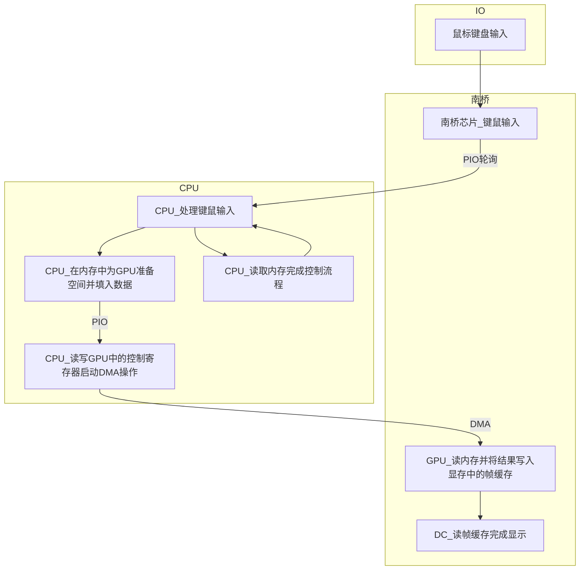

#### 计算机体系结构

# 作业五

* 王华强
* 2016K8009929035

***

## HW4勘误 4-1

上次写的时候不知道在想些什么...

应该分上下两片进行.

硬中断中内容: 禁用网卡中断, 此后网卡可以在收到数据后直接写内存.

软中断中内容: 处理和分发写入内存中的内容. 在接受结束之后开网卡中断. 网卡此时可以开始对下一个包的中断处理.

## 1. 不同硬件结构与冯诺依曼体系的对应关系

()内代表主要芯片以外的内容.

### CPU-南北桥三片

* CPU: 运算器, 控制器
* 不含GPU的北桥: 控制器(内存控制器集成在北桥中), 输入输出设备
* 独立GPU: 输出设备
* 南桥: 输入输出设备, (有输入输出控制功能)
* (内存: 存储器)
* (PCI: 输入输出设备)

### CPU-南北桥三片

* CPU: 运算器, 控制器
* 含GPU的北桥: 控制器(内存控制器集成在北桥中), 输入输出设备
* 南桥: 输入输出设备, (有输入输出控制功能)
* (内存: 存储器)
* (PCI: 输入输出设备)

### CPU-弱北桥-南桥三片

* CPU: 运算器, 控制器
* 北桥(含GPU): 输入输出设备, (有输入输出控制功能)
* 南桥: 输入输出设备, (有输入输出控制功能)
* (内存: 存储器)
* (其他: 输入输出设备)

### CPU-南桥两片

* CPU: 运算器, 控制器, 输出设备
* 南桥: 输入输出设备, (有输入输出控制功能)
* (内存: 存储器)
* (其他: 输入输出设备)

### SoC单片

* SoC: 运算器, 控制器, 输入输出设备
* (内存: 存储器)
* (其他: 输入输出设备)

## 2. 比较Zen处理器和Skylake处理器的运算器结构

本文中各个芯片的信息来自https://en.wikichip.org/wiki/WikiChip

ref: https://en.wikichip.org/wiki/amd/microarchitectures/zen

### 运算器整体结构

Zen的运算部分整数与浮点互相独立, 各自有独立的重命名, 调度, 重排序缓冲队列机制. 两者的计算单元也相对独立. 重排序缓冲每个周期可以结束八条指令.

Skylake架构整数与浮点部分仍然采用统一设计. 存在特殊的堆栈引擎来处理PUSH, POP等堆栈操作.

<!-- 同时其支持指令融合, 亦即将测试后跳转这样的指令转换成单个比较和分支指令.  -->

### 整数运算(ZEN)

ZEN: 4个ALU, 一个乘法ALU, 一个除法ALU. ZEN使用6个分布式的发射队列, 而不是一个整个的发射队列. 寄存器移动通过修改寄存器映射实现.

### 浮点运算(ZEN)

ZEN: 简单整数向量运算可以在一个周期之内完成. 在发射队列之前还存在 Non-Scheduling Queue 作为等待缓冲区. 有四个 pipe 以及处理单元, 亦即最多并行进行四个操作.

### SKYLAKE

统一的调度器存在8个port, 每个port可以发射不同的微指令. 整数和浮点运算通过相应的发射端口来进行发射. (比如: port0同时支持整数/向量运算的发射)

图: ZEN架构的运算器


图: SKYLAKE架构的运算器


## 3. 说明ROB, 发射队列, 重命名寄存器在指令流水线中的作用, 并比较Zen处理器和Skylake处理器的运算器结构

ROB, 发射队列, 重命名寄存器是为了处理流水线和乱序执行过程中的竞争冒险现象, 以及精确中断引入的. 同时, 这个结构也允许多条不相干的指令被同时乱序执行(超标量技术, 乱序执行), 本质上是为了加快CPU的执行速度.


上图反映了在指令执行的各个阶段这些机制生效的先后顺序.

### 发射队列

发射队列的作用是, 在当前的队列中挑选没有被阻塞的指令来执行. 被阻塞无法执行的指令会停留在这里, 等待下一个周期继续进行检查.

### 重命名寄存器

重命名寄存器是为了消除乱序调度中"使用相同寄存器进行中转"所引起的数据相关而引入的结构. 通过寄存器重命名来自动分配不同的中转寄存器, 从而避免WAR, WAW相关.

### ROB

设计ROB的目的是为了确保实现精确异常. 在乱序执行的过程中, 指令提交时必须按照顺序提交, 来保证触发异常的指令之后的指令并没有被提交. 

### SKYLAKE与ZEN的比较

A+B的格式代表定点浮点分离.

项目|SKYLAKE|ZEN
-|-|-
ROB|224|192
发射队列|97|(4+2)*14+96 (84+96) NSQ未统计
重命名寄存器|180+168|168+160

### 4. 比较一位和两位BHT的三重10循环转移猜测命中率. 起始时BHT表项为全0;

对于一重循环, BHT宽度为1: 
i|BHT|result
-|-|-
0|0|failed
1|1|succeed
2|1|succeed
...|1|succeed
9|1|succeed
10|1|failed

命中率为9/11; (N=10, 命中率为(N-1)/(N+1));

三重循环时同理:

$$\frac{9}{11}=81.8\%$$

BHT宽度为2, 只考虑一层循环:

循环第一次发生:

i|BHT|result
-|-|-
0|00|failed
1|01|failed
2|11|succeed
...|11|succeed
9|11|succeed
10|11|failed

循环第二次发生:

i|BHT|result
-|-|-
0|10|succeed
1|11|succeed
2|11|succeed
...|11|succeed
9|11|succeed
10|11|failed

因此, 对于某个循环, 只有在其第一次被执行时会猜测错误2+1次, 此后每次循环完成一次, 猜测错误只有一次.

最内层循环被执行100次, 次外层循环被执行10次, 最外层循环只执行一次.

因此不命中次数总共为:

$$2*(1+1+1)+(100+10+1)=117$$

猜测次数总计为:

$$(100+10+1)*11=1221$$

命中率为:

$$\frac{117}{1221}=\frac{39}{47}=95.1\%$$

## 5. 比较不同Cache处理器的平均访问延迟

认为此题中的命中延迟是指从开始内存访问到访问完成的整体延时, 而不是缓存失效时的额外访问延迟.

```
A: 0.95*1+0.05*(0.8*30+0.2*150)=3.65
B: 0.95*1+0.05*(0.75*20+0.25*(0.8*50+0.2*150))=2.575
```

## 6. 比较内存 open page 和 close page 的性能.

open page: 2+2+2=6拍(未命中), 2拍(命中)

close page: 2+2=4拍

命中率|open page|close page|性能较高
-|-|-|-
70%|3.2|4|open page
30%|4.8|4|close page

## 7. 说明处理器和I/O之间两种通信方式的通信过程

> 问题: 这里的通信过程和同步过程有何区别?

TODO

存储器到IO设备的数据交换方式如下:

PIO: 通过处理器中的通用寄存器进行中转.

DMA: 处理器为DMA操作分配空间, 设置参数之后, 数据的搬移由DMA部件完成, 在DMA操作结束时DMA部件产生DMA中断来通知CPU.

## 8. 说明处理器和I/O之间两种同步方式的同步过程

### 查询

处理器向IO设备发出访问请求之后, 不断的读取IO设备的状态寄存器进行轮询, 直到状态寄存器表明此操作已成功完成.

### 中断

处理器在等待IO设备完成某个操作时进行其他任务, IO设备完成操作之后产生一个中断信号终端处理器的执行, 通知处理器IO操作已完成, 这时处理器再去读取IO设备的寄存器.

## 9. PPT翻页过程中的同步和通信过程

鼠标是低速设备 采用轮询的处理方式.



## 10. 调查不同存储介质的价格

价格调查结果来自京东搜索的首条结果.

存储介质|光盘|HDD|SSD|内存
-|-|-|-|-
型号|纽曼DVD+R光盘/刻录盘|东芝HDWD110|三星MZ-76E250B|Kingston骇客神条HX424C15FB/8
单价|45|289|359|469
存储容量(GB)|4.7*50|1000|250|8
每GB价格|0.191|0.289|1.436|58.625