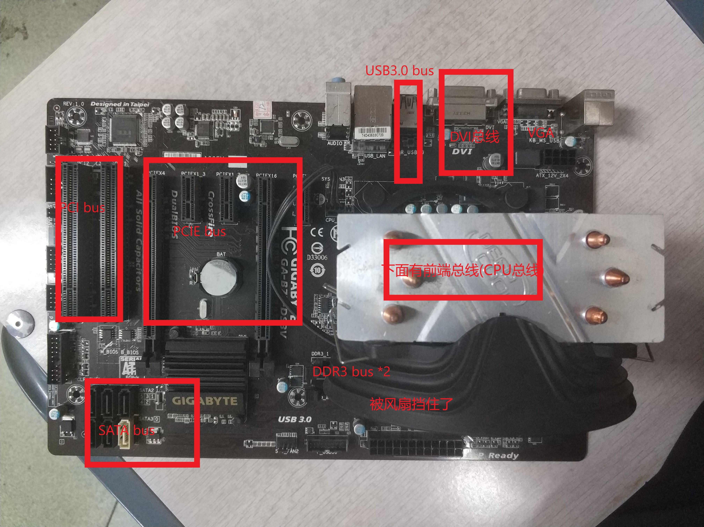

#### 计算机体系结构

# 作业六

* 王华强
* 2016K8009929035

***

## 1. 

(全寝室公用一位室友的可爱主板也是没谁了...所以这道题可能会和其他人的很相似)



## 2. 

1. 机械层
1. 电气层
1. 协议层
1. 架构层

## 3. 

ref: https://www.arm.com/products/silicon-ip-system/embedded-system-design/amba-specifications

* 支持的总线协议版本: AXI3, AXI4
* 不使用协议中涉及的 User-defined Signal, 位宽均设为0.
* 考虑协议中所有Required和Optional的信号.
* 设传输数据的宽度为8n.

ID宽度的定义:

* "The width of transaction ID fields is IMPLEMENTATION DEFINED." 
* 使用id_width来表示id宽度.

地址宽度的定义:

* "Typically a master supplies 32-bits of addressing, optionally a master can support up to 64-bits of addressing." 
* "Typically a memory slave has at least enough address bits to fully decode a 4KB address range"
* 因此直接用addr_width来指代地址宽度.


以下为完整的AXI总线定义以及信号线宽度:

### Global:

宽度|信号名称|说明
-|-|-
1|ACLK|Clock source Global clock signal. 
1|ARESETn|Reset source Global reset signal, active LOW. 

### Write address channel signals:

宽度|信号名称|说明
-|-|-
id_width|AWID|Master Write address ID.
addr_width|AWADDR|Master Write address. 
8|AWLEN|Master Burst length.
3|AWSIZE| Master Burst size. T
2|AWBURST| Master Burst type. T
AXI3:2,AXI4:1|AWLOCK| Master Lock type.
4|AWCACHE| Master Memory type. 
3|AWPROT| Master Protection type. 
4|AWQOS| Master Quality of Service, QoS. 
4|AWREGION| Master Region identifier
0|AWUSER| Master User signal.
1|AWVALID| Master Write address valid. 	
1|AWREADY| Slave Write address ready. 

### Write data channel signals:

宽度|信号名称|说明
-|-|-
AXI3only:id_width|WID| Master Write ID tag.
8n|WDATA| Master Write data
n|WSTRB| Master Write strobes. 
1|WLAST| Master Write last. 
0|WUSER| Master User signal. 
1|WVALID| Master Write valid. 
1|WREADY| Slave Write ready.

### Write response channel signals:

宽度|信号名称|说明
-|-|-
id_width|BID| Slave Response ID tag. 
2|BRESP| Slave Write response. 
0|BUSER| Slave User signal. 
1|BVALID| Slave Write response valid. 
1|BREADY| Master Response ready. 

### Read address channel signals:

宽度|信号名称|说明
-|-|-
id_width|ARID| Master Read address ID. 
addr_width|ARADDR| Master Read address
8|ARLEN| Master Burst length.
3|ARSIZE| Master Burst size. 
2|ARBURST| Master Burst type
AXI3:2,AXI4:1|ARLOCK| Master Lock type. 
4|ARCACHE| Master Memory type. 
3|ARPROT| Master Protection type
4|ARQOS| Master Quality of Service, QoS. 
4|ARREGION| Master Region identifier. 
0|ARUSER| Master User signal. 
1|ARVALID| Master Read address valid.
1|ARREADY| Slave Read address ready. 

### Read data channel signals:

宽度|信号名称|说明
-|-|-
id_width|RID| Slave Read ID tag. 
8n|RDATA| Slave Read data
2|RRESP| Slave Read response. 
1|RLAST| Slave Read last. 
0|RUSER| Slave User signal. 
1|RVALID| Slave Read valid. 
1|RREADY| Master Read ready. 

### 总计

信号组|AXI3|AXI4
-|-|-
Global|2|2
Write address channel signals|id_width+addr_width+32|id_width+addr_width+31
Write data channel signals|id_width+9n+3|9n+3
Write response channel signals|id_width+4|id_width+4
Read address channel signals|id_width+addr_width+32|id_width+addr_width+31
Read data channel signals|id_width+8n+5|id_width+8n+5
Total|id_width+addr_width+78+17n|id_width+addr_width+76+17n

id_width, addr_width指代的是该类中总的id宽度和地址宽度.

## 4. 

```verilog
module ABP_BUS#(
    parameter DATA_WIDTH=32,
    parameter PSELNUM=1
)(
    input pclk,
    input presetn,
    input [DATA_WIDTH-1,0]paddr,
    input [PSELNUM-1:0] pselx,
    output penable,
    output pwrite,
    output [DATA_WIDTH-1:0]prdata,
    input [DATA_WIDTH-1:0]pwdata
);

module APB_GPIO#(
    parameter DATA_WIDTH=32,
    parameter PSELNUM=1
)(
    input pclk,
    input presetn,
    input [DATA_WIDTH-1:0]port_direction_in,
    inout [DATA_WIDTH-1:0]gpio_port,
    
    input [DATA_WIDTH-1,0]paddr,
    input [PSELNUM-1:0] pselx,
    output penable,
    output transfered
)
//-------------------------------------------
//remark:
//do make sure port_direction_in was set as all 1 or all 0
//to coopration with the APB bus;
//-------------------------------------------

    wire penable;
    wire pwrite=port_direction_in!=0;
    wire [DATA_WIDTH-1:0] prdata;
    wire [DATA_WIDTH-1:0] pwdata=gpio_port;
    reg penable_r;
    assign penable=penable_r;
    assign transfered={pensel, penable}==2'b11;

    genvar i;
    generate
        for(i=0;i<DATA_WIDTH;i=i+1)
        begin
            assign gpio_port[i]=port_direction_in[i]?1'bz:prdata[i];
        end
    endgenerate

ABP_BUS abp_bus#(
    32,
    1
)(
    pclk,
    presetn,
    paddr,
    pselx,
    penable,
    pwrite,
    prdata,
    pwdata
);

endmodule;
```

## 5. DRAM的寻址 

1. 处理器发出线性的内存访问地址
1. 内存控制器将线性地址转化为对应于DRAM的片选, Bank地址, 行地址, 列地址
1. 内存控制器进行访存命令调度
1. 内存控制器向内存总线发出读命令
1. 内存芯片中的Bank通过感应放大器解析行地址, 打开一行
1. 解析列地址, 访问目标存储单元
1. 结果被发送到输出缓存

<!-- 1. 内存激活-读取-预充
1. 内存控制器接收到读前导信号
1. 内存控制器进行采样
1. 内存控制器返回访存结果 -->

## 6.

若认为片选个数为4代表有4个存储芯片:

$$2(2通道)*2^6(通道位宽)*2^2(片选个数为4)*2^15^2(内存中地址线个数15)*2(DDR3)=2^{40}bit=128GB$$

若认为片选个数为4代表有4个片选线:

$$2(2通道)*2^6(通道位宽)*2^4(片选个数为4)*2^15^2(内存中地址线个数15)*2(DDR3)=2^{40}bit=512GB$$


<!-- //FSM: generate penable
//This FSM reflects the State diagram of APB bus

    always@(posedge pclk)begin
        if(!presetn)begin
            penable_r<=1'b0;
        end else begin
            penable_r<=penable_next;
        end
    end

    always@(*)begin
        case({pensel, penable})
            2'b00:begin//idle
                penable_next=1'b0;
            end
            2'b10:begin//setup
                penable_next=1'b1;
                //ready to transfer
            end
            2'b11:begin//enable
                penable_next=1'b0;
                //transfer enabled
            end
        endcase
    end -->