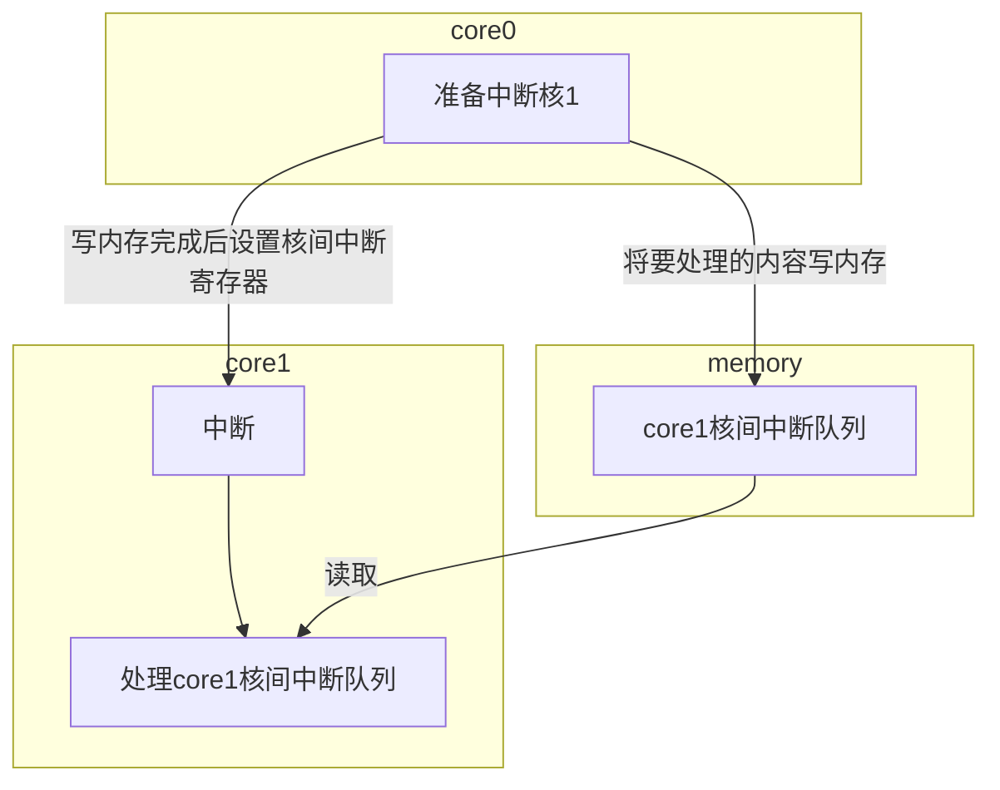

#### 计算机体系结构

# 作业七

* 王华强
* 2016K8009929035

***

## 1. Cache初始化

> 何时需要对Cache初始化?

在系统复位之后, TLB初始化完成之后.

> Index Store tag指令的作用?

在初始化Cache时使用, 对某个Cache块使用, 写其Tag为0, 标志其处于无效状态, 防止初始化时的随机无关数据造成干扰.

> 解释其他一种MIPSCache指令.

`Index Invalidate`

设置该高速缓存行为无效. 这是初始化CPU时作废指令缓存最简单的方法.

ref: https://blog.csdn.net/Blaider/article/details/7732338

## 2. 

### 2.1. Cache初始化与内存初始化的区别

内存初始化仅仅需要初始化内存控制器, 其数据来源为内存条上的spd芯片.  在此之后可以继续利用之前内存中已有的内容(比如休眠恢复), 或者也可以无视当前的数据而直接使用. 初始化内存时, 只需要使用load/store指令设置某些寄存器.

Cache初始化需要设置Cache中的各个Tag为无效状态, 防止指令使用了未经初始化的Cache里的值造成问题. Cache中的初始值全都是无效的. 初始化Cache时, 除常规的指令外, 还需要使用Cache指令. 随着硬件的发展, Cache初始化已经可以用硬件自动完成.

-|数据来源|初始化的对象|原有数据是否可用|指令|实现
-|-|-|-|-|-
Cache|启动指令(多为0)|Cache.Tag|是|涉及Cache指令|软/硬件实现
内存|内存条上的芯片(总线读)|内存控制器|依赖于具体场景|l/s为主|软件控制

### 2.2. 系统如何识别内存的更换

在内存初始化时, 系统可以通过I2C总线读内存条SPD芯片中的配置信息. 由此可以识别内存的更换.

## 3.

HyperTransport Type|总线数量|设备数量|功能数量
-|-|-|-
Type0|不支持多总线|2^5=32|2^8=256
Type1|2^8=256|2^13=8192|2^16=65536

## 4. PCI地址空间命中公式

考察PCI地址空间遍历流程:

用伪代码来描述这个流程

```c
通过(总线号, 设备号, 功能号)遍历配置空间地址, now_对于每一次遍历地址addri:

traverse(bus_num, device_num, func_num)
{
    now_addri=form_addr(bus_num, device_num, func_num);
    if((now_addri[0]==0)||(now_addri[0]==全1))
    {
        traverse(bus_num, device_num++, func_num)
        continue;
    }
    else
    {
        //发现设备
        check_all_bars(now_addri);
        if(is_mulit_func_device(now_addri))
        {
            traverse(bus_num, device_num, func_num++);
        }
        if(is_bridge_device(now_addri))
        {
            traverse(bus_num++, device_num, func_num);
        }
        if(device_num!=31)
            traverse(bus_num, device_num++, func_num);
        if((device_num==31)&&)(bus_num==0))exit();
        if(bus_num!=0)return;
    }
    
}

//实际调用
traverse(0, 0, 0);

```

以及bar检测流程

```c
check_all_bars(now_addri)
{
    for each bar{
        读取基址;
        向寄存器写入1;
        统计0的个数;
        按0的个数计算地址空间大小;
        按基址和大小分配地址空间;
    }
}

```

为了考察一个地址是否有效, 可以按照上面所述的流程进行遍历, 将分配地址空间的部分改成"比较地址空间是否为要考察的地址空间"即可. 也可以直接查询按照上面的步骤建立起的有效空间表;

## 5. 核间中断从核的唤醒流程



## 6. lspci -v, lspci -x

没有运行原生linux的设备, 使用linux虚拟机进行验证.

```
00:06.0 
USB controller: Apple Inc. KeyLargo/Intrepid USB
00: 6b 10 3f 00 06 00 10 00 00 10 03 0c 00 40 00 00
10: 00 40 80 f0 00 00 00 00 00 00 00 00 00 00 00 00
20: 00 00 00 00 00 00 00 00 00 00 00 00 00 00 00 00
30: 00 00 00 00 00 00 00 00 00 00 00 00 0a 01 00 00

00:07.0 
Bridge: Intel Corporation 82371AB/EB/MB PIIX4 ACPI (rev 08)
00: 86 80 13 71 01 00 80 02 08 00 80 06 00 00 80 00
10: 00 00 00 00 00 00 00 00 00 00 00 00 00 00 00 00
20: 00 00 00 00 00 00 00 00 00 00 00 00 00 00 00 00
30: 00 00 00 00 00 00 00 00 00 00 00 00 09 01 00 00

00:0d.0 
SATA controller: Intel Corporation 82801HM/HEM (ICH8M/ICH8M-E) SATA Controller [AHCI mode] (rev 02)
00: 86 80 29 28 07 00 10 00 02 01 06 01 00 40 00 00
10: 41 d2 00 00 49 d2 00 00 51 d2 00 00 59 d2 00 00
20: 61 d2 00 00 00 60 80 f0 00 00 00 00 00 00 00 00
30: 00 00 00 00 70 00 00 00 00 00 00 00 0b 01 00 00
```

附: 命令结果

```
00:00.0 Host bridge: Intel Corporation 440FX - 82441FX PMC [Natoma] (rev 02)
	Flags: fast devsel

00:01.0 ISA bridge: Intel Corporation 82371SB PIIX3 ISA [Natoma/Triton II]
	Flags: bus master, medium devsel, latency 0

00:01.1 IDE interface: Intel Corporation 82371AB/EB/MB PIIX4 IDE (rev 01) (prog-if 8a [Master SecP PriP])
	Flags: bus master, fast devsel, latency 64
	[virtual] Memory at 000001f0 (32-bit, non-prefetchable) [size=8]
	[virtual] Memory at 000003f0 (type 3, non-prefetchable) [size=1]
	[virtual] Memory at 00000170 (32-bit, non-prefetchable) [size=8]
	[virtual] Memory at 00000370 (type 3, non-prefetchable) [size=1]
	I/O ports at d000 [size=16]
	Kernel driver in use: ata_piix

00:02.0 VGA compatible controller: InnoTek Systemberatung GmbH VirtualBox Graphics Adapter (prog-if 00 [VGA controller])
	Flags: fast devsel, IRQ 10
	Memory at e0000000 (32-bit, prefetchable) [size=16M]
	Expansion ROM at <unassigned> [disabled]

00:03.0 Ethernet controller: Intel Corporation 82540EM Gigabit Ethernet Controller (rev 02)
	Subsystem: Intel Corporation PRO/1000 MT Desktop Adapter
	Flags: bus master, 66MHz, medium devsel, latency 64, IRQ 9
	Memory at f0000000 (32-bit, non-prefetchable) [size=128K]
	I/O ports at d010 [size=8]
	Capabilities: <access denied>
	Kernel driver in use: e1000
	Kernel modules: e1000

00:04.0 System peripheral: InnoTek Systemberatung GmbH VirtualBox Guest Service
	Flags: fast devsel, IRQ 11
	I/O ports at d020 [size=32]
	Memory at f0400000 (32-bit, non-prefetchable) [size=4M]
	Memory at f0800000 (32-bit, prefetchable) [size=16K]
	Kernel driver in use: vboxguest
	Kernel modules: vboxguest

00:05.0 Multimedia audio controller: Intel Corporation 82801AA AC'97 Audio Controller (rev 01)
	Subsystem: Dell Device 0177
	Flags: bus master, medium devsel, latency 64, IRQ 11
	I/O ports at d100 [size=256]
	I/O ports at d200 [size=64]
	Kernel driver in use: snd_intel8x0
	Kernel modules: snd-intel8x0

00:06.0 USB controller: Apple Inc. KeyLargo/Intrepid USB (prog-if 10 [OHCI])
	Flags: bus master, fast devsel, latency 64, IRQ 10
	Memory at f0804000 (32-bit, non-prefetchable) [size=4K]
	Kernel driver in use: ohci-pci

00:07.0 Bridge: Intel Corporation 82371AB/EB/MB PIIX4 ACPI (rev 08)
	Flags: medium devsel, IRQ 9
	Kernel driver in use: piix4_smbus
	Kernel modules: i2c-piix4

00:0d.0 SATA controller: Intel Corporation 82801HM/HEM (ICH8M/ICH8M-E) SATA Controller [AHCI mode] (rev 02) (prog-if 01 [AHCI 1.0])
	Flags: bus master, fast devsel, latency 64, IRQ 11
	I/O ports at d240 [size=8]
	I/O ports at d248 [size=4]
	I/O ports at d250 [size=8]
	I/O ports at d258 [size=4]
	I/O ports at d260 [size=16]
	Memory at f0806000 (32-bit, non-prefetchable) [size=8K]
	Capabilities: <access denied>
	Kernel driver in use: ahci
	Kernel modules: ahci
```

```
00:00.0 Host bridge: Intel Corporation 440FX - 82441FX PMC [Natoma] (rev 02)
00: 86 80 37 12 00 00 00 00 02 00 00 06 00 00 00 00
10: 00 00 00 00 00 00 00 00 00 00 00 00 00 00 00 00
20: 00 00 00 00 00 00 00 00 00 00 00 00 00 00 00 00
30: 00 00 00 00 00 00 00 00 00 00 00 00 00 00 00 00

00:01.0 ISA bridge: Intel Corporation 82371SB PIIX3 ISA [Natoma/Triton II]
00: 86 80 00 70 07 00 00 02 00 00 01 06 00 00 80 00
10: 00 00 00 00 00 00 00 00 00 00 00 00 00 00 00 00
20: 00 00 00 00 00 00 00 00 00 00 00 00 00 00 00 00
30: 00 00 00 00 00 00 00 00 00 00 00 00 00 00 00 00

00:01.1 IDE interface: Intel Corporation 82371AB/EB/MB PIIX4 IDE (rev 01)
00: 86 80 11 71 07 00 00 00 01 8a 01 01 00 40 00 00
10: 00 00 00 00 00 00 00 00 00 00 00 00 00 00 00 00
20: 01 d0 00 00 00 00 00 00 00 00 00 00 00 00 00 00
30: 00 00 00 00 00 00 00 00 00 00 00 00 00 00 00 00

00:02.0 VGA compatible controller: InnoTek Systemberatung GmbH VirtualBox Graphics Adapter
00: ee 80 ef be 03 00 00 00 00 00 00 03 00 00 00 00
10: 08 00 00 e0 00 00 00 00 00 00 00 00 00 00 00 00
20: 00 00 00 00 00 00 00 00 00 00 00 00 00 00 00 00
30: 00 00 00 00 00 00 00 00 00 00 00 00 0a 01 00 00

00:03.0 Ethernet controller: Intel Corporation 82540EM Gigabit Ethernet Controller (rev 02)
00: 86 80 0e 10 07 00 30 02 02 00 00 02 00 40 00 00
10: 00 00 00 f0 00 00 00 00 11 d0 00 00 00 00 00 00
20: 00 00 00 00 00 00 00 00 00 00 00 00 86 80 1e 00
30: 00 00 00 00 dc 00 00 00 00 00 00 00 09 01 ff 00

00:04.0 System peripheral: InnoTek Systemberatung GmbH VirtualBox Guest Service
00: ee 80 fe ca 03 00 00 00 00 00 80 08 00 00 00 00
10: 21 d0 00 00 00 00 40 f0 08 00 80 f0 00 00 00 00
20: 00 00 00 00 00 00 00 00 00 00 00 00 00 00 00 00
30: 00 00 00 00 00 00 00 00 00 00 00 00 0b 01 00 00

00:05.0 Multimedia audio controller: Intel Corporation 82801AA AC'97 Audio Controller (rev 01)
00: 86 80 15 24 05 00 80 02 01 00 01 04 00 40 00 00
10: 01 d1 00 00 01 d2 00 00 00 00 00 00 00 00 00 00
20: 00 00 00 00 00 00 00 00 00 00 00 00 28 10 77 01
30: 00 00 00 00 00 00 00 00 00 00 00 00 0b 01 00 00

00:06.0 USB controller: Apple Inc. KeyLargo/Intrepid USB
00: 6b 10 3f 00 06 00 10 00 00 10 03 0c 00 40 00 00
10: 00 40 80 f0 00 00 00 00 00 00 00 00 00 00 00 00
20: 00 00 00 00 00 00 00 00 00 00 00 00 00 00 00 00
30: 00 00 00 00 00 00 00 00 00 00 00 00 0a 01 00 00

00:07.0 Bridge: Intel Corporation 82371AB/EB/MB PIIX4 ACPI (rev 08)
00: 86 80 13 71 01 00 80 02 08 00 80 06 00 00 80 00
10: 00 00 00 00 00 00 00 00 00 00 00 00 00 00 00 00
20: 00 00 00 00 00 00 00 00 00 00 00 00 00 00 00 00
30: 00 00 00 00 00 00 00 00 00 00 00 00 09 01 00 00

00:0d.0 SATA controller: Intel Corporation 82801HM/HEM (ICH8M/ICH8M-E) SATA Controller [AHCI mode] (rev 02)
00: 86 80 29 28 07 00 10 00 02 01 06 01 00 40 00 00
10: 41 d2 00 00 49 d2 00 00 51 d2 00 00 59 d2 00 00
20: 61 d2 00 00 00 60 80 f0 00 00 00 00 00 00 00 00
30: 00 00 00 00 70 00 00 00 00 00 00 00 0b 01 00 00


```
