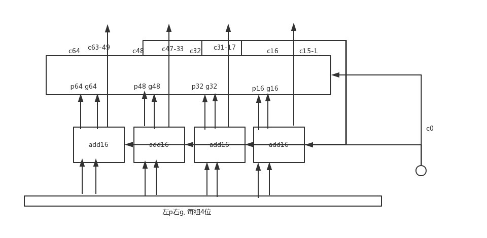

#### 计算机体系结构

作业八
============

* 王华强
* 2016K8009929035

***

## 1. 进制转换

### (1)

* 43
* 13
* 26
* 3917

### (2)

* 101010
* 1001111
* 1100101011
* 101010110

### (3)

* 2222
* 49549
* 45945
* 256

### (4)

* 13F77
* 782
* 54478
* 167C

## 2. 

* 无符号数: $0 to 2^{32}-1$
* 原码: $-2^{31}+1 to 2^{31}-1$
* 补码: $-2^{31} to 2^{31}-1$

## 3.

数据|源码|补码
-|-|-
45|00101101|00101101
-59|10111011|11000101
-128|OF|10000000
119|01110111|01110111
127|01111111|01110111
128|OF|OF
0|00000000|00000000
-1|10000001|11111111

## 4.

数据|源码|补码
-|-|-
00101100|0000_0000_0010_1100|0000_0000_0010_1100
11010100|1000_0000_0101_0100|1111_1111_1101_0100
10000001|1000_0000_0000_0001|1111_1111_1000_0001
00010111|0000_0000_0001_0111|0000_0000_0001_0111

## 5. 

ref:P138

### (1)

* 0
* 42E88000
* C08C0000

### (2)

* 8000_0000_0000_0000
* 405D_1000_0000_0000
* C000_0300_0000_0000

### (3)

* 0xFF800000
* 0xCFE00000
* -INF

### (4)

* 0x8008_0000_0000_0000
* 0x7065_0200_0000_0000

## 6. 

逻辑表达式为`(((not A)&(not B))|(not C))`

```py
for A in [0,1]:
    for B in [0,1]:
        for C in [0,1]:
            print(A,B,C,(((not A)&(not B))|(not C)))
```

真值表为:

A|B|C|Y
-|-|-|-
0|0|0|True
0|0|1|True
0|1|0|True
0|1|1|False
1|0|0|True
1|0|1|False
1|1|0|True
1|1|1|False

## 7. 

逻辑门为`!((A|B)&C)`

```py
for A in [0,1]:
    for B in [0,1]:
        for C in [0,1]:
            print(A,B,C,not((A|B)&C));
```

真值表为:

A|B|C|Y
-|-|-|-
0|0|0|True
0|0|1|True
0|1|0|True
0|1|1|False
1|0|0|True
1|0|1|False
1|1|0|True
1|1|1|False

## 8. 

NAND: a nand b := ~(a&b)= (!a)|(!b), 只有a,b全为1时得0

nand(a,a)可以作为非门使用. 因此:

```
XOR(a,b)
= a&(!b)|b&(!a) 
= nand(!(a&(!b)),!(b&(!a)))
= nand((!a)|b),(!b)|a)
= nand(nand(a,nand(b,b))),(nand(b,nand(a,a)))
= nand(nand(a,nand(a,b))),(nand(b,nand(a,b)))
```

nand(a,b)门可以被复用, 因此需要至少4个门.

<!-- nand(nand(a,b),nand(a,b)) -->

## 9. 

```v
module D_flip_flop(
    input D,
    input clk
);

module rstDff(
    input D,
    input clk,
    input rst
);

D_flip_flop ff(
    (!rst)&D,
    clk
)

endmodule
```

## 10.

在未溢出的情况下:

设此补码表示有n位

在两个数有一个是0或都为正数的情况下正确性显然.

在有负数的情况下:

若均为负数:

补码(X)+补码(Y)=(2^n-|X|+2^n-|Y|)%2^n=(2^n-|X|-|Y|)%2^n=补码(-(|X|+|Y|))=补码(X+Y)

若一正一负, 无妨设X为正数:

补码(X)+补码(Y)=(|X|+2^n-|Y|)%2^n=(2^n+|X|-|Y|)%2^n=补码(X+Y)

综上原命题成立.

## 11. 

由10, 知: 补码(X-Y)=补码(X+(-Y))=补码(X)+补码(-Y)

## 12. 

65T, 35T, 15T

## 13.

1. 当设计者就是想要写一个简单点的设计的时候
1. 当先行进位加法器所需的门输入过多, 实际电阻过大, 导致电路速度较慢的时候.
1. 当对电路设计的复杂度有限制的时候.(比如片上逻辑器件的多少)
1. (当需要做加法流水操作的时候写一个行波进位也是没有问题的)

## 14.

设8.22中的模块名为 add16, 则:
<!-- 
```verilog
module add16(
    input [15:0]g,
    input [15:0]p,
    output [15:0]c,
    input c0,
    output p16,
    output g16
);
endmodule

module add64(
    input [63:0]g,
    input [63:0]p,
    output [63:0]c,
    input c0
);

add16 add1(

);
.....(共4个)


endmodule
``` -->



## 15.

利用补码正负表示的不对称性来构造反例. 设补码宽度为n:

X:=$2^{n-1}$

Y:=$-1$

[XY补]在宽度n之下不存在.

[X补]*[Y补]可以通过booth乘法求得结果. (虽然结果有问题)

<!-- 或者利用溢出来构造反例. 比如

X:=01000

Y:=11111 (-1)
 -->


## 16.

<!-- 将一个数的源码*$2^N$等价于将这个数逻辑左移N位. -->
<!-- 将一个数的补码*$2^N$等价于将这个数的补码逻辑左移N位. -->
<!-- 因此只要证明: 先左移再求补码等价于先求补码再左移. -->

对于正数和0的情况, 显然成立.

由补码计算公式:

```
补码(X)=
    X (X>=0)
    2^M+X (X<0)
```

因此:

```
补码(X*2^N)=
    X*2^N % 2^M (X>=0)
    2^M + X*2^N % 2^M (X<0)

补码(X)*2^N=
    X*2^N % 2^M (X>=0)
    2^M*2^N+X*2^N % 2^M (X<0) = 2^M + X*2^N % 2^M

```

因此两者等价.

## 17.

22T, 17T

## 18.

在涉及到[-X补], [-2X补]的时候, 乘法器将这一运算拆开计算.

1. 取负部分分为两部分进行, 首先进行诸位取反的操作. 
1. 之后, 如果是[-2X补], 通过简单的左移一位操作可以完成*2的效果.
1. 上面的结果正常引入华莱士树中
1. 取负部分的+1操作在华莱士树中进行. 利用华莱士树中空余的进位输入和扩展半加器到全加器的方式, 引入所有的+1. 

细节参见下面的代码:

## 19.

这个乘法器的设计来自体系结构实验课中设计的CPU中所用的乘法器:

```verilog
//multipler.v
//Huaqiang Wang (c) 2018

module booth_decoder#
(
    parameter WIDTH=34,
    parameter POSITION=0
)
(
    input [WIDTH-1:0]y,
    input [2:0]x,
    output [WIDTH*2-1:0] result,
    output result_plus1
);

wire need_reverse=(x==3'b100)|(x==3'b101)|(x==3'b110);
wire need_y=(x==3'b001)|(x==3'b010)|(x==3'b011);
wire need_0=(x==3'b000)|(x==3'b111);

wire need_sl=(x==3'b011)|(x==3'b100);

wire [2*WIDTH-1:0]after_position={{WIDTH{y[WIDTH-1]}},y}<<(POSITION+need_sl);//place data into right position`
wire [2*WIDTH-1:0]after_reverse=
    {(2*WIDTH){need_reverse}}&(~after_position)|
    {(2*WIDTH){need_y}}&(after_position)|
    {(2*WIDTH){need_0}}&(0);

assign result=after_reverse;
assign result_plus1=(x==3'b100)|(x==3'b101)|(x==3'b110);

endmodule


module full_adder#
(
    parameter WIDTH = 1
)
(
    input [WIDTH-1:0]Ain,
    input [WIDTH-1:0]Bin,
    input [WIDTH-1:0]Cin,
    output [WIDTH-1:0]Sout,
    output [WIDTH-1:0]Cout
);

genvar i;
generate
    for(i=0;i<WIDTH;i=i+1)
    begin
        // full_bit_adder
        assign Cout[i]=~Ain[i]&~Bin[i]&Cin[i]|~Ain[i]&Bin[i]&~Cin[i]|Ain[i]&~Bin[i]&~Cin[i]|Ain[i]&Bin[i]&Cin[i];
        assign Sout[i]=Ain[i]&Bin[i]|Ain[i]&Cin[i]|Bin[i]&Cin[i];
    end
endgenerate

endmodule


module wallace_tree_17
(
    input [16:0]in,
    input [13:0]Cin,
    output [13:0]Cout,
    output c,
    output s
);
    wire [13:0]S;
    //l1
    full_adder#(1) fa0(in[16],in[15],in[14],Cout[0],S[0]);
    full_adder#(1) fa1(in[13],in[12],in[11],Cout[1],S[1]);
    full_adder#(1) fa2(in[10],in[9],in[8],Cout[2],S[2]);
    full_adder#(1) fa3(in[7],in[6],in[5],Cout[3],S[3]);
    full_adder#(1) fa4(in[4],in[3],in[2],Cout[4],S[4]);
    //l2
    full_adder#(1) fa5(S[0],S[1],S[2],Cout[5],S[5]);
    full_adder#(1) fa6(S[3],S[4],in[1],Cout[6],S[6]);
    full_adder#(1) fa7(in[0],Cin[0],Cin[1],Cout[7],S[7]);
    full_adder#(1) fa8(Cin[2],Cin[3],Cin[4],Cout[8],S[8]);
    //l3
    full_adder#(1) fa9(S[5],S[6],S[7],Cout[9],S[9]);
    full_adder#(1) fa10(S[8],Cin[5],Cin[6],Cout[10],S[10]);
    //l4
    full_adder#(1) fa11(S[9],S[10],Cin[7],Cout[11],S[11]);
    full_adder#(1) fa12(Cin[8],Cin[9],Cin[10],Cout[12],S[12]);
    //l5
    full_adder#(1) fa13(S[11],S[12],Cin[11],Cout[13],S[13]);
    //l6
    full_adder#(1) fa14(S[13],Cin[12],Cin[13],c,s);

endmodule

module multipler
(
input mul_clk, // 乘法器模块时钟信号
input resetn, // 复位信号，低电平有效
input mul_signed, // 控制有符号乘法和无符号乘法
input [31:0] x, // 被乘数
input [31:0] y, // 乘数
output [63:0] result   //乘法结果，高 32 写入 HI，低 32 位写入LO
);

wire [33:0]x_34=mul_signed?{{2{x[31]}},x}:{2'b0,x};
wire [33:0]y_34=mul_signed?{{2{y[31]}},y}:{2'b0,y};
wire [34:0]y_34_ext={y_34,1'b0};

wire [67:0]booth_result [16:0];
wire [16:0]add1;

genvar booth_cnt;
generate
    for(booth_cnt=0;booth_cnt<17;booth_cnt=booth_cnt+1)
    begin: booth_decoder
    booth_decoder #(34,booth_cnt*2) booth_decoder(
        x_34,
        y_34_ext[2*booth_cnt+2:2*booth_cnt],
        booth_result[booth_cnt],
        add1[booth_cnt]
    );
    end
endgenerate

//switch
wire [16:0]switched_wallace_data[67:0];
genvar k,l;
generate 
for(k=0;k<68;k=k+1)begin
    for(l=0;l<17;l=l+1)begin
        assign switched_wallace_data[k][l]=booth_result[l][k];
    end
end
endgenerate


wire [67:0]S;
wire [67:0]C;

reg [67:0]S_reg;
reg [67:0]C_reg;
reg add1_14;
reg add1_15;

wire [13:0]wt_C[68:0];
//FIXIT
assign wt_C[0]=add1[13:0];

genvar p;
generate
for(p=0;p<68;p=p+1)begin: wallace_tree
    wallace_tree_17 wt
    (
        switched_wallace_data[p],
        wt_C[p],
        wt_C[p+1],
        C[p],
        S[p]
    );
end
endgenerate

always@(posedge mul_clk)begin
    S_reg<=S;
    C_reg<=C;
    add1_14<=add1[14];
    add1_15<=add1[15];
end

wire [64:0] res_1={S_reg,add1_14};
wire [64:0] res_2={C_reg,add1_15,add1_14};
wire [64:0] res_3=res_1+res_2;

reg resetn_reg;
always@(posedge mul_clk)begin
    resetn_reg<=resetn;
end

assign result=resetn_reg?res_3[64:1]:64'b0;

endmodule
```

## 20. 

不能. 浮点数可以表示的精度是有限的. 而无理数这样的无限不循环小数有无限位, 因此浮点数只能逼近无理数, 但不能精确的表达无理数.