# Brief introduction for DNN acceleration

深度神经网络及其加速技术概论

王华强

<!-- ---

Draft - will be accomplished in 7.4. 

还在看论文...英文看的头大...

7.1 有原子物理期末考试先只交框架设计 -->

---

## Contents

1. Introduction for DNN
1. Bottleneck for DNN
1. How to accelerate DNN
1. Example: DianNao

--

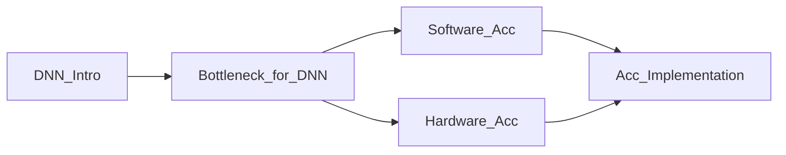

---

## 1. Introduction for DNN

Relation Between CNN and DNN.

--

### DNN: Deep Neutral Network

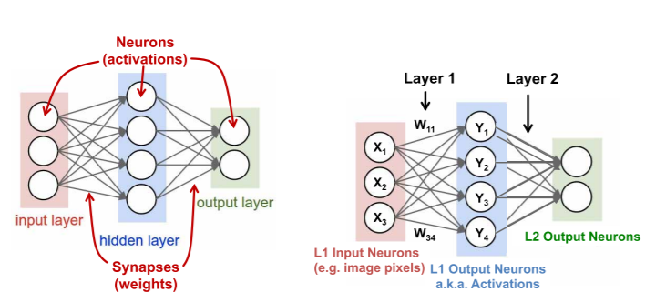

--

### CNN: Conventional Neural Network

Reuse, Sparse

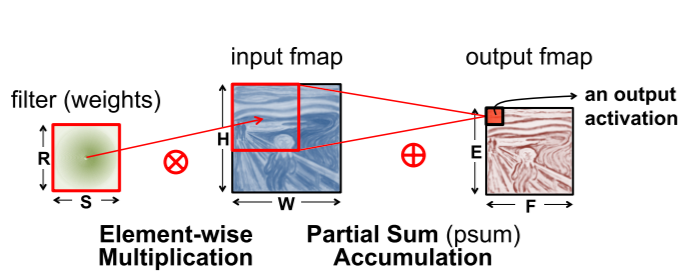

--

### A layer

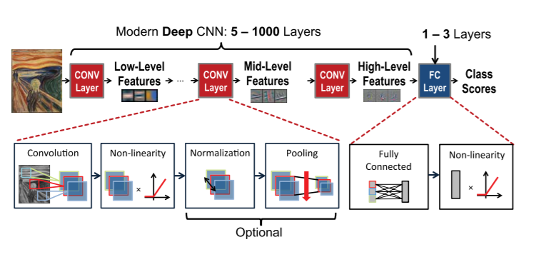

--

### Why we need a nonlinear function in neutral networks

Example: how can neutral network sort dots.

https://cs.stanford.edu/people/karpathy/convnetjs//demo/classify2d.html

--

### Non-linearity
<!-- 介绍卷积池化之外的激活函数, 正规化 -->

Example: ReLU(Rectified Linear Unit) function

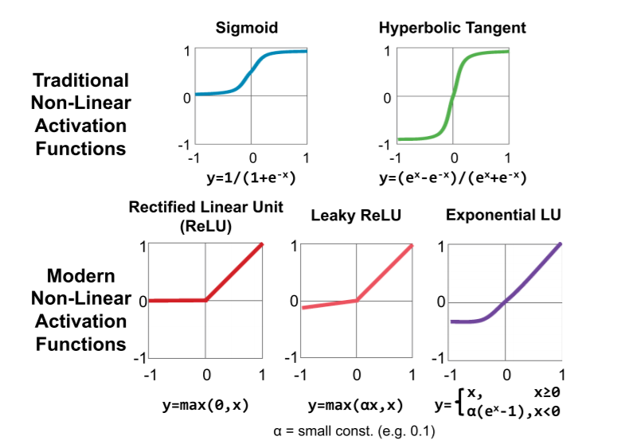

--

### Optional: Batch Normalization

--

### Back propaganda algorithm

<!-- 介绍反向传播算法 -->

<!-- --

### Example: 
 -->

<!-- 介绍一个DNN模型及其复杂度 -->

<!-- 2.5min -->

--

## Live example: http://playground.tensorflow.org

---

## 2. Bottleneck for DNN

1. Memory access
1. Non-linear calculation
1. MAC

<!-- 介绍内存瓶颈 -->

<!-- 运算量问题 -->

<!-- 0.5min -->

---

## 3. How to accelerate DNN

### 3.0. Acceleration Without impacting accuracy

<!-- 无精度损失 -->

--

### 3.1. Software Level Ideas

<!-- 面向不同平台优化访存 -->

<!-- 1-2min -->
<!-- (rolling,tiling) -->

1. Optimize memory access 
1. Lower the amount of calculation

> 这里应该是一段屎一样的代码

--

### 3.2. Hardware Level Ideas

<!-- 近数据端加速 -->

<!-- 直接处理模拟信号: before ADC / in sensor  -->

1. Near source data process
1. Process before ADC
1. (implement neurons and synapses by hardware)

> ... certain  applications,  such  as  image  processing,  the data movement from the sensor itself can account for a significant  portion  of  the  system  energy  consumption.  Thus, there has also been research on performing the computation as close as possible to the sensor.

<!-- 1min -->

---

## 4. Codesign of DNN models and hardware

<!-- 有精度损失 -->

<!-- 简要介绍专有硬件加速的原理 -->
<!-- 以及可能的各种加速手段 -->
<!-- 介绍网络稀疏, 网络量化, etc -->

> Hardware Acceleration needs Software Level Alternation

--

### 4.1. Quantization

> Uniform Quantization

--

### 4.2. Reduce Model Size

---

## 5. Example: DianNao

<!-- 4min -->

<!-- 用DianNao系列最早的一篇论文,相对基础但又很重要 -->

<!-- Example: DianNaoYu: 讲不完了 -->

<!-- 1min  -->
<!-- DianNao: 面向加速器访存瓶颈 -->

<!-- ./doc/网络稀疏/DianNao.pdf -->

<!-- https://yq.aliyun.com/articles/115588?t=t1 -->

<!-- 先进性: 解决访存瓶颈 -->

> DianNao:  A  Small-Footprint  High-Throughput  Accelerator  for  Ubiquitous  Machine-Learning

Structure:

1. NFU(Neuron Function Unit)
1. Buffer on Chip
1. DMAs(with preload)
1. Control Processor

<!-- 计算方式: 输入层重用(input reuse) -->

Type for calculation: reuse input layer.

--

### 5.1. Architecture

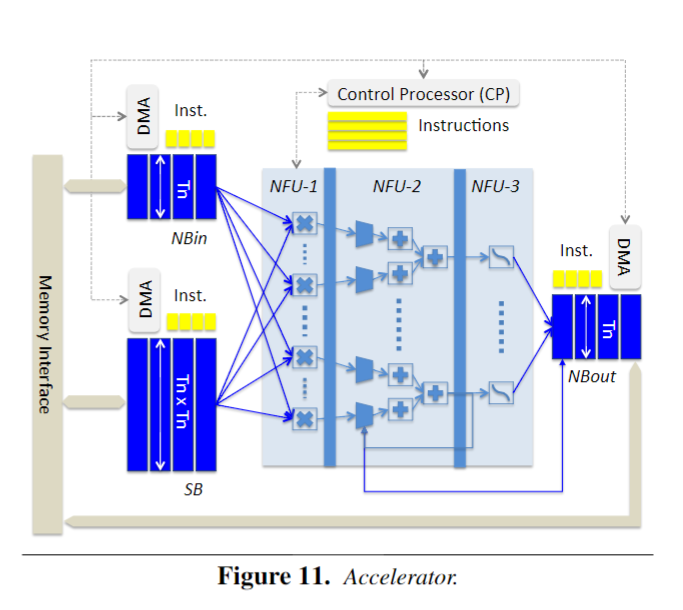

--

> The first benefit of splitting structures is to tailor the SRAMs to the appropriate read/write width.

> The  second  benefit  of  splitting  storage  structures is to avoid conflicts, as would occur in a cache. 

--

### 5.2. NFU

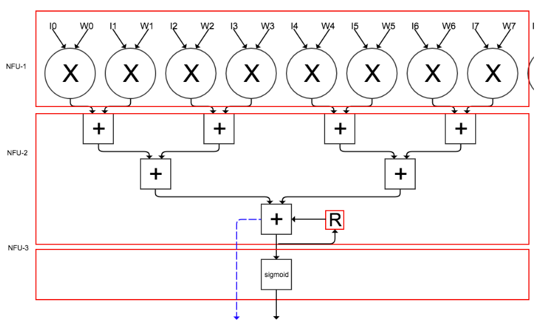

--

### 5.3. NFL calculation

Data:

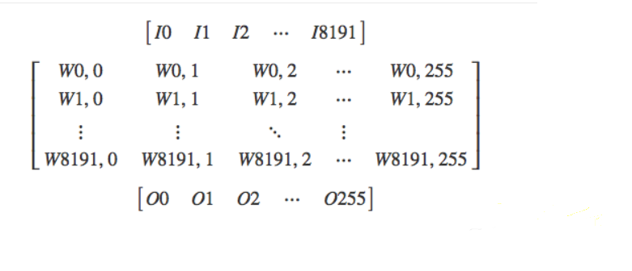

<!-- https://yq.aliyun.com/articles/115588?t=t1 -->

--

input buffer:

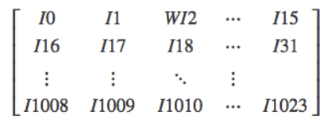

weight buffer:

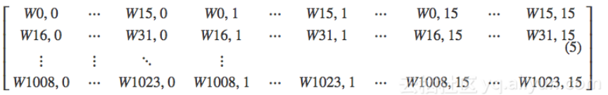

--

### 5.4. Advantage for using HLA.

1. Time cost
1. Energy cost

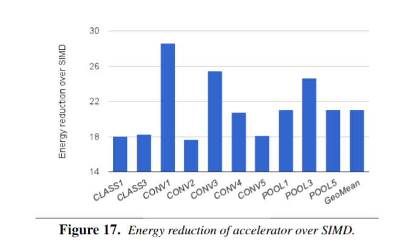

--

### 5.5. Ideas in *Diannao*

(in case I have time left......)

> Split buffers.
> Exploiting the locality of inputs and synapse
> 1. DMAs
> 1. Rotating NBin buffer for temporal reuse of input neu-rons
> 1. Local  transpose  in  NBin  for  pooling  layer
> Exploiting the locality of outputs
> 1. Dedicated registers
> 1. Circular  buffer

---

## Appendix

### 一些概念

1. SIMD 单指令流多数据流
1. Amdahl’s law effect

<!-- 利用Amdahl定律，可以计算出通过改进计算机某一部分而能获得的性能增益。Amdahl定律表明，使用某种快速执行模式获得的性能改进受限于可使用此种快速执行方式的时间比例 -->

--

## 内存传输: 制约加速效果的瓶颈

---

## Reference:

Chen, T., Du, Z., Sun, N., Wang, J., Wu, C., & Chen, Y., et al. (2014). Diannao: a small-footprint high-throughput accelerator for ubiquitous machine-learning. Acm Sigplan Notices, 49(4), 269-284.

Sze, V., Chen, Y. H., Yang, T. J., & Emer, J. S. (2017). Efficient processing of deep neural networks: a tutorial and survey. Proceedings of the IEEE, 105(12), 2295-2329.

--

https://yq.aliyun.com/articles/115588?t=t1

http://doi.acm.org/10.1145/2644865.2541967

http://delivery.acm.org/10.1145/3000000/2996864/p105-che.pdf?ip=121.195.114.228&id=2996864&acc=ACTIVE%20SERVICE&key=33E289E220520BFB%2E583BB86AD7417D9A%2E4D4702B0C3E38B35%2E4D4702B0C3E38B35&__acm__=1530116921_83e49c66adee33b5997b41cdbccd4f29

https://www.zhihu.com/question/41216802/answer/124409366

---

王华强 (c) 2018.7