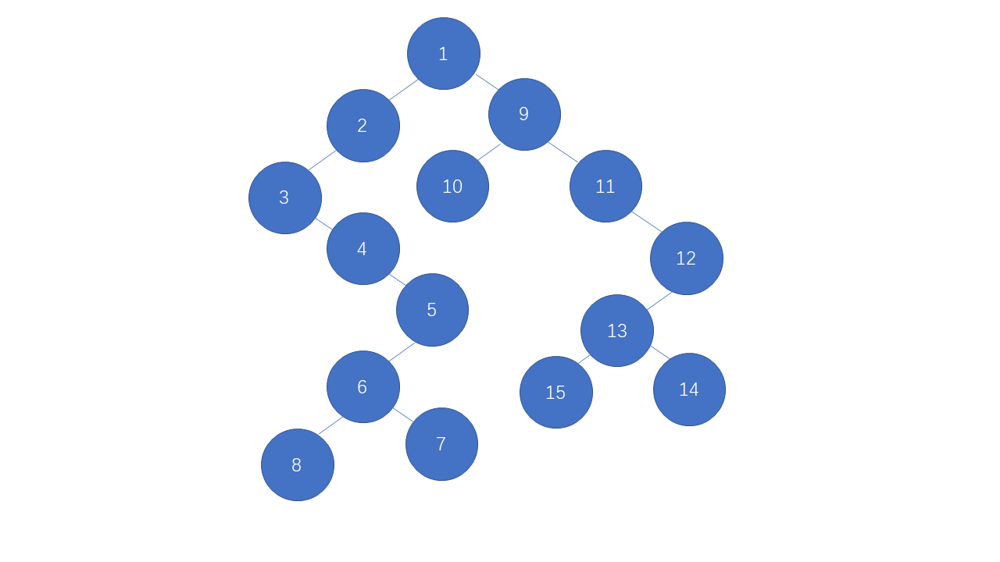
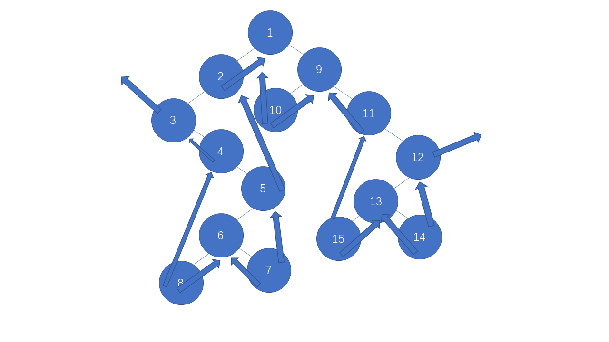
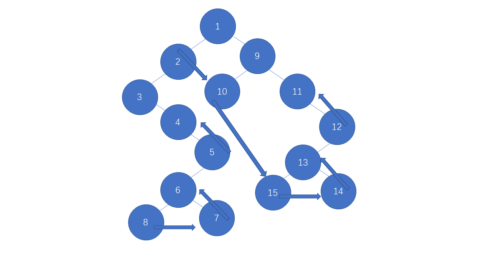

# 数据结构 作业4

王华强 2016K8009929035

***

第6章树和二叉树：	6.2, 6.5, 6.18,6.20, 6.31；	
6.33, 6.34, 6.37, 6.43, 6.48, 6.49, 6.51, 6.58, 6.65, 6.71

## 第4章：	

## 6.2 一棵度为2的树与一棵二叉树有何区别？

度为2的树各个非叶子节点的degree==2, 而二叉树的每个节点degree可以为0,1,2

## 6.5 已知一棵深度为k的树中有n1个度为1的结点，n2个度为2的结点，…，nk个度为k的结点，问该树中有多少个叶子结点？

degree(sum)=n1+2n2+...+knk=总节点数-1(root);
非叶节点数: n1+n2+...+nk;
叶节点数: n2+2n3+....+(k-1)nk+1;

## 6.18 试讨论，能否在一棵中序全线索二叉树上查找给定结点*p在后序序列中的后继。

在后序序列中, p的后继结点有3类可能:

```mermaid
graph TD;
3_middle-->1_left
3_middle-->2_right
1_left-.next.->1_left_left
1_left-.->1_left_leaf
1_left_leaf-.next.->2_right_left
2_right-.next.->3_middle
2_right-->2_right_left
```

p=1 --> p.next=2.left

p=2 --> p.next=3

p=3=root --> p.next=null

分类讨论如下:

* 对于root-->没有后继
* 对于某个节点的左子节点-->后继为右子树的最左节点
* 对于某个节点的右子节点-->后继为其父节点

对应着在中序全线索二叉树上寻找:

* 对于某个节点(左子节点)的父节点的右子树的最左节点: 在中序全线索二叉树中依次找到首个左叶子节点即为所求.
* 对于某个节点(是右子节点)的父节点: 在中序全线索二叉树中寻找其前驱节点即可

## 6.20 将下列森林转换为相应的二叉树，并分别按以下说明进行线索化：

转化为二叉树如下:

图例: 所有图中的箭头为正常类别的指针, 而额外附加的箭头为线索化指针.

(1)先序前驱线索化；

(2)中序全线索化前驱线索和后继线索；

(3)后序后继线索化。

## 6.31 证明：由一棵二叉树的先序序列和中序序列可唯一确定这课二叉树。

由先序序列, 可以判断二叉树的根节点root

从而在中序序列中, root左侧的节点在左子树上, root右侧的节点在右子树上

在先序序列中选出这左右子书, 同理可以确定其root

同理可知, 对于树上的任何一点, 由先序序列和中序序列可以唯一确定其左右子节点

从而可以唯一确定二叉树.