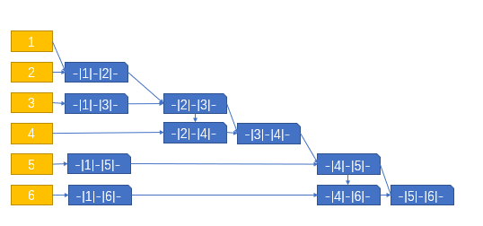

# 数据结构 作业5

王华强 2016K8009929035

***

## 图

7.1, 7.3, 7.10, 7.11；	

7.14, 7.15, 7.22, 7.25, 7.27, 7.36, 7.38, 7.42

## 7.1 已知如下图所示的有向图，请给出该图的

(1)每个顶点的入/出度；

vertex|in|out
-|-|-
1|3|0
2|2|2
3|1|2
4|1|3
5|2|1
6|2|3

(2)邻接矩阵；

-|1|2|3|4|5|6
-|-|-|-|-|-|-
1|0|0|0|0|0|0
2|1|0|0|1|0|0
3|0|1|0|0|0|1
4|0|0|1|0|1|1
5|1|0|0|0|0|0
6|1|1|0|0|1|0

(3)邻接表；

* 1
* 2->1->4
* 3->2->6
* 4->3->5->6
* 5->1
* 6->1->2->5

(4)逆邻接表；

* 1->2->5->6
* 2->3->6
* 3->4
* 4->2
* 5->4->6
* 6->3->4

(5)强连通分量。

* 1
* 2,3,4,6
* 5

## 7.3 画出下图所示的无向图的邻接多重表，使得其中每个无向边结点中第一个顶点号小于第二个顶点号，且每个顶点的各邻接边的链接顺序，为它所邻接到的顶点序号由小到大的顺序。列出深度优先和广度优先搜索遍历该图所得顶点序列和边的序列。

前序深度优先

* 点: 1->2->3->4->5->6
* 边: 12->23->34->45->56

前序广度优先

* 点: 1->2->3->5->6->4
* 边: 12->13->15->16->24

## 7.10 对于下图所示的AOE网络，计算各活动弧的e(ai)和l(aj)函数值、各事件(顶点)的ve(vi)和vl(vj)函数值；列出各条关键路径。

事件:

类别|起点|A|B|C|D|E|F|G|H|I|J|K|结束
-|-|-|-|-|-|-|-|-|-|-|-|-|-
ve|0|1|6|17|3|34|4|3|13|1|31|22|44
vl|0|20|24|26|19|34|8|3|13|7|31|22|44

关键路径: 

起点->G->H->K->J->E->终点

活动:

类别|起点A|起点B|起点D|起点F|起点G|起点I|AC|DC|DE|DJ|FE|FH|G终点|GH|CE|HC|HJ|HK|KJ|JE|J终点
-|-|-|-|-|-|-|-|-|-|-|-|-|-|-|-|-|-|-|-|-|-
ee|0|0|0|0|0|0|1|3|3|3|4|4|3|3|17|13|13|13|22|31|31
el|19|18|16|4|0|6|20|19|26|25|23|8|23|3|26|22|27|13|22|31|32

## 7.11 试利用Dijkstra算法求下图中从顶点a到其他各顶点间的最短路径，写出执行算法过程中各步的状态

步数|b|c|d|e|f|g
-|-|-|-|-|-|-
1|15|2|12|||
2|15|2!|12|10|6|
3|15|2!|11|10|6!|16
4|15|2!|11|10!|6!|14
5|15|2!|11!|10!|6!|14
6|15|2!|11!|10!|6!|14!
结果|15!|2!|11!|10!|6!|14!