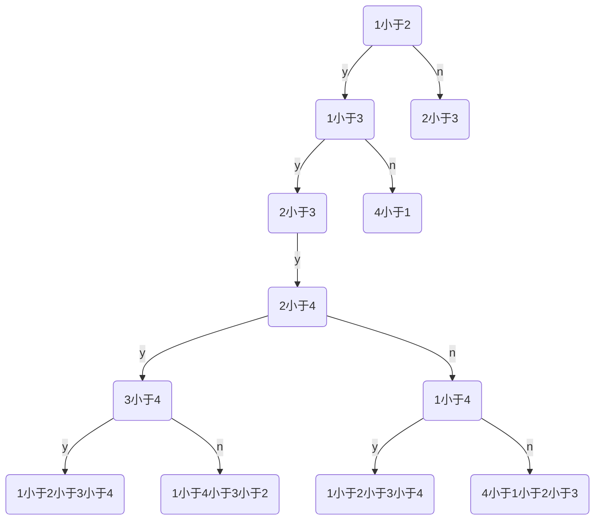
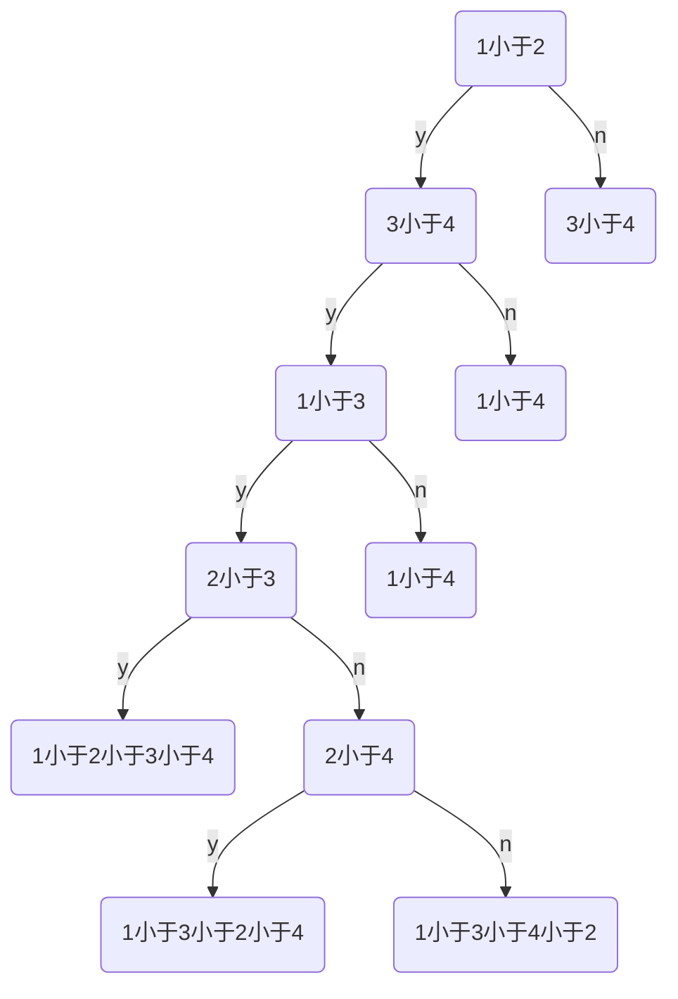

# 数据结构 作业7

王华强 2016K8009929035

***

第7次作业

第10章内部排序：10.1, 10.3, 10.15, 10.21； 10. 25, 10.30, 10.32, 10.33, 10.35, 10.38, 10.41, 10.43, 10.45, 10.46

## 10.1 以关键码序列(503,087,512,061,908,170,897,275,653,426)为例，手工执行以下排序算法，写出每一趟排序结束时的关键码状态:

## 10.3 试问在10.1题所列各种排序方法中，哪些是稳定的？哪些是不稳定的？并为每一种不稳定的排序方法举出一个不稳定的实例

　　(1)直接插入排序 稳定的                            (2)希尔排序(增量d[1]=5) 不稳定的

　　(3)快速排序 不稳定的                              (4)堆排序 不稳定的

　　(5)归并排序  稳定的                              (6)基数排序 稳定的

1)
```
503,087,512,061,908,170,897,275,653,426
087,503,512,061,908,170,897,275,653,426
087,503,512,061,908,170,897,275,653,426
061,087,503,512,908,170,897,275,653,426
061,087,503,512,908,170,897,275,653,426
061,087,170,503,512,908,897,275,653,426
061,087,170,503,512,897,908,275,653,426
061,087,170,275,503,512,897,908,653,426
061,087,170,275,503,512,653,897,908,426
061,087,170,275,426,503,512,653,897,908
Fin.
```

2)
```
503,087,512,061,908,170,897,275,653,426
170,087,512,061,908,503,897,275,653,426
170,087,512,061,908,503,897,275,653,426
170,087,275,061,908,503,897,512,653,426
170,087,275,061,908,503,897,512,653,426
170,087,275,061,426,503,897,512,653,908
170,087,275,061,426,503,897,512,653,908
087,170,275,061,426,503,897,512,653,908
087,170,275,061,426,503,897,512,653,908
061,087,170,275,426,503,897,512,653,908
061,087,170,275,426,503,897,512,653,908
061,087,170,275,426,503,897,512,653,908
061,087,170,275,426,503,512,897,653,908
061,087,170,275,426,503,512,653,897,908
061,087,170,275,426,503,512,653,897,908
Fin.

```

3)
```
503,087,512,061,908,170,897,275,653,426
503:
426,087,512,061,908,170,897,275,653,503
426*,087,512,061,908,170,897,275,653,503
426*,087*,512,061,908,170,897,275,653,503
426*,087*,503,061,908,170,897,275,653,512
426*,087*,503,061,908,170,897,275,653,512*
426*,087*,503,061,908,170,897,275,653*,512*
426*,087*,275,061,908,170,897,503,653*,512*
426*,087*,275*,061,908,170,897,503,653*,512*
426*,087*,275*,061*,908,170,897,503,653*,512*
426*,087*,275*,061*,503,170,897,908,653*,512*
426*,087*,275*,061*,503,170,897,908*,653*,512*
426*,087*,275*,061*,503,170,897*,908*,653*,512*
426*,087*,275*,061*,170*,503,897*,908*,653*,512*

426*,087*,275*,061*,170* ,503, 897*,908*,653*,512*

426,897:
426,087,275,061,170 ,503, 897,908,653,512
170*,087*,275*,061*,426 ,503, 512,653,897,908
170*,087*,275*,061* ,426! ,503!, 512,653, 897!, 908

170:
170,087,275,061 ,426! ,503!, 512!,653!, 897!, 908!
061,087,275,170 ,426! ,503!, 512!,653!, 897!, 908!
061,087,170,275 ,426! ,503!, 512!,653!, 897!, 908!
Fin.
```

4)
```

503(1),087(2),512(3),061(4),908(5),170(6),897(7),275(8),653(9),426(10)
建堆:
503(1),087(2),512(3),061(4),426(5),170(6),897(7),275(8),653(9),908(10)
503(1),087(2),512(3),061(4),426(5),170(6),897(7),275(8),653(9),908(10)
503(1),087(2),170(3),061(4),426(5),512(6),897(7),275(8),653(9),908(10)
503(1),061(2),170(3),087(4),426(5),512(6),897(7),275(8),653(9),908(10)
503(1),061(2),170(3),087(4),426(5),512(6),897(7),275(8),653(9),908(10)
061(1),087(2),170(3),503(4),426(5),512(6),897(7),275(8),653(9),908(10)
061(1),087(2),170(3),275(4),426(5),512(6),897(7),503(8),653(9),908(10)
061(1),087(2),170(3),275(4),426(5),512(6),897(7),503(8),653(9),908(10)
调整:
061:
908(1),087(2),170(3),275(4),426(5),512(6),897(7),503(8),653(9),061(10)
087(1),908(2),170(3),275(4),426(5),512(6),897(7),503(8),653(9),061(10)
087(1),275(2),170(3),908(4),426(5),512(6),897(7),503(8),653(9),061(10)
087(1),275(2),170(3),503(4),426(5),512(6),897(7),908(8),653(9),061(10)
087:
653(1),275(2),170(3),503(4),426(5),512(6),897(7),908(8),087(9),061(10)
170(1),275(2),653(3),503(4),426(5),512(6),897(7),908(8),087(9),061(10)
170(1),275(2),512(3),503(4),426(5),653(6),897(7),908(8),087(9),061(10)
170:
908(1),275(2),512(3),503(4),426(5),653(6),897(7),170(8),087(9),061(10)
......
908(1),897(2),653(3),512(4),503(5),426(6),275(7),170(8),087(9),061(10)
061,087,170,275,426,503,512,653,897,908
Fin.
```

5)
```
503,087,512,061,908,170,897,275,653,426
二路归并排序:
087,503,061,512,170,908,275,897,426,653
061,087,503,512,170,275,897,908,426,653
061,087,170,275,503,512,897,908,426,653
061,087,170,275,426,503,512,653,897,908
Fin.

```

6)
```
503,087,512,061,908,170,897,275,653,426
MSB:

908,
897,
653,
503,512,
426
275,
170,
087,061,
---
061,087,170,275,426,503,512,653,897,908
Fin.

LSB:
503,087,512,061,908,170,897,275,653,426
170,061,512,503,653,275,426,087,897,908
503,908,512,426,653,061,170,275,087,897
061,087,170,275,426,503,512,653,897,908
Fin.

```

不稳定的实例:

(2)希尔排序(增量d[1]=5) 不稳定的
```
2 2 1 1 1 1(6) 1(7)
-->
1(6) 1(7) 1 1 1 2 2
```
(3)快速排序 不稳定的
```
2 3(1) 3(2) 2 3(3)
-->
2 2 3(2) 3(1) 3(3)
```
(4)堆排序 不稳定的
```
4 2(1) 2(2) 
-->
4 2(2) 2(1) 
```
  
## 10.15 对一个由n个关键字不同的记录构成的序列，你能否用比2n-3少的次数选出这n个记录中关键字取最大值和关键字取最小值的记录？若能，请说明如何实现？在最坏情况下至少进行多少次比较？

n很大的情况下(2n-3>0)

<!-- 最大最小比较法

```c
首个元素同时确定为最大值和最小值;
之后遍历扫描每个元素;

if(元素>=max)
{
  max=元素;
  下一个元素;
}else{
  if(元素=<min)
  {
    min=元素;
  }
}
下一个元素;

```

分两种情况讨论:

1) 所有数据相同: max==min, 所有余下数据只需一次比较: n-1
2) 存在不同数据: 则最差2n-2 ???不行 -->

两两比较, 生成大组和小组再进行比较, 单独的元素同时归入两组.

理论复杂度为`n/2+n/2-1+n/2-1`

分两种情况讨论

n为奇数) 设n=2k+1, 复杂度为k+k+k=3(n-1))/2, 在n很大时<2n-3

n为偶数) -->3n/2-2, 在n很大时<=2n-3

这题在逗我玩吗...... 可以很简单的实现2n-2的算法而且结构简单, 这个引入了一大堆别的运算实际跑起来怕不是要麻烦死..... 这题出的真有意思.

## 10.21 分别利用折半插入排序法和2-路归并排序法对含4个记录的序列进行排序，画出描述该排序过程的判定树，并比较它们所需进行的关键字间的比较次数的最大值。

1 2 3 4 分别为元素序号

每个处理方法相似的层次都只画出一个分支, 其他分支与此类似.

就是不想画31个节点....

折半插入排序:




2-归并排序:




***

第7次作业的算法设计部分.

## 10.25 试编写教科书10.2.2节中所述链表插入排序的算法。

略
  
## 10.30 按下述原则编写快排的非递归算法：

(1)一趟排序之后，若子序列已有序（无交换），则不参加排序，否则先对长度较短的子序列进行排序，且将另一子序列的上、下界入栈保存；

(2)若待排记录数≤3，则不再进行分割，而是直接进行比较排序。

略

## 10.32 荷兰国旗问题：设有一个仅由红、白、蓝三种颜色的条块组成的条块序列。请编写一个时间复杂度为O(n)的算法，使得这些条块按红、白、蓝的顺序排好，即排成荷兰国旗图案

类似快速排序, 维护头尾两个指针, 之后从左到右遍历颜色, 红色与左侧指针交换,左侧指针++, 蓝色与右侧指针交换, 右侧指针++; 白色继续向后. 直到遍历位置与右侧指针位置相遇时做做后一次判断.

## 10.33 试以单链表为存储结构实现简单选择排序的算法。

略
  
## 10.35 假设定义堆为满足如下性质的完全三叉树:(1)空树为堆；(2)根结点的值不小于所有子树根的值，且所有子树均为堆。编写利用上述定义的堆进行排序的算法，并分析推导算法的时间复杂度。

见附件sort.cc, 三叉树与二叉树的区别在于做adjust操作时要更加复杂, 做更多的比较.

## 10.38 2-路归并排序的另一策略是，先对待排序序列扫描一遍，找出并划分为若干个最大有序子列，将这些子列作为初始归并段。试写一个算法在链表结构上实现这一策略。

略, 使用一个链表来记录各个子列链表的起始地址.
  
## 10.41 假设有1000个关键字为小于10000的整数的记录序列，请设计一种排序方法，要求以尽可能少的比较次数和移动次数实现排序，并按你的设计编出算法。

使用快速排序.
  
## 10.43 已知记录序列a[1..n]中的关键字各不相同，可按如下所述实现计数排序：另设数组c[1..n]，对每个记录a[i]，统计序列中关键字比它小的记录个数存于c[i]，则c[i]=0的记录必为关键字最小的记录，然后依c[i]值的大小对a中记录进行重新排列，试编写算法实现上述排序方法。

O(n^2+), 略了
  
## 10.45 试编写算法，借助“计数”实现基数排序。

略
  
## 10.46 序列b的每个元素是一个记录，每个记录占的存储量比其关键字占的存储量大得多，因而记录的移动操作是极为费时的。试写一个算法，将序列b的排序结果放入序列a中，且每个记录只拷贝一次而无其他移动。你的算法可以调用第10章中给出的任何排序算法。思考：当记录存于链表中时，若希望利用快速排序算法对关键字排序，从而最后实现链表的排序，如何模仿上述方法实现？

使用pair<关键字,记录指针>进行排序, 按排序之后的结果依次按记录指针读出数据写入到目标序列a中. 在链表中可以先按这种方法建立键-指针对, 排序完成之后按照顺序重新连接链表.
