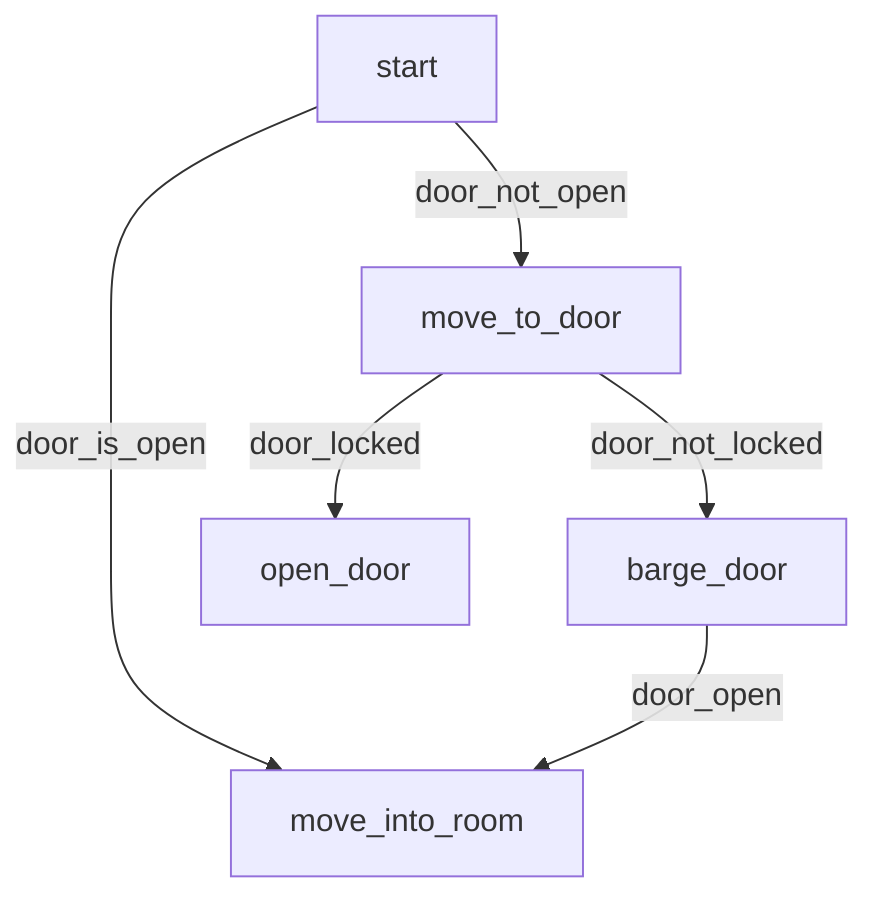

CS3247 – Game Development

Practice Problems – Set 1
=====================

(Topics: Path-finding, State Machine, Decision Tree Behaviour Tree)

* Huaqiang Wang

---

# 1

## a

## b

Here, we use `_u` to represent up, `_d` for down, `_l` for left and `_r` for right. For example: `A_u` means NPC is at A and faces up (north). 

1. 2:A_u
1. 3:A_u->A_r
1. 3:A_r->B_r, 4:A_r->A_d
1. 4:B_r->B_d, 4:A_r->A_d
1. 4:B_d->C_d, 5:A_d->A_l

So the path is: A_u->A_r->B_r->B_d->C_d

A* algorithm needs 5 iterations.

## c

i) Yes, it is. For Manhattan distance does not consider the cost of turning. It makes Manhattan distance always smaller than real distance. 

ii) Yes. For combined distance+heuristic from the initial vertex never decreases along any path. h(A)≤ cost(A,B)+h(B) always holds for h(A)=Md(A)<=Md(A,B)+Md(B)<=cost(a,b)+MD(b)

# 2

a)

Using shortest path as Heuristic function.

-|C1|C2|C3|C4
-|-|-|-|-
C1|0|12|28|15
C2|12|0|16|27
C3|28|16|0|3
C4|15|27|3|0

b)

1. 28:S
1. 36:S->A, 37:S->B
1. 37:S->B, 39:A->D, 40:A->B
1. 39:A->D, 39:B->M, 40:B->C
1. 39:B->M, 40:B->C, 41:D->C 
1. 40:B->C, 41:D->C, 41:M->O, 42:M->K, 51:M->N
1. 30:C->Q, 40:C->K, 41:M->O, 42:M->K, 51:M->N
1. 40:C->K, 42:M->K, 41:M->O, 51:M->N, 41:Q->E, 35:Q->F
1. 40:C->K, 42:M->K, 41:M->O, 51:M->N, 41:Q->E, 38:F->G
1. 40:C->K, 42:M->K, 41:M->O, 51:M->N, 41:Q->E, 40:G->E
1. 40:C->K, 42:M->K, 41:M->O, 51:M->N, 40:E->J
1. 49:K->L, 42:J->H, 41:M->O, 51:M->N
1. 49:K->L, 50:O->I, 61:O->N, 51:M->N, 42:J->H
1. 49:K->L, 50:O->I, 61:O->N, 51:M->N, 49:H->I
1. 49: I

# 3

a)

Target State: L:C
Action: M_exit + 2_action + L_entry + C_entry

b)

# 4

# 5

