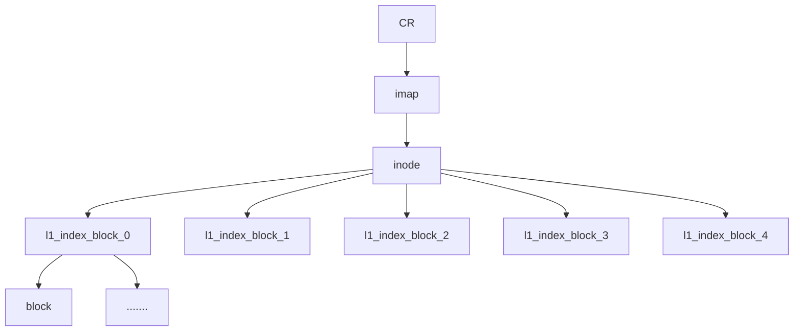

# 操作系统 作业14, 15

* 王华强
* 2016K8009929035

***

# 作业14

## 1. 

> 磁盘上有一个长度为 20KB 的文件 A，如果一个进程打开文件 A，并调用 write 一次性
> 向文件 A 的块 0 和块 1 写入新数据。假设有文件缓存，宕机可能发生在任意时刻。
> 1) 如果文件系统采用数据日志，宕机恢复后，文件 A 的内容是什么？分不同情况讨
> 论（在什么情况下，文件 A 的内容是什么）。
> 2) 如果文件系统采用元数据日志，并且采用一致性修改，宕机恢复后，文件 A 的内
> 容是什么？分不同情况讨论（在什么情况下，文件 A 的内容是什么）。

### 1.1.

宕机时间|恢复之后A的内容
-|-
TxB|原有内容
i-node journaling|原有内容
bitmap journaling|原有内容
data block journaling|原有内容
写TxE|新内容
inode|新内容
bitmap|新内容
data block|新内容
清除日志|新内容

### 1.2.

TODO

宕机时间|恢复之后A的内容
-|-
data block|写到一半的内容
TxB|写到一半的内容
i-node journaling|写到一半的内容
bitmap journaling|写到一半的内容
TxE|新内容
inode|新内容
bitmap|新内容
清除日志|新内容

---

## 2. 

### 2.1.

5000000个inode对应5000000个地址项, 共计20000000B

每个块为4KB, 即4096B, 因此共计需要20000000/4096=4883(上取整)个块.

### 2.2.

CR(Checkpoint Region)有两个, 一个CR中需要保存所有imap块的地址. 因此共计:

$$ceil(4883/(4096/4))*2=5*2=10$$

### 2.3.

ino=654321

过程如下:

* 首先磁盘寻道到磁盘头, 这里保留了一个CR.
* 假设CR按照顺序排列, 则ino654321对应CR中的第`654321/1024=638`个块(从0开始).
* 在这个块中ino654321对应的下标为:`654321%1024=1009`

---

## 3.
> 一个 LFS 的块大小为 4KB，segment 大小是 4MB。文件块采用与 FFS 一样的多级索
> 引，每个指向数据块的指针占 4 字节。该 LFS 中已经有一个 20MB 的文件 foo，
> 1) 给出文件 foo 的文件块索引结构
> 2) 写文件 foo 的第 2560 块（假设它在磁盘块 Ai 中，Ai 为磁盘逻辑块号），需要写哪
> 些块？给出它们写在磁盘上的顺序。需要几次 I/O？
> 3) 如果是 FFS （其块大小也为 4KB），写文件 foo 的第 2560 块，需要写哪些块？需
> 要几次 I/O？
> 4) 如果是日志文件系统，只记录元数据日志，且日志不采用批量提交，则写文件 foo
> 的第 2560 块，需要写哪些块？需要几次 I/O？

### 3.1.

每个完整的间接地址块支持4096/4=1024个地址. 在有一级间接地址的情况下每个间接地址块可以支持1024*4KB=4MB的文件.

因此一个20MB的文件foo需要5个间接地址块.

### 3.2.

第2560块需要额外的间接地址块:

因此需要写的内容有写:

* CR(读写缓存)
* imap(先读后写)
* inode(先读后写)
* 新的间接地址块
* 实际数据块

????

实际写的过程中, 会在segment中缓存imap, inode, 实际数据块的相关信息, 在一次segment写入过程中, 这些内容整段写到磁盘上(一次IO). 之后LFS更新两个CR中的需要写的CR(在两个CR交替写的情况下), 

3次写I/O, 2次读I/O, 计5次. 

### 3.3.

????

<!-- * 位图 -->
* inode(读)
* bitmap(读写)
* inode(写)
* 一级间接地址块(写)
* 文件块(写)

4次写I/O, 2次读I/O, 计6次. 

### 3.4.

????

* 读imap
* 读inode

* 写数据块(写)
* 写TxB, 各种日志, 提交日志(写)
* 写inode(写)
* 间接地址(写)
* 写imap(写)
* 清除日志(写)

6次写I/O, 2次读I/O

---

## 4. 

有一个 400GB 的 SSD，它的擦写上限（P/E cycles）是 100,000 次，假设写均匀分布
在所有的闪存页上，如果以每秒发 200,000 个写请求的速率写，请问多长时间这个 SSD
会被磨穿？

假设页的大小为4KB, 闪存使用页级映射. 

400GB包含100M个页, 认为每次写请求都需要整个替换一个页.

大致估计如下:

$$400GB*100000/4KB/200000=50Ms(注意不是ms)$$

---

## 5.

> 5. 一个 SSD 每个块有 64 页，且它读一页的延迟是 25 微秒，写一页的延迟是 200 微秒，
> 擦除一块的时间是 2 毫秒。如果它采用混合映射，分下面 3 种情况，计算回收一个块
> 需要的时间。
> 
> 1) Switch merge
> 2) Partial merge 且假设块中有效页为 50%
> 3) Full merge

### 5.1.

需要修改映射表信息, 并且擦除之前的chunk, 因此需要擦除一块的时间2ms.

### 5.2.

在有效页为50%(32/块)的情况下, 所用的时间共计:

$$2ms(擦除原有块)+32*(25+200)us=9.2ms$$

## 5.3.

<!-- 假设日志块中有效比例仍为50%: -->

$$2*2ms(擦除2个原有块)+64*(25+200)us(搬运所有有效块)=18.4ms$$

---

# 作业15

## 1.

> 1．假设一个 NFS 服务器使用 5 个磁盘构成的一个 RAID-5，每个条带为 64KB，每个磁盘
> 的寻道时间是 3ms，旋转速度是 10,000RPM，传输带宽是 200MB/s。假设网络传输
> 4KB 的延迟是 0.2ms，传输 1MB 的延迟是 9ms，请问：1）客户端用 NFS 一次读一个
> 数据块（4KB）的有效带宽是多少？2）客户端用 NFS 一次读 1MB 数据的有效带宽是
> 多少？

### 1.1.

$$10000RPM=10000/60RPS$$

因此平均旋转等待时间为:

$$(1/2)R/(10000/60RPS)=0.003S$$

在只读取一个数据块的情况下, 因为数据块太小不支持并行读取, 读取所花费的时间为:

$$3ms+3ms+4KB/200MB/S+0.2ms=6.22ms$$

因此带宽为:

$$4KB/6.22ms=0.643MBPS$$

### 1.2.

1MB的数据在Raid5上可以被并行读取. 这个Raid5由5个磁盘组成, 因此磁盘传输带宽是200*4MB/s

读取所花费的时间为:

$$3ms+3ms+1MB/800MB/S+9ms=16.25ms$$

因此带宽为:

$$1024KB/16.25ms=63.015MBPS$$

---

## 2.

> 2．机器 X0 是 NFS 服务器，并输出目录/share，机器 X1、X2、X3 和 X4 都通过下面命令
> 挂载了一个 NFS 文件系统，使用 NFS v3 协议。
> mount –t nfs X0:/share /share
> 机器 X1 上的进程 P1 打开文件/share/foo，读取文件 foo 的第一块（块 0），假设读操
> 作成功返回的时刻为 t0；之后，X2 上的进程 P2 也打开文件/share/foo，在 t0+3sec 时
> 刻读取了 foo 的块 0。
> 然后，P2 向块 0 写入新数据，假设写入成功返回的时刻为 t0+10sec。之后，P2 读写
> 的其它块，在 t0+30min 时刻关闭/share/foo。
> 请问：
> 1）P1 最早在什么时刻能够读到 P2 写入的新数据？
> 2）X3 上的进程 P3 最早在什么时刻打开/share/foo 能够读到 P2 写入的新数据？
> 3）X1 上的进程 Q1 最早在什么时刻打开/share/foo 能够读到 P2 写入的新数据？

在缓存过期时间为60s的情况下

> 1) t0+60sec (等待缓存过期)
> 2) t0+10sec (直接读取新的结果)
> 3) t0+60sec (?不确定)

---

## 3.

> 3．NFS 的 file handle 包含三个信息：volumn ID，ino，generation number。其中 generation
> number 是i-node 的版本号，每次分配该i-node 给一个文件或者目录，版本号都增长 1。
> 请举一个例子来说明为什么 NFS 的 file handle 必须包含 generation number。

NFS通过文件句柄来实现其无状态性(NFS v3), 每个请求中包含了需要执行请求所需要的所有信息. 在文件被删除后inode重新分配/掉电异常等等情况下, 一个inode被重新分配, 但是客户端并不知道这个inode被重新分配, 因此它会像之前一样发出请求. 这时, 请求中的generation number与句柄中的不一致, 因此客户端便可以推断出发生了异常, 进而采取相关操作.

---

## 4.

> 4．WAFL 的块大小都为 4KB，指针都为 4 字节，i-node 中有 16 个指针用于文件块索引。
> 请问
> 1) WAFL 最大能支持多大的文件？
> 2) 如果采用两级间址的话，最大能索引多大的文件？
> 3) 对于一个 10GB 的文件， WAFL 如何定位偏移(offset)为 5G 所在的文件块？

### 4.1.

$$4KB*16=64KB$$

### 4.2.

$$4KB*16*(4096/4)*(4096/4)=64GB$$

### 4.3.

接4.2:

* 每个1级间接地址对应4GB的空间
* 每个2级间接地址对应4MB的空间

因此, 5G的间址所在位置为:

* 5/4=1, 
* (5*1024)%4096=1024MB
* 1024/4=256.

因此这个偏移对应着inode中第1(从0开始)个间接地址, 一级地址块中第256个地址, 二级地址块中第0个地址.

---

## 5.

> 5．假设 WAFL 平均 1000 个操作的日志需要大约 1MB 的 NVRAM 空间，如果一个 NFS
> 服务器的吞吐率是 5000 IOPS （即每秒 3000 I/O 操作），操作的读写比是 6:4，如果
> 每 10 秒创建一个一致点的话，它需要多大的 NVRAM？

题目修正: 5000 IOPS （即每秒 3000 I/O 操作）修正为 5000 IOPS （即每秒 5000 I/O 操作）

$$10*5000*(4/(6+4))*(1MB/1000)=20MB$$

---

Copyright (C) 2019 Wang Huaqiang