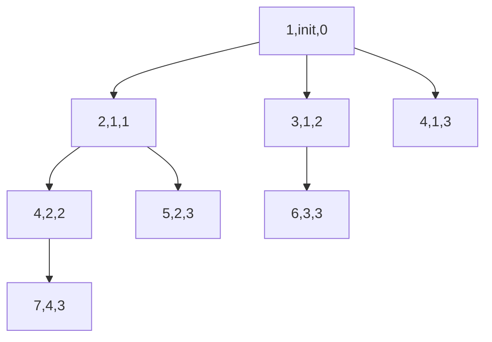

# 操作系统 作业3

* 王华强
* 2016K8009929035

***

## 作业指导

### part1

请大家阅读xv6源码，撰写一份分析报告。报告需要给出以下信息：
1. 在xv6中，PCB信息是如何表示的？是用什么数据结构？存放在哪个文件中？
2. 上述代码(fork,exec,wait)中，修改了哪些PCB中的信息？

### part2

进程创建：
```c
int  main()
{
     pid_t  pid;
     int  i;
     for  (i=0;  i<3;  i++)
      {
           /* fork  another  process  */
           pid = fork();
           if  (pid < 0) { /*error  occurred  */
                fprintf(stderr, “Fork Failed”);
                exit(-1);
           }
           else if (pid == 0) { /* child process */
                fprintf(stdout,  “i=%d,  pid=%d,  parent  pid=%d\n”,i,      
                getpid() ,getppid());
           }   
      }
      wait(NULL);
      exit(0);
} 
```
请问该程序最终一共生成几个进程？假设当前进程PID为1，生成的进程PID依次加1，请将生成进程关系图画出来。

***

## Part1解答

### 1. 在xv6中，PCB信息是如何表示的？是用什么数据结构？存放在哪个文件中？

对于PCB的每个表项, 数据结构定义在`proc.h`中, 数据结构使用struct定义, 定义如下:

```c
struct proc {
  uint sz;                     // Size of process memory (bytes)
  pde_t* pgdir;                // Page table
  char *kstack;                // Bottom of kernel stack for this process
  enum procstate state;        // Process state
  int pid;                     // Process ID
  struct proc *parent;         // Parent process
  struct trapframe *tf;        // Trap frame for current syscall
  struct context *context;     // swtch() here to run process
  void *chan;                  // If non-zero, sleeping on chan
  int killed;                  // If non-zero, have been killed
  struct file *ofile[NOFILE];  // Open files
  struct inode *cwd;           // Current directory
  char name[16];               // Process name (debugging)
};
```

PCB本身也是由struct定义的. 定义在文件`proc.c`中, 包含spinlock结构和记录进程信息的数组proc[NPROC]. 代码如下:
```c
struct {
  struct spinlock lock;
  struct proc proc[NPROC];
} ptable;

```

在源码中找到PCB是通过`wait()`函数的阅读. `wait()`函数需要遍历PCB来找到当前进程的子进程.

代码如下:

```c
    for(p = ptable.proc; p < &ptable.proc[NPROC]; p++){
      if(p->parent != curproc)
        continue;
```

### 2. 上述代码(fork,exec,wait)中，修改了哪些PCB中的信息？

#### in fork():

fork()函数fork出一个相同的进程. 因此要写子进程的PCB, 其内容与主进程基本相同. 

相关代码如下:

```c
    struct proc *np;//np as new process
    np->pgdir = copyuvm(curproc->pgdir, curproc->sz);
    //写新进程页表内容, 新进程的页表内容为原来页表的复制
    np->sz = curproc->sz;
    //内存大小等于原来的大小
    np->parent = curproc;//设置父进程
    *np->tf = *curproc->tf;
    //新进程的Trap frame继承旧的进程
    //  np->tf->eax = 0;
    for(i = 0; i < NOFILE; i++)
        if(curproc->ofile[i])
            np->ofile[i] = filedup(curproc->ofile[i]);
            //新进程继承旧进程打开的文件;
    np->cwd = idup(curproc->cwd);
    //新进程继承旧进程的工作目录, 注意这个函数调用将此目录的引用次数增加了1;

    safestrcpy(np->name, curproc->name, sizeof(curproc->name));
    //复制进程名
```

如果fork()失败, 错误处理也需要清理PCB:

```
    if failed:
        //kfree(np->kstack);
        np->kstack = 0;//Bottom of kernel stack设为0;
        np->state = UNUSED;//进程标为未使用状态;
```
#### in exec()

exec()函数用其他内容来替换当前运行中的进程. 

因此在exec()正常执行的最后一步, 会修改PCB中当前进程的页表指针(对应页表内容变更)和进程的内存空间大小.

```c
    curproc->pgdir = pgdir;
    curproc->sz = sz;
    //curproc->tf->eip = elf.entry;  // main
    //curproc->tf->esp = sp;
```

除此之外在这里也有写PCB:

```
// Save program name for debugging.
    ......
  safestrcpy(curproc->name, last, sizeof(curproc->name));
```

#### in wait()

wait()函数等待子进程结束并将其清理. 在处理已经变成zombie的子进程时, wait()函数修改了子进程在process block中的内容.

关键代码片段如下:

```c
        kfree(p->kstack);
        p->kstack = 0;
        //freevm(p->pgdir);
        p->pid = 0;
        p->parent = 0;
        p->name[0] = 0;
        p->killed = 0;
        p->state = UNUSED;
```

由此可见, wait()函数此时修改子进程的PCB内容包括:
 
1. p->kstack = 0;//BOTTOM OF KERNEL STACK 设置为0
1. p->pid = 0;//进程号
1. p->parent = 0;//父进程
1. p->name[0] = 0;//进程名
1. p->killed = 0;//标记此进程已被killed
1. p->state = UNUSED;//标记进程状态为未使用的

***

## Part2解答

图例: (PID,PPID,首次进行for循环条件判断时i的值)



除本身外生成7个进程.