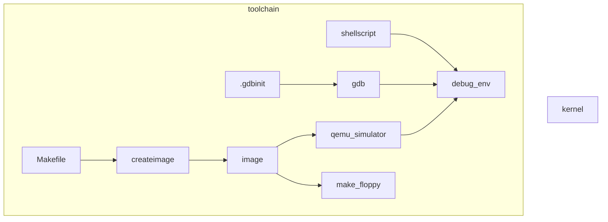
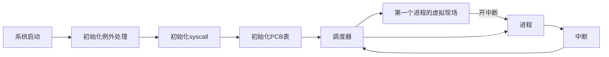
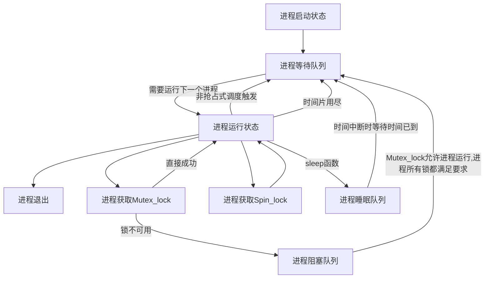
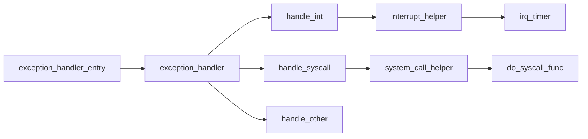
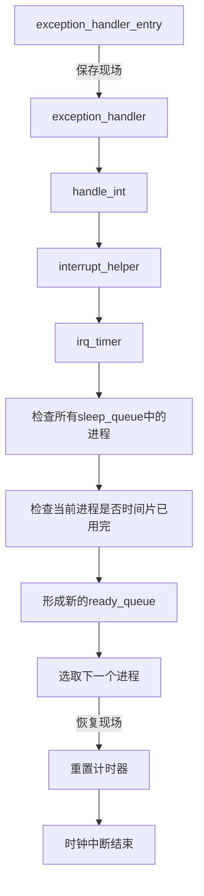
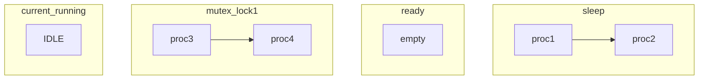
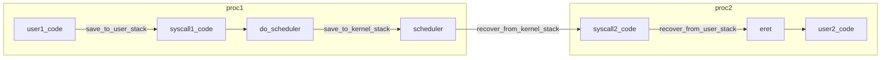

#### 0.0.0.1. 操作系统研讨课实验

# 1. Project2-A Simple Kernel

* 王华强
* 2016K8009929035
* wanghuaqiang16@mails.ucas.ac.cn

---

# 2. 目录

<!-- TOC -->

            - [0.0.0.1. 操作系统研讨课实验](#0001-操作系统研讨课实验)
- [1. Project2-A Simple Kernel](#1-project2-a-simple-kernel)
- [2. 目录](#2-目录)
- [3. 实验简述](#3-实验简述)
- [4. 系统整体设计](#4-系统整体设计)
- [5. 实验实现细节](#5-实验实现细节)
    - [5.1. 开发环境与工具配置](#51-开发环境与工具配置)
    - [5.2. 任务启动与Context Switching设计](#52-任务启动与context-switching设计)
        - [5.2.1. PCB设计](#521-pcb设计)
        - [5.2.2. 第一个TASK的启动](#522-第一个task的启动)
        - [5.2.3. 上下文切换](#523-上下文切换)
        - [5.2.4. 调度器逻辑](#524-调度器逻辑)
        - [5.2.5. 补充](#525-补充)
    - [5.3. 时钟中断、系统调用与blocking sleep设计](#53-时钟中断系统调用与blocking-sleep设计)
        - [5.3.1. 一般例外处理流程](#531-一般例外处理流程)
        - [5.3.2. 标准中断处理](#532-标准中断处理)
        - [5.3.3. 时钟中断处理流程](#533-时钟中断处理流程)
            - [5.3.3.1. 例外入口函数拷贝](#5331-例外入口函数拷贝)
        - [5.3.4. sleep()及时钟中断](#534-sleep及时钟中断)
            - [5.3.4.1. 时钟中断触发时的工作](#5341-时钟中断触发时的工作)
            - [5.3.4.2. sleep()实现](#5342-sleep实现)
        - [5.3.5. sleep唤醒的优化](#535-sleep唤醒的优化)
        - [5.3.6. 时钟中断处理流程与系统调用处理流程的比较](#536-时钟中断处理流程与系统调用处理流程的比较)
            - [5.3.6.1. 相同步骤](#5361-相同步骤)
            - [5.3.6.2. 不同步骤](#5362-不同步骤)
    - [5.4. 优先级调度器](#54-优先级调度器)
        - [5.4.1. 基于优先级的调度器设计思考](#541-基于优先级的调度器设计思考)
        - [5.4.2. priority-based scheduler的设计思路，包括在你实现的调度策略中优先级是怎么定义的，何时给task赋予优先级，测试结果如何体现优先级的差别](#542-priority-based-scheduler的设计思路包括在你实现的调度策略中优先级是怎么定义的何时给task赋予优先级测试结果如何体现优先级的差别)
            - [5.4.2.1. 手工定义优先级](#5421-手工定义优先级)
            - [5.4.2.2. 自动区分IO密集型进程/计算密集型进程](#5422-自动区分io密集型进程计算密集型进程)
            - [5.4.2.3. 测试: 将task4中的任务一起运行](#5423-测试-将task4中的任务一起运行)
            - [5.4.2.4. 测试: 带有自定义优先级的测试](#5424-测试-带有自定义优先级的测试)
    - [5.5. 锁设计](#55-锁设计)
        - [5.5.1. spin-lock和mutual lock的区别](#551-spin-lock和mutual-lock的区别)
        - [5.5.2. 获取锁时的动作](#552-获取锁时的动作)
        - [5.5.3. 释放锁时的动作](#553-释放锁时的动作)
        - [5.5.4. Task的阻塞](#554-task的阻塞)
        - [5.5.5. 一个进程获取多把锁](#555-一个进程获取多把锁)
        - [5.5.6. 多个进程获取一把锁](#556-多个进程获取一把锁)
        - [5.5.7. 多个进程同时获取一把锁/允许多次同时获取的锁](#557-多个进程同时获取一把锁允许多次同时获取的锁)
        - [5.5.8. 测试用例与结果](#558-测试用例与结果)
- [6. 额外讨论](#6-额外讨论)
    - [6.1. 龙芯处理器的异常处理机制](#61-龙芯处理器的异常处理机制)
    - [6.2. 死锁与饥饿](#62-死锁与饥饿)
    - [6.3. IDLE(处理器空闲状态)](#63-idle处理器空闲状态)
    - [6.4. 调度器的两种实现方式](#64-调度器的两种实现方式)
- [7. 实验相关建议整理](#7-实验相关建议整理)
    - [7.1. 环境配置](#71-环境配置)
    - [7.2. 文档描述部分](#72-文档描述部分)
    - [7.3. sleep和IDLE](#73-sleep和idle)
    - [7.4. 代码框架的相关问题](#74-代码框架的相关问题)
    - [7.5. 实验一中createimage的检查](#75-实验一中createimage的检查)
    - [7.6. 代码框架中的BUG](#76-代码框架中的bug)
- [8. 参考文献](#8-参考文献)
- [9. 致谢](#9-致谢)

<!-- /TOC -->

---

# 3. 实验简述

实验要求如下: 

> 设计一个简单的操作系统内核和工具栈, 实现任务的抢占式调度, 非抢占式调度, 互斥锁的实现, 系统调用的实现, 基于优先级的调度器设计.

> 完成优先级设置逻辑, 设计优先级相关的测试用例并给出结果.

> 设计更加复杂的锁机制并进行测试.

---

# 4. 系统整体设计

工具链架构如下:



--

系统整体架构如下:

```mermaid
graph LR;

subgraph kernel

scheduler

    bootblock.S-->system_init
    system_init-->fake_scene_for_1st_proc
    fake_scene_for_1st_proc-->scheduler

    system_init-->global_vars_:_pcb,queue,etc

    subgraph interrupt
        subgraph clock_interrupt
            clock_interrupt-->scheduler
        end
    
        subgraph syscall
            lock_syscall-->scheduler
            print_syscall
            sleep_syscall-->scheduler
        end
    
        subgraph others
            debug_func
        end
    end

end


subgraph task
test_sch_etc.
end

```

--

系统启动流程如下:



--

进程运行状态转移图如下:



---

# 5. 实验实现细节

## 5.1. 开发环境与工具配置

针对操作系统实验的内容, 开发环境可以优化如下:

debug时使用`.gdbinit`来简化gdb的操作. 具体实现参见代码.

---

## 5.2. 任务启动与Context Switching设计

### 5.2.1. PCB设计

PCB(Process Control Block)作为全局变量, 在本实验中位于与内核代码段靠近的全局变量区. 在`init_pcb()`时其中的内容根据task被首次初始化.

在一个进程被第一次调度时, 调度函数对这个进程对应的PCB进行二次初始化, 填充pid等等内容.

除了正常进程的PCB表, 还存在特殊的PCB表项用于IDLE进程.

在本实验内, 进程上下文切换的现场保存在PCB中.

PCB的内容如下:

```c
typedef struct pcb
{
    /* register context */
    regs_context_t kernel_context;
    regs_context_t user_context;
    
    uint32_t kernel_stack_top;
    uint32_t user_stack_top;

    /* previous, next pointer */
    void *prev;
    void *next;
    //used in algo queue

    /* process id */
    pid_t pid;

    /* kernel/user thread/process */
    task_type_t type;

    /* BLOCK | READY | RUNNING */
    task_status_t status;

    /* cursor position */
    int cursor_x;
    int cursor_y;

    // newly added struct contents are as following:

    /* parent process id */
    pid_t parent_pid;

    /* process priority level */
    int priority_level;

    /* block time */
    uint32_t block_time;

    /* sleep time */
    uint32_t sleep_time;

    /* process lock conut */
    int lock_cnt;

    /* entry position (for debug) */
    uint32_t entry;

    /* PCB valid */
    int valid;//保留位, 暂无意义

    /* Process first run */
    int first_run;

    //进程锁设计说明
    //进程唤醒按照不同的优先级进行, 同时进程锁在被触发之后, 对应不同的锁建立不同锁的等待队列. 如果锁解除时当前进程的剩余锁数为0, 则会将其设法加入运行队列中.

    //补充: 进程时间片耗尽之后和进程被block(sleep/acquire lock failed)的处理方式略有区别(返回地址的处理)

} pcb_t;
```

### 5.2.2. 第一个TASK的启动

<!-- 如何启动第一个task，例如如何获得task的入口地址，启动时需要设置哪些寄存器等 -->

在本实验中, 要执行的任务定义位于`test.c`中, 结构类似:

```c
struct task_info task2_2 = {(uint32_t)&printk_task2, KERNEL_THREAD};
```

因此从此全局变量中读出任务起始地址printk_task2和进程类型KERNEL_THREAD, 在初始化PCB时写入到PCB表项中.

如果手动定义了任务优先级, 任务优先级也会在此时写入.

在一个进程第一次被调度时(包括首个进程被调度时), 为了复用通用的的调度代码, 伪造一个中断现场, 将其epc置为任务的起始地址. 这样可以通过eret指令来启动任务.

为关键寄存器赋值如下所示: 设置两个栈的基址以及设置入口地址.

```c
current_running->kernel_context.regs[29]=current_running->kernel_stack_top;
current_running->user_context.regs[29]=current_running->user_stack_top;
current_running->user_context.cp0_epc=current_running->entry;//set entry
```

### 5.2.3. 上下文切换

在正常的上下文切换过程中, 几乎全部的通用寄存器需要保存, 除了zero, k1, k0这些特殊的寄存器. 其中k0, k1在保存现场过程中作为临时寄存器使用.

除此之外, 特殊寄存器的状态也要进行保存. 例如Hi, Lo, EPC等等.

CP0.Compare 寄存器的状态: 如果发生的是时钟中断, 时钟中断处理程序会修改保存的现场该寄存器的值. 在时钟中断的结尾部分, CP0.Compare的值被更新以重置计时器.

CP0.Status 寄存器比较特殊. 在中断发生时其中的数据即被修改. 在上下文切换中, 涉及到此寄存器的操作有: 在中断过程中维持status以关闭中断. 在修改EPC之前修改这个值以允许对EPC的写入. 中断返回时修改末位到0x3接eret指令. eret指令会修改EXL位到1, 从而允许中断.

CP0.Cause 寄存器是只读寄存器, 无需专门操作.

上下文切换逻辑如下: 保存现场-使用scheduler确认是否要进行切换-恢复现场(旧进程的或新进程的)

### 5.2.4. 调度器逻辑

使用先进先出队列(queue)来实现基本的调度器.

对于ready队列中的每个进程, 最基本的做法就是, 当轮到这个进程时给它一个时间片来运行, 时间片结束时终止. 

带有优先级的调度器设计将在下文中说明.

### 5.2.5. 补充

<!-- 设计、实现或调试过程中遇到的问题和得到的经验（如果有的话可以写下来，不是必需项） -->

调度器`scheduler`的操作在内核态进行. 对其进行调试时使用`printk`调试法会取的比较好的效果.

<!-- 在引入系统调用以后, 调度器的另一种写法如下.//TODO -->

---

## 5.3. 时钟中断、系统调用与blocking sleep设计

### 5.3.1. 一般例外处理流程



在cause寄存器被层层解析之后, 例外交由对应的函数处理.

### 5.3.2. 标准中断处理

开关中断通过调整寄存器CP0_Status来实现(mfc0, mtc0).

处理中断的流程如下:

```
（1）接收中断信号
（2）关闭中断响应(自动)
（3）保护现场（save context）
（4）确定中断原因
（5）跳转到对应中断处理入口地址
（6）处理中断
（8）restore context
（7）打开中断响应
（9）继续执行原进程
```

### 5.3.3. 时钟中断处理流程

流程图如下:



* 附注: "选取下一个进程"结果有可能当前进程(时间片未用尽)

#### 5.3.3.1. 例外入口函数拷贝

各个例外处理函数的入口地址在内核初始化时被拷贝到全局数组中. 需要拷贝的函数入口包括`syscall`全局数组中的内容, 以及`exception_handler`中的内容. 两者分别对应syscall的处理函数, 以及不同类型例外的handler入口.

最开始的例外处理函数`exception_handler_entry`一开始在内核中. 初始化时内核通过`memcpy()`来将其拷贝到0x80000180(例外处理初始地址). 拷贝的长度通过汇编中的全局标识符`exception_handler_end-exception_handler_begin`来获得.

### 5.3.4. sleep()及时钟中断

#### 5.3.4.1. 时钟中断触发时的工作

时钟中断的过程中进行以下操作

对于全局计时器变量: 计时器+=1

对于正在运行的进程: 比较PCB中的信息与计时器, 判断其时间片是否已经用尽, 是否需要进入等待队列.

对于睡眠状态中的进程: 比较PCB中的信息与计时器, 判断是否需要唤醒, 如果唤醒则进入等待队列.

#### 5.3.4.2. sleep()实现

`sleep()`的实现依赖于可遍历的`sleeping_queue`全局队列.

`sleep()`通过直接调用`do_block(&sleep_queue)`来实现睡眠. 睡眠之前要保存睡眠相关的信息到PCB表中. 每个时钟中断时检查睡眠队列来确定是否有要唤醒的进程.

进程sleep操作的调用通过系统调用进行. 在进行期间关闭中断确保鲁棒性.

相关代码如下:

```c
void do_sleep(uint32_t sleep_time)
{
    current_running->sleep_time=sleep_time;
    do_block(&sleep_queue);
}

void do_block(queue_t *queue)
{
    // block the current_running task into the queue
    current_running->status=TASK_BLOCKED;
    current_running->block_time=time_elapsed;
    queue_push(queue, current_running);
    do_scheduler();
}
```
<!-- 你所实现的时钟中断的处理流程中，如何处理blocking  -->

### 5.3.5. sleep唤醒的优化

在每次时钟中断时检查所有处在睡眠状态的进程虽然简单, 但在每次中断时进行检查有很大的开销. 因此可以维护一个唤醒队列, 以及"下次唤醒触发时间"的变量. 在每次触发睡眠时更新唤醒队列. 每次时钟中断时只要判断是否到达"下次唤醒触发时间"即可判断是否需要执行唤醒.

<!-- 代码如下: //TODO -->

### 5.3.6. 时钟中断处理流程与系统调用处理流程的比较

#### 5.3.6.1. 相同步骤

两者前期的处理基本一致, 都是从相同的例外入口分别进入到对应的处理函数. 都是通过中断机制来提交给系统.

#### 5.3.6.2. 不同步骤

时钟中断执行的任务内容相对固定. 而系统调用根据寄存器中的参数不同执行不同的函数. 


<!-- //TODO 图 -->

<!-- ### 6.3.7. 设计、实现或调试过程中遇到的问题和得到的经验（如果有的话可以写下来，不是必需项） -->

---

## 5.4. 优先级调度器

### 5.4.1. 基于优先级的调度器设计思考

带优先级的do_scheduler: 3种实现方法

考虑过的3种优先级处理方式如下:

1. FIFO+不同长度的时间片.
1. 按照优先级排布的多个FIFO.
1. 遍历队列, 按优先级+等待时间选出要执行的任务.

彩票算法之类实现比较复杂, 暂时不在考虑范围内.

> 问题: 优先级和等待时长的优先度

本次实验中使用不同长度的时间片与(优先级+等待时间)最高者先行调度的思路.

每次调度时遍历队列, 选出综合得分最高者执行.

<!-- 一个问题在于, 这样的算法是否会导致一些进程永远处于饥饿状态? -->

### 5.4.2. priority-based scheduler的设计思路，包括在你实现的调度策略中优先级是怎么定义的，何时给task赋予优先级，测试结果如何体现优先级的差别

带优先级的调度器有以下两个参数需要分配: 进程被调度的优先级, 以及一个进程被调度时所可用的时间片长短.

本次实现中优先级定义在test.c中的全局数组中:

```c

int timeslice_set[NUM_MAX_TASK]={1,2,1,3,2,1,1,1,1,1,1,1,1,1,1,1};
int priority_set[NUM_MAX_TASK]={1,1,1,3,2,1,1,1,1,1,1,1,1,1,1,1};

```

优先级的定义有以下两种设想:

#### 5.4.2.1. 手工定义优先级

在task列表中手工定义优先级, 并在初始化PCB表时初始化有关信息.

#### 5.4.2.2. 自动区分IO密集型进程/计算密集型进程

IO密集型进程的特征是要频繁的获取锁和释放锁, 但是用于计算的时间偏少. 为此可以考虑给之以正常长度的时间片以及较高的调度优先级.

计算密集型进程的特征是在CPU占用时进行长时间计算, 被打断主要来自时间片用尽. 为此可以给之以正常的调度优先级和较长的时间片, 以减少频繁切换对系统性能的影响.

为了自动区分两种不同的进程, 考虑在进程切换时为旧进程增加"切换原因计数", 通过计数器的值来判断进程类型.

为了保证sleep()之后的任务及时唤醒, 给之以较高的优先级.

综上所述, 进程执行的优先级定义如下:

```
final_priority_level=
    1+
    last_sched_time+
    priority_level(manually set)+
    io_correction-time
```

进程运行的时间片长度定义如下:

```c
proc_timeget=
    timeslice_set+
    time_int_correction
```

补正参数的计算方式如下:

```c
if(io_int_cnt>2*time_int_cnt)
{
    io_correction++;
}else if(io_int_cnt*2<time_int_cnt)
{
    time_int_correction++;
}
```
* 其中io_int_cnt对应syscall导致上下文切换的次数

#### 5.4.2.3. 测试: 将task4中的任务一起运行


运行的测试为:

```c
	//task_4_all_in_one
	//need to change Makefile
    int task_num=num_task4_tasks;
    struct task_info **tasks_used =task4_tasks;
```


#### 5.4.2.4. 测试: 带有自定义优先级的测试

使用之前的测试, 更改手动设置的优先级即可.

使用优先级调度时, 请定义宏`PRIORITY_SCH`.

测试自动优先级调整时, 请定义宏`AUTO_UPDATE_PRIORITY`

<!-- ### 6.4.3. 设计、实现或调试过程中遇到的问题和得到的经验（如果有的话可以写下来，不是必需项） -->

比较明显的结果包括: 相同优先级下, 设置时间片长短会使得任务效率与时间片长短成正比. 不同的优先级设置对任务效率的影响依赖于时间片划分. `task5_tasks`中提供了一组可行的测试样例.

注意如果允许自动优先级调整的话, 随时间变化进程的运行速度会发生变化.

---

## 5.5. 锁设计

### 5.5.1. spin-lock和mutual lock的区别

自旋锁在锁获取失败时不会交出CPU控制权, 而是无限自旋检查锁的状态直到时间片用尽.

Mutex_lock在获取锁失败时直接挂起当前进程, 等待锁被释放, 轮到当前进程使用锁时再启动进程.

### 5.5.2. 获取锁时的动作

// 能获取到锁和获取不到锁时各自的处理流程

spin-lock的动作比较简单, 能获取锁时正常向下执行, 否则自旋直到锁可用. 期间可能经历时钟中断导致的进程切换.

mutual lock的动作如下:

```c
void do_mutex_lock_acquire(mutex_lock_t *lock)
{
    if(lock->status==LOCKED)
    {
        //failed
        do_block(&(lock->lock_queue));
    }
    //succeed
    lock->status=LOCKED;
    lock->lock_current=current_running;
    current_running->status=TASK_RUNNING;
}
```

获取锁成功时, 标记该锁为LOCKED状态, 继续向下执行.

获取锁失败时, 挂起当前进程到锁的等待队列中. 切换到下一个可用进程.

### 5.5.3. 释放锁时的动作

```c
void do_mutex_lock_release(mutex_lock_t *lock)
{
    if(lock->status==LOCKED)
    {
        //for debug
        lock->lock_current=0;
        //

        if(!queue_is_empty(&(lock->lock_queue)))
        {
            do_unblock_one(&(lock->lock_queue));
            // do_unblock_high_priority(&(lock->lock_queue));
            //lock->status==LOCKED;
            //this lock is still locked.
        }else
        {
            lock->status=UNLOCKED;
        }
    }else
    {
        //do nothing;
        // printk("> [ERROR] release empty mutex lock.\n");
    }
}
```

在释放锁的过程中, 如果锁的队列中仍有其他进程, 则将优先级最高的被阻塞进程移出队列, 加入ready_queue中. 锁的状态维持LOCKED.

否则, 锁的状态设为UNLOCKED, 下一个申请锁的操作可以直接得到锁.

<!-- ### 6.5.3. Mutex Lock 实现

为每个 Mutex Lock 分配一个单独的阻塞队列.

<!-- 为每个进程设置一个当前等待解锁的锁的数目的计数器, 保存在PCB中. 每当这个进程进入一个锁的等待队列, 这个值加1. 每当进程进入一个锁的可用状态时, 这个计数器减1.  -->

<!-- 这个进程进入等待队列(Ready_queue). -->

### 5.5.4. Task的阻塞

任务的阻塞流程如下: 


<!-- // ### 6.5.5. 设计、实现或调试过程中遇到的问题和得到的经验（如果有的话可以写下来，不是必需项） -->

### 5.5.5. 一个进程获取多把锁

基于以上的设计, 一个进程可以多次调用`mutex_lock_acquire(some_lock)`来申请不同的锁. 不同的锁之间不会互相影响.

### 5.5.6. 多个进程获取一把锁

锁的队列是全局队列, 因此多个进程可以申请同一把锁.

### 5.5.7. 多个进程同时获取一把锁/允许多次同时获取的锁

为了实现这一功能, 对锁的状态进行修改.

基本的mutex_lock支持LOCKED/UNLOCKED两个状态, 而允许多次同时获取的锁需要维护当前申请成功的个数, 以及锁的最多同时可用次数. 将两者进行比较即可得出锁的状态.

```c
typedef struct mutexs_lock
{
    // void* lock_current;
    // lock_status_t status;
    queue_t lock_queue;
    int lock_accquired_cnt;
    int upperbound;
    // lock_status_t =(lock_accquired_cnt<upperbound)?UNLOCKED:LOCKED;
} mutexs_lock_t;

```

### 5.5.8. 测试用例与结果

通过文件`lock4_test.c`引入多个锁的测试.

其中包含5个TASK, 不同TASK申请锁的状态如下:

TASK|1|2|3|4|5
-|-|-|-|-|-
LOCK1|1|1|1|-|1
LOCK2|-|-|-|1|1

其中任务1,2,3有不同的优先级设置.

运行的测试为:

```c
	//task_extra
	//need to change Makefile
    int task_num=num_task5_tasks;
    struct task_info **tasks_used =task5_tasks;
```

结果表示所有锁的进程可以正常被运行. 锁的优先级体现在每个任务的执行计数器上.

---

# 6. 额外讨论

<!-- 请列出你觉得重要的代码片段、函数或模块（可以是开发的重要功能，也可以是调试时遇到问题的片段/函数/模块） -->

## 6.1. 龙芯处理器的异常处理机制

在讲义上这部分表述的很不清楚. 或许这一部分在讲义上给出详细的说明能避免在实验时花费太多无益的时间.

关键的机制如下:

* 开关中断时状态位的设置
* eret时status的设置
* syscall时epc+4
* compare&count的设置
* cause寄存器的使用, 不同cause对应的问题
<!-- handle_others -->


## 6.2. 死锁与饥饿

死锁之类的问题与当前设计无关, 不需要解决. 尽管如此, 如果真的出现死锁, 操作系统是否需要提供相应的机制加以解决?

在设计带优先级的调度算法时, 很可能出现进程饥饿的问题. 即某个进程可能长时间的处于较低调度优先级而无法被调度. 为此, 此实现在通过在优先级上加入`current_time-last_run_time`的方式, 保证长时间没有被调度的进程能够得到调度.

## 6.3. IDLE(处理器空闲状态)

假设存在两个进程, 在这两个进程中分别调用`sleep()`, 两个进程分别被挂起到sleep_queue中. 此时ready_queue中没有可用进程. 为了确保内核稳定, 此实现会运行一个名为`IDLE`的一次性进程. 在此进程期间开时钟中断来等待sleep结束.

此时进程队列状态图如下:



## 6.4. 调度器的两种实现方式


正常来看, 针对这次实验中的要求, 调度器可以只针对kernel现场进行操作.

但目前版本的逻辑是: 在中断触发时将现场保存到PCB.user_context中. 如果触发上下文切换, 则在PCB.kernel_context中保存当前现场(中断中现场), 切换到下一个进程的中断中现场. 下一个进程内核态操作完成处理之后恢复用户态现场. 示意图如下:



经过与老师的沟通, 这种实现方式在之后的虚拟存储等部分设计中可能有一定优势. 不过仍然希望进程切换的实现方式能体现在文档中.

---

# 7. 实验相关建议整理

## 7.1. 环境配置

<!-- 环境配置可以使用脚本完成.  -->

可以配置.gdbinit来避免每次打开gdb时重复输入命令.

## 7.2. 文档描述部分

汇编相关的语法表述的不十分清楚. 比如汇编宏(含参数)的使用和entry.S中`LEAF`, `NEST`的描述建议加到文档中.

特殊寄存器的设置, 比如系统启动时和开关中断时对status寄存器的设置. 这里一旦没有认真阅读处理器文档, 可能需要大量的时间来debug, 详见piazza上的讨论. (补充: 与体系结构老师沟通之后, 发现本学期体系结构实验课的"软件实现电子表"相比操作系统实验2更晚, 因此中断使用相关的知识在这个实验中第一次被涉及.)

<!-- * 实现的详细描述 -->
进程切换部分的表述. 在此次实验中是否需要区分内核现场和用户现场? 设置这两个现场有何用意? 建议在文档上加以表述.

## 7.3. sleep和IDLE

在sleep的相关测试时可以考虑一些特殊情况. 详见上文IDLE部分.

## 7.4. 代码框架的相关问题

个人意见: 现在的代码框架自由发挥空间很大, 还是很快乐的.

## 7.5. 实验一中createimage的检查

在实验一的检查过程中, createimage的检查不严格, 导致对小内核可用的createimage不一定对大内核可用. 建议在严格检查实验一, 并在实验一之后讲解memsz和filesz的区别, 指出全局变量段需要初始化为0.

## 7.6. 代码框架中的BUG

(这个经过这几个星期基本上已经踩一遍了...) O32和N32的调用规范问题真的是天坑啊, 查了好久都没找出问题......

---

# 8. 参考文献

[1] [lab2实验讲义]
[2] [龙芯2F使用手册]
[3] [MIPS指令手册]
[4] [现代操作系统]

---

# 9. 致谢

感谢提前踩坑的段江飞.

---

Huaqiang Wang (c) 2018