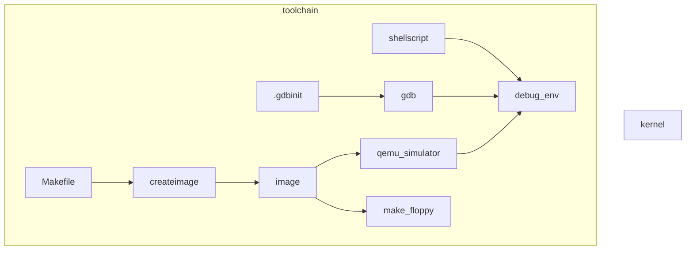
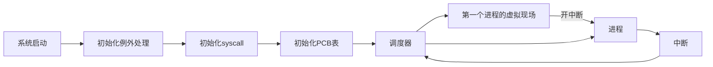
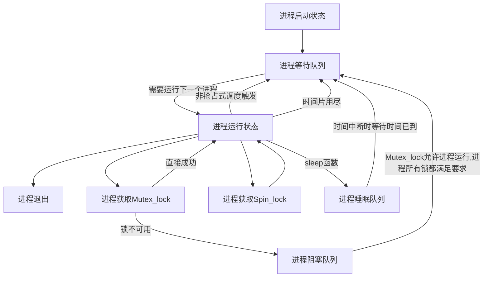

#### 操作系统研讨课实验

# Project2-A Simple Kernel

* 王华强
* 2016K8009929035
* wanghuaqiang16@mails.ucas.ac.cn

---

## 实验简述

实验要求: 

设计一个简单的操作系统内核和工具栈, 实现任务的抢占式调度, 非抢占式调度, 互斥锁的实现, 系统调用的实现, 基于优先级的调度器设计.

完成优先级设置逻辑, 设计优先级相关的测试用例并给出结果.

设计更加复杂的锁机制并进行测试.

---

## 系统整体设计

工具链架构如下:



--

系统整体架构如下:

```mermaid
graph LR;

subgraph kernel

scheduler

    bootblock.S-->system_init
    system_init-->fake_scene_for_1st_proc
    fake_scene_for_1st_proc-->scheduler

    system_init-->global_vars_:_pcb,queue,etc

    subgraph interrupt
        subgraph clock_interrupt
            clock_interrupt-->scheduler
        end
    
        subgraph syscall
            lock_syscall-->scheduler
            print_syscall
            sleep_syscall-->scheduler
        end
    
        subgraph others
            debug_func
        end
    end

end


subgraph task
test_sch_etc.
end

```

--

系统启动流程如下:



--

进程运行状态转移图如下:



---

### PCB设计与初始化

关键问题解答:

> Initialize PCB
> • Which registers should be set?
> • Where is the task located?
> • How to setup stack? Stack size?
> • Where is the PCB located?

> Pay attention to the initialization of the register in YOUR PCB (For special regs)

---

### 栈空间分配

> 问题: 空间分配的大小, 用户栈和内核栈的区分, 是否需要释放不适用的栈空间

---

### 调度器逻辑

使用先进先出队列(暂时)

3种优先级处理方式:

1. FIFO+不同长度的时间片
1. 按照优先级排布的多个FIFO
1. 优先队列

彩票算法之类的不在考虑范围内.

> 问题: 优先级和等待时长的优先度

--

#### 调度器实现上下文切换

保存现场时使用$k0,$k1辅助.

---

### Mutex Lock 实现

为每个 Mutex Lock 分配一个单独的阻塞队列.

为每个进程设置一个当前等待解锁的锁的数目的计数器, 保存在PCB中. 每当这个进程进入一个锁的等待队列, 这个值加1. 每当进程进入一个锁的可用状态时, 这个计数器减1. 

当这个计数器为0时, 这个进程进入等待队列(Ready_queue).

* 获取锁时的动作
* 释放锁时的动作

---

### 中断处理

调整寄存器开关中断(mfco, mtco)

处理中断的流程如下:

```
（1）接收中断信号
（2）关闭中断响应
（3）保护现场（save context）
（4）确定中断原因
（5）跳转到对应中断处理入口地址
（6）处理中断
（7）打开中断响应
（8）restore context
（9）继续执行原进程
```

--

#### 中断处理的实现

TODO: 例外入口函数拷贝

---

### sleep()及时钟中断

#### 时钟中断触发时的工作

对于全局计时器变量: 计时器+=1

对于正在运行的进程: 比较PCB中的信息与计时器, 判断其时间片是否已经用尽, 是否需要进入等待队列.

对于睡眠状态中的进程: 比较PCB中的信息与计时器, 判断是否需要唤醒, 如果唤醒则进入等待队列.

--

#### sleep()实现

维护可遍历的`sleeping_queue`队列.

---

### SYSCALL实现

```
写CP0
SYSCALL
```

---

## Design Review

### 1. What is PCB? What are included in PCB?

为了描述和控制进程的运行，操作系统需要为每个进程定义一个数据结构去描述一个进程，这是我们所说的进 程控制块（ProcessControlBlock），简称 PCB。它是进程重要的组成部分，它记录了操作系统用于描述进程的当前状态 和控制进程的全部信息，比如：进程号、进程状态、发生任务切换时保存的现场（通用寄存器的值）、栈地址空间、优先级等 信息。
操作系统就是根据进程的 PCB 来感知进程的存在，并依此对进程进行管理和控制，PCB 是进程存在的唯一标识。 

--

sched.h中PCB的数据类型包括用户态/核心态上下文、用户态/核心态栈顶指针、进程号、进程类型、进程状态等

task_info包含了入口地址指针、作业类型

--

xv6PCB结构体参考:
```c
struct proc {
uint sz;                     // Size of process memory (bytes) 小
pde_t* pgdir;                // Page table 页表
char *kstack;                // Bottom of kernel stack for process 进程在核心的栈底地址，简称内核栈//need
enum procstate state;        // Process state 进程状态//need
int pid;                     // Process ID       系统分配的编号，当进程进入ZOMBIE状态后返回系统分配的编号。//need
struct proc *parent;         // Parent process 父进程
struct trapframe *tf;        // Trap frame for current syscall 系统调用进入中断
struct context *context;     // swtch() here to run process   //need
void *chan;                  // If non-zero, sleeping on chan 
int killed;                  // If non-zero, have been killed 杀死进程
struct file *ofile[NOFILE];  // Open files    文件指针
struct inode *cwd;           // Current directory 文件的索引节点
char name[16];               // Process name (debugging) 进程名//need
};（xv6）
```

--

### 2. What need to be done for initializing tasks?

1. 接受锁
1. 向PCB中分配该进程对应的进程号、进程的栈地址、进程状态、创建该进程上下文信息对的context数据结构、进程优先级、进程类型、进程的入口地址。
1. 控制调度器地址跳转到该作业的入口地址

--

### 3. When is context switching in this project?

非抢占式：do_scheduler()函数执行在旧进程结束的时候，或者第一个进程开始之前。

抢占式： 有高优先级的进程抢占式执行时do_schedule()函数也会执行，并且切换上下文

--

### 4. What need to be done for context switching?

(见讲义)

--

### 5. How do you manage blocked tasks?

对应不同锁, 使用不同的block_queue.

互斥锁要求当前只有一个进程或者线程占用该锁，其余要占用该锁的进程或线程需要进入一个阻塞栈？队列？保持阻塞态，当该锁被释放时，被阻塞的进程或线程就会返回到就绪队列根据do_schedule执行。

--

### 6. What is the workflow for handling interrupt (for both clock interrupt and syscalls)?

```
接收中断信号
关闭中断响应
保护现场（save context）
确定中断原因
跳转到对应中断处理入口地址
处理中断
打开中断响应
restore context
继续执行原进程
```

具体到代码实现: (参见代码)

--

### 7. How do you implement the priority based scheduler?

(见上文)

--

### 8. When do you wake up the sleeping task?

(见上文)

--

---

## 思考题解答

---

## 附加题实现详述

带优先级的do_scheduler: 3种实现方法

* Support one thread to acquire multiple locks (at least two)
* Support more than two threads to acquire a single lock
* Design your own test cases and show the results 

---

## 问题

汇编语言描述符

---

# 实验相关建议

---

## 0. 开发环境与工具配置

针对操作系统实验的内容, 对相关的

---

## 1. 任务启动与Context Switching设计

### 1.1. PCB设计

### 1.2. 第一个TASK的启动

如何启动第一个task，例如如何获得task的入口地址，启动时需要设置哪些寄存器等

### 1.3. 上下文切换的设计

context switching时保存哪些寄存器，保存在内存什么位置，使得进程再切换回来后能正常运行

### 1.4. 补充

设计、实现或调试过程中遇到的问题和得到的经验（如果有的话可以写下来，不是必需项）

---

## 2. 时钟中断、系统调用与blocking sleep设计

### 2.1. 时钟中断处理流程

，请说明你认为的关键步骤即可
### 2.2. 你所实现的时钟中断的处理流程中，如何处理blocking sleep的任务，你如何决定何时唤醒sleep的任务？
### 2.3. 你实现的时钟中断处理流程和系统调用处理流程有什么相同步骤，有什么不同步骤？ 
### 2.4. 设计、实现或调试过程中遇到的问题和得到的经验（如果有的话可以写下来，不是必需项）

---

## 3. 基于优先级的调度器设计

### 3.1. priority-based scheduler的设计思路，包括在你实现的调度策略中优先级是怎么定义的，何时给task赋予优先级，测试结果如何体现优先级的差别
### 3.2. 设计、实现或调试过程中遇到的问题和得到的经验（如果有的话可以写下来，不是必需项）

---

## 4. 锁设计

### 4.1. spin-lock和mutual lock的区别
### 4.2. 能获取到锁和获取不到锁时各自的处理流程
### 4.3. 被阻塞的task何时再次执行
### 4.4. 设计、实现或调试过程中遇到的问题和得到的经验（如果有的话可以写下来，不是必需项）


### 4.5. 如何处理一个进程获取多把锁
### 4.5. 如何处理多个进程获取一把锁
### 4.5. 你的测试用例和结果介绍

---

## 5. 关键函数功能

请列出你觉得重要的代码片段、函数或模块（可以是开发的重要功能，也可以是调试时遇到问题的片段/函数/模块）

### 龙芯处理器的异常处理机制

### 调度器的两种实现方式

### 死锁

### IDLE(处理器空闲状态)

---

## 参考文献

[1] [单击此处键入参考文献内容]


---

Huaqiang Wang (c) 2018