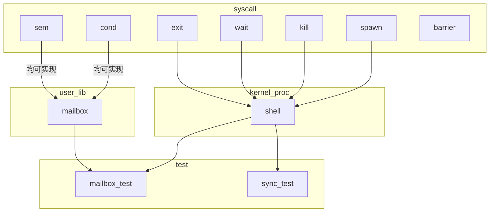
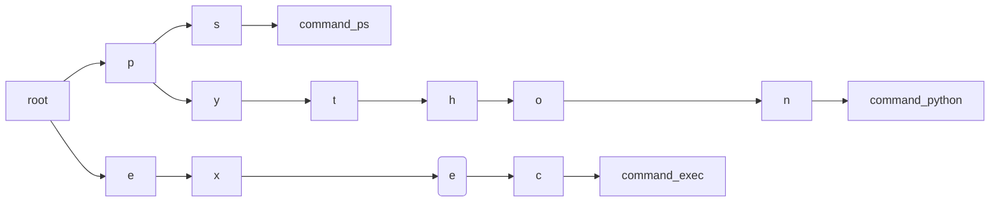

操作系统研讨课实验
--------------------

Project 3: Interactive OS and Process Management
=================================


* 王华强
* 中国科学院大学
* 2016K8009929035
* wanghuaqiang16@mails.ucas.ac.cn
* 文档版本: 2018.11.14.1 bug-fixed

---

# 1. 目录

<!-- TOC -->

- [1. 目录](#1-目录)
- [2. 总述](#2-总述)
- [3. Shell设计](#3-shell设计)
    - [3.1. Shell实现的功能](#31-shell实现的功能)
    - [3.2. 字符串及命令识别](#32-字符串及命令识别)
    - [3.3. 滚屏](#33-滚屏)
    - [3.4. 退格](#34-退格)
    - [3.5. 历史记录及"重复上一条命令"](#35-历史记录及重复上一条命令)
    - [3.6. 内置函数:ECHO](#36-内置函数echo)
    - [3.7. 内置函数:PS](#37-内置函数ps)
    - [3.8. 内置函数:KILL](#38-内置函数kill)
    - [3.9. 内置函数:EXEC](#39-内置函数exec)
    - [3.10. 内置函数:CLEAR](#310-内置函数clear)
    - [3.11. 系统软重启](#311-系统软重启)
- [4. spawn,kill和wait的内核实现](#4-spawnkill和wait的内核实现)
    - [4.1. spawn](#41-spawn)
        - [4.1.1. PID的维护](#411-pid的维护)
        - [4.1.2. SPAWN的处理过程](#412-spawn的处理过程)
    - [4.2. kill](#42-kill)
        - [4.2.1. 基本处理](#421-基本处理)
        - [4.2.2. 锁的释放](#422-锁的释放)
        - [4.2.3. 其他同步原语的处理](#423-其他同步原语的处理)
    - [4.3. exit](#43-exit)
    - [4.4. wait](#44-wait)
- [5. 同步原语设计](#5-同步原语设计)
    - [5.1. 条件变量(condition variable)](#51-条件变量condition-variable)
    - [5.2. 信号量(semaphore)](#52-信号量semaphore)
    - [5.3. 屏障(barrier)](#53-屏障barrier)
- [6. mailbox设计](#6-mailbox设计)
    - [6.1. mailbox的数据结构定义](#61-mailbox的数据结构定义)
    - [6.2. mailbox实现中producer-consumer问题的处理](#62-mailbox实现中producer-consumer问题的处理)
    - [6.3. 基本设计-临界区只支持一个写或读](#63-基本设计-临界区只支持一个写或读)
    - [6.4. 进阶设计-多写多读](#64-进阶设计-多写多读)
- [7. 其他功能](#7-其他功能)
    - [7.1. PANIC](#71-panic)
- [8. 参考文献](#8-参考文献)

<!-- /TOC -->

# 2. 总述

实验的第三阶段实现交互式shell, 进程控制相关的系统调用, 同步原语以及基于同步原语的用户库mailbox.

本次实验的逻辑层次如下:



 <!-- synchronization primitive; -->

# 3. Shell设计

<!-- （1）	shell实现过程中遇到的问题和得到的经验（如果有的话可以写下来，不是必需项） -->

## 3.1. Shell实现的功能

当前的shell实现了以下功能:

* 字符串及命令识别
* 滚屏
* 退格
* 历史记录及"重复上一条命令"
* 内置函数:ECHO
* 内置函数:PS
* 内置函数:KILL
* 内置函数:EXEC
* 内置函数:CLEAR
* 系统软重启

## 3.2. 字符串及命令识别

shell工作循环的核心代码如下:

```c


    while (1)
    {
        // read command from UART port
        disable_interrupt();
        char ch = read_uart_ch();
        enable_interrupt();
        if (!ch)
            continue;

        // TODO solve command
        if(ch==65)//up arrow
        {
            get_history();
        }
        else if (ch == 127)
        {
            if(shell_inline_position>0)
            {
                shell_inline_position--;
                screen_write_ch('\b');
                show_ascii(ch);
            }
        }
        else if (ch != 13) //
        {
            shell_add_to_buffer(ch);
            screen_write_ch(ch);
            //get ascii
            show_ascii(ch);
        }
        else //ch==13
        {
            disable_interrupt();
            shell_add_to_buffer('\0');
            screen_write_ch('\n');
            shell_inline_position = 0;
            enable_interrupt();
            add_to_history();
            reset_history();
            shell_interpret_cmd();

            disable_interrupt();
            screen_reflush();
            enable_interrupt();

            shell_newline();
        }
        shell_drawline();
    }
```

shell不断地从串口中读取信息并写入缓冲区. 当shell读取到换行符时, shell将调用`shell_interpret_cmd()`来解析缓冲区.

```c
inline void shell_interpret_cmd()
{
    argc=0;
    int i=0;
    int j=0;
    int in_space=1;
    while(1)
    {
        if((shell_buffer[i]==' ')||(shell_buffer[i]=='\t')||(shell_buffer[i]=='\0'))
        {
            if(!in_space)
            {
                argv[argc++][j]='\0';
                j=0;
            }
            in_space=1;
            if((shell_buffer[i]=='\0'))break;
        }
        else
        {
            in_space=0;
            argv[argc][j++]=shell_buffer[i];
        }
        i++;
    }
    //strcmp();return 0 if eq

    // Use key tree here to make it faster

    if(!strcmp(argv[0],"echo"))
    {
        cmd_echo();
        return;
    }
    ......
}
```

`shell_interpret_cmd()`会依照空格分别找出缓冲区中的命令的各个参数. 参数总数计入argc变量. 参数的具体内容计入argv数组. 一个正常解析的命令应该至少包括一个参数, 即命令本身.

例如:

```
echo power overwhelming
```

会被解析成:

```
argc=3;
argv[0]=echo;
argv[1]=power;
argv[2]=overwhelming;
```

之后, `shell_interpret_cmd()`会根据`argv[0]`的内容来调用对应的处理函数. 最后由对应的处理函数来处理其他的参数.

处理函数的参数和参数个数来源于全局变量argc, argv, 与一般的C语言函数相同. 例如:

```c
inline void cmd_exec()
{
    if(argc==1)
    {
        printf("No enough args for exec.\n");
        return;
    }
    int i;
    for(i=1;i<=(argc-1);i++)
    {
        int num=atoi(argv[i]);
        printf("Exec task: %d\n", num);
        sys_spawn(test_tasks[num]);
    }
}
```

在本实现中, 命令名称的识别通过"暴力遍历比较所有可能的命令"来实现. 在真实的系统中, 可以通过使用"键树"来实现快速比较以及命令自动补全.

一个典型的键树结构如下:



键树的实现依赖于键树节点空间分配, 需要在内存中额外划分出一段空间来实现键树. (因为太麻烦了就懒得写了, 不过应该不难)

通过引入键树数据结构, 可以实现O(1)级别的命令解析时间, 并且可以根据键树的内容进行快速的命令补全.

## 3.3. 滚屏

使用screen.c中提供的屏幕操作函数进行滚屏. 滚屏函数的BUG已在代码中进行了修正.

## 3.4. 退格

PS: 此实验中的串口输入和ascii码有一定的区别, 需要针对实验框架来进行控制字符比较.

当前的退格处理是, 直接printf("\b");, 并且修改全局变量`shell_inline_position--`, 来达到覆盖上一个字符的目的.

关键代码如下:

```c
else if (ch == 127)
{
    if(shell_inline_position>0)
    {
        shell_inline_position--;
        screen_write_ch('\b');
        show_ascii(ch);
    }
}
```

## 3.5. 历史记录及"重复上一条命令"

在每行的结尾(即串口输入换行字符), 将当前缓冲区的内容加入历史记录数组, 并将历史记录指针++;

在shell接收到字符`\upper_arrow`(重复上一行命令)时, 清空当前键盘缓冲区, 用历史记录中的数据填充缓冲区, 重新打印当前行并重设光标位置指针.

关键代码如下:

```c
......
    if(ch==65)//up arrow
    {
        get_history();
    }
......

inline void shell_fake_input(char* input)
{
    shell_inline_position=0;
    strcpy(shell_buffer, input);
    printf("%s",input);
    shell_inline_position+=strlen(shell_buffer);
}

inline void add_to_history()
{
    strcpy(shell_history[shell_history_cnt],shell_buffer);
    shell_history_cnt=loop_add(shell_history_cnt);
}

inline void get_history()
{
    shell_clear_input();
    shell_fake_input(&shell_history[shell_history_now]);
    shell_history_now=loop_sub(shell_history_now);
}

inline void reset_history()//not clear all history!!!
{
    shell_history_now=shell_history_cnt;
}
```


## 3.6. 内置函数:ECHO

命令格式:

```
echo arg1 ...
```

命令作用: 打印所有参数字符串

命令实现:

```c
inline void cmd_echo()
{
    int i=1;
    while(i<argc)
    {
        // shell_print(argv[i++]);
        printf("%s\n",argv[i++]);
    }
}
```

## 3.7. 内置函数:PS

命令格式:

```
ps
```

命令作用: 显示当前所有进程的信息

命令实现:

直接调用系统调用`sys_ps()`.

附注: 为了实现`sys_ps()`在终端中打印信息, 需要实现内核态下可用的屏幕缓冲区写入函数`printsys()`.

## 3.8. 内置函数:KILL

命令格式:

```
kill pid1 (pid2) ...
```

命令作用: 终止目标进程

命令实现:

对每个参数, 直接调用系统调用`sys_kill(pidi)`. `sys_kill()`会判定参数的合法性.

## 3.9. 内置函数:EXEC

命令格式:

```
exec id1 (id2) ...
```

命令作用: 启动目标任务

命令实现:

对每个参数, 直接调用系统调用`sys_exec(task[id])`. `sys_exec()`会判定参数的合法性.

## 3.10. 内置函数:CLEAR

命令格式:

```
clear
或
cls
```

命令作用: 清屏(只限于shell部分)

命令实现:

直接调用screen.c库中的函数.

## 3.11. 系统软重启

命令格式:

```
reboot
```

命令作用: 触发系统调用sys_reboot. (因为偷懒目前在内核态的shell下面就没用系统调用, 这里描述的是理想架构) 重置所有全局变量, 系统跳转到_start从头开始运行.

这个命令被用于调试时快速复现bug, 而不需要硬重启.

命令实现:

略

# 4. spawn,kill和wait的内核实现

## 4.1. spawn

### 4.1.1. PID的维护

下一个要使用的PID(next_pid)由全局变量维护. 为新进程获取PID时, 应实现类似于`_atomic_fetch_and_add(next_pid)的操作.

而实际上, 在本实现中, 由于创建新进程时系统处于核心态, 核心态下禁用所有中断, 因此这个操作必定为原子操作, 不需要使用特殊的汇编指令或者锁来加以保护.

在多处理器或者内核态开中断的情况下, 这种处理方法就不再适用.

### 4.1.2. SPAWN的处理过程

代码胜千言.

```c
int do_spawn(struct task_info * task)
{
    int i=-1;
    i=find_free_pcb();
    if(i==-1)
    {
        printsys("panic: pcb full.\n");
        return -1;
    }

    prepare_proc(&pcb[i],task);
    return 0;
}
```

`prepare_proc(&pcb[i],task)`函数与初始化PCB时使用的函数相同, 它会根据task的内容, 在指定的pcb中为新进程的执行做好准备. 

## 4.2. kill

### 4.2.1. 基本处理

先检查参数, 之后释放对应进程的所有资源.

```c
int do_kill(pid_t pid)
{
    pcb_t * tgt_pcb=0;
    int i;
    for(i=0;i<NUM_MAX_TASK;i++)
    {
        if(pcb[i].pid==pid)tgt_pcb=&pcb[i];
    }
    if(tgt_pcb)
    {
        free_proc_resource(tgt_pcb);
    }
    else
        printsys("DO_KILL FAILED.\n");
}
```

不含同步原语精细处理的资源释放函数方式如下:

```c
inline void free_proc_resource(pcb_t* pcbp)
{
    //free stack
    stack_push(&freed_stack, pcbp->kernel_stack_top);
    stack_push(&freed_stack, pcbp->user_stack_top);

    //free current queues
    queue_t* queuei = pcbp->current_queue;
    if(queue_exist(queuei, pcbp))
    {
        queue_remove(queuei, pcbp);
    }

    //set status
    pcbp->status=TASK_EXITED;
    //free pcb
    pcbp->valid=0;

    //free proc waiting for it to end
    do_unblock_all(&pcbp->wait_queue);

    //free all locks it holds
    while(!vector_is_empty(&pcbp->lock_vector))
    {
        do_mutex_lock_release(pcbp->lock_vector.head->data);
    }
}
```

释放的资源包括:

1. 栈孔间: 将进程持有的栈资源加入到"空闲栈"stack中, 分配给下一个需要使用栈的新进程.
1. 当前进程所在队列: 一个进程只能同时存在于一个队列中. 因此只要在PCB中保存当前所在队列, 退出进程时加以释放即可.
1. 等待当前进程结束的进程: 将这些进程全部唤醒.
1. 当前持有的锁: 使用PCB中特殊的"锁队列"来维护一个进程持有的锁. 在进程结束时, 这些锁全部都被释放出来.
1. 同步原语: 基本的处理包括: 将进程从当前队列中释放出来. 针对不同的同步原语, 有不同的处理, 详见下文.

最后标记当前的PCB.valid=0, 为未使用状态.

### 4.2.2. 锁的释放

使用PCB中特殊的"锁队列"来维护一个进程持有的锁. 在进程结束时, 这些锁全部都被释放出来.

```c
//in pcb
vector_t lock_vector;
vector_t sem_vector;
vector_t cond_vector;
vector_t barrier_vector;
```

"锁队列:由"通用队列"vector的数据结构实现. 其功能与"pcb_queue"基本相同. "通用队列"实际上是一个双向链表, 链表的每个节点中可以容纳一个int型数据, 恰好可以用来存放指针.

参见`vector.h`与`vector.c`

### 4.2.3. 其他同步原语的处理

其他同步原语的处理与锁相似, 使用"通用队列"vector来分类保存一个进程当前持有的不同同步原语的指针.

在进程释放时, 依不同种类的同步原语进行不同的操作.


> * semaphore: 记录该进程对信号量的操作（比如减了多少），在杀死时对这个值进行还原（加回去）
> * condition: 如果进程持有临界区，则通知并释放所有等待进程
> * barrier: 如果进程已进入等待队列，则直接将进程从等待队列中删除，并释放相应资源(count--); 否则，正常释放进程资源

因此还需要记录一个进程对于某个信号量的操作. 这个记录可以通过扩展"通用队列"vector节点的存储空间实现. 在存储信号量地址的同时记录进程对信号量的操作.

对于condition的: "如果进程持有临界区，则通知并释放所有等待进程"只要正常释放其拥有的锁即可.

~~//TODO~~

## 4.3. exit

exit的实现与kill基本相同. 唯一的区别就是, 在exit回收当前进程的所有资源之后, 会直接启动调度器.

## 4.4. wait

`sys_wait()`系统调用会将当前进程挂起到其要等待结束的进程的等待队列中. 当后者结束(exit或者被kill)时, `free_proc_resource()`函数会释放其对应阻塞队列中的所有进程.

```c
int do_wait(pid_t pid)
{
    //If pid not running: just run;
    int i;
    for(i=0;i<NUM_MAX_TASK;i++)
    {
        if(pcb[i].valid&&(pcb[i].pid==pid))
        {
            current_running->wait_pid=pid;
            do_block(&pcb[i].wait_queue);
            current_running->wait_pid=NULL;
            return;
        }
    }
    printsys("error: pid %d does not exist.\n", pid);
    return;
    
}
```

# 5. 同步原语设计
<!-- 条件变量、信号量和屏障实现的各自数据结构的包含内容 -->

同步原语条件变量, 信号量, 屏障相关的操作是一个原子操作, 因此只能通过系统调用`sys_synchronization_primitive()`来调用, 或在关中断的情况下使用对应的`do_synchronization_primitive()`函数实现.

下面描述的函数版本是"不支持同步原语回滚"的基本版本, 更能体现同步原语的本质. 支持回滚的版本需要在初始化同步原语时将其指针挂载到PCB中对应的通用队列中. 具体实现请参见最新的代码.

同步原语的实现各种教材上描述的已经非常详细了, 这里只提供代码实现, 不做解释.

## 5.1. 条件变量(condition variable)

数据结构定义如下:

```c
typedef struct condition
{
    queue_t queue;
} condition_t;
```

函数实现如下:

```c
void do_condition_init(condition_t *condition)
{
    queue_init(&condition->queue);
}

void do_condition_wait(mutex_lock_t *lock, condition_t *condition)
{
    do_mutex_lock_release(lock);
    do_block(&condition->queue);
    do_mutex_lock_acquire(lock);
}

void do_condition_signal(condition_t *condition)
{
    do_unblock_one(&condition->queue);
}

void do_condition_broadcast(condition_t *condition)
{
    do_unblock_all(&condition->queue);
}
```

## 5.2. 信号量(semaphore)

数据结构定义如下:

```c
typedef struct semaphore
{
    int value;
    queue_t queue;
} semaphore_t;
```

函数实现如下:

```c

void do_semaphore_init(semaphore_t *s, int val)
{
    s->value=val;
    queue_init(&s->queue);
}

void do_semaphore_up(semaphore_t *s)
{
    if(queue_is_empty(&s->queue))
        s->value++;
    else
    {
        do_unblock_one(&s->queue);
    }
}

void do_semaphore_down(semaphore_t *s)
{
    if(s->value>0)s->value--;
    else
    {
        do_block(&s->queue);
    }
}
```

## 5.3. 屏障(barrier)

数据结构定义如下:

```c
typedef struct barrier
{
    queue_t queue;
    int goal;
    int waiting;
} barrier_t;

```

函数实现如下:

```c
void do_barrier_init(barrier_t *barrier, int goal)
{
    barrier->goal=goal;
    barrier->waiting=0;
    queue_init(&barrier->queue);
}

void do_barrier_wait(barrier_t *barrier)
{
    barrier->waiting++;
    if(barrier->waiting==barrier->goal)
    {
        barrier->waiting=0;
        do_unblock_all(&barrier->queue);
    }
    else
    {
        do_block(&barrier->queue);
    }
}
```

# 6. mailbox设计

## 6.1. mailbox的数据结构定义
<!-- ## 7.1. mailbox的数据结构以及主要成员变量的含义 -->

基本实现(临界区只支持一个写或读)如下:

```c
#define MAILBOX_SIZE 100
typedef struct mailbox
{
    char name[25];//mailbox名称
    char content[MAILBOX_SIZE];//mailbox内容缓冲
    condition_t  not_full;//条件变量:非满
    condition_t  not_empty;//条件变量:非空
    int valid;//mailbox有效(被激活)
    int quote;//当前被引用数
    int size;//mailbox最大容量
    int size_used;//当前已使用的容量
    mutex_lock_t mutex_lock;//互斥锁, 用于维护mailbaox访问的原子性
} mailbox_t;
```

其中, 锁的分配需要着重强调: 为所有的mailbox实现分配一个共用的锁`mailbox_lock`, 来维护`open()`和`close()`的原子性. 而对于每个mailbox, 其中都自带一把锁, 来维护mailbox `send()`和`recv()`操作的原子性. 

## 6.2. mailbox实现中producer-consumer问题的处理

<!-- 你在mailbox设计中如何处理producer-consumer问题，你的实现中是否有多producer或多consumer，如果有，你是如何处理的 -->

在多producer或多consumer的情况下, 最简单的做法是维护一个临界区, 在同一时刻只能有一个读或写操作进入临界区, 这是下文"基本设计"的做法.

## 6.3. 基本设计-临界区只支持一个写或读

send()和recv()的核心代码如下:

```c
void mbox_send(mailbox_t *mailbox, void *msg, int msg_length)
{
    mutex_lock_acquire(&mailbox->mutex_lock);
    while((mailbox->size_used+msg_length)>mailbox->size)
    {
        sys_condition_wait(&mailbox->mutex_lock, &mailbox->not_full);
    }
    mmemcpy(((uint8_t*)&(mailbox->content)+mailbox->size_used),(uint8_t*)msg,(uint32_t)msg_length);
    mailbox->size_used+=msg_length;
    sys_condition_broadcast(&mailbox->not_empty);
    mutex_lock_release(&mailbox->mutex_lock);
}

void mbox_recv(mailbox_t *mailbox, void *msg, int msg_length)
{
    mutex_lock_acquire(&mailbox->mutex_lock);
    while(mailbox->size_used<msg_length)
    {
        sys_condition_wait(&mailbox->mutex_lock, &mailbox->not_empty);
    }
    mailbox->size_used-=msg_length;
    mmemcpy((uint8_t*)msg,(uint8_t*)&(mailbox->content)+mailbox->size_used,(uint32_t)msg_length);
    sys_condition_broadcast(&mailbox->not_full);
    mutex_lock_release(&mailbox->mutex_lock);
}
```

这是生产者, 消费者模型的直接实现. 使用两个条件变量和`while()`来进行操作条件判断, 足以支持多个producer和consumer的存在.

## 6.4. 进阶设计-多写多读

<!-- "多写多读"方案实现起来比较麻烦, 因此只简述思路. -->

这里我们考虑是否可以在"生产者-消费者"问题中引入"同时生产", "同时消费"的机制. "多写多读"方案的实现源于"读者-写者问题". 在mailbox的实现中: "读-读", "写-写" 都是允许的, 只有 "读-写" 操作是互斥的. 如果能够实现, 这个设计在实际的系统中应该作用显著, 但是在本实验中意义不大. (因为并没有什么并行的机会)

~~但是这个问题又不同于读者写者问题, 反正就是很难想.~~

~~还有人工智能考试和数据库大作业, 再见吧您那.~~

暂时先考虑到这里, 希望就这个问题进行进一步的探讨.

# 7. 其他功能

## 7.1. PANIC

`panic(char*)`用于表示操作系统内核遇到了不可逆的错误. 在此实现中, 在所有关键的位置进行了条件判断, 在出现异常状态的情况下调用`panic()`. 比如: 出现others例外的时候.

`panic()`函数会立即打印出当前的进程信息, 以及当前进程的关键信息, 方便进行调试(利用ps的相关代码实现). 之后系统进入死循环, 以保持当前现场状态.

# 8. 参考文献

[1]	[计算机网络技术应用-50382, Capcom, 2018]

~~这就是为什么周日晚上我会在写实验报告的原因~~

---

Copyright (C) 2018 Huaqiang Wang