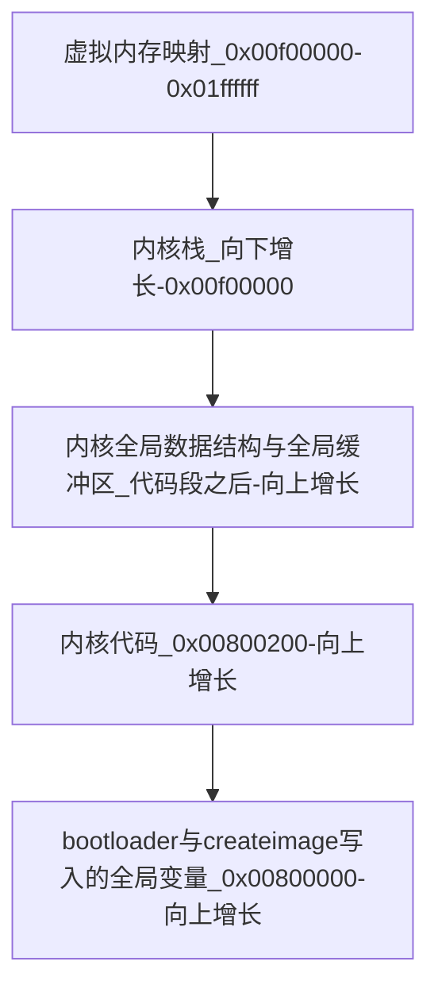
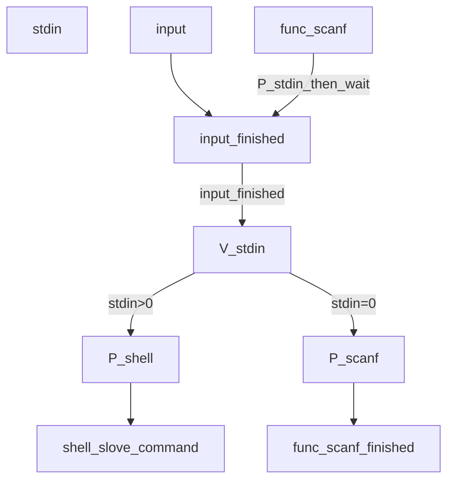

操作系统研讨课实验
--------------------

Project 4: Virtual Memory Management
=================================


* 王华强
* 中国科学院大学
* 2016K8009929035
* wanghuaqiang16@mails.ucas.ac.cn
* 文档版本: 2018.12.5
* 程序版本: L2swap_failed

注: 当前版本不能正确的执行Bonus的全部功能, (具体体现在L2页表替换随机抽风, 以及页替换会不定期出现异常), 更新SD卡读写库之后的版本将延后提交.

---

# 1. 目录

<!-- TOC -->

- [1. 目录](#1-目录)
- [2. 内存管理设计](#2-内存管理设计)
    - [2.1. 页表整体设计](#21-页表整体设计)
    - [2.2. 物理内存分配](#22-物理内存分配)
    - [2.3. 页表项结构设计](#23-页表项结构设计)
    - [2.4. 用户态进程的栈设计](#24-用户态进程的栈设计)
        - [2.4.1. 内核栈与用户栈的分离](#241-内核栈与用户栈的分离)
        - [2.4.2. 用户态进程的栈分配](#242-用户态进程的栈分配)
    - [2.5. TLB异常处理整体流程](#25-tlb异常处理整体流程)
    - [2.6. TLB miss及其处理流程](#26-tlb-miss及其处理流程)
- [3. 缺页处理设计](#3-缺页处理设计)
    - [3.1. 缺页处理简述](#31-缺页处理简述)
    - [3.2. 物理页分配策略](#32-物理页分配策略)
- [4. 页替换设计](#4-页替换设计)
    - [4.1. 页替换总述](#41-页替换总述)
    - [4.2. L2页表替换问题](#42-l2页表替换问题)
    - [4.3. SWAP操作的实现机制](#43-swap操作的实现机制)
        - [4.3.1. 守护进程: DEAMON VM](#431-守护进程-deamon-vm)
        - [4.3.2. SWAP操作的通信机制](#432-swap操作的通信机制)
        - [4.3.3. 页替换算法](#433-页替换算法)
        - [4.3.4. 页替换策略的优势和不足](#434-页替换策略的优势和不足)
    - [4.4. 测试用例设计](#44-测试用例设计)
        - [4.4.1. 基本读写](#441-基本读写)
        - [4.4.2. 用户栈测试](#442-用户栈测试)
        - [4.4.3. 压力测试和进程隔离](#443-压力测试和进程隔离)
        - [4.4.4. 大地址空间测试(SWAP测试)](#444-大地址空间测试swap测试)
    - [4.5. 特殊设计: 为每个进程分配最基本的物理地址映射](#45-特殊设计-为每个进程分配最基本的物理地址映射)
- [5. 其他设计](#5-其他设计)
    - [5.1. 利用Shell实现输入输出(未实装)](#51-利用shell实现输入输出未实装)
- [6. 实验反思](#6-实验反思)
    - [6.1. TLB例外处理笔误](#61-tlb例外处理笔误)
    - [6.2. TLB命中时返回0](#62-tlb命中时返回0)
    - [6.3. 第一次爆栈](#63-第一次爆栈)
    - [6.4. 页表初始化导致的启动慢](#64-页表初始化导致的启动慢)
    - [6.5. 页面替换算法的设计困难](#65-页面替换算法的设计困难)
- [7. 参考文献](#7-参考文献)

<!-- /TOC -->

---

# 2. 内存管理设计

这里直接阐述最终设计:

## 2.1. 页表整体设计

此操作系统采用二级页表, 支持`0x00000000`到`0x7fffffff`的全虚拟地址空间的映射以及进程地址空间隔离. 实际可用的地址空间包括物理内存24MB以及作为SWAP缓冲的磁盘空间, 实际地址范围决定于其总和.

每个进程的页表项相互独立. 其中每个进程的一级页表常驻内存, 二级页表中有四个存放在内存中, 其余部分在有映射的情况下会被缓冲到外存, 在实际使用时被从外存取出. 取出二级页表的操作不依赖于守护进程, 直接在内核态阻塞当前操作执行. 内存中的页表结构如下:

```v
pte_L1 PTE_L1[16][2048];
pte_L2 PTE_L2[16][4][256];
```

当前实现不支持不同的页框大小, 页框大小固定为4KB. 每个进程的一级页表共计2048项, 每个二级页表256项. 在页面大小恒置为为4K的情况下完成了全虚拟地址空间的映射.

## 2.2. 物理内存分配

当前物理内存的分配如下图所示:



## 2.3. 页表项结构设计

```c
// PTE define //-------------------------------

// a pte_L2 table: 2^8 * 16Byte -> 4KB
typedef struct page_table_entry_L2
{
    char setuped;       //vaddr-raddr project has already been setuped
    char inmem;         //this l2's page(s) is in memory, "valid" in tlb
    char valid;         //reserved
    char swap_cnt;      //4: count how many times this page has been swaped
    void* raddr;        //8: this page(s)' addr in physic memory
    int disk_addr;      //12: this page(s)' addr in disk. 0 if it has not been swaped out.
    int reserved;       //16: for align 16, now is used as R in clock algorithm.
    //for each tlb miss, reserved (i.e. R) ++
}pte_L2;

//pte_L1 always in memory
typedef struct page_table_entry_L1
{
    char setuped;       //L2 page table has already been setuped
    char inmem;         //pte_L2 is in memory, ie: pte_L2 valid
    char swap_cnt;      //L2 page table swap cnt
    char resv2;         //reserved for align
    pte_L2* addr;       //L2 page table's addr in disk.
    int disk_addr;      //L2 page table's addr in physic memory
}pte_L1;

// 16 L1 pte array is always in memory
// For each process, there are at most 4 L2 page table in memory
// It will not take for more than 1 MB space.
// PTE point is contained in TLB; 

pte_L1 PTE_L1[16][2048];
pte_L2 PTE_L2[16][4][256];
```

每个二级页表恰为4KB, 使用一个完整的页框.

## 2.4. 用户态进程的栈设计

### 2.4.1. 内核栈与用户栈的分离

为了实现使用虚拟地址的用户栈, 需要维护一个使用实地址的内核栈, 来在不触发各种TLB例外的情况下完成TLB的相关操作. 因此, 每次进入例外处理时切换到内核栈. 内核栈的栈基址使用与之前相同的实地址, 因此不会触发例外.

栈切换的关键代码如下:

```asm
LEAF(switch_to_kstack)
    lw k0, current_running
    lw $29, OFFSET_KBASE(k0)
    jr ra
    nop
END(switch_to_kstack)
```

(因此, 在进程切换时, 两个进程都处于内核态, 使用内核栈)

在退出例外处理时, 切换回用户栈.

一些系统进程(比如下文涉及的DEAMON VM)需要全程使用非映射的地址空间, 因此在初始化进程时, 用户进程分配虚拟用户栈, 系统进程分配非映射的用户栈.

```c
    if((pcbp->type==KERNEL_PROCESS)|(pcbp->type==KERNEL_THREAD))
    {
        pcbp->user_stack_top=alloc_stack();
    }else
    {
        pcbp->user_stack_top=0x70000000; 
    }
```

### 2.4.2. 用户态进程的栈分配

直接在初始化时为用户态进程栈分配虚拟地址`0x70000000`

## 2.5. TLB异常处理整体流程

本实现中各个TLB异常处理在一个流程中完成.

具体查询流程是: 由BadVaddr取得地址之后获得一级和二级页表地址. 由一级页表取得二级页表在内存中的位置(如果不在, 根据一级页表中记载的"二级页表在外存中的位置"来完成替换). 之后检查二级页表, 由`setup`和`inmem`位来确定需要做何种操作:

按照顺序由上至下判断:

1. !setup: 建立虚实地址映射 (PAGE FAULT)
0. !inmem: 将其他页保存到外存, 并从外存读取此二级页表对应的页 (PAGE SWAP) 
0. else: 用二级页表中的值刷新TLB (TLB miss)

## 2.6. TLB miss及其处理流程

发生TLB miss时直接查询页表, 将页表中的数据加入到TLB中.

流程参见"整体流程"

<!-- （1）你设计的页表项包含哪些内容？页表本身使用什么数据结构保存？
（2）任务1和任务2中各自初始化了多少个页表项，以及使用了多少个物理页框保存页表？
（3）任务2和任务3中，进程的用户态栈的起始地址各是多少，栈空间各是多大？
（4） 任务1和任务2中你设计的操作系统实际通过页表可以访问到的物理内存有多大？ 
（5）TLB miss何时发生？在任务2中，你处理TLB miss的流程是怎样的？
（6）设计或实现过程中遇到的问题和得到的经验（如果有的话可以写下来，不是必需项） -->

---

# 3. 缺页处理设计

## 3.1. 缺页处理简述

缺页处理发生的条件是, 在使用页表中某一项虚地址时, 这个虚地址还没有与内存中的物理地址建立映射关系. 或者当前的page已经被移出内存.

缺页处理流程在上面的整体流程中已经描述.

## 3.2. 物理页分配策略

绝大多数的物理页采用"先到先得"的原则进行分配. 但是为了使得每个进程都能正常运行, 在系统启动时直接访问16个PCB表项的用户栈, 藉此触发虚实地址自动映射, 为所有的进程分配最基础的虚拟地址空间.

在此设计中, 没有页属于pinning pages. (暂时没有发现特别重要必须pin住的页, 且其他重要的地址直接使用unmapped的地址). 在clock算法下, 常用的页一般比较难被换出.

<!-- 请至少包含以下内容
（1）何时会发生缺页处理？你设计的缺页处理流程是怎样的，此处的物理页分配策略是什么？
（2）你设计中哪些页属于pinning pages？你实现的页替换策略是怎样的？ 
（3）设计或实现过程中遇到的问题和得到的经验（如果有的话可以写下来，不是必需项） -->

---

# 4. 页替换设计

## 4.1. 页替换总述

页替换采用**进程内时钟算法**, 每次页替换只发生在进程内的页中. 在系统启动时已经有对每个进程分配最基础的内存空间, 因此在其二级页表中一定存在可以被换出的项. 如果此二级页表不在内存中, 从一级页表中遍历查询所有已经setup的二级页表并从磁盘读取, 总是能找出当前进程一个在内存中的页, 并进行替换.

鉴于页替换时更容易在"有较多page在内存中"的二级页表中找到用来替换的项, 而不需要从磁盘读取二级页表, 因此可以以二级页表中"有较多page在内存中"为依据, 来进行二级页表的替换.

## 4.2. L2页表替换问题

上文提到可以以二级页表中"有较多page在内存中"为依据来进行二级页表的替换, 但此实现中实际实现的是: 替换最不常被替换的二级页表. 在一级页表中保存了一个"二级页表替换计数器". 频繁被换入的二级页表应该尽可能的常驻内存, 而不常被使用, 仅仅偶尔被换入的二级页表可以被换出. 实际选择要换出的二级页表时只有4个值被比较.


## 4.3. SWAP操作的实现机制

### 4.3.1. 守护进程: DEAMON VM

这个进程通过信号量与其他进程通信. 作为系统进程, 其使用非映射的地址空间作为用户栈. 每当一个进程挂起到"swap等待"信号量下, 守护进程根据PCB表中提供的信息(见下)完成数据搬运, 之后解除进程挂起.

参见代码中的: `void deamon_vm(void)`

### 4.3.2. SWAP操作的通信机制

在`do_swap()`操作过程中, 中断处理程序先将具体的搬运指令写入对应PCB中`swap_request`项中, 具体数据结构定义如下所示:

```c
typedef struct swap_request_struct
{
    int disk_addr;
    void* mem_addr;
    int size;
    int valid;//optional
}swap_request_t;

```

之后中断处理程序操作信号量(P操作)挂起当前进程, 等待`DEAMON_VM`完成操作之后V信号量, 中断处理程序继续运行.

### 4.3.3. 页替换算法

在本次实验中, 页替换策略采用**进程内替换**的模式. 为了防止部分进程占用过大的地址空间, 在系统初始化时为每个进程分配少量的内存空间. 这样所有进程都可以完成进程内页替换.

在页替换发生时, 使用**二次机会时钟算法**, 找出应该被换出的页. 因为在内存中同一进程的二级页表连续排列, 因此进行时钟循环只要进行简单的地址线性加操作.

### 4.3.4. 页替换策略的优势和不足

优势: 

* 相比跨进程的页替换, 在使用二级页表的前提下, 进程内替换的复杂度更低.
* 时钟算法复杂度(时间复杂度和算法复杂度)低且效果优异, 几乎不需要引入其他的数据结构. (在L2pte中保存时钟每项的R位)

不足:

* 无法跨进程! 这意味着替换页的选择并非最优, 而且一个进程申请了过大的物理空间但是几乎不再使用之后**无法回收内存资源**, 造成资源浪费.

在"实验反思"部分解释了为何要采取此种页面替换策略.

## 4.4. 测试用例设计

测试用例参见`process2.c`

### 4.4.1. 基本读写

修改了`Process1`来支持终端外读写.

除此之外, 终端支持`set`和`dump`指令, 可以访问unmapped地址空间以及shell本身的虚地址空间. 可以用这两个指令来快速检查内存中的值, 以及验证虚地址读写操作.

### 4.4.2. 用户栈测试

当前所有用户进程的栈都已设置到虚地址空间.

### 4.4.3. 压力测试和进程隔离

这部分有两个进程, 以进程1代码为例:

```c
void pressure_test(void)
{
	uint32_t i = 0x0;
	uint32_t j = 0x0;
	int clk = 0;
	for (i = 0; i < 0x70000000; i += 4)
	{
		(*(int *)i) = i+1;
		sys_move_cursor(1, 1);
		printf("Pressure_test1: now write 0x%x\n", i+1);
		if (clk == 0)
		{
			clk = 1;
		}
		else
		{
			clk = 0;
			sys_move_cursor(1, 2);
			printf("Pressure_test2: now read 0x%x, should be 0x%x\n", (*(int *)(j)),(j)+1);
			if(((*(int *)(j)))!=((j)+1)){while(1);}
			j += 4;
		}
	}
	while(1);
}
```

两个进程读写相同的虚地址空间, 但是通过使用虚地址机制, 两个进程应当互不影响. 每个进程向不同的地址写入不同的值, 在当前时间的二倍之后读取这个地址的值, 与正确值比较. 如果不符合, 则使用while(1)终止进程.

两个进程写入的值和时间的关系分别为:

```c
//proc1
		(*(int *)i) = i+1;

//proc2
		(*(int *)j) = j+2;

//i, j每次+4
```

### 4.4.4. 大地址空间测试(SWAP测试)

SWAP测试每次访问一个页, 通过大的访问跨度(0x1000)来测试SWAP和L2页表替换.

```c
void mem_swap_test(void)
{
	uint32_t i = 0x0;
	uint32_t j = 0x0;
	int clk = 0;
	for (i = 0; i < 0x70000000; i += 0x1000)
	{
		(*(int *)i) = i+3;
		sys_move_cursor(1, 5);
		printf("Mem_swap_test: now write 0x%x\n", i+3);
		if (clk == 0)
		{
			clk = 1;
		}
		else
		{
			clk = 0;
			sys_move_cursor(1, 6);
			printf("Mem_swap_test: now read 0x%x, should be 0x%x\n", (*(int *)(j)),(j)+3);
			if(((*(int *)(j)))!=((j)+3)){while(1);}
			j += 0x1000;
		}
	}
	while(1);
}

```

<!-- 请至少包含以下内容
（1）Bonus中你设计的操作系统通过页表访问的可用物理内存是多少？何时会触发swap操作？swap操作是由专门的进程完成么？
（2）你设计的页替换策略是怎样的，有什么优势和不足么？
（3）你设计的测试用例是怎样的？ 
（4）设计或实现过程中遇到的问题和得到的经验（如果有的话可以写下来，不是必需项）

4.	关键函数功能
请列出上述各项功能设计里，你觉得关键的函数，及其作用 -->

## 4.5. 特殊设计: 为每个进程分配最基本的物理地址映射

这个操作在为每个虚拟进程划分栈空间时发生. 通过手工填充部分页表, 保证每个进程都有最基本的内存空间, 不至于出现因为其他进程占用了全部的进程空间而无法运行的情况.

---

# 5. 其他设计

## 5.1. 利用Shell实现输入输出(未实装)

~~截止到12.15提交版本,利用shell的输入输出尚未调试通过~~

在之前的设计中, 测试进程 Process2 使用`gethex()`函数来直接读取信息. 但是这样做的问题在于, `gethex()`函数会中断终端的输入, 并且需要使用与shell类似的一套机制来进行处理. 这样的后果是输入函数需要维护额外的输入缓冲区, 并且代码冗余, 结构不优雅. 为此, 将shell的读取机制与读取缓冲修改成全局的输入机制与缓冲, 并且根据函数`scanf()`的调用来控制输入结果的流向.

具体的输入与缓冲机制与shell的输入部分相同, 相比之前的设计需要添加的部分是: 当前输入结果流向的仲裁. 为此, 利用信号量实现读取等待机制. 信号量`stdin`初始值为0. 当一个进程调用`scanf`时, 对信号量`stdin`做P操作. 数据的输入来自于shell. 在信号量`stdin`下有阻塞进程时, shell的输入结果保存到缓冲区, 并做V操作唤醒对应进程. 在信号量`stdin`下没有阻塞进程时, 输入的结果由shell作为命令解析.

概括的逻辑关系如下:


---

# 6. 实验反思

非常悲伤的是, 尽管开始的比较早, 但是在此次实验之中被几个问题好好的制裁了一下, 而且这次的制裁比前几次都要严重一些... 再加上SD卡操作函数的相关问题, 导致全虚拟地址分配的swap处理并没有完成. 

~~虽然如此swap处理还是可以跑一会再爆炸的~~

总结本次实验中的主要问题有:

## 6.1. TLB例外处理笔误

TLB例外返回时使用了: SYSCALL_RESTORE_CONTEXT

SYSCALL返回时v0中可能存有数据, 因此`SYSCALL_RESTORE_CONTEXT`不会恢复`$v0`的值, 由此引起问题.

## 6.2. TLB命中时返回0

<!-- 开发板地址空间的问题 -->

PFN的设置问题. 虽然简单但是浪费了整整一天.

## 6.3. 第一次爆栈

从上到下追踪原因如下:

1. 内核栈栈指针的设置引起系统崩溃. 
1. 用户栈向内核栈切换的过程中会发生sp值的不断减小(因此在长时间运行之后会爆栈).
1. sp值的不断减小发生在进程切换过程中.
1. 进程切换过程中会保存当前进程内核栈的sp, 此后再次进入例外处理时会恢复这个值.

处理方法: 在每次进入例外处理时重新设置内核栈的sp为栈基址.

## 6.4. 页表初始化导致的启动慢

改进方案: 在操作系统启动时分配全局变量空间, 减小SD卡读写操作所造成的性能损失.

使用改进方案时, 操作系统启动后的第一件事是刷新内存分配全局变量空间. Bootloader只需要装载操作系统的代码即可. 为了便于实现, 可以规定一个适中的"装载体积", 将"装载体积"之后的全局变量全都交由操作系统自行刷新.

~~经测试, 这样的操作很容易引发BUG. 留到之后测试完善之后再使用此设计.~~

问题被证实是"全局变量初始化为0"的过程从0x00000000开始计算偏移, 而实际程序起始地址是0x00800200, 因此会将数据写到错误的位置.

## 6.5. 页面替换算法的设计困难

<!-- TODO: L2 page table switch -->

二级页表的存在会引发很大的问题... 之前的设计中试图支持跨进程的页面替换(一个进程可以抢占另一个进程的物理页面), 但是测试的结果是这样做有很高的复杂度. 为此设计了上面的"为每个进程分配最基本的物理地址映射"和"进程内时钟算法", 来在一个进程内的物理页面之中进行替换.

---

# 7. 参考文献

[1]	[龙芯2F开发版手册]

---

Copyright (C) 2018 Huaqiang Wang