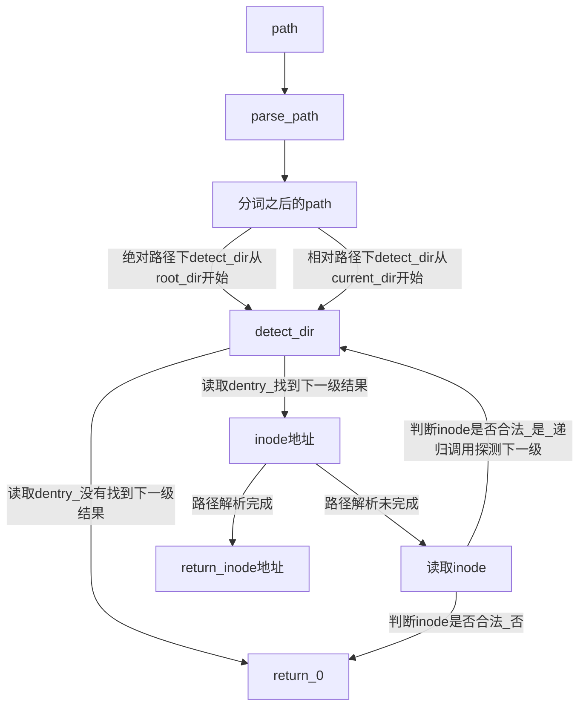

操作系统研讨课实验
--------------------

Project 6: File System
=================================


* 王华强
* 中国科学院大学
* 2016K8009929035
* wanghuaqiang16@mails.ucas.ac.cn
* 文档版本: 2019.1.18
* 程序版本: lab6_passed_vm_stable

注: 提交版本中各进程为使用虚地址空间的用户进程. 若要在板上取得稳定的测试结果(虚存不稳定的原因参见下文), 请将所有测试进程切换为内核进程.

---

# 1. 目录

<!-- TOC -->

- [1. 目录](#1-目录)
- [2. 文件系统总述](#2-文件系统总述)
- [3. 文件系统支持的命令及函数](#3-文件系统支持的命令及函数)
- [4. 文件系统初始化设计](#4-文件系统初始化设计)
    - [4.1. 文件系统磁盘布局](#41-文件系统磁盘布局)
    - [4.2. Superblock](#42-superblock)
    - [4.3. Inode](#43-inode)
    - [4.4. 文件系统关键参数](#44-文件系统关键参数)
    - [4.5. 关键逻辑说明](#45-关键逻辑说明)
        - [4.5.1. 文件系统缓冲](#451-文件系统缓冲)
        - [4.5.2. 文件系统同步](#452-文件系统同步)
        - [4.5.3. SD卡读写](#453-sd卡读写)
- [5. 文件操作设计](#5-文件操作设计)
    - [5.1. 文件的创建](#51-文件的创建)
        - [5.1.1. 元数据修改](#511-元数据修改)
        - [5.1.2. 空间分配](#512-空间分配)
        - [5.1.3. 软连接文件](#513-软连接文件)
        - [5.1.4. 硬连接文件](#514-硬连接文件)
    - [5.2. 文件的修改](#52-文件的修改)
        - [5.2.1. 文件元数据修改](#521-文件元数据修改)
        - [5.2.2. 文件内容修改](#522-文件内容修改)
    - [5.3. 文件描述符及操作函数](#53-文件描述符及操作函数)
    - [5.4. 硬链接](#54-硬链接)
    - [5.5. 软连接](#55-软连接)
    - [5.6. 文件搜索](#56-文件搜索)
- [6. 目录操作设计](#6-目录操作设计)
    - [6.1. 目录操作总述](#61-目录操作总述)
    - [6.2. 路径解析与绝对路径操作](#62-路径解析与绝对路径操作)
- [7. 文件系统测试](#7-文件系统测试)
    - [7.1. 文件系统初始化](#71-文件系统初始化)
    - [7.2. 目录操作测试](#72-目录操作测试)
    - [7.3. 小文件读写测试](#73-小文件读写测试)
    - [7.4. 大文件读写测试](#74-大文件读写测试)
    - [7.5. 杂项测试](#75-杂项测试)
- [8. 参考文献](#8-参考文献)

<!-- /TOC -->

---

# 2. 文件系统总述

此文件系统实现基于VFS框架, 在框架下可以自由地挂载各种文件系统. 文件系统的关键信息在内存中存在一份缓冲. 支持必要的文件操作函数`fopen`, `fclose`, `fread`, `fwrite`, `fclose`. 支持无限深度的目录(不超过存储能力限制), 支持常用的目录管理命令. 完成了全部Bonus要求, 原则上支持最大4G的单个文件大小. 目前文件系统的的大小限制为不超过2G.

---

# 3. 文件系统支持的命令及函数

支持的命令如下表所示, 对于需要参数的命令, 直接输入该命令会给出说明:

1. mkfs
1. mnt
1. ls
1. cd
1. touch
1. mkdir
1. rm
1. rmdir
1. ln
1. find
1. rename
1. statfs

支持的文件操作函数包括:

1. fopen
1. fclose
1. fread
1. fwrite
1. fclose

---

# 4. 文件系统初始化设计

<!-- 请至少包含以下内容
（1）请阐述你设计的文件系统对磁盘的布局（可以使用图例表示），包括从磁盘哪个位置开始，superblock，inode map，block/sector map，inode table以及数据区各自占用的磁盘空间大小
（2）请列出你设计的superblock和inode数据结构，并阐明各项含义。请说明你设计的文件系统能支持的最大文件大小，最多文件数目，以及单个目录下能支持的最多文件/子目录数目。
（3）设计或实现过程中遇到的问题和得到的经验（如果有的话可以写下来，不是必需项） -->

## 4.1. 文件系统磁盘布局

```c
// SD card file system for OS seminar
// This filesystem looks like this:
// Max FS size: 2GB
// Min FS size: 2MB
// ------------------------------------------------------------------------
// | Superblock | Block Bitmap  | Inode Bitmap | Inode         |  Blocks  |
// | 1 Block    | 16 Block 64KB | 1 Block 4KB  | 256 Block 1MB |  Others  |
// ------------------------------------------------------------------------
```

文件系统按照Block来分布. 每个Block的大小固定为4KB, 由以下宏定义:

```c
#define BLOCKSIZE_SD 4096
```

文件系统在sd卡上的起始地址由以下宏定义:

```c
#define FSSTART_SD 0x10000000
```

## 4.2. Superblock

超级快位于文件系统的第一个扇区, 定义如下所示:

```c

typedef struct superblock_head_sd
{
    uint32_t superblock_head_magic;
    uint32_t fs_size;
    uint32_t fs_start;
    uint32_t fs_end;

    uint32_t block_map_size;
    uint32_t block_map_start;

    uint32_t inode_map_size;
    uint32_t inode_map_start;

    uint32_t inode_size;
    uint32_t inode_num;
    uint32_t inode_start;

    uint32_t data_size;
    uint32_t data_start;

    // inode_sd_t* root_node;
    // int      is_backup;
} superblock_head_sd_t;

```

## 4.3. Inode

Inode的定义如下:

```c
typedef struct inode_sd
{
    char type;
    char hardlink_cnt;
    char res1; //not used
    char res2; //not used
    //1 0x0
    uint32_t owner;
    uint32_t group;
    uint32_t mode_mask;
    uint32_t create_timestamp;
    uint32_t access_timestamp;
    uint32_t modify_timestamp;
    //7

    uint32_t size;//0x1c
    //8 

    diskaddr_t blocks[16];
    //24

    diskaddr_t ext_inode1;
    diskaddr_t ext_inode2;
    diskaddr_t ext_inode3;
    //27

    uint32_t allign[5];
    //32
} inode_sd_t; //size: 32*sizeof(int) -> 128Byte
```

实际上为了实现基本的文件系统功能, 只需要以下关键项:

* type
* hardlink_cnt
* size
* blocks[16]
* ext_inode1
* ext_inode2

其中, ext_inode1指向一级间接地址节点, ext_inode2指向二级间接地址节点.

关于间接地址节点: 间接地址节点没有使用与inode相同的大小, 而是使用了与block相同的大小. 这样, 一个间接地址块中可以容纳4096/4=1024个索引项. 每个块对应的大小是4KB, 因此, 完全填满的二级间接地址(ext_inode2)可以容纳的大小是: 1024\*1024\*4KB=4GB, 再加上之前的部分, 可以粗略认为此文件系统支持的文件大小最大为4G.

## 4.4. 文件系统关键参数

几乎所有文件系统参数都以宏定义的形式声明在`fs.h`和`sdfs.h`中:

* 最大文件大小: 4GB
* 最多文件数目: 受到inode个数的限制, inode_map的大小为4096B, 因此支持最多4096*8=32768个文件
* 单个目录下能支持的最多文件: 由`DIR_FILE_MAX`宏定义, 目前为32, 最大允许4096/32-1=127个文件/目录, 除去".", ".."还有125个.
* 单个目录下能支持的子目录数目同文件数.

## 4.5. 关键逻辑说明

### 4.5.1. 文件系统缓冲

在此文件系统实现中, inode_bitmap, block_bitmap, 当前目录的block内容是一直被缓存在内存中的.

### 4.5.2. 文件系统同步

在对文件系统进行更改的过程中, 需要保证在关机时内存中缓存的内容与文件稀土写在持久介质上的内容一致. 此实现采用全写穿透的形式来保证内容的一致性以及实现的简单性.

### 4.5.3. SD卡读写

涉及到SD卡读写时, 每次读写一个扇区(512B)的内容.

注意: sd卡操作函数需要使用0x12000000-0x13000000的地址空间, 具体用途未知, 使用这一部分的内存会导致SD卡读写函数出现问题, 建议在下学期的实验中加以说明.

---

# 5. 文件操作设计

<!-- 请至少包含以下内容
（1）请说明创建一个文件所涉及的元数据新增和修改操作，例如需要新增哪些元数据，需要修改哪些元数据
（2）如果完成了bonus，请说明硬链接、软链接和rename涉及的操作流程
（3）设计或实现过程中遇到的问题和得到的经验（如果有的话可以写下来，不是必需项） -->

## 5.1. 文件的创建

文件的创建涉及以下操作:

### 5.1.1. 元数据修改 

首先申请新的inode节点并填充其内容, 之后将文件名, inode节点位置等信息填充到当前目录缓冲中去, 接下来同步当前目录缓冲, 完成文件创建. 此实现的文件空间分配采用"随用随分配"的形式, 根据fwrite的位置来为文件分配block. (也就是说, 为文件分配block的操作出现在fwrite中)

详细来说: 修改的内容有:

inode:

* type
* size
* blocks全部置为0(表明空间没有分配)
* ext_inode1设置为0(表明空间没有分配)
* ext_inode2设置为0(表明空间没有分配)
* ......(其他不太重要的属性, 如时间戳)

dir_dentry(目录项):

* name
* inode(指向inode的指针)
* valid(有效标记位)

对bitmap的修改在空间分配函数`alloc_inode`和`alloc_block`中进行. 在创建文件时只有`alloc_inode`被调用, 因此inode_bitmap会在此时被修改.

### 5.1.2. 空间分配 

不同文件创建时不进行block空间分配. 空间分配的例外是目录的创建. 在创建目录的过程中, 直接为其分配一个block来存放目录项. 用来存放目录项的block的地址存放在`inode.blocks[0]`中.

### 5.1.3. 软连接文件

为节省空间考虑, 不为软连接分配block. 软连接的指向路径字符串保存在`inode.blocks`数组(长度为64B)中, 开始位置为`&inode.blocks[0]`.

### 5.1.4. 硬连接文件

创建硬连接不需要新的inode节点, 只需要在目录项中将对应项的inode指向连接指向的位置即可.

## 5.2. 文件的修改

### 5.2.1. 文件元数据修改

涉及到文件元数据的修改, 比如`rename`,只要直接修改文件对应的目录项及inode即可. (比如rename只修改了目录项中的name字符串)

### 5.2.2. 文件内容修改

文件内容修改用到以下函数:

```c
int open(char *name, int access);
int read(int fd, char *buff, int size);
int write(int fd, char *buff, int size);
int seek(int fd, uint32_t offset);
int close(int fd);
```

这些函数被包装成以下系统调用:
```c
int sys_fopen(char *name, int access);
int sys_fread(int fd, char *buff, int size);
int sys_fwrite(int fd, char *buff, int size);
int sys_fseek(int fd, uint32_t offset);
int sys_fclose(int fd);
```

这些函数的用法与c标准中的文件操作函数基本一致. 需要特别指出的是: fread与fwrite都会根据当前的进度修改文件描述符中的`pos`(当前位置指针). 因此, 在需要对指定位置进行读写时, 可以使用`fseek`函数来将`pos`移动到指定的位置.

`fseek`函数接受的参数如下:

* fd 文件描述符
* offset 要移动到的位置距离文件开始的偏移.

比如文件:

```
0123456789
```

要想读取789, 可以采用以下的语句:

```c
char result_buff[3];
int fd=sys_fopen("foo");
if(fd==-1)
{
    //failed
    return -1;
}
else
{
    sys_fseek(fd, 7);
    sys_fread(fd, result_buff, 3)
    return 0;
}
```

## 5.3. 文件描述符及操作函数

文件描述符的结构定义如下:

```c
typedef struct file_descriptor
{
    diskaddr_t inode;
    diskaddr_t diskbase;
    uint32_t pos;
    uint32_t mode_mask; //mask from file
    uint32_t access;    //r/w/rw
    int valid;
} fdesc_t;
```

要操作文件描述符, 只要使用上面所述的函数即可.

在此实现中:

```
inode_sd_t inode_buffer_sd[FDESC_NUM];
```
被用来缓存每个文件描述符对应的inode节点.

## 5.4. 硬链接

硬连接的实现方式是: 直接在目录项中添加硬链接项, 并且提高被连接对象的引用计数.

## 5.5. 软连接

软连接的实现方式是: 在inode中保存连接目标的路径信息. 每次通过软连接访问文件时, 都会对软连接中包含的路径进行一次路径解析.

## 5.6. 文件搜索

使用dfs实现, 相对来说比较简单, 如下所示是DFS函数的实现:

```c
diskaddr_t find_sd_sub(diskaddr_t dir_now, char *name)
{
    //check if dir now is a valid dir
    char buff[512];
    char dbuff[512];
    uint32_t offset = dir_now % 512;
    sdread(&buff, dir_now - offset, 512);
    inode_sd_t *inodebuff = (inode_sd_t *)(&buff[offset]);

    if (inodebuff->type == FILETYPE_DIR)
    {
        //load dir into memory
        pprintf(inodebuff->blocks[0]);
        sdread(dbuff, inodebuff->blocks[0], 512);
        dir_t *dirbuff = (dir_t *)dbuff;
        int k = 0;
        for (k = 0; k < DIR_FILE_MAX; k++)
        {
            if (dirbuff->dentry[k].valid == 1)
            {
                //check if is this file
                if (!strcmp(name, dirbuff->dentry[k].name))
                {
                    //is this one
                    return dirbuff->dentry[k].inode;
                }
                else
                {
                    if (strcmp(".", dirbuff->dentry[k].name) && strcmp("..", dirbuff->dentry[k].name))
                    {
                        diskaddr_t res = find_sd_sub(dirbuff->dentry[k].inode, name);
                        if (res)
                            return res;
                    }
                }
            }
        }
        //not find here
        return 0;
    }
    else
    {
        return 0;
    }
}

```

---

# 6. 目录操作设计

<!-- 请至少包含以下内容 -->
<!-- （1）请说明文件系统执行ls命令查看一个绝对路径时的操作流程 -->
<!-- （2）设计或实现过程中遇到的问题和得到的经验（如果有的话可以写下来，不是必需项） -->

## 6.1. 目录操作总述

文件系统的目录部分与`*nix`类似, 支持`.`以及`..`, 这两个目录作为每个目录的特殊子目录, 无法被删除以及修改. 目前, 涉及到地址的操作, 只有`cd`命令(以及softlink)使用了路径解析, 余下的操作默认只在当前目录下搜寻对应的文件. (或者说: 只有`cd`以及`softlink`接受`path`参数, 其他实现只支持`name`参数)

~~当然要是想要让它们支持path的话只要把下面的语句复制过去就好了~~

## 6.2. 路径解析与绝对路径操作

通用路径解析语句如下:

```c
    diskaddr_t target_inode;
    parse_path(path);
    if (absolute_path)
    {
        pprintf(root_dir);
        target_inode = detect_dir(root_dir);
    }
    else
    {
        target_inode = detect_dir(current_dir);
    }
```

其中: `parse_path`是路径预处理函数, 对路径做分词处理并判断绝对/相对路径. `detect_dir`是路径解析函数, 如果解析成功则返回路径指向元素的inode位置, 否则返回0. 路径解析行为整体流程如下所示:



# 7. 文件系统测试

## 7.1. 文件系统初始化

在第一次启动系统时执行以下命令来创建并挂载文件系统:

```c
mkfs
mnt
```

执行命令`mkfs`来创建文件系统/格式化SD卡.

在创建文件系统之后, 使用`mnt`即可挂载文件系统. 注意: `mnt`命令不会在系统启动时自动执行.

## 7.2. 目录操作测试

可以使用以下各种命令来测试目录操作性能

```c
ls
cd
mkdir
touch
rm
rmdir
```

## 7.3. 小文件读写测试

使用以下的命令执行小文件读写测试. 这些命令可以在任意目录下执行:

```c
touch 1.txt
fs1
```

其中`fs1`命令的作用是启动`test_fs`, 参见代码框架.

在测试框架上进行了修改, 添加了`sys_fseek(fd, 0)`函数来控制写入/读取的位置.

## 7.4. 大文件读写测试

使用以下的命令执行小文件读写测试. 这些命令可以在任意目录下执行:

```c
touch 2.txt
fs2
```

其中`fs2`命令的作用是启动`test_bigfile`, 代码如下:

```c

void test_bigfile(void)
{
    int i, j;
    int fd = sys_fopen("2.txt", O_RDWR);

    if(fd==-1)
    {
        printf("Sysopen failed: fd==-1\n");
        sys_exit();
    }

    for (i = 0; i < 10; i++)
    {
        sys_fwrite(fd, "hello world!\n", 13);
    }

    sys_fseek(fd, 0);

    for (i = 0; i < 10; i++)
    {
        sys_fread(fd, buff, 13);
        for (j = 0; j < 13; j++)
        {
            printf("%c", buff[j]);
        }
    }
    
    sys_fseek(fd, 80000);

    for (i = 0; i < 10; i++)
    {
        sys_fwrite(fd, "hello world!\n", 13);
    }

    sys_fseek(fd, 80000);

    for (i = 0; i < 10; i++)
    {
        sys_fread(fd, buff, 13);
        for (j = 0; j < 13; j++)
        {
            printf("%c", buff[j]);
        }
    }
    sys_fclose(fd);
    // sys_exit();
    return 0;

}
```

这里的代码首先测试对文件头部的读写, 之后使用fseek将当前位置移动到离文件开头很远的位置处, 在这里进行读写测试.

fseek的目标位置可以在0到文件系统剩余容量之间任意指定.

注意: 由于部分文件可能过大, `cat`命令被设置成最多只能读取前4096B的模式.

## 7.5. 杂项测试

杂项测试包括一些其他指令的测试以及Bonus的测试.

```c
statfs
touch 2333
rename 2333 43333
mkdir 1
cd 1
ls
mkdir 2
cd 2
ls
cd /
ls
cd /1/2
ls
cd /
ls
cd ./1/2
ls
cd 1/2
ls
touch 666
cd /
rm 43333
ln /1/2/666 777
ls
......
```

一些七七八八的东西比如`pwd`, `runfile`(for bigbonus), `download`(for bigbonus)之类的等有时间再调吧, 代码里有但是(我懒得调了...).

# 8. 参考文献

- [1] [Linux Manual]

---

Copyright (C) 2018-2019 Huaqiang Wang