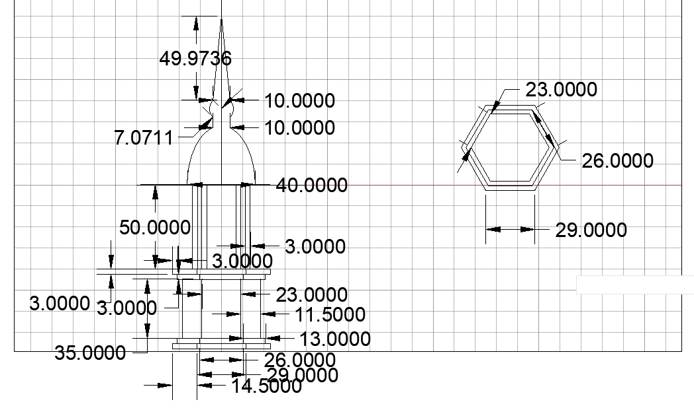
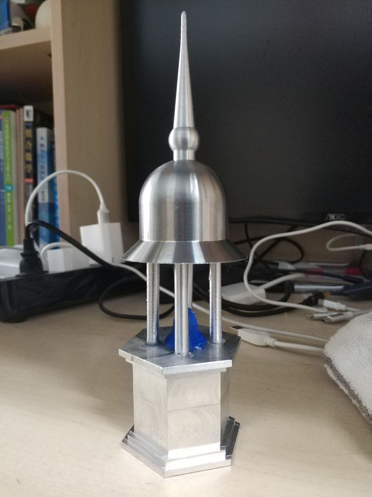

实习报告: 圣米迦勒教堂钟楼模型
===============

* 2018-2019秋季学期
* 金工实习个人报告
* 王华强
* 2016K8009929035
* wanghuaqiang16@mails.ucas.ac.cn

---

在此次实习中, 我们小组完成了圣米迦勒教堂钟楼模型的设计以及制作. 关于实习结果请参见附件中的小组报告. 在个人报告中, 仅讨论我个人承担的小组工作以及在金工实习过程中的心得体会.

---

在大作业的设计和制作中, 我负责整体的设计工作, 底座的详细设计工作以及其他零散部件的设计工作. 在加工方面, 我参与了底座的加工(铣床)以及其他装饰工序(包括使用3D打印制作挂钟, 使用激光雕刻雕刻花纹等等). 最后, 我负责执笔本组的小组报告.

<!-- 这个项目一开始的设计并非教堂模型. 我们一开始的计划是制作一个坦克模型, 但是, 小组成员并没有给出合理的设计. 因此 -->

模型主体部分的图纸如下:

模型主体部分的成品如下:

作为首个3D建模作品, 钟楼模型的设计还是相对来说比较成功的. 尽管由于用料的限制, 模型相比原型有较大的差距, 但是从零开始自行设计一个作品的感觉还是很不错的. 在作品的初步设计阶段, 我没有考虑比较具体的尺寸问题以及材料问题, 只是根据自己的设计思路设计出了需要用到本学期基本所有知识的模型结构. 在草图的设计中穹顶的设计使用了大量比较复杂的曲线来尝试拟合原图中穹顶部分的形状. 同时将尖顶和穹顶的部分设计在了一起. 底座部分的简化是在草图设计阶段就决定好的, 因为如果要按照原型来制作底座的话, 图纸部分的需要使用圆角矩形, 而我们并不清楚如何在铣床上实现这一形状. 因此, 在草图设计阶段, 我就将底座设置成了正六棱柱的情况. 接下来, 为了模仿原型建筑中底座的形状, 在六棱柱的基础上进行了变形, 在每个侧面削去一定的厚度, 来模仿原型建筑的层次感. 最后的支撑柱部分设计了六根支撑柱, 分别分布在底座的六个角上.

原型设计完成之后, 经小组商议通过, 我们开始根据原型图纸寻找合适的材料, 研究加工工艺的限制来修改图纸并固定尺寸. 根据可用材料的尺寸, 我们对图纸大小进行了缩放, 对于车床变成比较复杂的穹顶部分, 考虑到之前的草图过于复杂很难实现, 我们将塔顶的设计修改成了几个简单的几何体的链接的形式. 最后, 由于尺寸限制, 四根支撑柱显得过多, 我们将支撑柱的数目修改到了四根. 设计工作至此基本结束, 我们进入了小组分组加工的阶段. 

在分组加工阶段, 我负责铣床的操作, 这一部分没有太多值的表述的东西, 我们很顺利地依照设计完成了部件的加工.

在各个部件加工完成之后, 我在试图为模型增添装饰的过程中遇到了问题. 3D打印模型的设计和制作非常顺利, 然而3D打印出的结果颜色与金属制品放在一起并不和谐, 这是我之前应该预想到的. 可能在一开始, 使用车床和锯床来制作一个小的金属钟模型观感上会比较好. 在激光雕刻方面, 如同小组报告中所描述的, 我没能在铝制表面上留下较为明显的痕迹, 这部分的替代方案是使用激光雕刻雕刻小的激光切割出的金属板, 再将金属板粘贴到需要装饰的位置. 可能采取这样的方案会比较好, 直接在铝制品表面进行的激光雕刻, 只有仔细观察才能够发觉出来, 没有达到预定的装饰效果. 

整体上来说, 这次金工实习过程中, 在小组成员的帮助下, 我成功实现了一个自己的创意作品. 尽管因为种种原因, 这个作品并非尽善尽美, 但是想到这个作品是由自己设计出的, 就很有成就感. 同时, 通过这次分组作业制作, 我参与到了制作的各个工序中去, 因此此后在遇到类似的要求或者任务时能够很快的上手. 从原型设计到车床编程, 从车床铣床操作到手工修整, 从金属加工到3D打印和激光雕刻: 这次小组作业覆盖到了方方面面的知识, 让我对材料加工的工艺有了一个基本的认识.

当然, 遗憾也是有的. 比如在设计阶段由于第一次进行3D模型设计, 很多设计比较简陋, 没有实现比较复杂的建筑结构. 在主体部分加工完成之后, 很多装饰用的配件没有来得及完成. 结果就是, 成品模型看起来比较简单. 但是经过此次的设计和实现, 如果以后有机会的话, 我应当会有能力挑战更加复杂的设计和实现了. 将近80个小时的实习经历, 也会成为日后大学回忆中难忘的经历了吧.

---

Copyright (c) 2018-2019 Wang Huaqiang