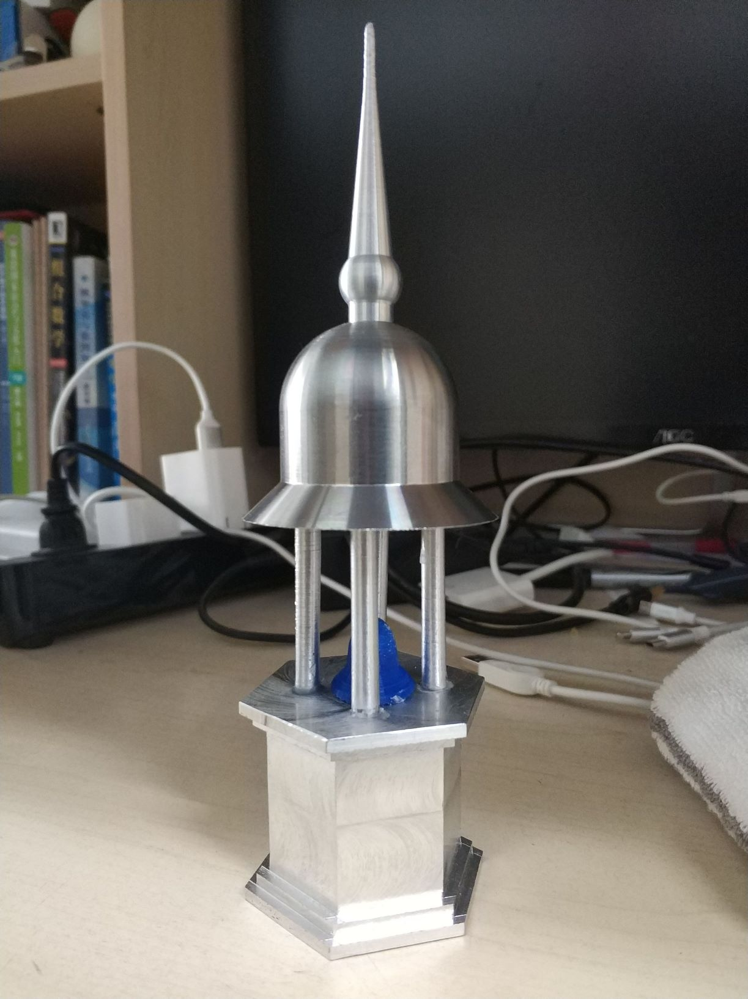

实习报告: 圣米迦勒教堂钟楼模型
===============

2018-2019秋季学期

金工实习小组报告

小组成员:

* 王华强
* 段江飞
* 资威
* 刘蕴哲
* 蔡昕

---

目录
--------

<!-- TOC -->

- [1. 课题内容](#1-课题内容)
    - [1.1. 选题说明](#11-选题说明)
    - [1.2. 原型图](#12-原型图)
    - [1.3. 初步概念](#13-初步概念)
    - [1.4. 有关修改说明](#14-有关修改说明)
    - [1.5. 设计图](#15-设计图)
- [2. 成本分析](#2-成本分析)
- [3. 加工计划](#3-加工计划)
    - [3.1. 原料清单](#31-原料清单)
    - [3.2. 工序说明](#32-工序说明)
        - [3.2.1. 车床选材](#321-车床选材)
        - [3.2.2. 车床编程](#322-车床编程)
        - [3.2.3. 塔顶和塔尖的连接](#323-塔顶和塔尖的连接)
        - [3.2.4. 塔基座的选材](#324-塔基座的选材)
        - [3.2.5. 塔基座的编程](#325-塔基座的编程)
        - [3.2.6. 铣床操作](#326-铣床操作)
        - [3.2.7. 塔基座的装饰](#327-塔基座的装饰)
        - [3.2.8. 塔主体部分的连接](#328-塔主体部分的连接)
        - [3.2.9. 其他组件的制造](#329-其他组件的制造)
    - [3.3. 小组分工](#33-小组分工)
- [4. 实践结果](#4-实践结果)
    - [4.1. 加工过程中关键问题](#41-加工过程中关键问题)
        - [4.1.1. 在原型基础上的设计变更](#411-在原型基础上的设计变更)
        - [4.1.2. 激光雕刻在铝制材料上效果不明显](#412-激光雕刻在铝制材料上效果不明显)
        - [4.1.3. 支撑柱的尺寸问题](#413-支撑柱的尺寸问题)
    - [4.2. 成品图](#42-成品图)
    - [4.3. 补充课题: 早期飞机模型](#43-补充课题-早期飞机模型)

<!-- /TOC -->

---

# 1. 课题内容

## 1.1. 选题说明

圣米迦勒教堂位于德国汉堡, 其标志式的巴洛克式的钟楼顶是汉堡的著名地标之一. 通过对照摄影作品制作相应的模型, 可以有效地锻炼设计能力. 同时, 教堂钟楼建筑整体外观简单优雅, 但具体细节需要仔细打磨. 在复现塔尖, 穹顶过程中需要使用橙创并进行精密编程来控制穹顶的形状. 在制作支柱的过程中需要处理因模型缩放导致的柱子精度问题(由于模型尺寸限制, 支撑柱必须设计的很细, 而车床在加工较细的棒料的时候比较困难). 在制作基座的过程中需要使用铣床来打磨出底座的大致形状, 并继续使用铣床来展现出基座的层次. 底座装饰需要使用激光雕刻来雕刻图案. 在底座, 支撑柱, 穹顶的链接部分需要设计有效的连接机制. 钟楼内部的装饰(比如吊钟, 栏杆)等等可能要使用3D打印/车床, 激光切割来进行制作. 综上所述, 这个模型的制作涉及了本学期所学的除线切割以外的各种金属加工技术.

## 1.2. 原型图

圣米迦勒教堂的全景如下图所示:

在实践过程中, 我们的模型表现的是教堂钟楼的上半部分, 即:

## 1.3. 初步概念

模型的主体分为两部分: 穹顶和底座. 两部分之间通过支撑柱进行连接. 在主体部分完成链接以后, 起装饰作用的各个零件将被添加到钟楼中.

## 1.4. 有关修改说明

由于实习中心的材料和设备限制, 我们所制作的模型不能够完美的还原原型的外形, 在设计上进行了较大的修改, 具体细节如下:

穹顶部分:

金工实习中心所提供的棒料直径不超过60mm, 在我们的设计中, 由于使用车床来制作穹顶的半椭球, 因此穹顶的最大尺寸被限制在55mm左右(直径). 与此同时, 车床的编程采用多个球面相接来模拟半椭球穹顶.

立柱部分:

由于穹顶的尺寸限制, 支撑立柱的数目由实际的六根减少到四根. 同时, 为方便通过打孔来连接柱子和其他部件, 立柱的位置进行了整体内移, 以防止打孔的位置距离部件边缘太近.

底座部分:

实际的钟楼底座为圆角矩台. 考虑到圆角制作复杂, 我们采用六棱台作为底座的基本结构.

## 1.5. 设计图

综合以上考虑. 我们的设计图如下:

其中:

* 尖顶由圆锥, 球体和圆柱组成
* 穹顶为多个球体相连模拟的半椭球, 穹顶底部被扩展出来作为房檐
* 支撑立柱直径为3mm
* 底部的基础为六棱台, 使用铣床来制作出进一步的精细结构

此项目的详细图纸, 参见电子版中的`图纸`文件夹.

---

# 2. 成本分析

原料|尺寸|成本|用途
-|-|-|-
钢棒料|直径60*300|预估60元|制作椭圆穹顶
铝棒料|直径30*1000|56元|制作尖顶及支撑柱
铝板料|150*150*50|91元|制作底座
3D打印原料|-|5元以下|制作装饰物(如钟模型)

激光雕刻只涉及到设备使用, 几乎没有成本.
激光切割的零件没有加装到最后的模型上, 成本不计.
电费预计不超过5元.

综上, 整体成本为: 221元

---

# 3. 加工计划

## 3.1. 原料清单

原料|尺寸|成本|用途
-|-|-|-
钢棒料|直径60*300|预估60元|制作椭圆穹顶
铝棒料|直径30*1000|56元|制作尖顶及支撑柱
铝板料|150\*150\*50|91元|制作底座
3D打印原料|-|10元以下|制作装饰物(如钟模型)

## 3.2. 工序说明

### 3.2.1. 车床选材

根据设计图的尺寸选取合适的棒料，塔尖细长，直径最大的部分也在15mm以内，但是塔顶比较粗，将这两部分分开处理，在塔顶上打个孔，将塔尖插进去，这样塔尖只需要直径15mm的铝料，塔顶使用直径40mm的铁料。

### 3.2.2. 车床编程

由于成型的材料有弧线，利用车床编程自动执行比较方便。首先，由老师讲解车床编程和具体参数的意思, 然后，先将程序写出来，在车床上建立程序；然后，请老师检查是否存在问题和演示车床的编程预切等操作，在程序无误之后，开始车棒料。

### 3.2.3. 塔顶和塔尖的连接

在塔顶上根据塔尖底部的尺寸打了一个孔，然后将塔尖插入进行连接。

### 3.2.4. 塔基座的选材

塔基座的设计是基于我们所持有的材料的尺寸的. 因此选材时直接选用150\*150\*50的铝板料.

### 3.2.5. 塔基座的编程

塔基座的外观加工完全由铣床实现. 铣床的编程由老师根据我们提交的3D模型完成.

### 3.2.6. 铣床操作

根据已经选好的铝块，通过设计图纸估计所需要的大小锯下一块铝块, 之后使用铣床进一步将材料加工到铣床程序所需的尺寸, 之后运行铣床程序1, 将材料处理成六棱台. 接下来, 在六棱台的每个侧面上运行程序2, 将每个侧面加工成想要的形状.

### 3.2.7. 塔基座的装饰

将铣床加工后的基座清洗干净, 放置在激光雕刻台上. 调整透镜位置来正确对焦, 之后进行激光雕刻.

### 3.2.8. 塔主体部分的连接

按照设计的好的图纸在底座和塔的上部分打好位置之后，我们选择小的钻头尽力打出深度相同的孔. 之后将连接棒插入孔中. 由于连接棒的尺寸不统一(见下文"问题"部分), 因此使用胶水来进一步进行固定.

### 3.2.9. 其他组件的制造

根据图纸, 分别进行3D打印/激光切割即可.

## 3.3. 小组分工

* 王华强: 项目创意, 项目整体草图(3D模型)实现, 整体结构设计, 3D打印设计及操作, 基座部分设计及操作(铣床), 激光雕刻设计及操作, 小组报告撰写
* 段江飞: 整体结构设计, 穹顶部分实际图纸实现(3D模型), 车床编程, 车床操作（塔尖，塔顶，支架）, 参与小组报告撰写
* 资威: 参与激光雕刻部分设计, 参与铣床（铣底座）、车床（车支架）、钻床（钻支架的孔）、锯床（锯底座）的手动操作
* 刘蕴哲: 完成连接部分细节设计, 连接件部分实际加工(钻床操作)
* 蔡昕: 进行塔顶的设计，参与车床操作（塔尖，塔顶，支架）、锯床（锯底座）的手动操作

---

# 4. 实践结果

## 4.1. 加工过程中关键问题

### 4.1.1. 在原型基础上的设计变更

首先是设计方面的问题. 材料和设备的限制决定了我们不能原貌复原原型建筑. 在设计上的具体变动请参见1.4节.

### 4.1.2. 激光雕刻在铝制材料上效果不明显

在原本的设计中, 我们希望通过激光雕刻在铝制底座上雕刻装饰花纹. 

图样如下:

然而, 在实际加工过程中, 激光雕刻在铣床加工过的铝块上的效果很差. 在完成对焦之后, 激光雕刻仅仅能在铝块表面上留下及其浅的痕迹, 只有依靠光线在某些特定角度下可见. 在下面的成品图中可以看到, 激光雕刻的结果难以识别, 被铣床加工所造成的痕迹完全覆盖住了.

### 4.1.3. 支撑柱的尺寸问题

在图纸中, 我们所设计的支撑柱直径为3mm, 然而, 车床加工不支持如此之小的尺寸. 因此实际加工出的支撑柱直径大于3mm且直径不均匀(因为当前直径太小). 为此, 我们放弃了原有的连接计划, 直接使用打孔-嵌入-胶粘的方式来应对支撑柱的不均匀性.

## 4.2. 成品图

经过以上所有工序的成品图如下:

## 4.3. 补充课题: 早期飞机模型

在学期之初, 我们也使用激光切割制作了一个简单的早期飞机模型. 如下图所示:

制作和设计较为简单, 在此不再赘述.

---

Copyright (c) 2018-2019 Wang Huaqiang, Duan Jiangfei