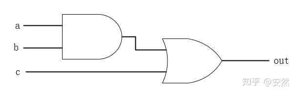

<!-- (i) Make a 15-min survey presentation containing both following two items: -->
<!-- a. A paper reading from the list given blow. -->
<!-- b. Some existing DSL in the area you are exploring. -->

Paper reading report

## Improving JavaScript Performance by Deconstructing the Type System
<!-- ============================= -->

* REINISCH FABIAN, WANG HUAQIANG

---

## Basic Idea

* Analyze how a compiler deal with a language. 
* Point out problems that may impact performance.
* Give ideas on how to solve these problems.

<!-- (30) -->

---

## Background: The JavaScript Language & The Chrome V8 Compiler

### JavaScript Prototyping

<!-- JavaScript uses prototyping to emulate the class inheritance of statically-typed languages such as C++ or Java.
Every object in JavaScript inherits from a “parent” object,
which is the prototype object of the constructor function
used to create that object. Inheritance is supported by having the special property __proto__ in the object pointing
to the prototype object at object construction time

Properties in the
prototype can either be accessed via inheritance through the
“child” object, or directly through the prototype property
in the constructor function object. -->

```js
function Point (x, y){
    this.x = x;
    this.y = y;
}
var p1 = new Point (11, 22);
var p2 = new Point (33, 44);
Point.prototype.size=100
print(p1.size)
```

--

```js
function singleX(x){this.x=x;}
var p3=singleX(10)

function getX(i){return i.x}

getX(p1)
getx(p3)
```
<!-- 
where property x is stored in memory. Indeed, property
x can be found at different memory offsets for the different objects that getX can receive as arguments. Thus, in
JavaScript, each property access requires a lookup in a dictionary to resolve the property’s location in memory. 

Modern Just-In-Time (JIT) compilers address this problem by using specialization  -->

---

### Hidden Classes

<!-- (1:30) -->
V8 uses hidden classes to introduce the notion of types.

V8 uses the information collected in the hidden
class to generate efficient code, as hidden classes record the
offset where a given property for that object type is located.


Figure 2: Example of hidden classes.

---

### Inline Caching
<!-- (2:00) -->
<!-- IMPORTANT -->

A common assumption is that property accesses at a given
access site are usually performed on objects with the same
type. Hence, V8 uses a technique called inline caching [13]
to optimize accesses to object properties at an access site.

<!-- Inline cache example for the code in Figure 1(b) -->

```js
//load inline cache
function getX(p){
    if(p is an object && p.hiddenclass==cashed_hiddenclass)
        return p[cashed_offset]
    else
        //jump to V8 runtime
}
```

<!-- Whether an inline cache access hits or misses has performance implications

Our experimental results show that a
monomorphic inline cache hit requires about 10 instructions
(or only 3 instructions if optimized by the V8 Crankshaft
optimizing compiler), while a polymorphic inline cache hit
requires approximately 35 instructions if there are 10 types,
and approximately 60 instructions if there are 20 types. An
inline cache miss requires 1,000–4,000 instruction -->

---

## Problem and Ways to Overcome them

### Overview

This paper focus on three questions.

1. Prototype Changes due to Function Creation
1. Prototype Changes due to Built-in Object Creation
1. Method Bindings

Solution: Decoupling Prototypes From Types / Decoupling Method Bindings From Types

<!-- (2:15) -->

---

### Prototype Changes due to Function Creation

<!-- (3:00) -->

<!-- JavaScript semantics dictate that every time a function
is created, a corresponding prototype for that function is
created, when the function is used as a constructor. This
is how JavaScript implements inheritance. The problem occurs when there is frequent function creation. Since the
__proto__ pointer is immutable in a hidden class, growth in
the number of prototypes leads to a corresponding growth
in the number of hidden classes. -->

```js
for ( var i = 0 ; i < 100; i++) {
var Foo = function (x, y) {
    this.sum = x + y;
}
var Obj = new Foo (1 ,2);
}
```

<!-- graph -->

--
### Solution: Optimizing Function Creation

Decoupling Prototypes From Types

<!-- PIC -->

<!-- (4:00) -->

---

### Prototype Changes due to Built-in Object Creation

<!-- (5:00) -->

<!-- The second source of rampant hidden class creation and
type unpredictability is the regeneration of these built-ins
from scratch. One might think that updates to built-in objects would be rare. However, there is one frequent web
browser event that triggers such updates: Page Loads. Whenever a page is loaded, semantically JavaScript must create a
new global execution context. The context contains new instances of the built-ins described above because JavaScript
permits modification of even built-in objects in the course
of user-code execution.

Regeneration of the built-in prototype objects causes all
objects that were constructed using the built-in functions
to have different hidden classes, due to the immutability
of the __proto__ property in hidden classes. It also causes
automatically-generated function prototypes that inherit from
Object.prototype to have different hidden classes. This
leads to type unpredictability and, hence, low performance. -->

--

### Solution: Optimizing Built-in Object Creation

Decoupling Prototypes From Types 


<!-- CODE -->
<!-- PIC -->

<!-- (5:30) -->
---

### Method Binding

<!-- Function bindings are encoded into hidden classes in V8
by storing the values of function properties in the hidden
class itself, rather than the offsets in the object like regular properties. These values are immutable, just like offsets are immutable in a hidden class. This immutability
allows method bindings to be checked automatically when
hidden classes are checked in call inline caches. However, immutability also means that, if the method binding changes,
a new hidden class has to be created. This gives rise to the
same problem as with prototypes: frequent changes in the
method binding lead to excessive hidden class creation and
type unpredictability -->

<!-- (6:30) -->

--

### Solution: Decoupling Method Bindings From Types

Decoupling Method Bindings From Types

* Complete Decoupling
* Partial Decoupling

Here we will only talk about `Complete Decoupling`.
<!-- 
We completely decouple method bindings from types by
disallowing the storage of function property values in the
hidden class altogether. Instead, function property values
are always stored in the object itself; the hidden class only
contains the offsets they are stored in, just like for regular
properties -->

<!-- PIC -->

<!-- (7:30) -->

---

## Result evaluation

<!-- PIC -->
<!-- TBD: POINTS -->

<!-- (8:30) -->

---

# DSL: Chisel

* REINISCH FABIAN, WANG HUAQIANG

---

## Outline 

* Hardware description language
* What is Chisel
* Highlights for Chisel
* Examples for Chisel: a full adder
* Our mini-project plan

---

## Hardware description language

MUX: multiplexer

```verilog
//verilog code
module my_4_2_mux(
  input sel,
  input [3:0]in1,
  input [3:0]in2,
  output [3:0]out
);
  assign output=sel?in1:in2;
endmodule
```

--

8-bit counter

```verilog
......
//verilog code
reg [7:0]counter;
always@(posedge clk)begin
  counter=counter+1;
end
......
```

--



---

## What is Chisel

> Chisel is an open-source hardware construction language developed at UC Berkeley that supports advanced hardware design using highly parameterized generators and layered domain-specific hardware languages.

--

* highly parameterized generators
* layered domain-specific hardware languages

<!-- (9:00) -->

---

## Why use Chisel

* Embedded in the Scala programming language
* Hierarchical + object oriented + functional construction
* Highly parameterizable using metaprogramming in Scala
<!-- We are goint to talk about scala related features. We will not put much time on hardware. -->

```
* Hardware construction language (not C to Gates)
* Algebraic construction and wiring
* Abstract data types and interfaces
* Bulk connections
......
```

---

<!-- (9:30) -->

## What is the difference between Chisel and VHDL/Verilog

* Verilog and VHDL were developed as hardware simulation languages
  * Many constructs are simply not synthesizable / not appropriate for hardware synthesis
  * Some constructs are non-intuitive in how they map to hardware implementations

--

* Easier to design circuit generators
  * It will raise the level of design abstraction 
* Provide the powerful facilities present in modern programming languages, such as object-oriented programming, type inference, support for functional programming, and reflection.

<!-- > We were motivated to develop a new hardware language by years of struggle with existing hardware description languages in our research projects and hardware design courses. Verilog and VHDL were developed as hardware simulation languages, and only later did they become a basis for hardware synthesis. Much of the semantics of these languages are not appropriate for hardware synthesis and, in fact, many constructs are simply not synthesizable. Other constructs are non-intuitive in how they map to hardware implementations, or their use can accidently lead to highly inefficient hardware structures. While it is possible to use a subset of these languages and still get acceptable results, they nonetheless present a cluttered and confusing specification model, particularly in an instructional setting. -->

<!-- > However, our strongest motivation for developing a new hardware language is our desire to change the way that electronic system design takes place. We believe that it is important to not only teach students how to design circuits, but also to teach them how to design circuit generators ---programs that automatically generate designs from a high-level set of design parameters and constraints. Through circuit generators, we hope to leverage the hard work of design experts and raise the level of design abstraction for everyone. To express flexible and scalable circuit construction, circuit generators must employ sophisticated programming techniques to make decisions concerning how to best customize their output circuits according to high-level parameter values and constraints. While Verilog and VHDL include some primitive constructs for programmatic circuit generation, they lack the powerful facilities present in modern programming languages, such as object-oriented programming, type inference, support for functional programming, and reflection. -->

<!-- > Instead of building a new hardware design language from scratch, we chose to embed hardware construction primitives within an existing language. We picked Scala not only because it includes the programming features we feel are important for building circuit generators, but because it was specifically developed as a base for domain-specific languages. -->

<!-- (11:00) -->

--

Use functions
```scala
def clb(a: UInt, b: UInt, c: UInt, d: UInt): UInt = 
  (a & b) | (~c & d)
```

--

Bundles

```scala
class MyFloat extends Bundle {
  val sign        = Bool()
  val exponent    = UInt(8.W)
  val significand = UInt(23.W)
}

val x  = Wire(new MyFloat)
val xs = x.sign
```
--

Vectors

```scala
// Vector of 5 23-bit signed integers.
val myVec = Wire(Vec(5, SInt(23.W)))

// Connect to one element of vector. 
val reg3 = myVec(3) 
```

--

Parameterized Functions

```scala
def Mux[T <: Bits](c: Bool, con: T, alt: T): T = { ... }
```

--

Parameterized Classes
```scala
class FilterIO[T <: Data](gen: T) extends Bundle { 
  val x = Input(gen)
  val y = Output(gen)
}

class Filter[T <: Data](gen: T) extends Module { 
  val io = IO(new FilterIO(gen))
  ...
}
```

--

Parametrization based on Modules

```scala
trait MyAdder {
    def in1: UInt
    def in2: UInt
    def out: UInt
}

class Mod1 extends RawModule with MyAdder {
    val in1 = IO(Input(UInt(8.W)))
    val in2 = IO(Input(UInt(8.W)))
    val out = IO(Output(UInt(8.W)))
    out := in1 + in2
}
```

--

```scala
class X[T <: BaseModule with MyAdder](genT: => T) extends Module {
    val io = IO(new Bundle {
        val in1 = Input(UInt(8.W))
        val in2 = Input(UInt(8.W))
        val out = Output(UInt(8.W))
    })
    val subMod = Module(genT)
    io.out := subMod.out
    subMod.in1 := io.in1
    subMod.in2 := io.in2
}
```

---

# How it works

<!-- TBD -->

> Chisel3 (Scala) to Firrtl (this is your "Chisel RTL").
> Firrtl to Verilog (which can then be passed into FPGA or ASIC tools).
> Verilog to C++ for simulation and testing using Verilator.

https://github.com/ucb-bar/chisel-template
https://github.com/freechipsproject/chisel3/
<!-- (13:00) -->

---

# Code examples

<!-- Two examples -->

```scala
// Full adder
import chisel3._
import chisel3.util._

//A n-bit adder with carry in and carry out
class Adder(val n:Int) extends Module {
  val io = IO(new Bundle {
    val A    = Input(UInt(n.W))
    val B    = Input(UInt(n.W))
    val Cin  = Input(UInt(1.W))
    val Sum  = Output(UInt(n.W))
    val Cout = Output(UInt(1.W))
  })
  //create an array of FullAdders
  val FAs   = Array.fill(n)(Module(new FullAdder()).io)
  val carry = Wire(Vec(n+1, UInt(1.W)))
  val sum   = Wire(Vec(n, Bool()))
```

--

```scala
  //first carry is the top level carry in
  carry(0) := io.Cin

  //wire up the ports of the full adders
  for (i <- 0 until n) {
    FAs(i).a := io.A(i)
    FAs(i).b := io.B(i)
    FAs(i).cin := carry(i)
    carry(i+1) := FAs(i).cout
    sum(i) := FAs(i).sum.toBool()
  }
  io.Sum := Cat(sum.reverse)
  io.Cout := carry(n)
}
```

---

<!-- (14:30) -->

## Our project

<!-- The simulation unit testing infrastructure is still a work in progress. -->
<!-- langref(In Chinese): http://chuquan.me/2016/12/17/chisel-tutorial/ -->

Improve Chisel by trying to solve the following questions. 

* https://github.com/freechipsproject/chisel3/issues/740 (namespace)
* https://github.com/freechipsproject/chisel3/issues/832 (type_check)
* https://github.com/freechipsproject/chisel3/issues/697 (type_check)

--

Difficulty: Chisel is a well designed hdl. It is not easy to understand its source code.

--

## Add a namespace support for Chisel

* https://github.com/freechipsproject/chisel3/issues/740 (namespace)

Proposed API:
```scala
nameSpace("jackslib") {
  nameSpace("COV") {
    // all names get prefixed with jackslib_COV
  }
  nameSpace("foobar", absolute = true) {
    // all names prefixed with foobar_
  }
}
```

A basic improvement. We can learn more about Chisel's structure from it.

--

## Improve comparison operator warnings

* https://github.com/freechipsproject/chisel3/issues/697 (type_check)

Idea: Make Comparison Operators check whether both outcomes are possible (for example: if widths allow it). 

Proposed API:
```scala
val counter = RegInit(0.U)
when(counter > 15.U) {
  //ERROR
}
```

* It would be nice to provide the user a way to check for coding errors.
* Help designers to remove "dead" code.
--

## Implement comparison operator for Bundle 

* https://github.com/freechipsproject/chisel3/issues/832 (type_check)

Bundle doesn't implement === (hardware equality) in Chisel now.

--

## Alternative plan

https://github.com/freechipsproject/chisel3/milestone/7

---

Thank you.

