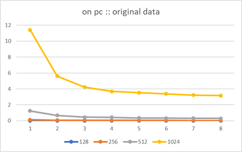
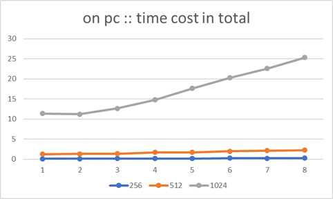
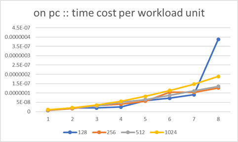
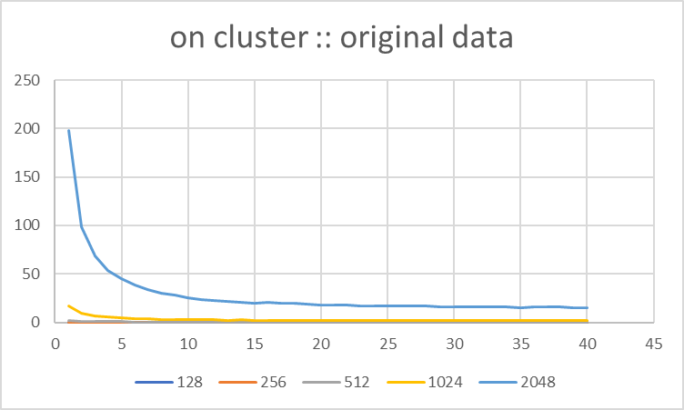
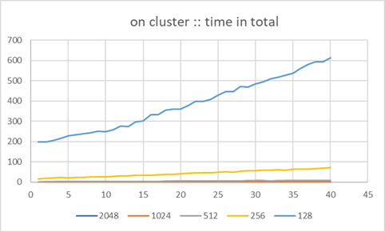
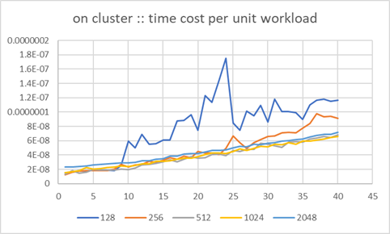
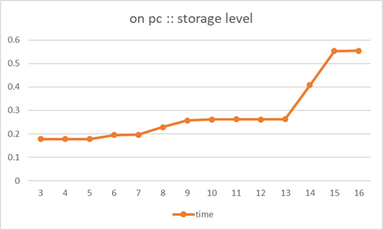
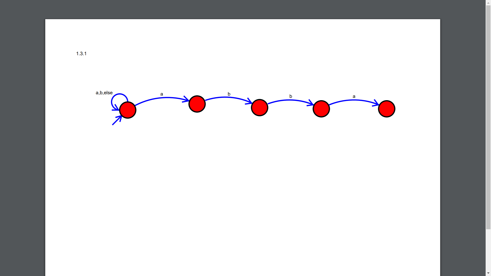
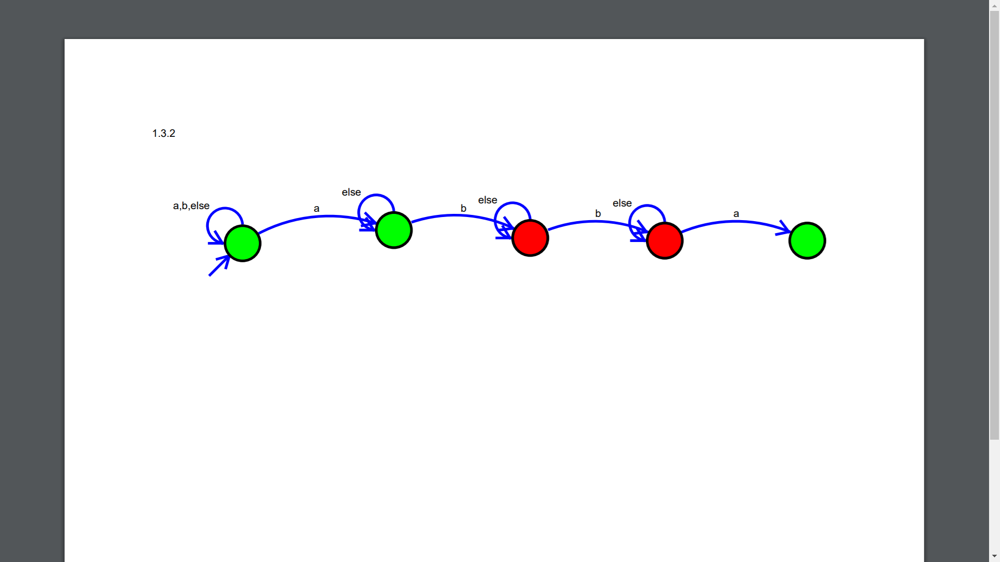
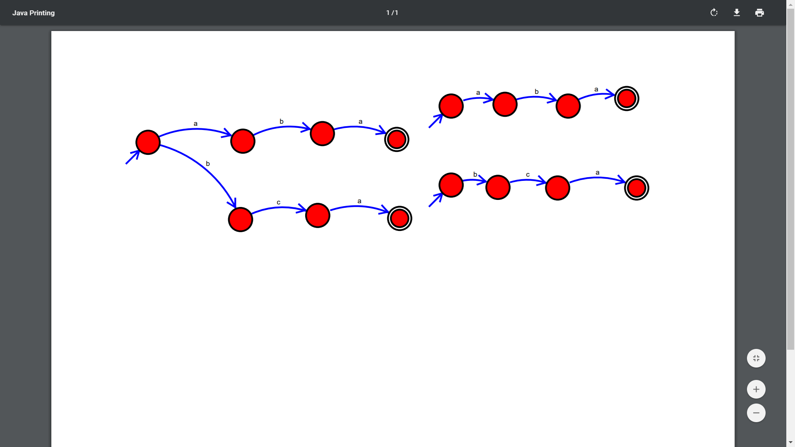

CS3211 Part2 Individual Report
=============================

* (c) 2019 Wang Huaqiang

---

[TOC]

---

# 1. Lab1: openMP, and memory behaviour

## 1.1. Task 1

> Compile and run the matrix multiplication program. Observe the number of threads that the program is using. What is the number? Why is it this number? You can change the number of threads using the function omp_set_num_threads(int) in your OpenMP code, or the environment variable OMP_NUM_THREADS.

8 threads. 

Because this time I was running it on my computer, and my computer has a Intel-I76700HQ CPU, which has 4 cores and 8 threads. Therefore openMP used all useable threads tio get the best speed.

## 1.2. Task 2 

>Tabulate the (unloaded) runtime for the program working on arrays of size 128 up to 2048, and for threads from 1 to (say) 32. The size of the problem should go across the table, and one row for each number of threads (1,2,4,8,16,32). Note that the times will vary dramatically, dependant on other events in the particular computer you are using. In your table, should you use the minimum, average or maximum value for the times?

0|1|2|3|4|5|6|7|8
-|-|-|-|-|-|-|-|-
128|0.0141|0.0103|0.0047|0.0033|0.005|0.0042|0.0039|0.0127
256|0.127|0.0693|0.0587|0.0419|0.0376|0.0485|0.0354|0.0333
512|1.2444|0.6714|0.4496|0.4216|0.3465|0.3271|0.3048|0.2839
1024|11.4018|5.611|4.2239|3.6943|3.5334|3.3828|3.229|3.1684

Notes: After 8 threads, the time of exec will not change at all, for the computer I used support up to 8 threads in parallel.

Because we have other programs running on the machine, we run the test script multiple times. And then, we pick the shortest time in result, for these results are closest to the ideal performance of the program being tested.

## 1.3. Task 3

> Record and interpret your table. What do the rows and columns tell you? Can you relate any discontinuities in the results tabulated to things you might know or discover about the processor?





main point:

* for the same workload: the curve is almost a hyperbola when there is still thread available
* for different work loads: the more workload, the more time (in total: use complexity analyze)

The complexity of the matrix multi program is:

$$O(n^3)$$

s.t. n is the size of the array.

Then form this formula:

$$TimePerUnit=\frac{time*ThreadNum}{size^3}$$

We got the following graph.



This graph is the most important one in the three graphs in this section. We can see from this graph that time cost for per unit workload keeps going higher and higher when the number of parallel thread grows. It is easy to explain as the speed of different thread may be different, and the processor will have to spend more time on thread communication, joining, etc. . an interesting result is for 128-matrix. When using 8 threads for a 128kb matrix, time cost for per unit workload goes up abnormally when there is 8 thread. It is probably because of the problem that for a 128-matrix, the cost of controlling 8 threads and merging the result of 8 threads has overpowered the cost of actually calculate.

## 1.4. Task 4 

> Repeat your experiment from Tasks 1..3, only this time use threads from 1 to 40. Compile and run the program as before, tabulating the results. In your writeup, you should be able to explain why we are interested in up to 8 threads on the lab machines and 40 threads on the tembusu machines, and also explain the tabulated results in terms of speedup.

For full result table, see `Appendix`.

For the cluster support more than 8 threads, so the time will be further shortened when there are more than 8 threads available. The results we can get from the graphs as almost the same as Task3.






The same as the result on PC: the result for matrix size 256 and 128 are not stable, is is because of the fact the data size is too small for too many parallel threads. Also, we can learn from the graph that the 256-size matrix can make use of more threads than 128-size matrix.

What is interesting is, though the cluster support up to 40 threads, the timing result for this program hardly changes after 30-32 threads. It may because of 1) the difference is just not significant or 2) the cluster do not support so many threads.  

## 1.5. Task 5

> Download, compile and run the program testmem.c:
<!-- 
```
e0389042@xcnd0:~$ ./testmem 
Array size: 4 kB and time taken is 0.177851 secs
Array size: 8 kB and time taken is 0.177634 secs
Array size: 16 kB and time taken is 0.177675 secs
Array size: 32 kB and time taken is 0.178166 secs
Array size: 64 kB and time taken is 0.195574 secs
Array size: 128 kB and time taken is 0.196206 secs
Array size: 256 kB and time taken is 0.228457 secs
Array size: 512 kB and time taken is 0.257428 secs
Array size: 1024 kB and time taken is 0.261333 secs
Array size: 2048 kB and time taken is 0.262480 secs
Array size: 4096 kB and time taken is 0.261404 secs
Array size: 8192 kB and time taken is 0.261840 secs
Array size: 16384 kB and time taken is 0.407127 secs
Array size: 32768 kB and time taken is 0.552639 secs
Array size: 65536 kB and time taken is 0.554280 secs
Array size: 131072 kB and time taken is 0.559558 secs
``` -->

```
e0389042@xcnd0:~$ ./testmem 
Array size: 4 kB and time taken is 0.177750 secs
Array size: 8 kB and time taken is 0.177532 secs
Array size: 16 kB and time taken is 0.177656 secs
Array size: 32 kB and time taken is 0.178022 secs
Array size: 64 kB and time taken is 0.195783 secs
Array size: 128 kB and time taken is 0.196086 secs
Array size: 256 kB and time taken is 0.222868 secs
Array size: 512 kB and time taken is 0.258163 secs
Array size: 1024 kB and time taken is 0.261301 secs
Array size: 2048 kB and time taken is 0.262450 secs
Array size: 4096 kB and time taken is 0.261389 secs
Array size: 8192 kB and time taken is 0.261941 secs
Array size: 16384 kB and time taken is 0.406156 secs
Array size: 32768 kB and time taken is 0.549750 secs
Array size: 65536 kB and time taken is 0.553372 secs

```

## 1.6. Task 6 

> Tabulate and explain the results you got in task 5. You could even plot them

array size(kb)|array size (2 exp kb)|time
-|-|-
4|2|0.177851
8|3|0.177634
16|4|0.177675
32|5|0.178166
64|6|0.195574
128|7|0.196206
256|8|0.228457
512|9|0.257428
1024|10|0.261333
2048|11|0.262480
4096|12|0.261404
8192|13|0.261840
16384|14|0.407127
32768|15|0.552639
65536|16|0.554280



This is because of the cache of CPU. For such program that need much data, load data from cache/memory is the main cost of time. From the data above, we can make a roughly guess about the cache size of that platform, for at some point the time changes suddenly:

cache|size
-|-
L1|32kb
L2|256kb
L3|8192kb
memory|...

Above is only a roughly estimate. The real cache size and *cache level* may be quite different from that.

## 1.7. Task 7

> Use perf stat to produce a summary of program performance:

Unfortunately, we do not have the permission to use perf on the cluster, and perf does not support Windows Subsystem of Linux. The following test was based on a VM, and as a sequence the result could be different from running perf on a normal linux. 

<!-- TBD -->

Update: perf is able to work correctly on lab computer. The data below is tested on PC in lab.

## 1.8. Task 8

> Use perf to measure (L1 and L3) cache loads and misses for different sizes of array. Tabulate and interpret the results.

array size(kb)|L1d load|L1d miss|L1i miss|cache miss|cache reference
-|-|-|-|-|-
4|405,746,474|21,576|54,847|31,509|85,767
8|402,664,671|14,928|42,710|23,994|79,681
16|405,687,255|178,288|35,386|30,194|141,430      
32|403,003,206|1,185,088|64,122|26,809|161,015      
64|403,395,399|67,661,705|50,310|37,814|154,295      
128|404,492,124|67,155,288|48,122|38,344|792,055      
256|402,956,914|66,853,531|43,392|36,797|69,822,383      
512|404,075,270|67,148,640|49,578|27,597|122,057,291      
1024|405,196,380|66,977,566|45,674|41,647|132,987,320      
2048|407,500,623|66,777,332|51,388|69,222|133,590,015      
4096|411,726,363|66,408,510|57,559|384,611|130,047,320      
8192|408,327,091|66,815,889|64,269|15,271,015|130,400,717      
16384|409,444,839|67,824,857|73,831|47,592,262|119,528,173      
32768|412,063,179|67,732,654|65,126|61,635,793|113,824,704      
65536|421,580,375|67,927,086|120,984|68,718,136|111,266,562      
131072|438,044,280|67,623,431|269,110|72,152,173|110,704,566      
262144|471,126,403|68,676,788|774,682|71,893,236|109,007,143      

From the table above we can learn that from 8kb, l1 miss start to rise. After 256kb, the total reference of L3 cache goes up. And after 4096kb, cache miss begin to rise greatly. Theses are critical points that L1 cache is fully used, L2 cache (or something like that) is fully used, and the processor has run out of its on-chip L3 cache.

---

# 2. Lab2 Accuracy

## 2.1. Accuracy examples

> This one fails with an interesting effect. What is the interesting 2x value in this case? Make sure you understand exactly what effect is happening here.

Important part of result is:

```
Adding 2000000000 1s to 0 gives this result: 2000000000
Adding 2100000000 1s to 0 gives this result: 2100000000
Overflow happened at 2147483648.
Adding 2200000000 1s to 0 gives this result: -2094967296
Adding 2300000000 1s to 0 gives this result: -1994967296
Adding 2400000000 1s to 0 gives this result: -1894967296
```

$$2147483648=2^(31)$$

What has happened is, `int` in C (in test environment) is saved in 32-bit format. The 31st(highest) bit is sign bit, and from 30th to 0th bit are number bits. When 1 is added to $2^(31)-1$, a one was carried on to the 31th bit. The 31th bit become 1 rather than 0, which caused overflow. The next number is -2147483648.

> Compile and run the fpadd1 program. Observe the accuracy of the answers you get. Examine the code. Examine the output. You will see a peculiarity between 16500000 and 17000000 additions. Note that you would really expect 19000000 1s added together to have the value 19000000, but it is way way out!

```
Adding 16000000 1s to 0 gives this result: 16000000.0
Adding 16500000 1s to 0 gives this result: 16500000.0
Adding 17000000 1s to 0 gives this result: 16777216.0
Adding 17500000 1s to 0 gives this result: 16777216.0
```

As we can see from above, the number did not increase from 16777216.0. What has happened is related to the mechanism of float add. To do a float add, the ALU in processor must align the exp bits and num bits in IEEE-754 float. When add 1 to 16777216.0, ALU have to right shift (>>) the num bits and left shift (<<) the exp bits. The problem is, the exp bit of 1 is a far cry from 16777216.0, so the num bit right shifted too many bits for align. As a result, the num bit become zero, and the result of add is always 16777216.0.

>  Compile and run the fpadd2 program. Observe the accuracy of the answers you get. Examine the code. Examine the output. You will see peculiarities between 1000000 and 1500000, 4000000 and 4500000 additions. Your goal here is to make sure you understand why this mindlessly simple program acts the way it does.

```
Adding 1 to 0.3, lots of times...
Adding 500000 1s to 0.3 gives this result:   500000.3
Adding 1000000 1s to 0.3 gives this result:  1000000.3
Adding 1500000 1s to 0.3 gives this result:  1500000.2
Adding 2000000 1s to 0.3 gives this result:  2000000.2
Adding 2500000 1s to 0.3 gives this result:  2500000.2
Adding 3000000 1s to 0.3 gives this result:  3000000.2
Adding 3500000 1s to 0.3 gives this result:  3500000.2
Adding 4000000 1s to 0.3 gives this result:  4000000.2
Adding 4500000 1s to 0.3 gives this result:  4500000.0
Adding 5000000 1s to 0.3 gives this result:  5000000.0
Adding 5500000 1s to 0.3 gives this result:  5500000.0
```

The reason of the above result is not as obvious as the one above. To make it clear, some important float values are listed below.

Number|Value actually in float|conversion error|Binary Representation
-|-|-|-
0.3|0.30000001192...|1.2E-8|0 01111101 00110011001100110011010
1000000.3|1000000.3125|0.0125|0 10010010 11101000010010000000101
1500000.2|1500000.25|0.05|0 10010011 01101110001101100000010
1500000.3|1500000.25|-0.05|0 10010011 01101110001101100000010
4000000.3|4000000.25|-0.05|0 10010100 11101000010010000000001
10000000.3|10000000|-0.3|0 10010110 00110001001011010000000

ref: https://www.h-schmidt.net/FloatConverter/IEEE754.html

Then the answer is obvious. The main reason is, as the float number grows larger and larger, its accuracy gets worse and worse. For the exp bits is getting larger and larger, the internal between two exact floats is also getting larger and larger. As we can see from the represent of `1500000.2` and `1500000.3`, at that time the `float` is not precise enough to distinguish them.

The second reason is, IEEE-754 float is not exact. It also lead to the result that +1 is not always exact.

> Compile and run the fporder program. Run it multiple times - each time it will choose a different set of values to add. Observe the accuracy of the answers you get. Examine the code. Examine the output. Your goal here is to make sure you understand why this mindlessly simple program acts the way it does.

```
Adding 20 (pseudo)randomly generated floating point numbers for 1 to 20 and 20 down to 1
Sum from 1 to 20 is 681.691467
Sum from 20 to 1 is 681.691589
```

As we mentioned above, the ieee-754 float numbers are not precise, and when they are being calculated, there will be precision lose from exp-align. In the instance above, `add` operations are in different sequence. The diverge of result starts from the beginning of the add sequence. 

> Compile and run the fpomp program. Run it multiple times - each time it will choose a different set of values to add. Observe the accuracy of the answers you get. Examine the code. Examine the output. Try running the program on tembusu (use nodes between xcna0 and xcna15 - they have been reserved for CS3211). Your goal here is to make sure you understand why this mindlessly simple program acts the way it does. The tasks exhibit some of the issues with the use of floating point numbers, and you should develop a clear understanding of the underlying reasons for these issues.

```
Adding 100000 randomly generated floating point numbers using 8 threads

Final sum is 3068417.750000
Final sum is 3068418.000000
Final sum is 3068418.000000
Final sum is 3068417.750000
Final sum is 3068418.000000
....
```

The reason is almost the same. But in this case, for each thread, add operations have a sequence, it will not influence the result of this thread. The different in results comes from the sequence of thread joining: the threads finish their work in random sequence, so their results will be joined in random sequence. As mentioned above, the sequence of float op will influence the final result. So that is the reason. 

## 2.2. GMP library

> Write a new version of the integer program intadd1.c, gmpadd1.c, that makes use of the GMP library. What is the interesting 2 x value in this case? Approximately how many decimal digits might this be?

For source code, see `Appendix`.

We did not find that 2x in GMP library. 

TBD

<!-- ## Summary

> Your first project will include a write-up, with the results for the tasks in the laboratories, which explore issues related to memory, processors, and accuracy. The document must contain clear answers to each question asked in each lab. To get ahead on your project, you should work on this sooner rather than later.

 -->

---

# 3. Lab3 More on accuracy

## 3.1. Task1

> Task 1: Try running the program with various graduations, and see if you can find a different value. Try using a bigger (64-bit) float. Can you get a better minimum than 2.0? What if > the large integer was 10,000,000,000,000 instead of 10,000,000? I managed to get this, by using floats, and a range very near to 1.3:

One instance is:

```
(double)
Large int: 10000000.000000
Trying 10000 slices between 1.299999 and 1.300001
Minimum value is  -366803.0, range 1.0 to        1.3
```

It also come from the problem that when `abs(x)` is too large, `ieee-754-float(x)` will become less precise.

## 3.2. Task2

> Task 2: Construct a version of fpminval.c called unumminval.c. Your version could try computing bounds, doing perhaps [1,1.2] [1.2,1.4] [1.4,1.6] [1.6,1.8] and [1.8,2.0]. What is the minimum value of the function in this range?

For source code, see `Appendix`.

The results are:

```
   Result of [1,1.20001220703125) is [0,0.440032958984375)
   Result of (1.1999969482421875,1.4000091552734375) is (4.43994140625,4.9600830078125)
   Result of (1.399993896484375,1.600006103515625) is (2.9599609375,3.560028076171875)
   Result of (1.5999908447265625,1.8000030517578125) is (3.559967041015625,4.24005126953125)
   Result of (1.79998779296875,2] is (4.23992919921875,5]

```

<!-- > You probably will not use this package in your second project, so this laboratory has no formal writeup  but you can submit your program via the IVLE Lab3 submission folder at some stage.
 -->

---

# 4. Lab4 Automata

## 4.1. Simple automata

We represent these NFAs in the form of regular expressions, as they are equivalent mathematically. The two NFAs in 1.2 can be represented as:

```re
[^a]*(a[^a]*a[^a]*)*a
```

and

```re
.*a.*b
```

## 4.2. Construct automata

### 4.2.1. `.*abba`

> Construct an NFA which signals every time there is an “abba” sequence found in a string.



### 4.2.2. `.*a[^a]*b[^b]*b[^a]*a`

> Construct an NFA which matches whenever `a*b*b*a` is found. The `*` characters indicatethere can be other characters between the “a”s and “b”s. Note though that “abbba” would not match (there should be only one of each character).



### 4.2.3. `(aba)|(bca)`

> Construct a recognizer for instances of either of the two sequences “aba” and “bca”. Do this both as a single NFA, and as two NFAs (with two distinct starting states).



### 4.2.4. summary

> Assuming the degree of parallelism is expressed as a percentage of the program automata cells that are active, what is the maximum degree of parallelism you see with each of the automata you have constructed today?

NFA|maximum degree of parallelism|Instance
-|-|-
1|0.6|abba
2|0.6|abba
3 single NFA|0.43|aba
3 double NFA|0.375|aba

### 4.2.5. problems that automata processors are naturally suited for

> Can you characterize the sort of problems that automata processors are naturally suited for?

We assume automata mentioned here are DFAs/NFAs, not more powerful calculate model such as PDAs (push down automata). Then, as DFAs/NFAs are equivalent with REGs (regular expressions), they are naturally suitable for regular expressions match. NFA model makes it possible to match REGs in parallel.  

---
<!-- 
• Hardware: Discussions on the hardware you used (the lab machines and/or the cluster), and how the
hardware contributes to the results obtained.
• Speedup and memory effects: The tabulated results from Lab01, along with a discussion on interpreting these tables with respect to the two aspects of speedup from the lectures. For example: if you
hold the problem constant, how does the time taken scale with cores? If you hold the time constant,
how does the problem scale with cores? The tabulated results from the cache experiment, along with
a discussion on the results. What is causing the behaviour you see?
• Accuracy: Tabulate your results from Lab02, along with a discussion on the results. What is causing
the behaviour you see? -->

# 5. Appendix

## 5.1. Lab01 on server run result

```
0	128	256	512	1024	2048
1	0.0321	0.2055	1.7772	16.8814	197.7487
2	0.0165	0.1353	1.2492	9.2177	98.8609
3	0.0127	0.0998	0.6598	6.6496	68.5613
4	0.0092	0.0753	0.5501	6.0979	53.7998
5	0.0081	0.0605	0.5198	4.3528	45.4109
6	0.0066	0.0517	0.4284	3.7857	38.7627
7	0.0056	0.0442	0.3675	3.45	34.005
8	0.0047	0.0432	0.3218	3.1182	30.3822
9	0.0059	0.0506	0.3032	2.9571	27.8586
10	0.0124	0.0395	0.2661	2.5641	24.9746
11	0.0095	0.0401	0.2629	2.516	23.5508
12	0.012	0.0377	0.2949	2.48	22.9834
13	0.0089	0.0405	0.2771	2.307	21.1612
14	0.0084	0.0357	0.2748	2.422	21.1078
15	0.0085	0.0369	0.2723	2.2265	20.084
16	0.008	0.0381	0.2777	2.1247	20.7971
17	0.0108	0.0334	0.244	2.1415	19.4741
18	0.0103	0.0356	0.2572	2.1092	19.7547
19	0.0106	0.0318	0.2648	2.0262	18.9515
20	0.0078	0.0376	0.2394	2.0437	18.0223
21	0.0123	0.0343	0.2332	2.0632	18.0321
22	0.0108	0.0324	0.2477	2.0955	18.0249
23	0.0132	0.0296	0.2434	1.9846	17.3269
24	0.0153	0.0344	0.2183	1.8939	16.9453
25	0.0071	0.0448	0.2502	1.9459	17.131
26	0.006	0.037	0.2307	2.0052	17.1392
27	0.0079	0.0308	0.2374	1.8352	16.4942
28	0.0071	0.0344	0.228	1.8935	16.8509
29	0.0079	0.0355	0.2605	1.9344	16.1381
30	0.006	0.0368	0.2454	1.8438	16.0949
31	0.008	0.0359	0.2292	1.9044	15.9518
32	0.0066	0.0372	0.2143	1.8301	15.8855
33	0.0064	0.0363	0.2359	1.873	15.6439
34	0.0061	0.0349	0.2324	1.7436	15.5178
35	0.0054	0.0373	0.2222	1.8269	15.3561
36	0.0064	0.039	0.2316	1.7805	15.5643
37	0.0066	0.0443	0.2304	1.7568	15.6579
38	0.0065	0.0414	0.2325	1.7576	15.6159
39	0.0062	0.0406	0.2216	1.7738	15.1794
40	0.0061	0.0384	0.2294	1.7768	15.3292
```

## 5.2. UNUM program

```c
/* NUS - CS3211 AY2017/2018 Sem 2
 *
 * (c) 2019 Huaqiang Wang
 *
 */

#include <stdio.h>
#include <stdlib.h>
#include <unum.h>
#include <string.h>

#define PROG "unumcalc"


int main(int argc, char **argv) {
  unum_set_env( 3,4 );

#define UBND_ROP(result,op1,oper,op2)   \
  ubnd_set_str(u1, op1); \
  ubnd_set_str(u2, op2); \
  ubnd_#oper(result,u1, u2);

  #define VAR(name, val) UBND_VAR(#name); ubnd_set_str(#name,#val)

  UBND_VAR(x);
  ubnd_set_str(x,"[1.8,2.0]");
  UBND_VAR(one);
  ubnd_set_str(one,"1.0");
  UBND_VAR(n_one);
  ubnd_set_str(n_one,"-1.0");
  UBND_VAR(result);
  UBND_VAR(temp);

  //VAR(bigint, "10000000.0");
  UBND_VAR(bigint);
  ubnd_set_str(bigint,"10000000.0");
  //VAR(opt, "1.3");
  UBND_VAR(opt);
  ubnd_set_str(opt,"1.3");
  //VAR(three, "3.0");
  UBND_VAR(three);
  ubnd_set_str(three,"3.0");

//float f(float x) {
//  return -1.0/fabs(3*((1.0-(10000000.0*(x-1.3))))) + x*x + 1.0;
//}

ubnd_set_str(result, "1.0");
ubnd_mul(temp, x,x);
ubnd_add(result, temp, result);

ubnd_sub(temp, x, opt);
ubnd_mul(temp, bigint, temp);
ubnd_sub(temp, one, temp);
ubnd_mul(temp, three, temp);
unum_abs(temp, temp);
unum_div(temp, n_one, temp);
ubnd_add(result, temp, result);


 // if (strcmp("add",argv[2]) == 0) { UBND_ROP(fresult,argv[1],add,argv[3]); }
 // if (strcmp("sub",argv[2]) == 0) { UBND_ROP(fresult,argv[1],sub,argv[3]); }
 // if (strcmp("mul",argv[2]) == 0) { UBND_ROP(fresult,argv[1],mul,argv[3]); }
 // if (strcmp("div",argv[2]) == 0) { UBND_ROP(fresult,argv[1],div,argv[3]); }
 
 printf("   Result of "); ubnd_print(x); printf(" is "); ubnd_print(result); printf("\n");

  return 0;
}

```