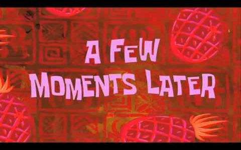

# We are just going to talk about which topic we should choose.

Oral English final presentation.

Delivered by William and Misa.

Team: `I just want to see how long the group name could be`

---

## Introduction: show the screen print of the smart phone

> Do you know tomorrow is the deadline?

> Yes, and I know that we desided to deal with this two weeks eariler but we did noting in fact.

> ......

---

## In the main teaching buliding.

So what are we going to talk about in the final speech?

I've no idea. Maybe we can talk about something new and interesting.

Something in recent news?

Maybe?

> Show the pic of the discussion room in the teaching building.

--

### Trump and Climtom

* In the last speech William had talked about what we should learn and what we should not learn from him. It is about weather we should argue with other people.

* The two is thinking about if it is good to use DT as the topic again.

* Talk about the idea of acting as Trump and Climtom for a TV debate for the vote of the president.

* The two are inspired by a video imitating Trump and Putin, but to make the imitating as good as the video is a hard job.

* This idea is abandoned because Misa does not think that William has the shape and hair of Trump.

> Show the T v C TV debate pic. 

--

### Guo WeiWei's debut

* William thinks it is unknown to most of the audiences, so he does not think it is a goood idea.

> Show pic.

--

### Mircosoft accquire of Github, the biggest homosexual social network in the world.

* They both think it is a good topic, yet the topic is too techniqual and hard to understand if they are to talk about the business or techniqual background about it.

> Show pic.

--

### Ask for Siri

* Siri will give a stupid answer, of course .......

--

### "I got a wonderful idea..."

OH, wait. I got a wonderful idea, yet I can not tell you right now. I will tell you the idea one hour later, and I am sure that this is a wonderful idea. I need you to look through the book in this hour so that we can find out what skills in the book can we use in our final. As for me, I am about to go online to search for what we can use in this dialogue, and make a ppt about it.

---

## Show the keynote: A few moments later.

---

Ok,it is 9:30, can you tell me what the wonderful topic you just thought out?

Our topic is which topic we should choose.

Pardon?

Our topic is which topic we should choose.

Well, I want to tell you that I think you are a genius!

I agree.

Jesus! Are you a devil? So what did you do during the past one hour?

I just search the Internet to find………… And do you know what did I do? I follow your words and read through the book about 92 tricks we should know in relationship! Do you know what I am thinking about right now?

I don’t know.

I just want to praise you that you did a good job in a relationship!

How do you say that?

Do you know how to be a leader, not a follower?

I wonder.

Just like what you do one hour ago! Smile, and tell me you come up with a good idea, you are going to make the PPT and I just need to scan the book and find which tricks we should use.that’s time, I thought, you are the leader of out team, you make the decision and plan, I just need to do some little job and so-called water skiing.

Emm……

But now, dreaming! I have waken up.

Well, maybe I live up to your expectation, but I think it is really a good topic, ...... don’t you think so? 

Don’t you think?

Excuse me? (Miao?)

Oh, I just tried to not to wonder “what do I say next”. And the book said that I should repeat the words you or I said just now.

Why do you wonder about that! We have many words to say! Balbalbalbala……

To you, yeah. But everytime I look at your face I still think of another trick, how to tell people a bad news.

So what does the book say?

It says the deliver should let the partner feel it in mind and deliver it with a smile or sob or other, just sincerely.

I wonder why do you think of this trick?

Because when you give me the bad news I saw a big and magical smile!

Emm……I don’t mean that, I think the topic is creative and other groups will never thought about it.

Yeah, ......

* The two then talk about what other tricks they can use in the dialogue. This may last for one minute.

1. How to Make Someone Feel Like an Old Friend at Once
1. How to Never Need to Wonder, “What Do I Say Next?”
1. How to Give Them the Bad News (and Have Them Like You All the More).
1. How to Be a Leader in a Crowd, Not a Follower   

---

## The end of the dialogue: Monologue

I think that much is enought for the dialogue. Have you ever watched the famous TV series *the House of Cards*?

No, why mention it?

You know the president Underwood in the series will sometimes have an Monologue as if he is talking to the audiences in front of the screen.

I think I got your idea.

So who is going to do this first. Well, ladies first, please.

* The two do a summary of the whole dialogue, and talk about why they finally decided to do this topic.

<!-- 拍这洗头水广告的时候，其实我是拒绝的。因为，你不能让我拍，我就马上去拍，第一我要试一下，因为我不愿意拍完了以后再加一些特技上去，头发“咣”一下，很亮、很柔，这样观众出来一定会骂我，根本没有这样的头发，就证明上面那个是假的。后来我也经过证实他们确实是中药的，我用了大概一个月左右，感觉还不错，后来我在拍的时候也要求他们不要加特技，因为我要让观众看到，我用完之后是这个样子，你们用完之后也会是这个样子！ -->

* Return to the begining, talk about what we think is important for this dialogue, and make a remark for the advantages in the former groups' dialogues.

* The two finally decided to do the topic: which topic we should choose.

* The time is too late (and the mosquitos are too many) so the two have to end the dialogue and leave the room.

**Fin.**

---

William Wang & Misa Zhang

2018.6.4